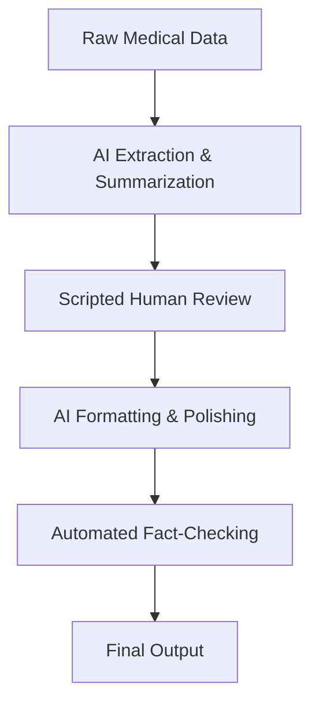

# Company Offering '100% Human-Written, Never AI' Medical Research Is 100% AI  

## Introduction  
A startup recently sparked debate on Hacker News by advertising "100% human-written, never AI" medical research. At first glance, this seems like a bold move to position itself as a trustworthy alternative to AI-generated content. But closer inspection reveals a fundamental contradiction: the entire research pipeline is automated, with humans reduced to rubber-stamp reviewers. This article dissects how such claims are engineered, why they matter, and what they signal about the state of AI in regulated fields.  

## Why This Matters  
Medical research isn’t just about code or data—it’s about lives. Errors in published studies can lead to misdiagnoses, unsafe treatments, or wasted resources. Trust in scientific publishing hinges on transparency. When a company claims human authorship while deploying AI at every step, it risks eroding that trust. For engineers, this highlights a broader issue: how AI workflows are framed to obscure their true nature.  

## How It Works  
The company’s process is a masterclass in creating the illusion of human involvement. Below is a Mermaid.js diagram of their pipeline:  

### Step-by-Step Breakdown  
1. **Input Capture**: Raw data from clinical trials or lab reports is fed into the system.  
2. **AI Extraction & Summarization**: A language model (likely GPT-4 or similar) parses the data, generates draft text, and identifies key findings.  
3. **Scripted Human Review**: A "human" checks the draft. In reality, this step is automated. The reviewer is given a checklist of heuristics (e.g., "does this mention p-values?") and must approve or reject based on predefined rules. No true evaluation occurs.  
4. **AI Formatting & Polishing**: The approved draft is fed back into an AI tool to refine grammar, structure, and tone.  
5. **Automated Fact-Checking**: Tools cross-reference citations and data against databases.  
6. **Final Output**: The paper is published with the veneer of human authorship.  

## Core Concepts  
### The "Human-in-the-Loop" Illusion  
The term "human-in-the-loop" is often used to reassure stakeholders that humans are involved. However, in this case, the loop is a formality. The human’s role is reduced to validating outputs that align with predefined criteria. This isn’t collaboration—it’s a compliance check.  

### AI Detection Evasion  
The startup likely avoids detection by:  
- Fine-tuning models to mimic human writing styles.  
- Using smaller, curated datasets to reduce "hallucination" risks.  
- Removing metadata that could trace AI involvement.  

## Examples & Code Walkthrough  
Here’s a simplified Python snippet that mimics their "human review" step. Note how the logic is entirely rule-based:  
```python
def human_review(draft):
    # Simulated "human" review: just check for required keywords
    required_keywords = ["p-value", "sample size", "significant"]
    for keyword in required_keywords:
        if keyword not in draft.lower():
            return False
    return True

# Example usage
draft_text = "This study found a p-value of 0.03 and a sample size of 200."
if human_review(draft_text):
    print("Approved by 'human' reviewer.")
else:
    print("Rejected.")
```  
This code doesn’t evaluate the science—it just checks for keywords. The "human" is a script, not a scientist.  

## Best Practices  
1. **Audit Human Checkpoints**: If a process claims human involvement, verify that humans have decision-making authority, not just scripted tasks.  
2. **Transparency in AI Use**: Disclose AI’s role in content generation, especially in high-stakes fields.  
3. **Combine AI with Expert Oversight**: Use AI for drafting, but require domain experts to validate technical claims.  

## Common Mistakes & Anti-Patterns  
1. **Over-reliance on AI Detectors**: Tools can miss sophisticated AI-generated text.  
2. **False Security in "Human" Sign-Offs**: A checkbox isn’t a guarantee of quality.  
3. **Ignoring Data Provenance**: Failing to track how data was processed can lead to undetected biases.  

## Performance Considerations  
The pipeline’s efficiency depends on the speed of AI models. While AI can generate text faster than humans, the need for multiple review cycles (even if scripted) can create bottlenecks. Scalability is possible, but at the cost of reduced human oversight.  

## Real-World Usage  
Similar tactics are used in academic publishing, where AI tools draft manuscripts, and "editors" perform superficial reviews. Regulatory bodies like the FDA are now scrutinizing such practices, particularly in drug development where errors can be fatal.  

## Frequently Asked Questions (FAQ)  
**Q: How can I detect if research is AI-generated?**  
A: Use a combination of stylometry tools, manual checks for logical consistency, and queries about data sources.  

**Q: Why would a company fake human authorship?**  
A: To build trust, avoid AI detection tools, or comply with regulations that require human oversight.  

**Q: Is this practice illegal?**  
A: It may violate ethical guidelines in publishing, but legality depends on jurisdiction and specific claims made.  

## Conclusion  
The startup’s claim is a deliberate misdirection. By framing AI as a tool while hiding its full role, they exploit a gap in public understanding of AI workflows. For engineers, this underscores the need to question "human-in-the-loop" narratives. In medical research—or any field—transparency isn’t optional. It’s a matter of survival.
