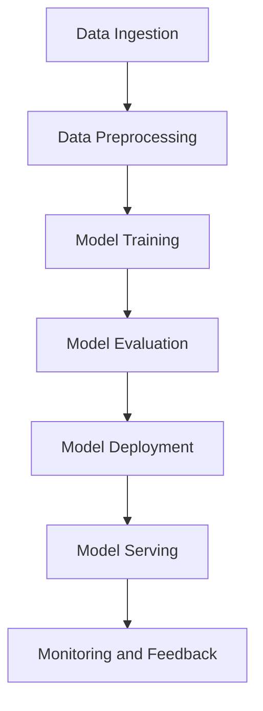

# Confessions of a Long-Distance Sailor

As I reflect on my years of experience with artificial intelligence, I'm reminded of the countless times I've had to navigate the complexities of machine learning models. It's a bit like sailing across the ocean - you need to understand the winds, the currents, and the tides to reach your destination. In this article, I'll share my confessions as a long-distance sailor in the realm of AI, and provide insights into the challenges and opportunities that come with building and deploying machine learning models.

## Introduction
I still remember the first time I tried to deploy a machine learning model in production. It was a simple classification model, but it took me weeks to get it working correctly. The model would work fine in my local environment, but as soon as I deployed it to our production cluster, it would start throwing errors. I spent countless hours debugging, only to realize that the issue was not with the model itself, but with the way it was interacting with our infrastructure. This experience taught me the importance of considering the entire pipeline, from data ingestion to model deployment, when building machine learning systems.

## Why This Matters
So why should software engineers care about this topic? The answer is simple - machine learning is becoming an integral part of many applications, and understanding how to build and deploy these models is crucial for any organization that wants to remain competitive. Whether it's recommendation systems, natural language processing, or computer vision, machine learning is being used to solve some of the most complex problems in the industry. However, building and deploying these models is not trivial, and requires a deep understanding of the underlying technology.

## How It Works
At its core, a machine learning model is a complex system that involves multiple components, including data ingestion, model training, and model deployment. The following diagram illustrates the high-level architecture of a typical machine learning pipeline:

As you can see, the pipeline involves multiple stages, each of which requires careful consideration. From data ingestion to model serving, each stage has its own set of challenges and opportunities.

## Core Concepts
So what are the core concepts that govern machine learning? At its core, machine learning is about building models that can learn from data. There are several key concepts that are essential to understanding machine learning, including:

* **Supervised learning**: This is the most common type of machine learning, where the model is trained on labeled data.
* **Unsupervised learning**: This type of machine learning involves training the model on unlabeled data, and is often used for clustering or dimensionality reduction.
* **Reinforcement learning**: This type of machine learning involves training the model through trial and error, and is often used for robotics or game playing.

## Examples & Code Walkthrough
Let's consider a simple example of a machine learning model - a linear regression model. The following code snippet illustrates how to build and train a linear regression model using scikit-learn:
```python
from sklearn.linear_model import LinearRegression
from sklearn.datasets import make_regression
from sklearn.model_selection import train_test_split

# Generate some sample data
X, y = make_regression(n_samples=100, n_features=1, noise=0.1)

# Split the data into training and testing sets
X_train, X_test, y_train, y_test = train_test_split(X, y, test_size=0.2)

# Create and train a linear regression model
model = LinearRegression()
model.fit(X_train, y_train)

# Evaluate the model on the test set
print(model.score(X_test, y_test))
```
This code snippet illustrates the basic steps involved in building and training a machine learning model.

## Best Practices
So what are some best practices for building and deploying machine learning models? Here are a few tips:

* **Monitor your models**: Monitoring your models is essential to ensuring that they are performing as expected.
* **Use version control**: Using version control is essential to tracking changes to your models and ensuring that you can reproduce your results.
* **Test your models**: Testing your models is essential to ensuring that they are working as expected.

## Common Mistakes & Anti-Patterns
Here are a few common mistakes that engineers make when building and deploying machine learning models:

* **Overfitting**: Overfitting occurs when a model is too complex and fits the training data too closely.
* **Underfitting**: Underfitting occurs when a model is too simple and fails to capture the underlying patterns in the data.
* **Data leakage**: Data leakage occurs when information from the test set is used to train the model.

## Performance Considerations
When building and deploying machine learning models, there are several performance considerations that need to be taken into account. These include:

* **Latency**: Latency refers to the time it takes for the model to make a prediction.
* **Throughput**: Throughput refers to the number of predictions that the model can make per unit time.
* **Memory usage**: Memory usage refers to the amount of memory required to store the model and its parameters.

## Real-World Usage
Machine learning is being used in a variety of real-world applications, including:

* **Recommendation systems**: Recommendation systems use machine learning to suggest products or services to users based on their past behavior.
* **Natural language processing**: Natural language processing uses machine learning to analyze and generate human language.
* **Computer vision**: Computer vision uses machine learning to analyze and understand visual data from images and videos.

## Frequently Asked Questions (FAQ)
Here are a few frequently asked questions about machine learning:

* **Q: What is machine learning?**
A: Machine learning is a type of artificial intelligence that involves training models on data to make predictions or decisions.
* **Q: How do I get started with machine learning?**
A: Getting started with machine learning involves learning the basics of programming and statistics, and practicing with real-world datasets.
* **Q: What are some common applications of machine learning?**
A: Machine learning is being used in a variety of applications, including recommendation systems, natural language processing, and computer vision.

## Conclusion
In conclusion, building and deploying machine learning models is a complex task that requires careful consideration of multiple factors, including data ingestion, model training, and model deployment. By following best practices and avoiding common mistakes, engineers can build and deploy effective machine learning models that drive business value. Whether you're a seasoned engineer or just getting started with machine learning, I hope this article has provided you with a deeper understanding of the challenges and opportunities involved in building and deploying machine learning models.
