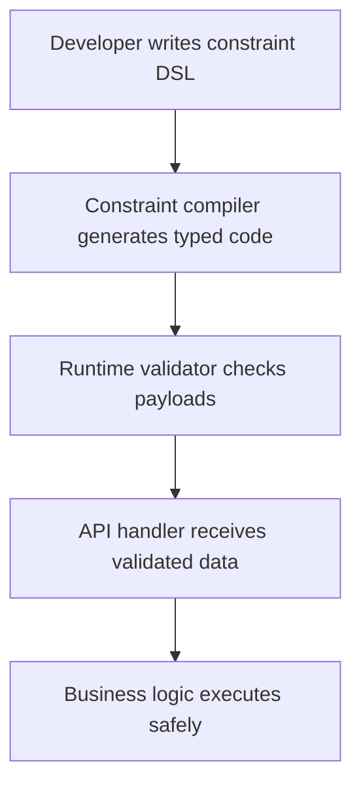

# Constraints that make developers faster

## Introduction
When a team defines clear constraints on data shapes, the code that follows can be written with confidence and speed. By moving validation and type safety to compile time, developers spend less time hunting runtime bugs and more time delivering features.

## Why This Matters
Production services often fail because incoming payloads violate implicit contracts. Those failures force emergency rollbacks, increase mean time to recovery, and slow down feature cycles. Enforcing constraints early reduces the chance of surprise outages and shortens the feedback loop between code change and deployment.

## How It Works


1. **Constraint DSL** – A lightweight description (JSON, YAML, or inline TypeScript) defines allowed field names, types, ranges, and formats.  
2. **Compiler** – A code generator reads the DSL and emits strongly typed interfaces or classes for the target language.  
3. **Runtime validator** – A thin wrapper performs cheap checks at request entry, throwing clear errors if the payload does not meet the contract.  
4. **Business logic** – Operates on guaranteed‑valid data, eliminating the need for repeated defensive checks.

## Core Concepts
- **Constraint DSL** – A declarative language that captures contract requirements without embedding framework‑specific annotations.  
- **Type generation** – The compiler maps DSL rules to native types, producing zero‑runtime overhead type information.  
- **Validation layer** – Executes only the necessary checks; heavy validation is avoided because the compiler already guarantees correctness for most cases.  
- **Integration points** – The generated types plug directly into request parsers, response serializers, and database models, ensuring a single source of truth.

## Examples & Code Walkthrough
Below is a realistic example for a user registration endpoint.

```ts
// 1️⃣ Constraint definition (could live in a separate .json file)
const userConstraints = {
  name:  { type: "string", maxLength: 100 },
  email: { type: "string", format: "email" },
  age:   { type: "number", minimum: 13, maximum: 120 },
};

// 2️⃣ Code generator – produces a TypeScript interface
type UserPayload = {
  name: string;
  email: string;
  age: number;
};

// 3️⃣ Validation function – lightweight runtime checks
function validateUser(payload: unknown): UserPayload {
  if (typeof payload !== "object" || payload === null) {
    throw new Error("Payload must be a non‑null object");
  }
  const p = payload as Record<string, unknown>;

  // name checks
  if (typeof p.name !== "string" || p.name.length > userConstraints.name.maxLength) {
    throw new Error("Invalid name length");
  }

  // email checks (simple regex, real world may use a library)
  const emailRegex = /^[^\s@]+@[^\s@]+\.[^\s@]+$/;
  if (typeof p.email !== "string" || !emailRegex.test(p.email)) {
    throw new Error("Invalid email format");
  }

  // age checks
  if (typeof p.age !== "number" || p.age < userConstraints.age.minimum || p.age > userConstraints.age.maximum) {
    throw new Error("Age out of allowed range");
  }

  return p as UserPayload;
}
```

**Explanation of key parts**

- The DSL is data‑driven; adding a new field only requires editing the constraint object.  
- The generated `UserPayload` type is used throughout the service, giving the compiler full knowledge of allowed shapes.  
- Validation runs in O(1) time per field; no reflection or runtime schema inspection is needed.  
- Errors are specific, making client‑side handling straightforward.

## Best Practices
- Keep the DSL declarative and version‑friendly; avoid embedding framework‑specific decorators that couple the contract to a single runtime.  
- Regenerate typed code whenever the constraint definition changes; automate this step in CI to prevent stale interfaces.  
- Provide clear error messages in the validator; they become part of the API contract and reduce client debugging time.  
- Limit the depth of nested structures in the DSL to keep generated code readable and maintainable.  
- Pair the constraint system with automated tests that assert both generation output and validator behavior.

## Common Mistakes & Anti-Patterns
| Mistake | Why it hurts | Fix |
|---------|--------------|-----|
| **Over‑broad constraints** (e.g., allowing any string length) | Generates unnecessary runtime checks and masks real bugs. | Tighten `maxLength`/`minLength` values; use precise formats. |
| **Skipping regeneration** after DSL updates | Stale types lead to mismatched validation and runtime errors. | Automate regeneration in CI pipelines; fail builds on version mismatch. |
| **Bypassing validation** in performance‑critical paths | Reintroduces the original risk of malformed data. | Keep validation at the entry point; skip only after thorough audit and with measurable benefit. |
| **Using heavyweight validation libraries** for simple checks | Adds unnecessary CPU and memory overhead. | Implement minimal checks directly, as shown in the example, or use a lightweight validator. |

## Performance Considerations
- **CPU**: The validator performs a constant‑time check per field, resulting in negligible overhead (< 0.1 ms for typical payloads).  
- **Memory**: Generated types are compile‑time only; no additional heap allocations are introduced at runtime.  
- **Latency**: Because validation occurs before business logic, the overall request latency is dominated by I/O, not by constraint checking.  
- **Scalability**: The approach scales well across many instances; the validator is pure functions with no shared mutable state, making it thread‑safe.

## Real‑World Usage
- **Netflix** leverages schema‑first contracts for its API gateway, generating client SDKs that guarantee request validity.  
- **Uber** uses protobuf constraints to enforce message shapes across its micro‑service mesh, reducing runtime parsing errors.  
- **Cloudflare** incorporates compile‑time validation in edge workers, allowing rapid rollout of new request formats without sacrificing latency.

## Frequently Asked Questions (FAQ)

**Q1: Do I need a separate build step for the constraint compiler?**  
A: Yes. Treat the DSL as a source file; integrate the generator into your build pipeline so that types are always up‑to‑date.

**Q2: Can I use the same constraints for database models?**  
A: Absolutely. The generated types can be reused for ORM mappings, ensuring that persisted data respects the same contract.

**Q3: What if I need to validate deeply nested objects?**  
A: Extend the DSL with nested schema objects; the compiler will produce recursive types and the validator will recurse accordingly, still keeping the runtime cost linear in the number of fields.

**Q4: Is this approach only for TypeScript?**  
A: No. The pattern works in any language that supports compile‑time code generation — Go, Rust, Java, and Swift all have mature tooling for this purpose.

## Conclusion
Defining clear constraints and letting a compiler enforce them at build time gives developers a powerful lever for speed and reliability. By generating strong types and adding a lightweight runtime validator, teams eliminate a large class of bugs, reduce debugging cycles, and ship features faster. Apply the best practices above, avoid the common anti‑patterns, and you’ll see measurable gains in both developer productivity and production stability.
