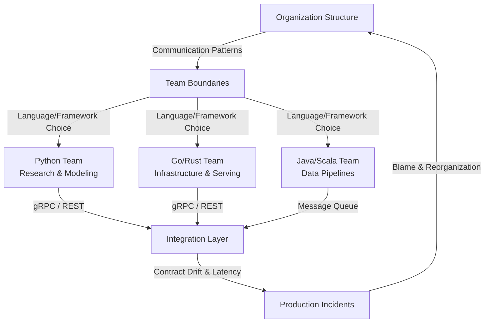

# Conway's Law and Programming Languages

## Introduction

In 1968, Melvin Conway published a paper arguing that any organization designing a system produces a design whose structure mirrors the organization's own communication structure. Nearly six decades later, this observation has become one of the most quietly influential forces shaping which programming languages dominate AI engineering teams—and why your company's architecture looks the way it does.

When an AI research team at a major tech company picks Python over Rust, or when a distributed systems group chooses Go over Java, they're rarely making a purely technical decision. Conway's Law is pulling the strings. Understanding this dynamic is essential if you've ever wondered why your organization's software looks like a map of your org chart.

## Why This Matters

Here's the uncomfortable truth: the programming language stack in your organization is a symptom of how your teams communicate—not a reflection of which language is objectively best for the task.

Consider a mid-size company building an AI pipeline. The data science team lives in Jupyter notebooks and Python. The infrastructure team deploys Kubernetes clusters with Go. The backend service team maintains a Java monolith. When these teams need to integrate, the seams between their languages become fault lines. Model serving breaks because the Python team didn't account for the Go team's gRPC interface. Data contracts drift because nobody owns the shared schema.

This isn't a tooling problem. It's a Conway's Law problem. The organization's communication boundaries created software boundaries, and those software boundaries are now generating real production incidents.

If you're an engineer or architect making language decisions today, ignoring Conway's Law means you're optimizing for a theoretical org chart that doesn't exist.

## How It Works

Conway's Law operates through a feedback loop. An organization's communication structure determines team boundaries. Those team boundaries produce architectural decisions—language choice, framework selection, deployment topology. The resulting software structure reinforces (or disrupts) the original communication patterns.

In AI specifically, this manifests aggressively. Research teams experiment freely with Python, PyTorch, and Jupyter. Production teams need determinism, so they reach for Rust or Go. The gap between those two worlds creates an integration layer—often the most fragile part of the entire system.



The cycle is self-reinforcing. When the integration layer fails—and it will—the organization restructures to "fix" the problem, which produces a new software architecture that mirrors the new org chart, which introduces new integration boundaries, which eventually fail again.

Step-by-step, here's what's happening:

1. **Team formation** — Teams form around expertise. The ML researchers cluster together; the SREs cluster together. Each cluster develops its own vocabulary, tooling preferences, and language loyalty.
2. **Architecture emerges** — Each team builds systems in their preferred language. The ML team ships models as Python pickle files. The SRE team wraps them in Go containers.
3. **Integration surface appears** — The boundary between Python and Go becomes a contractual interface. Someone has to define the data format, the versioning strategy, and the error handling protocol.
4. **Friction accumulates** — As the system grows, the integration surface becomes the most complex and least-tested part of the codebase. Debugging requires fluency in two languages and two team cultures simultaneously.
5. **Org restructuring** — Leadership reorganizes to "fix" the integration problem, often creating cross-functional teams that blur the original boundaries—but the existing codebase still reflects the old structure.

## Core Concepts

Three foundational concepts govern how Conway's Law operates in the context of programming languages:

**Communication Topology** — The pattern of who talks to whom in an organization. A tightly coupled team (daily standups, shared Slack channels, pair programming) tends to produce tightly coupled code. A loosely coupled organization (async communication, independent squads) tends to produce microservices.

**Language Ecosystem Gravity** — Every programming language carries an ecosystem of libraries, tooling, and community conventions. Python dominates AI because its ecosystem (NumPy, PyTorch, Hugging Face) creates gravitational pull that keeps ML researchers inside its orbit. Rust's ecosystem pulls systems engineers toward performance-critical paths. These gravitational fields are real and they constrain language choice more than any benchmark ever will.

**Architectural Mirror Effect** — The final software architecture will, over time, approximate the organization's communication structure. If Team A and Team B share a database, their code will share a schema. If they communicate through events, their code will be event-driven. If they barely talk, their systems will be completely decoupled—and the integration points will be the most brittle.

## Examples & Code Walkthrough

Let's walk through a realistic scenario: an AI inference service where the research team's Python model must be served by an infrastructure team's Go application. This is the exact integration pattern where Conway's Law creates the most pain.

### The Python Side (Research Team)

```python
# inference_model.py
# Owned by the ML Research team
# Exports a prediction function over gRPC

import numpy as np
import torch
import grpc
from concurrent import futures
import inference_pb2
import inference_pb2_grpc

class ModelServicer(inference_pb2_grpc.InferenceServicer):
    """
    Serves PyTorch model predictions over gRPC.
    The research team owns this file. They update the model
    but rarely think about the Go service consumers.
    """

    def __init__(self, model_path: str, device: str = "cpu"):
        self.model = torch.jit.load(model_path)
        self.model.to(device)
        self.model.eval()
        self.device = device
        # No version tracking here — a problem we'll revisit

    def Predict(self, request, context):
        try:
            # Deserialize the input tensor from the Go client
            input_data = np.frombuffer(
                request.raw_tensor, dtype=np.float32
            ).reshape(request.shape)

            with torch.no_grad():
                tensor = torch.from_numpy(input_data).to(self.device)
                output = self.model(tensor)

            # Serialize back — note: no content-type or schema version
            return inference_pb2.PredictionResponse(
                raw_output=output.cpu().numpy().tobytes(),
                output_shape=list(output.shape())
            )
        except Exception as e:
            # Swallowing the error — anti-pattern, see below
            context.set_code(grpc.StatusCode.UNKNOWN)
            context.set_details(str(e))
            return inference_pb2.PredictionResponse()

def serve_model(model_path: str, port: int = 50051):
    """Starts the gRPC server on the specified port."""
    server = grpc.server(futures.ThreadPoolExecutor(max_workers=10))
    servicer = ModelServicer(model_path)
    inference_pb2_grpc.add_InferenceServicer_to_server(servicer, server)
    server.add_insecure_port(f"[::]:{port}")
    server.start()
    print(f"Model server listening on port {port}")
    server.wait_for_termination()
```

### The Go Side (Infrastructure Team)

```go
// inference_client.go
// Owned by the Infrastructure/SRE team
// Consumes the Python model service

package main

import (
	"context"
	"log"
	"time"

	"google.golang.org/grpc"
	"google.golang.org/grpc/codes"
	"google.golang.org/grpc/status"
	pb "inference-service/proto"
)

// InferenceClient wraps the gRPC connection to the Python model server.
// The SRE team owns retry logic and connection pooling.
type InferenceClient struct {
	client pb.InferenceClient
	conn   *grpc.ClientConn
}

// NewInferenceClient establishes a connection with a hardcoded timeout.
// Note: no connection health checking — another Conway's Law artifact.
func NewInferenceClient(addr string) (*InferenceClient, error) {
	conn, err := grpc.Dial(addr, grpc.WithInsecure(), grpc.WithBlock())
	if err != nil {
		return nil, err
	}
	return &InferenceClient{
		client: pb.NewInferenceClient(conn),
		conn:   conn,
	}, nil
}

// Predict sends a tensor to the Python model and returns the result.
// The SRE team assumes the response shape matches their expectations,
// but the Python team changed the model output last Tuesday.
func (ic *InferenceClient) Predict(
	ctx context.Context,
	input []float32,
	shape []int64,
) ([]float32, error) {
	req := &pb.PredictionRequest{
		RawTensor: input,
		Shape:     shape,
	}

	// No timeout on the context — if the Python server hangs,
	// this goroutine leaks. Classic integration boundary bug.
	resp, err := ic.client.Predict(ctx, req)
	if err != nil {
		// Check if it's a known error code
		if st, ok := status.FromError(err); ok {
			if st.Code() == codes.Unknown {
				log.Printf("Model inference failed: %s", st.Message())
				return nil, st.Err()
			}
		}
		return nil, err
	}

	// Trust the shape from the response without validation
	// If the Python team changes the model, this breaks silently
	output := make([]float32, len(resp.RawOutput))
	copy(output, resp.RawOutput)
	return output, nil
}

func main() {
	client, err := NewInferenceClient("model-service:50051")
	if err != nil {
		log.Fatalf("Failed to connect: %v", err)
	}
	defer client.conn.Close()

	// Simulate a prediction request
	input := make([]float32, 784) // Flattened 28x28 image
	shape := []int64{1, 1, 28, 28}

	output, err := client.Predict(context.Background(), input, shape)
	if err != nil {
		log.Fatalf("Prediction failed: %v", err)
	}
	log.Printf("Inference complete: %d output values", len(output))
}
```

### Where Conway's Law Shows Up

Every line of friction between these two files is an organizational boundary made manifest:

- The Python team doesn't track model version in the gRPC response. The Go team assumes the output shape is stable.
- The Go team doesn't set a deadline on the context. The Python team doesn't implement request timeouts.
- Neither team owns the proto schema as a shared contract. It's treated as an implementation detail rather than an interface.

If you've worked in a company where the data team and the platform team constantly blame each other, this code is your blame game in executable form.

## Best Practices

After years of watching teams burn cycles on Conway's Law integration problems, here are the rules that actually work:

**1. Own the Interface, Not the Implementation.** Define your gRPC or REST contracts as versioned, independently deployable artifacts. The proto file or OpenAPI spec is the shared contract between teams. Treat it with the same rigor as a public API. Use semantic versioning and enforce backward compatibility checks in CI.

**2. Create Cross-Functional Boundary Teams.** Instead of a pure Python team and a pure Go team, create an integration squad that owns the contract layer. This team should have members fluent in both languages and both domains. They enforce the interface and catch drift before it reaches production.

**3. Automate Contract Testing.** Implement consumer-driven contract tests that run on every PR. The Go team writes tests that verify the Python service still returns the expected shape and data types. If the Python team changes the model output, the contract test fails before deployment.

**4. Document Communication Protocols.** Write down how teams communicate. Daily standups? Shared Slack channels? Weekly architecture reviews? The communication protocol should be explicit, not assumed. If you can't describe how Team A and Team B coordinate, your architecture will reflect that ambiguity.

**5. Use Language-Agnostic Data Formats.** Prefer Protocol Buffers, Avro, or JSON over language-specific serialization (Python pickles, Java serialized objects). Language-agnostic formats force teams to think about the interface rather than the implementation.

## Common Mistakes & Anti-Patterns

**Mistake 1: Sharing a Database Across Teams**

When the ML team and the data engineering team both write to the same PostgreSQL database, they create a tight coupling that mirrors neither team's actual expertise. The ML team's schema migrations break the data engineering team's ETL pipelines.

*Fix:* Each team owns its database instance. They communicate through events or APIs, not shared tables.

```python
# BAD: Direct database access across team boundaries
# ml_team/models.py
def save_model_output(model_id, result):
    # Writing directly to a shared table
    db.execute("INSERT INTO predictions (model_id, result) VALUES (%s, %s)",
               (model_id, json.dumps(result)))

# FIX: Publish to a message queue
def save_model_output(model_id, result):
    event = {
        "model_id": model_id,
        "result": result,
        "timestamp": time.time(),
        "schema_version": "2.1"
    }
    queue.publish("model-outputs", event)
```

**Mistake 2: No Versioning on Shared Interfaces**

The Python team updates the model and changes the output tensor shape. The Go service breaks in production because nobody versioned the proto schema.

*Fix:* Always version your interface definitions. Use `v1`, `v2` in your proto package names and route traffic accordingly.

```protobuf
// GOOD: Versioned proto definition
syntax = "proto3";
package inference.v2;

service InferenceService {
  rpc Predict(PredictionRequest) returns (PredictionResponse);
}

message PredictionRequest {
  bytes raw_tensor = 1;
  repeated int64 shape = 2;
  string schema_version = 3;  // Enforced by the contract team
}
```

**Mistake 3: Assuming Synchronous Communication Is Fine**

The Go team calls the Python model synchronously on every request. When the Python service goes down for maintenance, the entire Go service cascade-fails.

*Fix:* Use async patterns where possible. Queue inference requests and process them asynchronously. The Go service can serve cached results or fall back to a lighter model while the Python service recovers.

**Mistake 4: Letting One Team Own Both Sides of the Boundary**

If the same team writes both the Python model and the Go wrapper, they'll optimize for their own convenience rather than the interface contract. Conway's Law says the design will mirror their internal communication, not a well-defined external interface.

*Fix:* Separate ownership. The Python team owns the model. The Go team owns the serving layer. A boundary team owns the contract.
