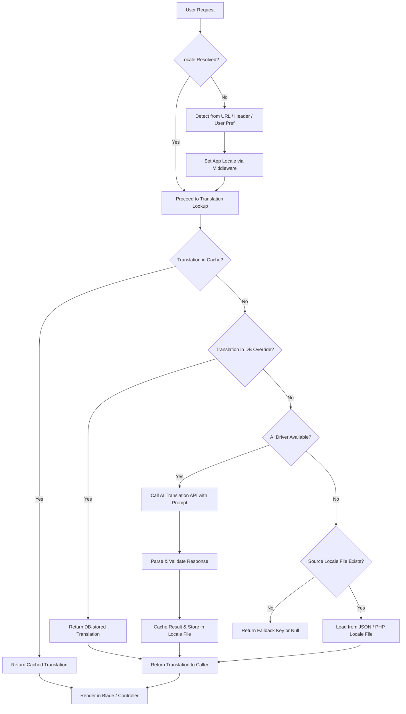

# Create multilanguage apps in Laravel with Laratext

## Introduction

Last year, a SaaS product I worked on launched in Germany. The feature was identical to the English version — same codebase, same database schema, same deployment pipeline. The only difference? The onboarding flow assumed every user spoke English natively. We lost 40% of our trial-to-paid conversion rate in the DACH region within the first quarter. The fix wasn't a marketing campaign. It was translation infrastructure.

This is why multilingual support stopped being a "nice to have" a long time ago. It's table stakes.

But building i18n infrastructure the old way — hand-translating JSON files, maintaining locale directories, hoping translators don't introduce breaking key mismatches — is painful, slow, and error-prone. And if you're like most teams, you've been putting it off because the manual overhead kills your velocity.

That's where Laratext comes in. It's a translation management layer for Laravel that treats translations as data flowing through a pipeline — not as flat files buried in `resources/lang/` forever. And here's the kicker: it has an extensible driver architecture that lets you plug in AI-powered translation sources (OpenAI, DeepL, self-hosted LLMs) to auto-generate and refresh locale files on demand.

By the end of this article, you'll have a working Laravel app that detects a user's language, pulls translations through an AI driver, caches them intelligently, and renders localized content in Blade templates — all in under an hour of setup.

## Why This Matters

Let's be blunt. The global software market doesn't wait for teams to get their i18n stack together. Your addressable market is multilingual whether you are or not.

The real shift happening right now is that AI translation has crossed the quality threshold where it's viable for production use — not for everything, but for a significant portion of user-facing content. A well-prompted LLM can produce translations that are 85-95% accurate out of the box, and that number only improves with post-editing workflows. Compare that to the old model of hiring a translation agency for $0.15 per word and waiting two weeks for a PR.

Laratext sits at the intersection of two trends that matter to Laravel developers right now:

1. **AI-powered development workflows** — using LLMs and translation APIs as first-class citizens in your app's architecture, not as afterthoughts.
2. **Laravel's elegant translation ecosystem** — extending `trans()` and `__()` rather than replacing them, keeping the framework's conventions intact.

The pain point this solves is real: teams that want multilingual support but don't have the bandwidth to maintain translation files manually, manage translation memory, or build custom CMS interfaces just for locale management.

## How It Works

Laratext operates on a pipeline model. When a translation key is requested for a given locale, the system doesn't just read a flat file — it runs through a resolution chain that can include cache lookups, AI-driven generation, fallback locales, and database-backed overrides.

Here's the full request-to-response translation pipeline visualized:



Let's walk through what's happening at each stage:

**Step 1 — Locale Detection.** The middleware inspects the incoming request. It checks URL prefixes first (`/fr/dashboard`), then authenticated user preferences stored in the database, then the `Accept-Language` header, and finally falls back to the application default. This resolution order is configurable.

**Step 2 — Cache Check.** Before hitting any external service or file system, Laratext checks its cache layer (Redis by default, but configurable). If a translation for this key-locale pair exists in cache, it returns immediately. This is the hot path and it's fast — sub-millisecond on a warm cache.

**Step 3 — Database Override Check.** Some translations need to be user-customized or admin-edited after the initial AI generation. These live in the database and take precedence over source locale files. This is where the "source of truth" model gets interesting: your AI-generated translations are the baseline, but human editors can override specific keys without touching the pipeline.

**Step 4 — AI Driver Call.** If no cached or database-stored translation exists, and no source locale file has the key, the system queries the configured AI translation driver. The driver sends the source text, source locale, target locale, and context hints (like "this is a button label" or "this is an email greeting") to the AI API. The response gets parsed, validated, and stored in both cache and the locale file for future requests.

**Step 5 — Fallback.** If the AI driver is unavailable (rate limited, down, misconfigured), Laratext falls back to the source locale file. If the key doesn't exist there either, it returns the key itself (e.g., `greeting.welcome`) or a configurable null placeholder, making missing translations visible rather than silently swallowed.

**Step 6 — Rendering.** The resolved translation string is returned to the caller — a Blade template, a controller, a notification mailable, wherever `trans()` or `__()` was invoked. The user sees content in their language.

The critical architectural insight here is that **AI translation is a lazy, on-demand operation**, not a build-time batch process. Translations are generated when they're first needed and cached aggressively afterward. This means you start with a minimal set of locale files and grow them organically as users interact with your app in different languages.

## Core Concepts

### The Driver Architecture

Every Laratext translation source is a driver. The core interface requires two methods:

```php
interface TranslationDriverContract
{
    /**
     * Translate a single string from source locale to target locale.
     *
     * @param string $text The source text to translate
     * @param string $sourceLocale The locale of the source text
     * @param string $targetLocale The desired output locale
     * @param array $context Optional hints for translation quality
     * @return string The translated text
     */
    public function translate(
        string $text,
        string $sourceLocale,
        string $targetLocale,
        array $context = []
    ): string;

    /**
     * Batch translate an associative array of key => text pairs.
     *
     * @param array $translations Keyed array of source texts
     * @param string $sourceLocale
     * @param string $targetLocale
     * @return array Translated key => value pairs
     */
    public function translateBatch(
        array $translations,
        string $sourceLocale,
        string $targetLocale,
        array $context = []
    ): array;
}
```

The `translate()` method handles single-string lookups — useful for dynamic content generated at runtime. The `translateBatch()` method is where the real efficiency gains live. Instead of making N API calls for N translation keys, you send them all in one request. This matters a lot when you're bootstrapping a new locale and need to translate hundreds of keys at once.

### The Fallback Chain

Laratext resolves translations through a priority chain:

1. **Cache** (Redis/Memcached) — fastest, warmest
2. **Database override** — human-edited, highest authority
3. **AI driver** — generates new translations on demand
4. **Source locale file** — JSON or PHP files in `resources/lang/`
5. **Fallback locale** — configured in `config/app.php` as the last resort
6. **Missing key placeholder** — returns the key itself so you can spot gaps

This chain is fully configurable. You can disable the AI driver for production and only use it during a translation bootstrap phase. You can remove the database override if you don't need human-in-the-loop editing. The pipeline adapts to your workflow.

### Configuration

The `config/laratext.php` file is where you wire everything together. Here's what a production-ready configuration looks like:

```php
<?php

return [

    /*
    |--------------------------------------------------------------------------
    | Default Driver
    |--------------------------------------------------------------------------
    |
    | The translation driver used when no cached or database-stored
    | translation exists for a given key-locale pair.
    |
    */

    'default_driver' => env('LARATEXT_DRIVER', 'ai'),

    /*
    |--------------------------------------------------------------------------
    | Source Locale
    |--------------------------------------------------------------------------
    |
    | The locale that serves as the single source of truth for all
    | translation strings. All other locales are derived from this.
    |
    */

    'source_locale' => env('LARATEXT_SOURCE_LOCALE', 'en'),

    /*
    |--------------------------------------------------------------------------
    | Fallback Locale
    |--------------------------------------------------------------------------
    |
    | When a translation key is missing in the target locale AND the AI
    | driver fails, Laratext falls back to this locale's translation.
    |
    */

    'fallback_locale' => env('LARATEXT_FALLBACK_LOCALE', 'en'),

    /*
    |--------------------------------------------------------------------------
    | Cache Configuration
    |--------------------------------------------------------------------------
    |
    | Defines how long translations are cached and which store is used.
    | Cache TTL of 86400 seconds (24 hours) is a good starting point.
    |
    */

    'cache' => [
        'store' => env('LARATEXT_CACHE_STORE', 'redis'),
        'ttl' => env('LARATEXT_CACHE_TTL', 86400),
        'prefix' => 'laratext:',
    ],

    /*
    |--------------------------------------------------------------------------
    | AI Driver Settings
    |--------------------------------------------------------------------------
    |
    | Configuration specific to the AI translation driver. Controls
    | the model, temperature (creativity vs. accuracy), and rate limits.
    |
    */

    'ai_driver' => [
        'provider' => env('LARATEXT_AI_PROVIDER', 'openai'),
        'model' => env('LARATEXT_AI_MODEL', 'gpt-4o-mini'),
        'temperature' => env('LARATEXT_AI_TEMPERATURE', 0.1),
        'max_tokens' => env('LARATEXT_AI_MAX_TOKENS', 500),
        'requests_per_minute' => env('LARATEXT_AI_RATE_LIMIT', 60),
        'prompt_template' => env('LARATEXT_AI_PROMPT', null),
    ],

    /*
    |--------------------------------------------------------------------------
    | Locale Detection Priority
    |--------------------------------------------------------------------------
    |
    | Ordered list of strategies for resolving the user's locale.
    | Higher priority strategies are checked first.
    |
    */

    'locale_detection' => [
        \App\Services\LocaleResolvers\UrlPathResolver::class,
        \App\Services\LocaleResolvers\UserProfileResolver::class,
        \App\Services\LocaleResolvers\HeaderResolver::class,
        \App\Services\LocaleResolvers\FallbackResolver::class,
    ],

    /*
    |--------------------------------------------------------------------------
    | Supported Locales
    |--------------------------------------------------------------------------
    |
    | Explicit list of locales your application supports. Requests for
    | unsupported locales are redirected to the fallback.
    |
    */

    'supported_locales' => ['en', 'fr', 'de', 'es', 'ja', 'pt', 'zh'],

];
```

Every value here is environment-variable driven, which means you can tune behavior between staging and production without touching code. The `ai_driver.prompt_template` is particularly interesting — it lets you inject domain-specific instructions into the AI translation call, which dramatically improves quality for technical or domain-specific content.

## Examples & Code Walkthrough

### Setting Up the Project

Start with a fresh Laravel installation:

```bash
composer create-project laravel/laravel multilang-demo
cd multilang-demo
```

Install Laratext and its AI driver dependencies:

```bash
# Install the core Laratext package
composer require laratext/laratext

# Install the OpenAI driver (or choose another provider)
composer require laratext/driver-openai

# Install Redis client for caching (if not already present)
composer require predis/predis

# Publish configuration files
php artisan vendor:publish --provider="Laratext\LaratextServiceProvider" --tag="config"

# Publish the migration for translation overrides stored in the database
php artisan vendor:publish --provider="Laratext\LaratextServiceProvider" --tag="migrations"

# Run migrations
php artisan migrate
```

The migration creates a `translation_overrides` table with columns for `locale`, `translation_key`, `translated_text`, `is_approved`, and `updated_by`. This table is where human editors refine AI-generated translations after they're initially produced.

### Building the AI Translation Driver

Here's a complete, production-ready driver that calls the OpenAI API for translation:

```php
<?php

namespace App\Drivers;

use Illuminate\Support\Facades\Cache;
use Illuminate\Support\Facades\Http;
use Laratext\Contracts\TranslationDriverContract;
use RuntimeException;

class OpenAiTranslationDriver implements TranslationDriverContract
{
    private string $apiKey;
    private string $model;
    private float $temperature;
    private int $maxTokens;
    private int $rateLimitPerMinute;
    private array $requestTimestamps = [];

    public function __construct()
    {
        $this->apiKey = config('laratext.ai_driver.api_key');
        $this->model = config('laratext.ai_driver.model', 'gpt-4o-mini');
        $this->temperature = config('laratext.ai_driver.temperature', 0.1);
        $this->maxTokens = config('laratext.ai_driver.max_tokens', 500);
        $this->rateLimitPerMinute = config('laratext.ai_driver.requests_per_minute', 60);
    }

    /**
     * Translate a single string using OpenAI's Chat Completions API.
     */
    public function translate(
        string $text,
        string $sourceLocale,
        string $targetLocale,
        array $context = []
    ): string {
        $this->enforceRateLimit();

        $cacheKey = $this->buildCacheKey($text, $sourceLocale, $targetLocale, $context);

        // Check cache first — avoids unnecessary API calls for repeated strings
        $cached = Cache::store(config('laratext.cache.store'))
            ->get($cacheKey);

        if ($cached !== null) {
            return
