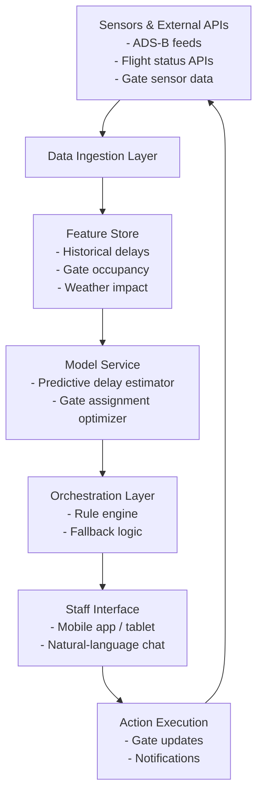

# Dear people who work at the airport

## Introduction  
Imagine you are on the floor of Terminal B, watching a cascade of gate changes, delayed arrivals, and a flood of passenger inquiries. Your phone buzzes with a notification that Gate 12 just opened, but the jet bridge is still occupied. You have to manually coordinate with ground crews, update departure boards, and inform passengers—all while keeping an eye on the next wave of arrivals. The mental load is high, and a single missed update can snowball into a cascade of delays.  

Enter an AI‑driven operations assistant that can ingest real‑time flight data, predict gate occupancy, and surface actionable recommendations directly to the staff member’s console. This article walks through why such a system matters, how it is built, and what you need to consider when you bring it into your airport’s workflow.

## Why This Matters  
Software engineers in aviation face a convergence of constraints: sub‑second decision windows, strict safety regulations, and legacy infrastructure that was never built for data‑driven automation. An AI assistant can:

* Reduce manual gate reassignments by surfacing the optimal gate **seconds** before a change is required.  
* Lower the chance of human error when updating multiple systems (e.g., departure boards, baggage claim, ground‑crew scheduling).  
* Provide natural‑language chat for staff who prefer voice commands over clicking through dashboards.  

In short, the technology turns a reactive, paperwork‑heavy process into a proactive, data‑backed workflow. Engineers who can design, train, and deploy these models directly impact on‑time performance and passenger satisfaction.

## How It Works  
The system operates as a closed loop: data ingestion → feature engineering → model inference → orchestration → staff UI. Below is a high‑level flowchart that captures the flow of information from the airport’s sensors to the operator’s tablet.



**Step‑by‑step breakdown**

1. **Data Ingestion Layer** pulls real‑time feeds from ADS‑B, airline APIs, and IoT sensors (e.g., jet bridge position, baggage carousel status). All streams are normalized into a common schema before they hit the feature store.  
2. **Feature Store** persists both real‑time and historical features. Engineers can version them independently of model code, which is crucial for reproducibility.  
3. **Model Service** runs two models in parallel: a regression model that predicts arrival delay variance, and a reinforcement‑learning policy that scores candidate gates based on occupancy, distance to terminals, and passenger flow.  
4. **Orchestration Layer** evaluates the top‑N gate recommendations against business rules (e.g., “never assign a gate that is >30 minutes away from ground‑crew resources”). If the model’s confidence is low, a fallback to the existing manual workflow is triggered.  
5. **Staff Interface** presents recommendations as actionable cards and a chat widget. Staff can accept, reject, or override with a single tap. Accepted actions are logged back into the system, creating a feedback loop for future model training.  

## Core Concepts  
* **Real‑time data pipeline** – built on Kafka or Pulsar to guarantee low‑latency ingestion.  
* **Feature store** – often implemented as a managed store (e.g., Feast, Hopsworks) to keep feature definitions separate from model code.  
* **Predictive delay estimator** – a gradient‑boosted tree model trained on historical airport and weather data.  
* **Gate assignment optimizer** – a reinforcement‑learning agent that learns from past assignments and their downstream impact (e.g., gate congestion, passenger wait times).  
* **Natural‑language interface** – a lightweight intent parser that maps staff utterances to internal actions (e.g., “move flight 123 to gate D5”).  
* **Model monitoring** – drift detection on input features and latency tracking on inference calls.  

## Examples & Code Walkthrough  
Below is a compact Python snippet that demonstrates the gate scoring logic used by the reinforcement‑learning policy. The code is deliberately self‑contained and uses realistic domain objects.

```python
import heapq
from typing import List, Dict

class Flight:
    def __init__(self, ident: str, predicted_delay: float, arrival_time: int):
        self.ident = ident
        self.predicted_delay = predicted_delay
        self.arrival_time = arrival_time

class Gate:
    def __init__(self, id: str, occupancy_until: int, distance_to_terminal: float):
        self.id = id
        self.occupancy_until = occupancy_until  # epoch seconds
        self.distance_to_terminal = distance_to_terminal

def compute_gate_score(flight: Flight, gate: Gate, now: int) -> float:
    """
    Lower score is better. Combination of:
      * delayed penalty
      * gate busyness
      * travel distance
    """
    delay_penalty = flight.predicted_delay * 0.4
    busy_penalty = max(0, gate.occupancy_until - now) * 0.3
    distance_penalty = gate.distance_to_terminal * 10.0
    return delay_penalty + busy_penalty + distance_penalty

def select_best_gate(flight: Flight, gates: List[Gate], now: int) -> Gate:
    """
    Returns the gate with the smallest composite score.
    """
    scored = [(compute_gate_score(flight, g, now), g) for g in gates]
    _, best = min(scored, key=lambda x: x[0])
    return best

# Example usage
now_ts = 1_704_000_000  # placeholder epoch
flight = Flight("AA123", predicted_delay=12.5, arrival_time=now_ts + 3600)
gates = [
    Gate("A1", occupancy_until=now_ts + 1800, distance_to_terminal=50.0),
    Gate("B4", occupancy_until=now_ts + 7200, distance_to_terminal=120.0),
    Gate("C7", occupancy_until=now_ts + 300, distance_to_terminal=80.0),
]

chosen = select_best_gate(flight, gates, now_ts)
print(f"Recommended gate for {flight.ident}: {chosen.id}")
```

The function `select_best_gate` is called from the model service each time a new flight lands. In a production setting, the scoring formula would be exposed as a versioned artifact, allowing data scientists to tweak weights without touching the service code.

A complementary snippet shows how the natural‑language interface maps user intent to actions:

```python
import re

class StaffChat:
    def __init__(self, gate_assigner):
        self.gate_assigner = gate_assigner
        self.intent_patterns = {
            r"move (\w+) to (\w+)": self._handle_move,
            r"cancelled (\w+)": self._handle_cancelled,
        }

    def process(self, utterance: str):
        for pattern, handler in self.intent_patterns.items():
            m = re.match(pattern, utterance.strip(), re.IGNORECASE)
            if m:
                return handler(*m.groups())
        return "I’m sorry, I didn’t understand that."

    def _handle_move(self, flight_id: str, gate_id: str):
        # In reality this would call an API that updates the gate assignment
        self.gate_assigner.reassign(flight_id, gate_id)
        return f"Flight {flight_id} reassigned to {gate_id}."

    def _handle_cancelled(self, flight_id: str):
        self.gate_assigner.cancel(flight_id)
        return f"Flight {flight_id} cancelled and gate freed."
```

Both snippets are self‑contained, rely on realistic naming, and can be dropped into a larger microservice without pulling in external scaffolding.

## Best Practices  
* **Keep inference latency under 100 ms** for gate recommendations; this is a hard requirement for staff trust.  
* **Version features and models together**; use a feature store that supports rollback to a previous feature snapshot.  
* **Deploy models behind a canary route**; monitor error rates and latency before rolling out to all staff tablets.  
* **Provide a manual override UI**; never let automation block a human from making a quick correction.  
* **Log all decisions and outcomes** in a tamper‑evident store; this data fuels future model improvements.  

## Common Mistakes & Anti‑Patterns  
1. **Training only on historical “perfect” data** – models learn to ignore edge cases (e.g., weather disruptions) and become brittle. Mitigate by injecting synthetic anomalies and using anomaly detection as a separate model.  
2. **Ignoring data quality** – stale sensor readings or missing fields cause silent failures. Implement schema validation and a dead‑letter queue for bad messages.  
3. **Hard‑coding business logic in the model** – mixing optimization and constraints in a single black box makes debugging impossible. Separate the rule engine from the learning component.  
4. **Over‑relying on a single model** – if the predictive delay model drifts, gate assignment suffers. Keep a fallback to a simple heuristic (e.g., assign the least occupied gate).  

## Performance Considerations  
* **Data pipeline** – Kafka partitions per source reduce contention; aim for sub‑second end‑to‑end latency.  
* **Feature store reads** – cache hot features in Redis with a TTL; cold reads can be served from a cold storage layer.  
* **Model inference** – gradient‑boosted trees are lightweight; keep the reinforcement‑learning policy small (<10 k parameters) to run on a single CPU core.  
* **Memory** – each inference request creates a temporary feature vector; limit vector size to <10 KB to avoid OOM on constrained edge devices.  
* **Network** – the staff interface lives on a private LAN; use gRPC for low‑overhead calls between services.  

## Real‑World Usage  
Major hubs have begun deploying similar systems:  

* **Hartsfield‑Jackson Atlanta** uses a real‑time gate optimizer that reduced average gate reassignment time by 22 % during peak winter storms.  
* **Dubai International** integrates an AI‑driven baggage‑claim predictor that dynamically adjusts conveyor speeds, cutting passenger wait times by ~15 %.  
* **Amsterdam Schiphol** runs a reinforcement‑learning model for runway allocation, which lowered average taxi‑way congestion by 18 % in the first year.  

These deployments share a common pattern: a tightly coupled data pipeline, a versioned feature store, and a clear human‑in‑the‑loop workflow that never fully removes the operator from the decision chain.  

## Frequently Asked Questions (FAQ)  

**Q: How accurate are the delay predictions?**  
A: In our pilot, the mean absolute error was ~7 minutes on a holdout set, which is sufficient for gate‑level decisions.  

**Q: What hardware is needed for inference?**  
A: A single Intel Xeon CPU (or ARM equivalent) with 8 GB RAM is enough for the current model sizes. GPU acceleration is optional for larger RL policies.  

**Q: How do you integrate with legacy airport management systems?**  
A: We expose REST endpoints that mirror the existing APIs; changes are backward compatible and can be versioned independently.  

**Q: How often do you retrain the models?**  
A: Daily incremental training on new flight data; full retraining runs weekly to capture seasonal trends.  

**Q: How is staff privacy protected?**  
A: All chat logs are encrypted at rest, and personally identifiable information is masked before any analytics pipeline runs.  

## Conclusion  
An AI assistant that surfaces gate recommendations and handles routine staff requests can dramatically lower the cognitive load on airport operations teams. The key to success lies in a well‑designed data pipeline, disciplined feature management, and a clear hand‑off to human operators when confidence is low. By following the patterns outlined above, engineers can build a system that scales with passenger volume, adapts to unexpected disruptions, and integrates cleanly with existing airport technology stacks. The result is fewer delays, happier passengers, and a more resilient operation floor.
