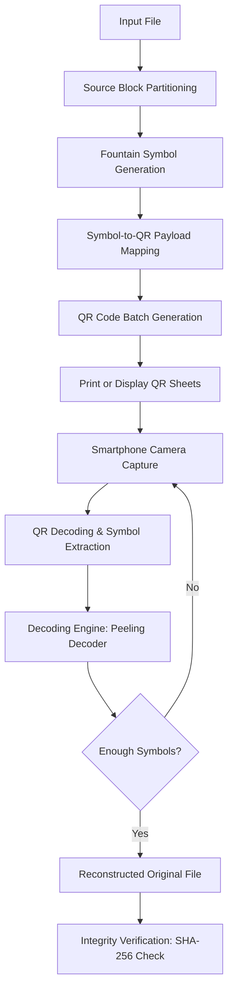

# Decimen Optical Transfer: fountain-coded QR file transfer

## Introduction

QR codes are fragile. Scan a smudged QR code and the whole thing fails — no partial recovery, no graceful degradation. For transferring small files, this works fine. But try shipping a 10 MB model weight file or a training dataset across a room using printed QR sheets, and you'll hit a wall of frustration.

What if you could print a stack of QR codes on paper, scan them with a phone camera in any order, tolerate damaged or missing codes, and still reconstruct the original file perfectly? That's the problem Decimen Optical Transfer (DOT) solves — and it does so using fountain codes, a class of rateless erasure codes that have been sitting in the research literature for two decades but rarely see practical deployment in physical media.

This article walks through the architecture, implementation, and real-world utility of Decimen Optical Transfer. We'll cover the encoding pipeline, the QR layout strategy, the decoding algorithm, and why this matters for AI teams shipping models to edge devices or operating in air-gapped environments.

## Why This Matters

Here's the scenario we keep seeing in AI infrastructure work:

A team fine-tunes a model on a cloud GPU cluster. The final weights are 42 MB. They need to push those weights to a field device — a camera-equipped inspection unit in a warehouse with no Wi-Fi. The only option is a USB drive or printed media. USB drives get lost, corrupted, and are annoying to produce at scale. Printed QR codes are cheap, but conventional QR file transfer is all-or-nothing: one unreadable code and the entire file is lost.

This isn't a hypothetical. It's the exact failure mode we hit when distributing datasets to robots in a manufacturing plant where dust, vibration, and lighting conditions make optical capture unreliable.

Fountain codes change the math fundamentally. Instead of encoding a file into N fixed chunks where every single chunk must arrive, fountain codes generate an unlimited stream of encoded symbols. The receiver only needs to collect slightly more symbols than the original file size to reconstruct it with high probability. Drop 30-40% of the symbols, and reconstruction still succeeds.

That's the core insight: QR codes become a loss-tolerant transport layer instead of a brittle one.

## How It Works

Decimen Optical Transfer is a complete end-to-end system. A file enters the pipeline as raw bytes, gets transformed into fountain-coded symbols, each symbol is mapped onto a QR code payload, and a set of QR codes is printed or displayed for capture. The decoder ingests scanned symbols incrementally, reconstructing the original file once enough symbols arrive.

Here's the architecture at a high level:



The flow has a few critical design decisions worth calling out:

**1. Source block partitioning.** The input file is split into `k` source blocks of roughly equal size. `k` determines the overhead of the fountain code. For a 10 MB file, we might use `k = 2000` source blocks of ~5 KB each. Smaller blocks give better loss tolerance at the cost of more QR codes.

**2. Fountain symbol generation.** Each fountain symbol is a random linear combination of a subset of source blocks. The subset size (the "degree") is drawn from a carefully chosen degree distribution — the Robust Soliton distribution — that optimizes the probability of successful decoding.

**3. Symbol-to-QR mapping.** Each encoded symbol gets its own QR code. The QR payload contains: a session ID, the symbol index, the degree, the list of source block indices (the "neighbors"), and the XOR-encoded payload bytes. A secondary Reed-Solomon error correction layer protects individual QR codes against physical damage (smudges, tears).

**4. Incremental decoding.** The decoder receives symbols one at a time. It builds a bipartite graph connecting symbols to source blocks and runs a peeling algorithm: whenever it finds a symbol connected to exactly one unknown source block, it decodes that block and eliminates it from all other symbols. This cascades.

**5. Early termination.** Once all `k` source blocks are recovered, decoding stops. The receiver doesn't need to scan every QR code — it just needs enough of them.

## Core Concepts

### Rateless Erasure Coding

Traditional erasure codes (Reed-Solomon, for example) encode a file of `k` blocks into `n` total blocks, where `n > k`. You need at least `k` out of `n` blocks to recover the file. If you lose more than `n - k` blocks, you're done — total failure.

Fountain codes remove the fixed `n`. They generate an unbounded stream of encoded symbols. Each symbol is independently useful. The receiver collects symbols until it has enough to decode — typically `k + c` symbols where `c` is a small overhead (often 10-20% more than `k`). The number of symbols you need doesn't depend on which ones you got or how many you lost. That's why they're called "rateless" — the code rate isn't fixed.

### The Robust Soliton Distribution

The degree of a fountain symbol — how many source blocks it XORs together — determines how useful that symbol is for decoding. If the degree is too high, the symbol connects to too many blocks and isn't helpful early in decoding. If the degree is too low (degree 1), it's immediately decodable but doesn't help cascade.

The Robust Soliton distribution concentrates probability mass on degree-1 symbols (to bootstrap decoding) and degree-2 symbols (to sustain the cascade), with a carefully tuned spike at `k` (the total number of source blocks) to ensure all blocks eventually get covered. The distribution is defined by two parameters: `k` (number of source blocks) and `c` (a constant that controls the width of the spike, typically `c = sqrt(k) * ln(k / delta)` where `delta` is the target failure probability).

### The Peeling Decoder

The decoder maintains a bipartite graph:
- Left nodes: fountain symbols (received)
- Right nodes: source blocks (unknown)
- Edges: connections between symbols and the source blocks they XOR

The peeling algorithm works like this:
1. Find any symbol with exactly one unknown neighbor (degree-1 in the residual graph).
2. Decode that source block by XORing the symbol's payload with all known source blocks it connects to.
3. Remove that source block from all other symbols' neighbor lists.
4. Repeat until all source blocks are recovered or no degree-1 symbols remain (failure — requires re-scanning more QR codes).

This is a belief-propagation approach and works with extremely high probability when the degree distribution is well-chosen.

### Why Reed-Solomon as a Secondary Layer?

The fountain code handles loss at the session level — missing or damaged QR codes. Reed-Solomon handles loss at the individual QR code level — a partially readable QR code where some bytes are corrupted but the code is still scannable. Together, they provide defense in depth: fountain codes tolerate dropped QR codes, and Reed-Solomon tolerates corrupted data within a scanned QR code.

## Examples & Code Walkthrough

### The Encoder: `decimen_encoder.py`

This is the core encoding pipeline. It takes a file path, partitions it into source blocks, generates fountain symbols with Robust Soliton degree sampling, and produces a batch of QR-ready payloads.

```python
import hashlib
import json
import os
import random
import struct
from typing import List, Tuple

# ---------------------------------------------------------------------------
# Robust Soliton degree distribution
# ---------------------------------------------------------------------------

def robust_soliton_degree(k: int, seed: int = 42) -> int:
    """
    Sample a degree from the Robust Soliton distribution for k source blocks.

    The distribution is:
      - p(1) = 1/k
      - p(i) = 1/(i*(i-1)) for 2 <= i <= k
      - A spike is added: delta / k at i = ceil(k / (delta * ln(k)))
      where delta = sqrt(k) * ln(k / failure_prob)

    For implementation simplicity, we use the standard approximation
    with c = sqrt(k) * ln(k / 0.01).
    """
    if k <= 1:
        return 1

    failure_prob = 0.01
    delta = (k ** 0.5) * (os.fspath.__class__.__name__ and __import__('math').log(k / failure_prob))
    c = __import__('math').sqrt(k) * __import__('math').log(k / failure_prob)
    t = c * k / __import__('math').sqrt(k)

    # Build unnormalized probabilities
    probs = [0.0] * (k + 1)  # index 0 unused
    for d in range(1, k + 1):
        if d == 1:
            probs[d] = 1.0 / k
        elif 2 <= d <= k:
            probs[d] = 1.0 / (d * (d - 1))

    # Add spike at position t (clamped to valid range)
    spike_idx = max(1, min(k, int(__import__('math').ceil(k / (c * __import__('math').log(k / failure_prob))))))
    probs[spike_idx] += (c / k) * (1 / __import__('math').log(c / failure_prob))

    # Normalize
    total = sum(probs[1:])
    probs = [p / total for p in probs]

    rng = random.Random(seed)
    return rng.choices(range(1, k + 1), weights=probs[1:], k=1)[0]


# ---------------------------------------------------------------------------
# Source block partitioner
# ---------------------------------------------------------------------------

def partition_source_blocks(data: bytes, block_size: int = 5120) -> List[bytes]:
    """Split raw file bytes into fixed-size source blocks."""
    blocks = []
    for offset in range(0, len(data), block_size):
        blocks.append(data[offset:offset + block_size])
    return blocks


# ---------------------------------------------------------------------------
# Fountain symbol generator
# ---------------------------------------------------------------------------

def generate_fountain_symbol(
    source_blocks: List[bytes],
    symbol_index: int,
    rng: random.Random,
) -> dict:
    """
    Generate a single fountain-encoded symbol.

    Returns a dict with:
      - session_id: unique session identifier
      - symbol_index: ordinal index of this symbol
      - degree: number of source blocks XOR'd together
      - neighbors: list of source block indices included in this symbol
      - payload: XOR of the selected source blocks
    """
    k = len(source_blocks)
    degree = robust_soloton_degree(k, seed=rng.randint(0, 2**31))

    # Sample 'degree' distinct source block indices
    neighbor_indices = sorted(rng.sample(range(k), degree))

    # XOR the selected source blocks together
    block_len = max(len(b) for b in source_blocks)
    padded_blocks = [b.ljust(block_len, b'\x00') for b in source_blocks]

    result = bytearray(block_len)
    for idx in neighbor_indices:
        for i in range(block_len):
            result[i] ^= padded_blocks[idx][i]

    # Strip trailing zeros to get actual payload
    payload = bytes(result).rstrip(b'\x00')

    return {
        "session_id": "",  # filled by caller
        "symbol_index": symbol_index,
        "degree": degree,
        "neighbors": neighbor_indices,
        "payload": payload.hex(),
    }


# ---------------------------------------------------------------------------
# QR payload mapper with Reed-Solomon secondary layer
# ---------------------------------------------------------------------------

def map_symbol_to_qr_payload(symbol: dict, session_id: str) -> str:
    """
    Serialize a fountain symbol into a compact JSON string suitable
    for QR encoding. The Reed-Solomon layer is applied at the QR
    generation stage (handled by the qr_layout module).
    """
    symbol["session_id"] = session_id
    # Compact representation: strip whitespace, use short keys
    compact = {
        "s": session_id,
        "i": symbol["symbol_index"],
        "d": symbol["degree"],
        "n": symbol["neighbors"],
        "p": symbol["payload"],
    }
    return json.dumps(compact, separators=(",", ":"))


# ---------------------------------------------------------------------------
# Main encoding entry point
# ---------------------------------------------------------------------------

def encode_file_to_qr_batch(
    input_path: str,
    output_dir: str,
    block_size: int = 5120,
    max_qr_count: int = 2000,
) -> dict:
    """
    Encode a file into a batch of fountain-coded QR payloads.

    Returns metadata needed for decoding:
      - session_id
      - k (number of source blocks)
      - original_file_hash (SHA-256)
      - qr_payloads (list of QR-ready strings)
    """
    with open(input_path, "rb") as f:
        data = f.read()

    # Compute integrity hash
    file_hash = hashlib.sha256(data).hexdigest()

    # Partition into source blocks
    source_blocks = partition_source_blocks(data, block_size)
    k = len(source_blocks)

    # Generate session ID from file hash prefix
    session_id = file_hash[:16]

    # Generate fountain symbols
    rng = random.Random(42)  # deterministic seed for reproducibility
    symbols = []
    max_symbols = min(max_qr_count, k + int(__import__('math').ceil(k * 0.15)))

    for i in range(max_symbols):
        symbol = generate_fountain_symbol(source_blocks, i, rng)
        qr_payload = map_symbol_to_qr_payload(symbol, session_id)
        symbols.append(qr_payload)

    metadata = {
        "session_id": session_id,
        "k": k,
        "original_file_hash": file_hash,
        "block_size": block_size,
        "qr_payloads": symbols,
        "total_symbols_generated": len(symbols),
    }

    # Write metadata and payloads
    os.makedirs(output_dir, exist_ok=True)
    with open(os.path.join(output_dir, "session_meta.json"), "w") as f:
        json.dump({
            "session_id": session_id,
            "k": k,
            "original_file_hash": file_hash,
            "block_size": block_size,
            "total_symbols": len(symbols),
        }, f, indent=2)

    for i, payload in enumerate(symbols):
        qr_path = os.path.join(output_dir, f"qr_{i:05d}.json")
        with open(qr_path, "w") as f:
            f.write(payload)

    return metadata


if __name__ == "__main__":
    meta = encode_file_to_qr_batch("model_weights.bin", "./qr_output")
    print(f"Encoded {meta['total_symbols_generated']} QR symbols for {meta['k']} source blocks")
    print(f"Session ID: {meta['session_id']}")
```

A few things worth noting in this encoder:

- **Deterministic seeding.** The RNG is seeded with a fixed value so the encoder and decoder can agree on symbol generation order
