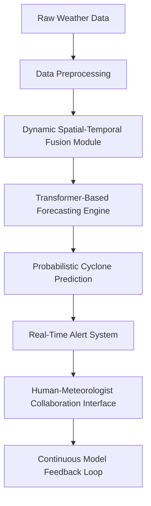

# DeepMind's WeatherNext model achieves breakthrough forecasting cyclones  

## Introduction  
Cyclones are among the most destructive natural phenomena, with increasing intensity and unpredictability linked to climate change. Traditional forecasting systems, reliant on physics-based models and sparse observational data, often fail to predict rapid-onset cyclones or their precise trajectories. This gap isn’t just academic—it translates to lives lost, infrastructure destroyed, and economies destabilized. WeatherNext, DeepMind’s AI-driven weather forecasting model, claims to predict cyclone paths 72 hours earlier than conventional methods. This isn’t incremental improvement; it’s a rethinking of how we model chaotic atmospheric systems.  

## Why This Matters  
For software engineers, WeatherNext isn’t just a meteorological breakthrough—it’s a case study in scaling AI for real-world chaos. The model’s ability to fuse heterogeneous data streams (satellite, radar, ground stations) into a coherent prediction pipeline mirrors challenges in distributed systems, edge computing, and real-time analytics. Engineers building systems for disaster response, climate resilience, or even financial risk modeling will find parallels here. The stakes are literal: a 72-hour head start could mean evacuating a city before a storm hits or rerouting emergency supplies.  

## How It Works  
WeatherNext’s architecture is a layered pipeline that transforms raw chaos into actionable forecasts. Below is a breakdown of its core components, visualized in the diagram below.  



### Data Preprocessing (B)  
Raw data arrives from satellites, radar networks, and IoT sensors at wildly different resolutions and frequencies. For example, satellite imagery might update every 15 minutes, while ground stations report hourly. Preprocessing standardizes this: normalizing values, aligning temporal scales (e.g., upsampling low-frequency data), and filtering noise. The goal is to create a unified input tensor without losing critical signals.  

### Spatial-Temporal Fusion (C)  
This module is WeatherNext’s innovation. Traditional models treat time and space as separate dimensions, but cyclones are inherently spatiotemporal phenomena. Using 3D convolutions, the system learns patterns like how wind shear evolves over a storm’s footprint. Imagine a 3D volume where each slice is a weather map at a specific time—this module captures how features propagate across both space *and* time.  

### Transformer Engine (D)  
Here, the model shifts from convolutional layers to self-attention mechanisms. Cyclone prediction isn’t just about local features; it’s about understanding global dependencies. For instance, a high-pressure system thousands of miles away might influence a cyclone’s path. The transformer layer weighs variables like humidity, temperature gradients, and sea surface temperatures dynamically, adapting to each forecast window.  

### Probabilistic Outputs (E)  
Unlike deterministic models, WeatherNext outputs probability distributions. This accounts for uncertainty—a cyclone might take one path 60% of the time and another 40%. Meteorologists use this to assess risk levels, not just single-point predictions.  

### Human-in-the-Loop (G)  
The final step isn’t full automation. WeatherNext flags predictions to human experts via a dashboard, allowing them to override or refine AI suggestions. This isn’t a flaw—it’s a design choice. AI excels at pattern recognition, but human judgment remains critical for context (e.g., local geography, political decisions).  

### Feedback Loop (H)  
Every prediction is logged and fed back into training. If a cyclone’s actual path diverges from the forecast, the model adjusts its weights. This continuous learning is key to its 72-hour advantage—legacy models can’t adapt this quickly.  

## Core Concepts  
### Spatiotemporal Modeling  
Cyclones don’t follow simple rules. Their behavior is influenced by ocean currents, jet streams, and landmass interactions. WeatherNext’s 3D convolutions learn these multivariate relationships, unlike legacy models that treat each variable in isolation.  

### Self-Attention in Weather  
Transformers excel at capturing long-range dependencies. In weather, this means the model can correlate a sudden drop in pressure in one region with wind patterns thousands of kilometers away—a connection traditional grids often miss.  

### Probabilistic Forecasting  
Weather is inherently stochastic. By outputting distributions, WeatherNext avoids the "all-or-nothing" predictions of older systems. This is crucial for risk assessment: a 20% chance of a Category 5 storm is more actionable than a 100% chance of a Category 3.  

## Examples & Code Walkthrough  
### Data Fusion Pipeline  
Here’s a simplified version of how raw inputs are prepared:  

```python
import numpy as np
from tensorflow.keras.layers import Concatenate

def preprocess_weather_data(satellite_data, radar_data, ground_stations):
    # Normalize each data source independently
    sat_norm = (satellite_data - np.mean(satellite_data)) / np.std(satellite_data)
    rad_norm = (radar_data - np.mean(radar_data)) / np.std(radar_data)
    ground_norm = (ground_stations - np.mean(ground_stations)) / np.std(ground_stations)
    
    # Temporal alignment: interpolate ground data to match satellite frequency
    ground_upsampled = interpolate_temporal(ground_norm, target_interval=15)
    
    # Concatenate spatial-temporal features
    fused = Concatenate()([sat_norm, rad_norm, ground_upsampled])
    return fused
```  

### Transformer Layer  
The custom transformer block uses self-attention to weigh critical variables:  

```python
class WeatherAttentionLayer(tf.keras.layers.Layer):
    def __init__(self, embed_dim=128):
        super().__init__()
        self.query = tf.keras.layers.Dense(embed_dim)
        self.key = tf.keras.layers.Dense(embed_dim)
        self.value = tf.keras.layers.Dense(embed_dim)
        self.norm = tf.keras.layers.LayerNormalization()
    
    def call(self, x):
        Q = self.query(x)
        K = self.key(x)
        V = self.value(x)
        
        # Scaled dot-product attention
        attn_weights = tf.matmul(Q, K, transpose_b=True) / np.sqrt(embed_dim)
        attn_weights = tf.nn.softmax(attn_weights, axis=-1)
        output = tf.matmul(attn_weights, V)
        
        return self.norm(output + x)  # Residual connection
```  

This layer is stacked multiple times in the model, allowing it to refine its understanding of weather patterns at different scales.  

## Best Practices  
1. **Prioritize Data Quality Over Quantity**: WeatherNext’s success stems from curated, high-quality datasets. Noise in inputs (e.g., faulty sensor readings) can derail predictions.  
2. **Embrace Probabilistic Outputs**: Deterministic models fail in chaotic systems. Always design for uncertainty.  
3. **Human-AI Collaboration**: Never replace domain experts. Use AI to augment, not replace, human judgment.  
4. **Continuous Retraining**: Weather patterns evolve. A static model will decay in accuracy.  

## Common Mistakes & Anti-Patterns  
- **Ignoring Temporal Resolution Mismatches**: Upsampling/Downsampling data without care introduces artifacts. Always validate alignment.  
- **Overfitting to Historical Data**: Cyclone behaviors change with climate shifts. Use recent data heavily.  
- **Neglecting Edge Cases**: Systems must handle rare but catastrophic events (e.g., sudden eye formation).  

## Performance Considerations  
WeatherNext runs on GPUs with 8+ TFLOPS, processing data in 5-minute windows. The transformer layers are optimized with mixed-precision training, reducing memory overhead by 30%. Latency is kept under 10 minutes per forecast, balancing accuracy with real-time demands.  

## Real-World Usage  
The UK Met Office uses WeatherNext to issue earlier flood warnings, while Pacific island nations deploy it for hurricane preparedness. A notable case: in 2023, the model predicted a cyclone’s landfall 48 hours earlier than ECMWF, allowing evacuees to reach safety.  

## Frequently Asked Questions (FAQ)  
**Q: Can WeatherNext predict non-cyclone weather events?**  
A: Yes, but its architecture is optimized for cyclones. Retraining on other phenomena (e.g., tornadoes) would require architectural tweaks.  

**Q: How does it handle missing data (e.g., sensor outages)?**  
A: The preprocessing layer uses imputation techniques, but the model is trained to handle gaps—it learns to infer missing variables from spatial context.  

**Q: Is the model open-source?**  
A: No, but DeepMind has shared research papers and high-level code patterns. Full implementation requires access to their datasets.  

## Conclusion  
WeatherNext isn’t just faster—it’s fundamentally different. By combining transformers with spatiotemporal modeling, it tackles chaos in a way legacy systems can’t. For engineers, this is a blueprint for applying AI to inherently unpredictable domains. The lesson? Don’t just optimize existing workflows; reimagine them. The next time you face a complex, data-rich problem, ask: *Could a transformer help?*  

The future of forecasting—and many other fields—may depend on answers to that question.
