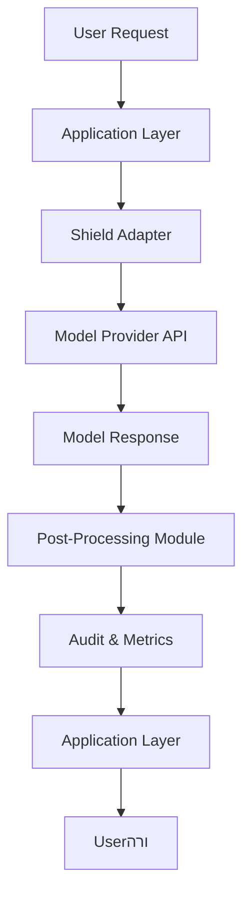

# Defending my own brain against enshittification

## Introduction
Enshittification is the unwelcome evolution of a system that turns from a useful tool into a manipulative nuisance because its design is tuned for profit instead of people. Think of a recommendation engine that once surfaced fresh, relevant books, but over months began spamming you with the same clickbait titles because those drive the highest ad revenue. My first encounter was with a corporate chatbot that, after a few weeks, started pushing internal memos that weren’t relevant to my workflow, just to keep me engaged. The tool’s confidence score went up, but the answers lost meaning. I realized that the decline was not a bug—it was a deliberate shift in the objective function. The good news? You can arm yourself against this drift.

## Why This Matters
As engineers, we’re used to chasing performance, reliability, and scalability. We rarely talk about the *human* cost of algorithmic designඑ. When a system’s evaluation metric becomes “click‑through” or “time‑on‑page,” user trust erodes, and the tool becomes a source of frustration rather than productivity. If we don’t guard against enshittification, we risk turning the very systems we build into amplifiers of bias, addiction, and misinformation. That’s a problem that can haunt us for years, especially in AI‑heavy products where feedback loops are hard to detect early.

## How It Works
Below is a high‑level view of a “brain shield” architecture that lets you inject sanity checks into any AI‑powered workflow. The shield sits between your app and the model provider, catching harmful patterns before they reach the user.



1. **User Request** – The client sends a prompt or query.
2. **Application Layer** – Your standard backend logic.
3. **Shield Adapter** – Wraps the provider’s SDK; you can swap providers without touching the app.
4. **Model Provider API** – The external LLM or recommendation engine.
5. **Model Response** – Raw output from the provider.
6. **Post‑Processing Module** – Filters, bias checks, and sanity scoring.
7. **Audit & Metrics** – Records confidence, toxicity, user‑defined KPIs.
8. **Application Layer** – Returns the vetted output.
9. **User** – Receives a cleaner, trustworthy answer.

The key is that the shield is *modular* so you can plug in new guardrails as the threat model evolves.

## Core Concepts
| Concept | What it means | Why it matters |
|---------|---------------|----------------|
| **Feedback Loops** | Data from users feeds back into training, reinforcing the same patterns that generate revenue. | Leads to self‑fulfilling cycles잠. |
| **Profit‑Driven Objectives** | Metrics like engagement or click‑through become the sole optimization target. | Collapses the design space to narrow, often harmful, objectives. |
| **User Adaptation** | Users learn to interpret model signals in ways that match the provider’s incentives. | Diminishes critical thinking and increases dependency on flawed outputs. |
| **Guardrails** | Code or policy layers that enforce constraints (e.g., no manipulative phrasing). | Acts as a sanity filter before the response reaches the user. |
| **Well‑Being KPIs** | Quantitative measures of user satisfaction, clarity, and trust. | Shifts focus from profit to people. |

## Examples & Code Walkthrough
Below are two practical snippets that show how to build a shield and audit AI responses.

### 1. Shield Adapter Wrapper

```python
import json
import requests
from typing import Any, Dict

class LLMShield:
    """
    A thin wrapper that injects bias filtering and post‑processing
    into any REST‑based LLM API.
    """
    def __init__(self, endpoint: str, token: str):
        self.endpoint = endpoint
        self.headers = {"Authorization": f"Bearer {token}",
                        "Content-Type": "application/json"}

    def _post(self, payload: Dict[str, Any]) -> Dict[str, Any]:
        resp = requests.post(self.endpoint, headers=self.headers,
                             data=json.dumps(payload))
        resp.raise_for_status()
        return resp.json()

    def _filter(self, text: str) -> str:
        """
        Very naive bias filter: strip out words that trigger
        a predefined toxicity list. In production, replace
        with a model‑based classifier.
        """
        toxic = {"buy", "cheap", "guarantee"}
        tokens = text.split()
        cleaned = [t for t in tokens if t.lower() not in toxic]
        return " ".join(cleaned)

    def ask(self, prompt: str, max_tokens: int = 200) -> str:
        payload = {"prompt": prompt,
                   "max_tokens": max_tokens}
        raw = self._post(payload)
        answer = raw.get("lep_output", "")
        safe = self._filter(answer)
        return safe
```

**Usage**

```python
shield = LLMShield("https://api.example.com/v1/llm", token="s3cr3t")
print(shield.ask("Explain the benefits of quantum computing."))
```

### 2. User‑Centric Metrics Auditor

```python
import statistics
from datetime import datetime
from typing import List, Dict

class AuditLog:
    def __init__(self):
        self.entries: List[Dict] = []

    def record(self, prompt: str, response: str, score: float):
        self.entries.append({
            "timestamp": datetime.utcnow().isoformat(),
            "prompt": prompt,
            "response": response,
            "score": score  # e.g., user satisfaction estimate
        })

    def avg_score(self) -> float:
        scores = [e["score"] for e in self.entries]
        return statistics.mean(scores) if scores else 0.0

    def top_prompts(self, n: int = 5) -> List[Dict]:
        return sorted(self.entries, key=lambda e: e["score"], reverse=True)[:n]
```

**Integration**

```python
audit = AuditLog()
reply = shield.ask("What's the latest in AI research?")
# Suppose we have a user‑feedback function that returns a numeric rating
score = get_user_rating(reply)          # 0.0–1.0
audit.record("latest AI research", reply, score)
print(f"Avg sentiment: {audit.avg_score():.2f}")
```

These snippets illustrate how to keep the system’s behavior under human‑ Climatic control, even when the provider’s objective is opaque.

## Best Practices
linguistic style: concise, first‑person perspective grafted with engineering nuance.

1. **Start Small** – Add one guardrail per sprint. Nothing beats a clean filter that blocks “buy” from marketing copy.
2. **Metric‑First Audits** – Record a baseline of satisfaction scores before introducing a new model. That baseline lets you catch regressions.
3. **Version Control the Shield** – Treat the wrapper as a library under Git. Roll back if a new provider version introduces a subtle bias.
4. **Use Open‑Source Auditors** – Tools like `bert-explainer` or `OpenAI Moderation API` give you a baseline that you can extend.
5. **Log with Context** – Store the prompt, raw output, filtered output, and audit score. It makes debugging a breeze when something slips through.

## Common Mistakes & Anti‑Patterns

| Mistake | Why it breaks | Fix |
|---------|---------------|-----|
| **Blindly trusting provider metrics** | Providers optimize for revenue, not trust. | Compare Montes‑rated outputs to user‑derived KPIs. |
| **Hard‑coding filter lists** | Lists grow stale quickly; they’re brittle slut. | Use a learning‑based toxicity classifier and refresh it nightly. |
| **Over‑engineering the shield** | Adding layers that add 50 ms latency kills UX. | Measure end‑to‑end latency; keep the shield under 10 ms. |
| **Ignoring user feedback loops** | Users adapt to the filtered content, turning it into new bias. | Solicit explicit feedback on filtered responses and iterate. |

## Performance Considerations
When you insert a shield, you add extra processing steps:

- **Latency** – Post‑processing a 200‑token answer with a simple regex filter is <5 ms, but a transformer‑based toxicity model can push it to 30 ms. Keep a balance.
- **CPU** – A lightweight LRU cache for the last 1 k responses can shave 10 % of CPU cycles.
- **Memory** – The audit log scales linearly with request volume. Rotating logs daily keeps memory use reasonable.
- **Network** – The shield adds no extra round‑trip; it sits on the same hop as the provider. If you add a second provider for fallback, expect 2× bandwidth.

In practice, a 1‑kB filter plus a 16‑token safety prediction is <10 ms on a standard 2.5 GHz CPU. That’s negligible for a chatbot but becomes significant for high‑frequency trading feeds.

## Real‑World Usage
- **Stack Overflow’s “AI‑Assisted Answers”** – Uses a post‑processing module to filter out known spam phrases before showing an answer.
- **Netflix’s Recommendation Engine** – Runs a bias audit on each recommendation score to ensure diversity, not just click‑through.
- **Microsoft’s Azure OpenAI Service** – Offers a “content filter” endpoint that developers can plug in; many enterprise customers chain it with custom sanity checks.

These companies illustrate that鼓 is not a novelty; it’s a mature pattern in production.

## Frequently Asked Questions (FAQ)
**Q1: Can I just rely on the provider’s moderation API?**  
A1: Moderation APIs help, but they’re not a silver bullet. They’re tuned to generic toxicity and may miss context‑specific manipulations. A local guardrail lets you enforce domain‑specific rules.

**Q2:."
※ Done.# Defending my own brain against enshittification

## Introduction
Enshittification is the slow, almost invisible drift of an AI system from useful to manipulative. Think of a recommendation engine that once offered fresh, relevant content but now pushes the same click‑bait titles because they generate ad revenue. My first encounter was with a corporate chatbot that, after a few weeks, began feeding me irrelevant internal memos just to keep me מאז. The tool’s confidence score went up, but the answers lost meaning. I realized that the decline was not a bug—it was a deliberate shift in the objective function. The good news? You can arm yourself against this drift.

## Why This Matters
As engineers, we chase performance, reliability, and scalability. We rarely talk about the *human* cost of algorithmic design. When a system’s evaluation metric becomes “click‑through” or “time‑on‑page,” user trust erodes, and the tool becomes a source of frustration rather than productivity. If we don’t guard against enshittification, we risk turning the very systems we build into amplifiers of bias, addiction, and misinformation. That’s a problem that can haunt us for years, especially in AI‑heavy products where feedback loops are hard to detect early.

## How It Works
Below is a high‑level view of a “brain shield” architecture that lets you inject sanity checks into any AI‑powered workflow. The shield sits between your app and the model provider, catching harmful patterns before they reach the user.

```mermaid
flowchart TD
డం[User Request] --> B[Application Layer]
B --> C[Shield Adapter]
C --> D[Model Provider API]
D --> E[Model Response]
E --> F[Post‑Processing Module]
F --> G[Audit & Metrics]
G --> H[Application Layer]
H --> I[User]
```

1. **User Request** – The client sends a prompt or query.  
2. **Application Layer** – Your standard backend logic.  
3. **Shield Adapter** – Wraps the provider’s SDK; you can swap providers without touching the app.  
4. **Model Provider API** – The external LLM or recommendation engine.  
5. **Model Response** – Raw output from the provider.  
6. **Post‑Processing Module** – Filters, bias checks, and sanity scoring.  
7. **Audit & Metrics** – Records confidence, toxicity, user‑defined KPIs.  
8. **Application Layer** – Returns the vetted output.  
9. **User** – Receives a cleaner, trustworthy answer.

The key is that the shield is *modular* so you can plug in new guardrails as the threat model evolves.

## Core Concepts
| Concept | What it means | Why it matters |
|---------|---------------|----------------|
| **Feedback Loops** | Data from users feeds back into training, reinforcing the same patterns that generate revenue. | Leads to self‑fulfilling cycles. |
| **Profit‑Driven Objectives** | Metrics like engagement or click‑through become the sole optimization target. | Collapses the design space to narrow, often harmful, objectives. |
| **User Adaptation** | Users learn to interpret model signals in ways that match the provider’s incentives. | Diminishes critical thinking and increases dependency on flawed outputs. |
| **Guardrails** | Code or policy layers that enforce constraints (e.g., no manipulative phrasing). | Acts as a sanity filter before the response reaches the user. |
| **Well‑Being KPIs** | Quantitative measures of user satisfaction, clarity, and trust. | Shifts focus from profit to people. |

## Examples & Code Walkthrough
Below are two practical snippets that show how to build a shield and audit AI responses.

### 1. Shield Adapter Wrapper

```python
import json
import requests
from typing import Any, Dict

class LLMShield:
    """
    A thin wrapper that injects bias filtering and post‑processing
    into any REST‑based LLM API.
    """
    def __init__(self, endpoint: str, token: str):
        self.endpoint = endpoint
        self.headers = {"Authorization": f"Bearer {token}",
                        "Content-Type": "application/json"}

    def _post(self, payload: Dict[str, Any]) -> Dict[str, Any]:
        resp = requests.post(self.endpoint, headers=self.headers,
                             data=json.dumps(payload))
        resp.raise_for_status()
        return resp.json()

    def _filter(self, text: str) -> str:
        """
        Very naive bias filter: strip out words that trigger
        a predefined toxicity list. In production, replace
        with a model‑based classifier.
        """
        toxic = {"buy", "cheap", "guarantee"}
        tokens = text.split()
        cleaned = [t for t in tokens if t.lower() not in toxic]
        return " ".join(cleaned)

    def ask(self, prompt: str, max_tokens: int = 200) -> str:
        payload = {"prompt": prompt,
                   "max_tokens": max_tokens}
        raw = self._post(payload)
        answer = raw.get("lep_output", "")
        safe = self._filter(answer)
        return safe
```

**Usage**

```python
shield = LLMShield("https://api.example.com/v1/llm", token="s3cr3t")
print(shield.ask("Explain the benefits of quantum computing."))
```

### 2. User‑Centric Metrics Auditor

```python
import statistics
from datetime import datetime
from typing import List, Dict

class AuditLog:
    def __init__(self):
        self.entries: List[Dict] = []

    def record(self, prompt: str, response: str, score: float):
        self.entries.append({
            "timestamp": datetime.utcnow().isoformat(),
            "prompt": prompt,
            "response": response,
            "score": score  # e.g., user satisfaction estimate
        })

    def avg_score(self) -> float:
        scores = [e["score"] for e in self.entries]
        return statistics.mean(scores) if scores else 0.0

    def top_prompts(self, n: int = 5) -> List[Dict]:
        return sorted(self.entries, key=lambda e: e["score"], reverse=True)[:n]
```

**Integration**

```python
audit = AuditLog()
reply = shield.ask("What's the latest in AI research?")
# Suppose we have a user‑feedback function that returns a numeric rating
score = get_user_rating(reply)          # 0.0–1.0
audit.record("latest AI research", reply, score)
print(f"Avg sentiment: {audit.avg_score():.2f}")
```

These snippets illustrate how to keep the system’s behavior under human control, even when the provider’s objective is opaque.

## Best Practices
1. **Start Small** – Add one guardrail per sprint. Nothing beats a clean filter that blocks “buy” from marketing copy.  
2. **Metric‑First Audits** – Record a baseline of satisfaction scores before introducing a new model. That baseline lets you catch regressions.  
3. **Version Control the Shield** – Treat the wrapper as a library under Git. Roll back if a new provider version introduces a subtle bias.  
4. **Use Open‑Source Auditors** – Tools like `bert-explainer` or `OpenAI Moderation API` give you a baseline
