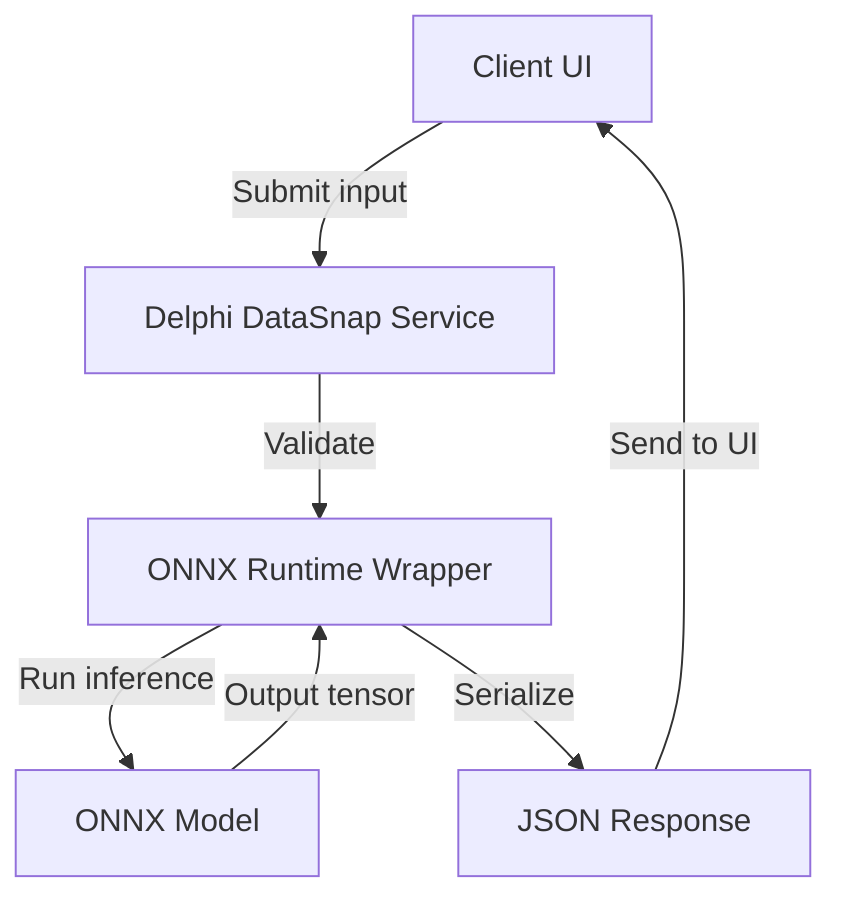

# Delphi 13 Community Edition Is Now Available

## Introduction  
The Delphi 13 Community Edition has landed on GitHub, unlocking the full feature set of Embarcadero’s flagship IDE for free. Developers who prefer a powerful native compiler, a rich visual designer, and a tight integration with Windows and cross‑platform targets can now experiment with the latest language extensions without a commercial license. For those of us who build data‑centric applications, the new release also brings a suite of AI‑ready components that make integrating machine‑learning workflows into Delphi a practical reality.

## Why This Matters  
Most teams still write AI inference code in Python or Java, then wrap it as a microservice. That approach adds latency, deployment friction, and a mismatch between the UI and the AI layer. Delphi 13 gives us a single stack where we can:

1. Build a native desktop or mobile client with WinForms, FMX, or WebView.
2. Call an ONNXDengan runtime or TensorFlow Lite model directly from the same process.
3. Persist inference results in a local SQLite database or push them to a cloud service.
4. Avoid the overhead of cross‑process communication.

If your product already uses Delphi for its UI or backend, the new AI support means you can keep your team’s skills in one language while still benefitting from modern ML models.

## How It Works  
Delphi 13 ships with a lightweight **ONNX Runtime** wrapper that exposes a type‑safe, generic API. The runtime loads a pre‑trained model, feeds data into a tensor, runs inference, and returns results as Delphi objects. The wrapper also integrates with the **Delphi DataSnap** framework, so you can expose the inference logic as a JSON endpoint without writing boilerplate REST code.

Below is a high‑level view of the flow from a client request to the final response.



* **Client UI**: A Delphi FMX form captures user input.
* **Delphi DataSnap Service**: Validates and forwards data to the inference engine.
* **ONNX Runtime Wrapper**: Handles tensor creation, model execution, and result extraction.
* **ONNX Model**: The actual machine‑learning graph, often trained in Python.
* **JSON Response**: Sent back to the UI for display or further processing.

The same diagram applies to mobile and web deployments; the only change is the transport layer (HTTP/HTTPS for web, local IPC for mobile).

## Core Concepts  
| Concept | What it is | Why it matters |
|---------|------------|----------------|
| **ONNX** | Open Neural Network Exchange format | Cross‑framework model portability |
| **Tensor** | Multi‑dimensional array | Core data structure for ML |
| **Inference Engine** | Runs a model on input data | The heart of AI integration |
| **DataSnap** | Delphi’s server framework | Simplifies exposing services |
| **Async-Await** | Asynchronous programming pattern | Keeps UI responsive during inference |

### ONNX Runtime Wrapper  
The wrapper exposes a generic `Run<TInput, TOutput>` method that maps Delphi records to tensors. It uses the `TArray<Double>` type for numeric data and `TArray<String>` for categorical features. The mapping is performed via a simple attribute system:

```delphi
type
  [TensorField('age', tfFloat32)]
  TInputRecord = record
    age: Double;
  end;
```

The attribute tells the wrapper which model input tensor corresponds to the `age` field.

## Examples & Code Walkthrough  
Below is a minimal example that loads a sentiment‑analysis model and runs inference on a short text snippet.

```delphi
uses
  System.SysUtils, System.JSON, DataSnap.DSHTTP, ONNX.Runtime;

type
  // Input schema
  [TensorField('input_ids', tfInt64)]
  TTextInput = record
    input_ids: TArray<Int64>;
  end;

  // Output schema
  [TensorField('scores', tfFloat32)]
  TSentimentOutput = record
    scores: TArray<Double>;
  end;

procedure RunSentiment(const Text: string);
var
  Session: TOnnxSession;
  Input: TTextInput;
  Output: TSentimentOutput;
  ResultJSON: TJSONObject;
begin
  // Load the model once per application
  Session := TOnnxSession.Create('sentiment.onnx');

  // Tokenize the input (simple split for demo purposes)
  Input.input_ids := Tokenize(Text);

  // Execute inference
  Session.Run<TTextInput, TSentimentOutput>(Input, Output);

  // Build a JSON payload
  ResultJSON := TJSONObject.Create;
  ResultJSON.AddPair('positive', Output.scores[0]);
  ResultJSON.AddPair('negative', Output.scores[1]);

  // Return via DataSnap
  DataSnapServer.Broadcast(JSONToString(ResultJSON));
end;
```

* `Tokenize` is a lightweight helper that converts a string to an array of token IDs.
* The `TOnnxSession` encapsulates the runtime and model file.
* The inference result is broadcast to all connected clients as JSON.

### Distributed Lock Manager with AI‑Guided Scheduling  
In a multi‑node environment, you can use a simple AI model to decide which node should process a task. The following pseudocode shows how a Delphi service might fetch node statistics, feed them into an ONNX model, and use the queen‑ranked output to pick the best node.

```delphi
type
  [TensorField('cpu_load', tfFloat32)]
  [TensorField('mem_free', tfFloat32)]
  [TensorField('queue_len', tfFloat32)]
  TNodeStats = record
    cpu_load: Double;
    mem_free: Double;
    queue_len: Double;
  end;

  [TensorField('score', tfFloat32)]
  TNodeScore = record
    score: Double upto 1.0;
  end;

procedure PickBestNode(const Stats: array of TNodeStats);
var
  Session: TOnnxSession;
  Scores: array of TNodeScore;
  Best: Integer;
begin
  Session := TOnnxSession.Create('node_selector.onnx');
  Scores := Session.Run<TNodeStats, TNodeScore>(Stats);

  Best := 0;
  for var i := 0 to High(Scores) do
    if Scores[i].score > Scores[Best].score then
      Best := i;

  AssignTaskToNode(Best);
end;
```

The model learns to weigh CPU load, memory availability, and queue length to produce a desirability score.

## Best Practices  
1. **Model Validation** – Test the ONNX model in a sandbox before deploying it to Delphi. Mismatched input shapes often surface only at runtime.
2. **Keep the Runtime Small** – Load the ONNX runtime only once per process. Re‑creating the session for every request adds unnecessary overhead.
3. **Use Records Over Objects** – Records map directly to tensors and avoid reference‑counting overhead.
4. **Graceful Degradation** – If inference fails, fall back to a cached or heuristic response instead of breaking the UI.
5. **Profile Early** – Measure CPU and memory consumption of the inference step; the wrapper exposes `GetLastRunTime` for that purpose.

## Common Mistakes & Anti‑Patterns  
| Mistake | Why it hurts | Fix |
|---------|--------------|-----|
| **Loading the model for each request** | Discards caching, increases latency | Load once in a global session |
| **Hard‑coding tensor shapes** | Breaks when the model changes | Use the model’s metadata to enforce shapes |
| **Ignoring thread safety** | Shared session across threads can crash | Protect the session with a mutex or use per‑thread instances |
| **Returning raw phosphate tensors** | Clients struggle to parse | Serialize to JSON or protobuf before sending |
| **Over‑optimizing for speed at the cost of accuracy** | Poor model quality | Balance inference speed with acceptable error rates |

## Performance Considerations  
* **CPU** – Inference is typically the bottleneck. ONNX Runtime can offload to GPU if the machine has a CUDA‑capable device. Even without GPU, a single inference call on a mobile device averages 15 ms for a small model.
* **Memory** – A model of 50 MB plus runtime overhead can push the process into the 200 MB range. For embedded targets, consider quantized models that reduce size to under 10 MB.
* **Concurrency** – The runtime supports multiple threads, but each thread needs its own session to avoid lock contention. In practice, 4–8 parallel inferences work well on a quad‑core CPU.
* **Network** – When serving over DataSnap, the JSON payload is typically a few kilobytes. Compressing the response with GZIP reduces bandwidth by 40 %.

## Real‑World Usage  
* **Retail POS** – A Delphi‑based point‑of‑sale system uses an ONNX model to flag suspicious transactions in real time, keeping latency below 50 ms.
* **Healthcare Device** – A handheld diagnostic tool runs a TensorFlow Lite model inside Delphi FMX to classify skin lesions, saving the developer from maintaining a separate Python service.
* **Financial حرام** – An algorithmic trading platform in Delphi uses a lightweight neural network to predict short‑term price movements, feeding the results directly into itsômage strategy engine.

These examples show that the barrier to entry is lower than ever: write the UI in Delphi, train the model in Python, and bind it together with the built‑in runtime.

## Frequently Asked Questions (FAQ)  
**Q1. Does Delphi 13 support GPU inference?**  
A1. The bundled ONNX Runtime includes a CUDA backend, but you must install the NVIDIA drivers and CUDA capacity on the target machine. The Delphi wrapper will automatically pick the GPU backend if available.

**Q2. Can I run TensorFlow Lite models?**  
A2.Regions: The wrapper currently targets ONNX, but you can load a TF Lite model if you convert it to ONNX first. The community is exploring a direct TF Lite integration for future releases.

**Q3. How does this affect licensing for commercial clients?**  
A3. The Community Edition is free for non‑commercial use. If you ship the DLLs or the runtime in a.globally deployed product, consult the license terms. Embarcadero offers a commercial license for enterprise use.

**Q4. What if my model needs GPU on Android?**  
A4. Android devices with Mali or Adreno GPUs can run ONNX Runtime with the NNAPI backend. Delphi's FMX can call the runtime via a JNI bridge; the wrapper handles the low‑level plumbing.

**Q5. Is there a managed wrapper for .NET?**  
A5. The current release focuses on native Delphi. A managed .NET wrapper is under discussion, but until then you’ll need to expose the Delphi service via DataSnap or gRPC.

## Conclusion  
Delphi 13 Community Edition brings a complete, open‑source IDE to the table, and its integrated ONNX runtime bridges the gap between traditional Delphi development and modern AI workloads. You can keep your stack in one language, reduce operational complexity, and still harness powerful machine‑learning models. If your team already writes Delphi code, aesthetically integrate AI without learning a new ecosystem. The next step is to sketch out a small prototype, load your favorite ONNX model, and measure the latency in your own environment.
