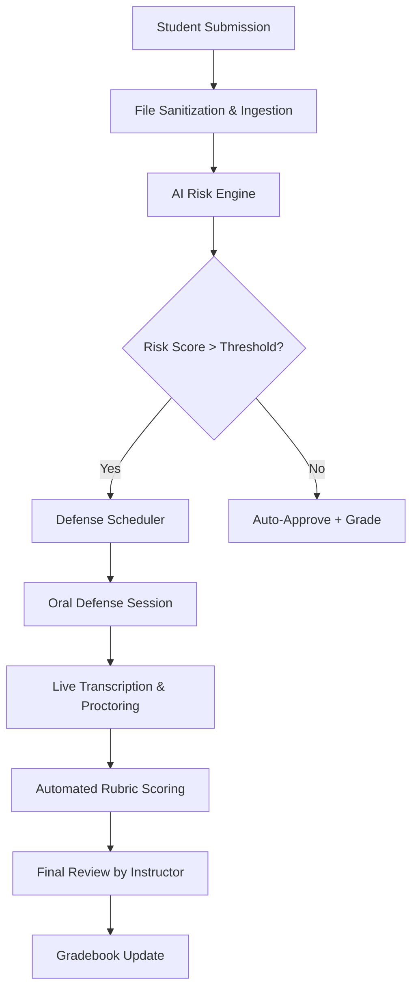

# Denmark Requires Oral Defenses for Students' Written Work to Counter AI Cheating

## Introduction

Denmark is taking a bold step in academic integrity by mandating oral defenses for student-written work suspected of being generated with AI assistance. This isn’t just a policy tweak — it’s a systemic response to a problem that’s already reshaping higher education globally. As LLMs become more sophisticated, traditional plagiarism detection tools are falling short. Universities can no longer rely solely on keyword matching or citation checks. They need a smarter, more adaptive approach — one that combines AI detection, risk scoring, and human validation through structured oral assessments.

## Why This Matters

Software engineers building systems for education, compliance, or content moderation should pay attention. This isn’t just about catching cheaters; it’s about designing resilient pipelines that handle ambiguity, scale under pressure, and maintain trust. The core challenge mirrors many real-world problems: how do you verify authenticity when the source material is indistinguishable from human output? Whether you’re securing financial transactions, moderating social media, or verifying identity, this use case offers valuable lessons in layered verification and risk-based decision-making.

## How It Works

At its heart, Denmark’s new system is a multi-stage pipeline that evaluates student submissions, flags high-risk content, schedules oral defenses, and grades outcomes. Here’s how the architecture breaks down:



1. **Submission Ingestion**: Secure upload with file type validation and malware scanning.
2. **AI Risk Engine**: Analyzes text for linguistic patterns associated with LLMs, including perplexity, burstiness, and semantic inconsistency.
3. **Risk Assessor**: Applies configurable thresholds based on institutional policy.
4. **Defense Scheduler**: Integrates with calendars to assign time slots, avoiding conflicts.
5. **Oral Defense Platform**: Hosts secure video sessions with real-time transcription and optional proctoring.
6. **Grading Engine**: Uses rubric-based AI scoring, finalized by an instructor.

Each component communicates via well-defined APIs, ensuring modularity and ease of updates as detection methods evolve.

## Core Concepts

### Risk-Based Authentication
Rather than binary pass/fail checks, the system uses probabilistic models to calculate a risk score. This mirrors fraud detection in finance, where transactions are scored rather than outright blocked.

### Linguistic Fingerprinting
LLM-generated text often exhibits telltale signs: uniform sentence structure, lack of personal voice, and overly polished phrasing. Detection relies on statistical analysis of these features.

### Human-in-the-Loop Verification
Oral defenses reintroduce human judgment into the process. Even if an AI writes a flawless essay, articulating ideas under questioning reveals gaps in understanding.

### Audit Trails
Every action — from initial submission to final grade — is logged for transparency and compliance, especially important under GDPR.

## Examples & Code Walkthrough

Let’s implement a simplified version of the **AI Risk Engine**, which scores a document based on linguistic features.

```python
import re
from collections import Counter
import math

def calculate_perplexity(text):
    words = re.findall(r'\b\w+\b', text.lower())
    freq = Counter(words)
    total_words = len(words)
    
    # Shannon entropy as a proxy for unpredictability
    entropy = -sum((count / total_words) * math.log2(count / total_words)
                   for count in freq.values())
    return entropy

def calculate_burstiness(text):
    sentences = re.split(r'[.!?]+', text)
    sentence_lengths = [len(re.findall(r'\b\w+\b', s)) for s in sentences if s.strip()]
    if not sentence_lengths:
        return 0
    
    avg_len = sum(sentence_lengths) / len(sentence_lengths)
    variance = sum((x - avg_len) ** 2 for x in sentence_lengths) / len(sentence_lengths)
    return math.sqrt(variance)

def score_document(text, length_weight=0.3, perplexity_weight=0.4, burstiness_weight=0.3):
    perplexity_score = calculate_perplexity(text)
    burstiness_score = calculate_burstiness(text)
    length_score = min(len(text) / 5000, 1.0)  # Normalize to 0–1 range

    weighted_score = (
        length_weight * length_score +
        perplexity_weight * (perplexity_score / 10) +  # Normalize perplexity
        burstiness_weight * burstiness_score
    )

    # Clamp between 0 and 1
    return max(0.0, min(1.0, weighted_score))

# Example usage
submission = "This essay was written by a student discussing the impacts of climate change..."
risk = score_document(submission)
print(f"AI Risk Score: {risk:.2f}")
```

This function returns a normalized risk score. In practice, you’d integrate this with a machine learning model trained on labeled datasets of human vs. AI-generated texts.

## Best Practices

- **Modular Design**: Keep detection logic separate from scheduling and grading so each can evolve independently.
- **Configurable Thresholds**: Institutions should be able to adjust sensitivity without code changes.
- **Graceful Degradation**: If the AI engine fails, fall back to manual review, not automatic rejection.
- **Real-Time Feedback**: Notify instructors immediately when a defense is scheduled or completed.
- **Data Privacy First**: Encrypt all communications and anonymize logs where possible.

## Common Mistakes & Anti-Patterns

1. **Over-reliance on Single Metrics**: Using only perplexity or burstiness leads to false positives. Combine multiple signals.
2. **Ignoring Edge Cases**: Short essays, non-native speakers, and creative writing styles skew results. Always allow for appeals.
3. **Hardcoded Policies**: Embedding thresholds in code makes adaptation slow. Move policies to configuration files or databases.
4. **No Fallback Mechanism**: Systems must degrade gracefully. If detection fails, don’t block submissions indefinitely.

## Performance Considerations

- **Latency**: Text analysis should complete within seconds to avoid disrupting submission flows.
- **Throughput**: Batch processing during peak periods (e.g., end-of-term deadlines) requires horizontal scaling.
- **Memory Usage**: Avoid loading entire documents into memory for large files. Stream processing is preferable.
- **Model Complexity**: Simpler heuristics may suffice for initial screening. Reserve heavy ML models for borderline cases.
- **Scalability**: Use message queues (e.g., RabbitMQ/Kafka) to decouple ingestion from analysis.

## Real-World Usage

While Denmark is pioneering this policy at a national level, similar approaches are emerging elsewhere:

- **Turnitin** has introduced AI writing detection tools, though they’ve faced criticism for accuracy.
- **University of California, Berkeley** piloted oral exams for suspected AI-assisted assignments.
- **Coursera** now offers identity verification services that include webcam proctoring and keystroke dynamics.

These implementations show that combining automated detection with human oversight is becoming standard practice — not just in academia, but across industries requiring content authenticity.

## Frequently Asked Questions (FAQ)

**Q: Can LLMs pass oral defenses?**  
A: Not reliably. While they can generate coherent responses, they struggle with spontaneous reasoning, emotional nuance, and detailed recall of specific arguments.

**Q: What happens if a student refuses the defense?**  
A: Institutions typically treat refusal as evidence of misconduct, leading to disciplinary action or grade penalties.

**Q: Is this approach legally enforceable?**  
A: Yes, as long as it aligns with local educational laws and student rights frameworks. Clear communication and appeal processes are essential.

**Q: How accurate are current AI detectors?**  
A: Mixed. Some tools report up to 90% accuracy, but false positives remain a concern, especially with paraphrased or collaborative writing.

**Q: Will this increase workload for instructors?**  
A: Initially, yes. But automation in scheduling, transcription, and preliminary grading helps offset the burden over time.

## Conclusion

Denmark’s push toward oral defenses represents a shift from reactive policing to proactive verification. For engineers, it’s a reminder that the best systems aren’t just smart — they’re robust, transparent, and designed with real people in mind. As AI becomes indistinguishable from human output, our tools must adapt. Layered defense, clear workflows, and continuous learning aren’t luxuries anymore — they’re necessities.
