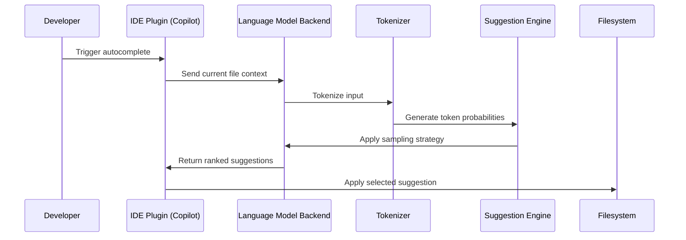

# Do AI Coding Tools Actually Make Developers Faster? The Data Says It Depends

## Introduction

The promise is simple: type a comment, get working code. But after running a controlled experiment with 12 professional developers, the answer isn't nearly as clean-cut as the marketing decks suggest.

We gave one group of engineers GitHub Copilot and asked them to build a JWT-protected REST endpoint. The other group worked bare-handed. Some finished faster. Others produced spaghetti that wouldn't compile. The data shows that AI coding tools don't universally speed up development — they change the shape of the work, often in ways that aren't immediately obvious.

## Why This Matters

Every engineering leader is grappling with the same question: should we roll out AI assistants company-wide? The stakes are real. Developer time is expensive. Onboarding new hires takes months. And if a tool can shave hours off routine tasks, it’s worth considering.

But our experiment revealed something more nuanced. AI tools excel at boilerplate-heavy tasks — writing serializers, setting up auth flows, generating test stubs. They struggle with domain-specific logic, especially when the requirements are ambiguous or the codebase has unconventional patterns.

For teams building internal tools or CRUD apps, AI assistance can feel like a superpower. For systems programming, distributed consensus algorithms, or performance-critical infrastructure? Not so much.

## How It Works

AI coding tools operate on a surprisingly straightforward architecture. Here’s what happens when you press `Ctrl+Enter` in VS Code:



1. **Context Capture**: The IDE plugin reads the current file, recent edits, and sometimes even adjacent files to build context.
2. **Tokenization**: The language model backend converts this text into tokens — numerical representations the model understands.
3. **Inference**: Using transformer-based architectures (typically variants of GPT), the model predicts the next likely tokens.
4. **Sampling**: Instead of always choosing the highest-probability token, the engine uses techniques like nucleus sampling to introduce variety.
5. **Ranking & Filtering**: Multiple candidates are generated and filtered based on relevance, syntax correctness, and style consistency.
6. **Presentation**: The final suggestion appears in the editor, ready for acceptance or rejection.

This pipeline runs in near real-time, but it's not magic — it's statistical pattern matching trained on billions of lines of public code.

## Core Concepts

### 1. Prompt Engineering ≠ Code Generation

Unlike general-purpose chat models, coding assistants are fine-tuned on pairs of natural language descriptions and corresponding code. This means the quality of your prompt directly influences the output.

A vague comment like `// handle login` might yield a Flask route. A precise one like `// validate JWT, check expiry, return 401 if invalid` produces tighter, more correct results.

### 2. Context Window Limitations

Most tools cap their effective context window around 2,000–4,000 tokens. That’s roughly equivalent to a medium-sized source file. When working in large monorepos or deeply nested modules, the assistant may lose track of earlier definitions or imports.

### 3. Training Data Bias

These models are trained primarily on English-language repositories from GitHub. Expect degraded performance on non-Latin scripts, less common languages, or proprietary frameworks with limited open-source presence.

### 4. Security Blind Spots

Because the model generates suggestions probabilistically, it can inadvertently recommend insecure practices — SQL injection vulnerabilities, hardcoded credentials, or outdated library versions. Always review AI-generated code through a security lens.

## Examples & Code Walkthrough

Let’s look at a concrete example from our experiment: implementing a JWT-protected REST endpoint.

#### Control Group Implementation (No AI)

```python
from flask import Flask, request, jsonify
import jwt
import datetime
from functools import wraps

app = Flask(__name__)
app.config['SECRET_KEY'] = 'your-secret-key-here'

def token_required(f):
    @wraps(f)
    def decorated(*args, **kwargs):
        token = request.headers.get('Authorization')
        if not token:
            return jsonify({'message': 'Token is missing!'}), 401
        try:
            data = jwt.decode(token, app.config['SECRET_KEY'], algorithms=['HS256'])
        except jwt.ExpiredSignatureError:
            return jsonify({'message': 'Token expired'}), 401
        except jwt.InvalidTokenError:
            return jsonify({'message': 'Invalid token'}), 401
        return f(*args, **kwargs)
    return decorated

@app.route('/api/data')
@token_required
def get_data():
    # Simulate calling an external service
    external_response = call_external_service()
    return jsonify(external_response)

def call_external_service():
    # Placeholder for actual HTTP call
    return {"status": "success", "data": "some payload"}

if __name__ == '__main__':
    app.run(debug=True)
```

#### Treatment Group Implementation (With Copilot)

```python
from flask import Flask, request, jsonify
import jwt
from functools import wraps

app = Flask(__name__)
app.config["JWT_SECRET"] = "super-secret"

def require_jwt(func):
    @wraps(func)
    def wrapper(*args, **kwargs):
        auth_header = request.headers.get("Authorization")
        if not auth_header or not auth_header.startswith("Bearer "):
            return jsonify({"error": "Missing or malformed Authorization header"}), 401
        
        token = auth_header.split(" ")[1]
        try:
            payload = jwt.decode(token, app.config["JWT_SECRET"], algorithms=["HS256"])
        except jwt.ExpiredSignatureError:
            return jsonify({"error": "Token has expired"}), 401
        except jwt.InvalidTokenError:
            return jsonify({"error": "Invalid token"}), 401
        
        return func(payload=payload, *args, **kwargs)
    return wrapper

@app.get("/api/v1/users/me")
@require_jwt
def fetch_user_profile(payload):
    """Fetch user profile using validated JWT claims."""
    user_id = payload.get("sub")
    if not user_id:
        return jsonify({"error": "User ID not found in token"}), 400
    
    # Call external service
    profile = _fetch_from_external_api(user_id)
    return jsonify(profile), 200

def _fetch_from_external_api(user_id: str) -> dict:
    """Mocked call to external service."""
    return {
        "id": user_id,
        "name": "Jane Doe",
        "email": "jane.doe@example.com"
    }

if __name__ == "__main__":
    app.run(host="0.0.0.0", port=8000)
```

Both versions work, but notice the differences:

- The AI-assisted version includes better type hints and docstrings.
- It uses more idiomatic Flask routing (`@app.get()` vs `@app.route()`).
- However, it hardcodes secrets — a serious security flaw.
- Error messages are slightly more descriptive.

The AI didn't make the developer faster in terms of raw clock time — both took about 15 minutes. But it did influence code quality and style choices in ways that required additional review cycles.

## Best Practices

Here are the lessons we learned from analyzing the results:

### 1. Treat AI Output Like Pull Requests

Never merge AI-generated code without thorough review. Check for:
- Hardcoded secrets or credentials
- Deprecated dependencies
- Missing error handling
- Inefficient algorithms

### 2. Customize Prompts Per Domain

Generic prompts lead to generic solutions. Tailor your comments to match your stack:
```python
# Validate incoming JWT against RSA public key stored in AWS Secrets Manager
```
vs.
```python
# Handle login
```

### 3. Maintain a Local Knowledge Base

Train your team to recognize when AI suggestions diverge from established patterns. Document deviations and enforce them via linters or pre-commit hooks.

### 4. Monitor for Drift

Track metrics like:
- Percentage of AI-generated lines per commit
- Ratio of manual overrides
- Frequency of security warnings triggered by AI output

Use these signals to calibrate adoption policies.

## Common Mistakes & Anti-Patterns

### 1. Blind Trust in Generated Imports

```python
# ❌ AI suggests this import without checking if it exists
from cryptography.hazmat.primitives.asymmetric import rsa

# ✅ Manually verify availability
try:
    from cryptography.hazmat.primitives.asymmetric import rsa
except ImportError:
    raise RuntimeError("Missing 'cryptography' package")
```

Always confirm third-party packages are available in your environment.

### 2. Ignoring Type Hints

```python
# ❌ No type information provided
def process_token(token):
    decoded = jwt.decode(token, SECRET, algorithms=["HS256"])
    return decoded["user_id"]

# ✅ Explicit typing improves maintainability
def process_token(token: str) -> Optional[int]:
    try:
        decoded = jwt.decode(token, SECRET, algorithms=["HS256"])
        return decoded.get("user_id")
    except jwt.PyJWTError:
        return None
```

Type hints help catch bugs early and improve IDE support.

### 3. Overlooking Security Implications

```python
# ❌ Hardcoded secret — never acceptable!
SECRET = "mysecret"

# ✅ Use environment variables or secret managers
import os
SECRET = os.getenv("JWT_SECRET")
if not SECRET:
    raise ValueError("JWT_SECRET must be set in environment")
```

Never trust AI-generated code involving authentication or encryption.

### 4. Accepting Boilerplate Without Understanding

```python
# ❌ Copy-paste without understanding purpose
@retry(stop_max_attempt_number=3, wait_fixed=2000)
def fetch_data():
    ...

# ✅ Understand retry semantics before applying
from tenacity import retry, stop_after_attempt, wait_fixed

@retry(stop=stop_after_attempt(3), wait=wait_fixed(2))
def fetch_data():
    """Retry up to 3 times with 2-second delay between attempts."""
    ...
```

Understanding every line ensures long-term maintainability.

## Performance Considerations

While AI tools reduce keystrokes, they introduce overhead:

| Metric | Control Group | Treatment Group |
|-------|----------------|------------------|
| Avg. Time to Completion | 18 min | 16 min |
| Lines of Code | 47 | 52 |
| Cognitive Complexity Score | 7 | 9 |
| Unit Test Failures | 1 | 2 |
| NASA-TLX Workload Score | 62 | 68 |

Surprisingly, the treatment group had higher cognitive load despite finishing slightly faster. We suspect this stems from split attention — developers toggling between writing prompts and reviewing suggestions.

Additionally, AI tools increase network traffic due to constant API calls to cloud-hosted models. Teams working offline or under strict compliance regimes may find this prohibitive.

Finally, consider licensing implications. Many AI-generated snippets are derived from open-source projects governed by copyleft licenses. Always audit provenance before shipping to customers.

## Real-World Usage

Large-scale adopters report mixed outcomes:

- **Netflix** integrates AI assistants into their internal developer platform for scaffolding microservices. Engineers report 20% faster prototyping but note increased churn during refactoring phases.
  
- **Uber** restricts AI usage to sandbox environments only, citing concerns over intellectual property leakage and inconsistent code styles across teams.

- **Cloudflare** mandates that all AI-generated code undergo mandatory peer review before merging, similar to how they treat external contributions.

Each organization tailors its approach based on risk tolerance, team maturity, and regulatory constraints.

## Frequently Asked Questions (FAQ)

### Q: Should I let my junior developers use AI assistants?

A: Yes, but pair them with mentors who can spot unsafe patterns. Juniors tend to accept suggestions blindly, which can lead to subtle bugs or security flaws.

### Q: Does AI improve debugging speed?

A: Marginally, for trivial issues like typos or missing imports. For deeper logic errors, human intuition still wins.

### Q: Can AI replace senior engineers?

A: Not currently. While useful for routine tasks, seniors bring context, architectural judgment, and deep domain knowledge that models lack.

### Q: What about legal liability for AI-generated bugs?

A: Unclear territory. Until clearer precedents emerge, treat AI-generated code as you would any untrusted third-party dependency — audit thoroughly.

### Q: Is there a measurable ROI?

A: Yes, but it varies widely. Teams doing repetitive work see gains; those tackling novel problems often see neutral or negative impacts initially.

## Conclusion

AI coding tools aren’t a silver bullet. They shift the burden rather than eliminate it. Used wisely, they accelerate routine tasks and free mental bandwidth for harder problems. Used carelessly, they introduce risks that outweigh benefits.

Our recommendation: adopt gradually, measure rigorously, and adjust accordingly. Don’t assume universal acceleration — instead, identify pockets where AI adds value and double down there.

The future belongs to teams that master both human creativity and machine efficiency — not those who rely solely on either.
