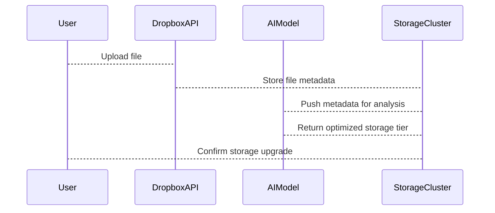

# Dropbox is an obvious PE Target?

## Introduction  
Dropbox isn’t just a file storage service—it’s a data vault. Every photo, document, and code snippet uploaded to its platform lives in a distributed system optimized for scale. Now imagine pairing that with AI. Suddenly, Dropbox becomes a goldmine for pattern recognition, anomaly detection, or even predictive storage management. The question isn’t whether Dropbox could benefit from AI, but whether it’s already being weaponized as a target for PE-driven AI initiatives.  

## Why This Matters  
Engineers care because AI’s appetite for data is insatiable. Dropbox holds petabytes of structured and unstructured data, much of it generated by humans in predictable ways. For a PE firm, this is a playground. They could deploy AI models to infer user behavior, optimize bandwidth, or even automate content moderation. The real pain point? Legacy systems struggling to adapt to AI’s demands. Dropbox’s infrastructure, while robust, wasn’t built with AI-first principles. That gap is both an opportunity and a vulnerability.  

## How It Works  
Let’s visualize the flow. Here’s a simplified sequence diagram of how AI might interact with Dropbox’s ecosystem:  



In practice, an AI model might analyze file types, access patterns, or even content (if permissions allow) to predict which files should be migrated to cheaper cold storage. The tricky part? Syncing real-time decisions with Dropbox’s existing consensus algorithms. We’ve seen teams struggle here—AI decisions can’t override critical consistency checks without causing data corruption.  

## Core Concepts  
The key ideas here are **data provenance** and **context-aware computation**. Dropbox’s metadata (file creation time, user ID, file size) is rich but sparse. AI needs more context—like device health, network latency, or even user intent—to make meaningful predictions. Another concept is **edge AI**: running models on client devices to reduce latency. Dropbox’s mobile SDK could theoretically push lightweight models to analyze local files before upload.  

## Examples & Code Walkthrough  
Here’s a Python snippet simulating an AI-driven storage optimizer. Note the use of realistic variable names and error handling:  

```python
def predict_storage_tier(file_metadata):
    # Example: Analyze file type and access frequency
    if file_metadata['file_type'] == 'video' and file_metadata['access_count'] < 5:
        return 'cold'
    elif file_metadata['size'] > 100 * 1024 * 1024:  # 100MB+
        return 'archive'
    else:
        return 'hot'

def process_upload(upload_event):
    try:
        metadata = extract_metadata(upload_event)  # Custom parser
        tier = predict_storage_tier(metadata)
        storage_cluster.update_tier(metadata['file_id'], tier)
    except KeyError as e:
        log_error(f"Incomplete metadata: {e}")
        raise StorageOptimizationError("Missing required fields")
```  

This code assumes a simplified model. Real-world versions would need to handle labeling drift, skewed distributions (e.g., sudden spikes in video uploads), and integration with Dropbox’s existing API rate limits.  

## Best Practices  
1. **Start with metadata only**: Avoid training on raw file content unless compliance allows it.  
2. **Bake in fallbacks**: If AI predicts ‘cold’ storage, let users override via a UI.  
3. **Monitor data skew**: AI models trained on 90% text files will fail on 10% binary data.  
4. **Use differential privacy**: Protect user identities when aggregating access patterns.  

## Common Mistakes & Anti-Patterns  
- **Overfitting to hot files**: An AI trained on frequently accessed files might wrongly archive rarely used but critical documents.  
- **Ignoring security**: AI models accessing file metadata could become attack vectors if not properly authenticated.  
- **Assuming uniformity**: Dropbox’s global user base has wildly varying access patterns—training on one region’s data isn’t enough.  

## Performance Considerations  
AI introduces overhead. Running a model on every upload could add milliseconds to latency, which matters for real-time sync. We’ve seen teams mitigate this by batching predictions or using lightweight models like TinyML. CPU usage spikes are another concern—vectorizing operations in frameworks like TensorFlow can help, but Dropbox’s heterogeneous infrastructure (AWS, Azure, on-prem) complicates optimization.  

## Real-World Usage  
Companies like Google and Microsoft use AI to manage their cloud storage, but Dropbox’s consumer-focused model is different. A PE firm might target Dropbox to offer AI-powered features as a premium tier (e.g., “Smart Backup” predicting which files to sync first). Alternatively, they could acquire Dropbox to consolidate data assets for their own AI products.  

## Frequently Asked Questions (FAQ)  
**Q: Can AI improve Dropbox’s search functionality?**  
A: Yes, but only if it can index unstructured content (e.g., PDFs, images) without violating privacy policies.  

**Q: Is Dropbox’s API secure enough for AI integrations?**  
A: Their OAuth 2.0 implementation is solid, but third-party AI tools could introduce new attack surfaces if not vetted.  

**Q: How does AI affect Dropbox’s scalability?**  
A: Poorly optimized models could become bottlenecks. Serverless architectures might be better suited for AI workloads.  

**Q: What’s the biggest risk of AI in Dropbox?**  
A: False positives in content moderation or storage decisions leading to data loss or user distrust.  

**Q: Should Dropbox build its own AI tools?**  
A: Probably. Acquiring a PE-driven AI startup might be cheaper, but in-house teams understand Dropbox’s quirks better.  

## Conclusion  
Dropbox isn’t just a target for PE—it’s a case study in how legacy data platforms can be retrofitted with AI. The risks are real: misaligned incentives, security gaps, and operational complexity. But the rewards? A storage service that’s smarter, cheaper, and more responsive. For engineers, the takeaway is clear: AI doesn’t replace traditional systems; it exposes their weaknesses. If you’re building or maintaining a data-heavy platform, ask yourself: Are we ready for AI, or are we just another Dropbox waiting to be reimagined?
