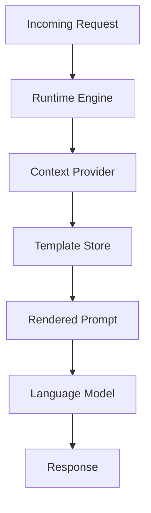

# Dynamic Prompts: Context Injected at Runtime

## Introduction
Static prompt templates often fail when the surrounding state changes. In a system that serves thousands of requests per second, the ability to inject live context—user preferences, current time, recent interactions—determines whether the model returns a generic answer or a relevant one. We built a runtime engine that merges a base template with a dynamic context map before the request reaches the model.

## Why This Matters
Engineers care because fixed prompts lead to higher latency, wasted tokens, and lower user satisfaction. When a prompt must be rebuilt for each request, manual string concatenation introduces bugs and slows down iteration. A dynamic approach centralizes the logic, reduces duplication, and enables A/B testing of prompt variants without redeploying code.

## How It Works
The engine receives a request identifier, retrieves a template from a versioned store, and calls a context provider to gather variables. It then renders the template with the gathered variables, producing a final prompt string that is sent to the language model.

1. **Request arrival** – The API gateway forwards the request to the engine.
2. **Template lookup** – The engine fetches the template associated with the request type.
3. **Context collection** – A pluggable provider aggregates data from caches, databases, and external services.
4. **Rendering** – The engine substitutes placeholders with the collected values, applying escaping and validation.
5. **Model invocation** – The rendered prompt is posted to the model endpoint.
6. **Response handling** – The model output is parsed and returned.

## Core Concepts
- **Template** – A string with `{{variable}}` placeholders. Templates are stored in a versioned repository.
- **Context Provider** – A component that implements `getContext(request) -> dict`. It can read from feature flags, session stores, or real‑time streams.
- **Renderer** – Converts a template and a context map into a final string. It
