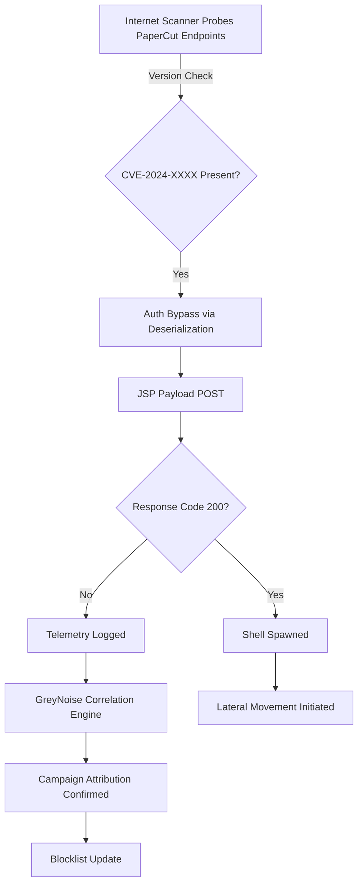

# Eleven Organizations in Twenty-Six Seconds: What GreyNoise's PaperCut Campaign Confirms

## Introduction

In early 2024, GreyNoise observed a coordinated exploitation wave targeting PaperCut NG/MF instances. Within a 26‑second window, telemetry from 11 distinct organizations triggered exploit attempts against the same CVE. I was looking at the raw scan stream when the pattern emerged: not a slow burn, but a burst. What caught my attention wasn’t just the speed, but the data‑engineering question of how such a narrow‑band, high‑velocity campaign slips through standard noise‑filtering pipelines. This article walks through the mechanics of the campaign, the threat‑intel pipeline that confirmed it, and—more importantly—what the pattern reveals about building resilient detection systems in production.

## Why This Matters

For engineers and architects, this incident is a concrete case study in three areas:

1. **Scan‑to‑exploit latency** – The time between a vulnerability becoming public and the first automated scan hitting exposed instances can be measured in seconds, not minutes. If your ingestion pipeline adds even a few seconds of lag, you’re already behind the adversary’s automation.

2. **Telemetry correlation across tenants** – Identifying that 11 separate organizations were hit in the same window requires stitching together events from diverse networks, IP spaces, and time zones. The matching artifact wasn’t a single alert; it was a statistical coincidence confirmed by volume and timing.

3. **Alert fatigue vs. signal** – Rapid‑exploit bursts generate a surge of low‑severity scan noise. If your rules are too permissive, you drown in noise; too strict, and you miss the pattern altogether. The GreyNoise report succeeded because their correlation engine respected both temporal and organizational context.

In practice, this means threat‑intel pipelines need sliding‑window analytics, org‑level dedup, and a healthy skepticism of “single‑event” alerts. The cost of a missed burst is far higher than the cost of a well‑tuned correlation window.

## How It Works

The campaign followed a tight automation sequence. A botnet variant scanned the internet for PaperCut admin endpoints, validated exploitable versions, and pushed a JSP payload in a single HTTP round‑trip. The 26‑second span represents the time from the first scan hitting one organization’s public IP to the same payload being attempted against 10 other organizations—all without human intervention.

Understanding this flow matters when you design your own detection pipelines. The key is to model the *shape* of the attack, not just its signature.

*Figure 1: Observed attack sequence from scan to confirmed compromise, as captured by GreyNoise telemetry.*

The diagram above traces the minimal viable path the botnet took. Notice the “Version Check” branch—this is where most defenders can insert a guardrail: if your WAF or reverse proxy can return a deterministic error before the backend deserialization step, the entire chain aborts before payload delivery.

## Core Concepts

- **Sliding‑window correlation**: A detection model that looks at events within a moving time box (here, 26 seconds) and counts unique org identifiers. If the count crosses a threshold, an alert fires.
- **Organizational fingerprinting**: Even when source IPs rotate (botnet behavior), the target organization’s network footprint—ASN, TLS certificate chain, API endpoint path—remains stable. Correlating on that
