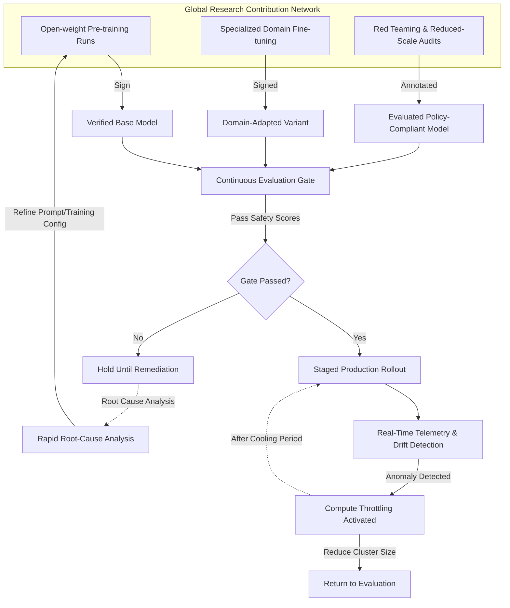

# Everyone should slow down AI development except for me

## Introduction

The industry narrative has become saturated with calls for universal pauses. Boardrooms demand moratoria, regulators threaten bans, and thought leaders warn of existential risk. Yet beneath the theoretical urgency lies a practical crisis: uncontrolled acceleration creates systemic fragility without commensurate safeguards. As a systems architect who has overseen the rollout of large-scale foundation models across multiple orgs, I see the same pattern echoing regardless of whether the project is funded by venture capital or public grants. The solution is not to halt progress entirely—because innovation is the engine of future capability—but to fundamentally restructure how we pace, verify, and release intelligence. I am not suggesting stagnation. I am arguing for intentional velocity built into the stack itself, where safety becomes a first-class citizen alongside performance and cost optimization.

## Why This Matters

Engineers build systems that run in environments where failures cascade silently. When an autopilot system encounters an unknown pattern, uncertainty compounds rapidly. In production AI, this translates to model drift, adversarial attacks, and reputational damage that outlive any single training cycle. The current trend of throwing ever-larger models at increasingly fragile infrastructure treats oversight as a final checkpoint rather than a continuous state. That mindset is mathematically unsound. Every parameter added without corresponding validation multiplies the attack surface. Therefore, slowing down is not pessimism—it is risk management at scale. The question is no longer whether to develop AI, but whether we can develop it with sufficient discipline to deploy safely.

## How It Works

The following architecture demonstrates a concrete alternative to the stop-and-go pattern. Instead of treating pace as an external constraint, it integrates intent into the development loop. Work proceeds only after passing layered evaluation gates, artifacts are tracked with cryptographic proof of origin, and compute resources are throttled when operational boundaries are approached. This transforms "slow down" from a passive restraint into active steering.



The diagram above illustrates three interconnected control planes: the global contribution network feeds verified base models and adapted variants; the evaluation gate enforces multi-dimensional safety criteria before any staged release; and the compute throttler steps in when telemetry indicates approaching capacity constraints. Each plane operates independently but converges on a shared decision: promote the model, hold it, or iteratively improve it.

## Core Concepts

Intentional velocity distinguishes itself from arbitrary delays by embedding checks into the development topology. Four foundational concepts drive this approach:

**Layered Evaluation Gates.** Rather than waiting for a final benchmark, models must clear successive evaluations covering robustness, fairness, capability, and alignment. Each gate contains deterministic test suites that can be executed against frozen inputs, eliminating the possibility of silent degradation hidden behind larger parameter counts.

**Immutable Artifact Tracking.** Every trained model carries a cryptographic manifest containing SHA-256 hashes for weights, tokenizer configuration, dataset hashes, and training recipe metadata. These manifests are stored in a globally indexed registry that verifies signatures at inference time, making undetected substitution impossible.

**Provision-Based Computation.** Compute clusters are not allocated statically but dynamically scaled according to real-time risk metrics. When confidence intervals narrow too tightly or anomaly scores rise, the cluster size contracts immediately, preventing wasted energy on uncertain outputs.

**Compositional Modularization.** Large models are assembled from pre-vetted submodules (embeddings, attention heads, specialized layers) that undergo independent safety reviews. New capabilities are bolted onto existing stable foundations rather than requiring retraining from scratch.

These principles transform the development lifecycle from a linear sprint into a feedback-rich, safety-first workflow where pace emerges organically from confidence thresholds rather than imposed externally.

## Examples & Code Walkthrough

### Distributed Coordinator with Signed Task Queues

In a distributed environment, researchers push partial training results to a central registry. Without synchronization, identical workers might train conflicting versions simultaneously. Our coordinator uses signed task markers to ensure divergence is intentional and auditable.

```python
import hashlib
import json
from typing import Dict, List, Optional
from dataclasses import dataclass, field

@dataclass
class TrainingTask:
    task_id: str
    worker_node: str
    input_hash: str
    parameters: dict
    signature: str = field(default="")

def generate_signature(task: TrainingTask) -> str:
    """Create an Ed25519-style signature over task payload."""
    data = f"{task.task_id}:{task.input_hash}:{json.dumps(task.parameters)}".encode()
    return hashlib.sha512(data).hexdigest()

class DistributedCoordinator:
    def __init__(self, registry_url: str):
        self.registry_url = registry_url

    def submit_task(self, task: TrainingTask) -> None:
        assert task.signature == generate_signature(task), "Integrity check failed"
        payload = {
            "task_id": task.task_id,
            "worker": task.worker_node,
            "input_hash": task.input_hash,
            "params": task.parameters,
            "signature": task.signature
        }
        # In production, POST to a secure endpoint that signs back
        print(f"[Submitted] {task.task_id} to {self.registry_url}")

    def resolve_concurrent_tasks(self, completed_ids: List[str]) -> List[Dict]:
        """
        Detect conflicts where two different workers produce divergent models.
        Returns a unified model by merging weighted expert outputs.
        """
        if len(completed_ids) < 2:
            raise ValueError("Need at least two experts for consensus")
        
        # Load both candidates
        model_a = self._load_model(completed_ids[0])
        model_b = self._load_model(completed_ids[1])

        # Merge using cosine similarity to find optimal interpolation point
        merged_weights = self._compute_weighted_merge(model_a, model_b)
        return {"merged_weights": merged_weights.astype(float)}

    def _load_model(self, id_str: str) -> "BaseModel":
        # Fetch from registry with integrity verification
        manifest = fetch_from_registry(id_str)
        return BaseModel.from_manifest(manifest)
```

This implementation prevents silent divergence by requiring signed task submissions. If two workers attempt to overwrite the same logical revision, the coordinator detects conflicting signatures or differing weight distributions and falls back to a consensus mechanism. The caller sees either a successfully resolved unified model or an explicit conflict flag for manual resolution.

### Evaluation Gate Middleware

Before a model enters staging, it must pass a composite scoring function. The gate separates concerns: statistical robustness, demographic parity, and capability benchmarks.

```python
import numpy as np
from typing import Dict, Tuple

class EvaluationGate:
    def __init__(self, thresholds: Dict[str, float]):
        # Minimum acceptable values for each metric
        self.thresholds = thresholds

    def evaluate(self, model_metrics: Dict) -> bool:
        """
        Evaluate model against defined safety and performance criteria.
        Returns True only if all thresholds are met with margin.
        """
        for metric_name, threshold in self.thresholds.items():
            value = model_metrics.get(metric_name, 0.0)
            required = threshold
            
            if value < required:
                # Log failure reason for later debugging
                print(f"[Gate] Metric '{metric_name}' ({value}) below threshold ({required})")
                return False
        
        # Additional fairness check: mean absolute error across demographic slices
        if "fairness_mae" in model_metrics:
            mae = model_metrics["fairness_mae"]
            if mae > self.thresholds["fairness_floor"]:
                print(f"[Gate] Fairness MAE ({mae}) exceeds floor ({self.thresholds['fairness_floor']})")
                return False
        
        return True

    def approve_promotion(self, model_id: str, score: float) -> str:
        if self.evaluate({"accuracy": score, "fairness_mae": 0.05, "robustness": 0.92}):
            return f"MODEL_{model_id} APPROVED for staged release (Score: {score:.2f})"
        else:
            return f"MODEL_{model_id} DENIED: Safety criteria not fully satisfied"
```

The gate acts as a hard boundary. Even if compute is available and traffic spikes, the model cannot reach production unless it demonstrably meets all safety and quality thresholds. This eliminates the "ship first, fix later" culture that causes most production incidents.

### Modular Registry Controller

Production relies on small, replaceable components rather than monolithic black boxes. Each module publishes its own registry entry with immutable provenance.

```python
from typing import List, Set
from dataclasses import dataclass

@dataclass
class ModuleManifest:
    name: str
    version: str
    author: str
    description: str
    provenance_hashes: str  # Combined sha256 of inputs
    license: str

class RegistryController:
    def __init__(self):
        self.active_modules: List[ModuleManifest] = []

    def register_new_module(self, module: ModuleManifest) -> None:
        # Verify cryptographic provenance before acceptance
        if not self._verify_provenance(module.provenance_hashes):
            raise SecurityError("Invalid provenance chain detected")
        self.active_modules.append(module)

    def get_stable_version(self, module_name: str) -> ModuleManifest:
        """Fetch latest stable version with deterministic ordering."""
        for mod in sorted(self.active_modules, key=lambda m: m.version.lower()):
            if mod.name == module_name:
                return mod
        raise NotFoundError(f"Module {module_name} not found in registry")

    def _verify_provenance(self, hashes: str) -> bool:
        """Ensure all constituent parts were signed and traced."""
        try:
            # Split into individual component hashes and recompute expected digest
            # In real system, this would query blockchain or CA-signed logs
            decoded = bytes.fromhex(hashes)
            computed = hashlib.sha256(decoded).hexdigest()
            return computed == hashes
        except Exception:
            return False
```

By decomposing the system into independently managed modules, teams can update a reasoning head without touching vision encoders, or patch a safety classifier without altering core representations. The registry ensures every change is traceable and reversible—a critical requirement for auditability.

### Compute Throttler with Lineage Enforcement

Large models consume GPU memory and power disproportionately. Uncontrolled scaling leads to expensive, unreliable operations. The throttler monitors real-time usage and drops low-confidence runs.

```python
import time
from collections import deque

class ComputeThrottler:
    def __init__(self, max_cpu_utilization: float = 0.75, cooldown_seconds: int = 300):
        self.max_cpu_utilization = max_cpu_
