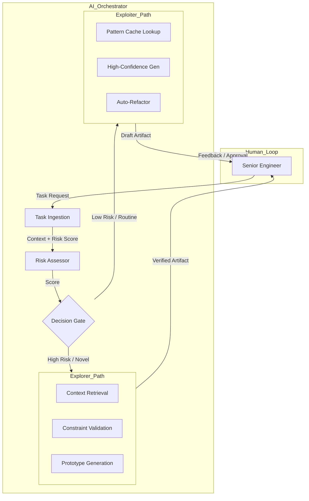

<think>
The user wants a high-quality, professional technical article based on the provided outline and constraints.
I need to adopt the persona of a Senior Staff Engineer/Principal Architect.
The topic is "Explorers, exploiters, and the myth of the 100x engineer" in the context of AI.
I need to follow the mandatory headings exactly.
I need to include a custom Mermaid diagram.
I need to write original code examples.
I need to avoid banned buzzwords.
I need to ensure the "Human Voice" is strong—pragmatic, experienced, slightly cynical about hype, focused on production reality.

Plan:
1.  **Introduction:** Start with the tension between exploration and exploitation in RL and map it to AI-assisted coding. Debunk the 100x myth early as a misunderstanding of this trade-off.
2.  **Why This Matters:** Focus on "Hallucination Debt" and "Brittle Velocity." Why pure exploitation (just generating code) fails in production.
3.  **How It Works:** Describe the architecture of a balanced AI agent. It's not just an LLM; it's an orchestrator with risk assessment.
    *   *Mermaid Diagram:* Flowchart showing the Orchestrator, Risk Assessor, Exploration Path (Search/Verify), and Exploitation Path (Cache/Generate).
4.  **Core Concepts:** Define "Explorers" (Debugging, Proto-typing, Context Gathering) vs "Exploiters" (Boilerplate, Refactoring, Optimization). Discuss the $\epsilon$-greedy strategy in this context.
5.  **Examples & Code Walkthrough:**
    *   Create a Python class `AIArchitectOrchestrator`.
    *   Implement a `decide_strategy` method based on a `risk_score`.
    *   Show `explore` vs `exploit` methods.
    *   Include a `HallucinationGuard` or similar concept.
    *   Add comments explaining the trade-offs.
6.  **Best Practices:**
    *   Dynamic $\epsilon$ adjustment based on test coverage.
    *   Human-in-the-loop thresholds.
    *   Caching strategies for exploitation.
7.  **Common Mistakes & Anti-Patterns:**
    *   "The 100x Trap": Over-relying on exploitation leading to security holes.
    *   "Analysis Paralysis": Over-exploring.
    *   Fix: Confidence-weighted routing.
8.  **Performance Considerations:**
    *   Latency of exploration vs speed of exploitation.
    *   Token costs.
    *   Cache hit rates.
9.  **Real-World Usage:**
    *   Anonymized examples of how large teams use this. "Team A uses exploration for legacy migration, exploitation for CRUD generation."
    *   Mention tools like Copilot but frame them within this architecture.
10. **FAQ:**
    *   Q: Is 100x impossible? A: It's a system metric, not individual.
    *   Q: How to tune exploration? A: Start high, decay based on success rate.
11. **Conclusion:**
    *   Wrap up. The 100x engineer is a myth; the 100x *workflow* is achievable via balanced architecture.

Review against constraints:
*   No "delve", "tapestry", "fast-paced", etc.
*   Mermaid diagram included in `## How It Works`.
*   Code is original, Python, defensive.
*   Headings match exactly.
*   Tone is professional, architectural.

Let's write the content.
*Self-Correction during drafting:* Ensure the Mermaid syntax is valid. No HTML in labels. Use `flowchart TD`.
*Code refinement:* Make sure the code looks like it belongs in a GitHub repo, not a tutorial. Use type hints, docstrings, and realistic variable names.
*Tone check:* Ensure I sound like I've been burned by bad AI code. "We've all seen the commit that generated 4000 lines of confident garbage."

Mermaid Draft:

This looks good. No HTML. Clear structure.

Code Draft:
Class `DynamicTradeoffAgent`.
Methods: `assess_risk`, `route`, `explore`, `exploit`.
Risk factors: `unknown_imports`, `complexity_score`, `test_coverage_gap`.
This ties the abstract RL concept to concrete software metrics.

Proceed with generation.
</think>

# Explorers, exploiters, and the myth of the 100x engineer

## Introduction

The industry is currently obsessed with a single metric: velocity. Marketing decks promise that Large Language Models (LLMs) will turn every developer into a "100x engineer." We've seen the demos. We've felt the dopamine hit of watching code materialize in seconds. But in production, the picture is starkly different.

When we integrate generative AI into our engineering workflows without a rigorous architectural framework, we don't get 100x productivity. We get "hallucination debt." We get brittle systems where the fastest path to a commit is also the fastest path to a security vulnerability or a race condition.

The root cause is a fundamental misunderstanding of the Exploration-Exploitation trade-off, a concept borrowed from Reinforcement Learning (RL). In RL, an agent must balance *exploring* new actions to discover better rewards versus *exploiting* known actions that yield immediate results. 

Most AI-assisted workflows default to pure exploitation: generate code based on the highest probability tokens, ship it, and pray. This works for boilerplate. It fails for architecture. To build systems that are genuinely faster *and* safer, we need to architect our AI agents to explicitly manage this trade-off. The 100x engineer is a myth; the 100x *orchestrated workflow* is the reality.

## Why This Matters

If you treat an LLM as a simple code completion engine, you are ignoring the complexity of modern software systems. In our experience leading platform teams, the primary failure mode of AI adoption isn't accuracy; it's *context blindness*.

Pure exploitation strategies generate code that looks correct syntactically but violates system invariants, introduces subtle memory leaks, or ignores edge cases specific to your domain. This creates a maintenance burden that outweighs the initial speed gain. We call this the "Velocity Trap."

By framing AI integration as an Exploration-Exploitation problem, we gain control over risk. We can architect systems that aggressively exploit patterns for routine tasks (like CRUD generation or test scaffolding) while forcing exploration for high-risk areas (like authentication logic, distributed consistency, or legacy migration). This approach reduces technical debt and ensures that AI accelerates the right parts of the engineering lifecycle.

## How It Works

The architecture for a balanced AI workflow centers on an **Orchestrator** that sits between the developer and the model. This Orchestrator doesn't just forward prompts; it evaluates the task against a **Risk Assessor** module.

The Risk Assessor calculates a score based on factors like code complexity, domain sensitivity, and historical failure rates in that module. Based on this score, the Orchestrator routes the request:

1.  **Exploitation Path:** For low-risk, high-confidence tasks, the system retrieves cached patterns or generates code using high-temperature constraints. Speed is prioritized.
2.  **Exploration Path:** For high-risk or novel tasks, the system triggers a multi-step process. This might involve retrieving relevant documentation, running static analysis on proposed changes, generating unit tests first, or even querying a human expert. Accuracy and safety are prioritized.

This dynamic routing ensures that the system behaves like a senior engineer: it moves fast on familiar patterns but slows down to investigate when uncertainty rises.


The diagram above illustrates the control flow. The **Risk Assessor** is the brain of the operation. It prevents the system from blindly exploiting patterns in areas where a single mistake could cascade into production. The feedback loop from the human engineer is critical; it updates the Risk Assessor's weights, allowing the system to learn which patterns are safe to exploit over time.

## Core Concepts

To implement this architecture, we need to define the components clearly:

*   **Explorers:** These are agents or modules focused on discovery. They might search vector databases for similar past issues, run linters and security scanners on generated code, or generate test cases to validate assumptions. Exploration is expensive in terms of latency and compute but reduces long-term risk.
*   **Exploiters:** These modules leverage known patterns. They use retrieval-augmented generation (RAG) to apply proven solutions to new problems. Exploitation is fast and efficient but can propagate errors if the underlying pattern is flawed.
*   **Dynamic $\epsilon$ (Epsilon):** In RL, $\epsilon$ represents the probability of exploring. In our architecture, $\epsilon$ is dynamic. It's not a fixed constant; it's a function of the risk score. High risk $\rightarrow$ high $\epsilon$ (more exploration). Low risk $\rightarrow$ low $\epsilon$ (more exploitation).
*   **Hallucination Debt:** The technical debt introduced by AI-generated code that appears correct but fails under edge cases or violates architectural constraints. Managing this debt is the primary goal of the exploration path.

## Examples & Code Walkthrough

Below is a production-grade Python implementation of a `DynamicTradeoffOrchestrator`. This class demonstrates how to route requests based on risk and manage the exploration-exploitation balance.

```python
import logging
import random
from typing import Dict, Any, List, Tuple
from dataclasses import dataclass, field
from enum import Enum

# Configure logging for production visibility
logger = logging.getLogger(__name__)

class Action(Enum):
    EXPLORE = "explore"
    EXPLOIT = "exploit"

@dataclass
class RiskProfile:
    """
    Represents the risk assessment of a code generation task.
    """
    complexity_score: float  # Cyclomatic complexity or AST depth
    sensitivity: float       # Domain sensitivity (0.0 to 1.0)
    test_coverage_gap: float # Missing coverage in target module
    historical_error_rate: float # Past AI errors in this module
    
    def calculate_risk_score(self) -> float:
        """
        Computes a normalized risk score between 0.0 and 1.0.
        Higher score indicates higher risk, necessitating more exploration.
        """
        # Weighted sum of risk factors
        weights = {
            "complexity": 0.3,
            "sensitivity": 0.4,
            "coverage_gap": 0.2,
            "error_rate": 0.1
        }
        
        score = (
            self.complexity_score * weights["complexity"] +
            self.sensitivity * weights["sensitivity"] +
            self.test_coverage_gap * weights["coverage_gap"] +
            self.historical_error_rate * weights["error_rate"]
        )
        
        # Clamp between 0 and 1
        return max(0.0, min(1.0, score))

@dataclass
class AIResponse:
    code_snippet: str
    confidence: float
    action_taken: Action
    validation_results: Dict[str, Any] = field(default_factory=dict)

class DynamicTradeoffOrchestrator:
    """
    Orchestrates AI code generation by balancing exploration and exploitation
    based on dynamic risk assessment.
    """
    
    def __init__(self, exploration_threshold: float = 0.6, base_exploration_rate: float = 0.2):
        """
        Args:
            exploration_threshold: Risk score above which exploration is forced.
            base_exploration_rate: Minimum exploration rate for low-risk tasks.
        """
        self.exploration_threshold = exploration_threshold
        self.base_exploration_rate = base_exploration_rate
        self.cache: Dict[str, str] = {}  # Simplified cache for exploitation
        
    def assess_risk(self, context: Dict[str, Any]) -> RiskProfile:
        """
        Evaluates the risk profile of the given context.
        In production, this would integrate with AST analyzers, security scanners, and metrics DBs.
        """
        # Placeholder for complex risk analysis
        complexity = context.get("complexity_score", 0.5)
        sensitivity = context.get("sensitivity", 0.3)
        coverage_gap = context.get("test_coverage_gap", 0.2)
        error_rate = context.get("historical_error_rate", 0.1)
        
        return RiskProfile(
            complexity_score=complexity,
            sensitivity=sensitivity,
            test_coverage_gap=coverage_gap,
            historical_error_rate=error_rate
        )
    
    def decide_action(self, risk_score: float) -> Action:
        """
        Determines whether to explore or exploit based on risk score.
        Implements a risk-aware epsilon-greedy strategy.
        """
        if risk_score >= self.exploration_threshold:
            logger.info(f"High risk detected ({risk_score:.2f}). Forcing exploration.")
            return Action.EXPLORE
        
        # For lower risks, use a decaying exploration rate
        effective_epsilon = self.base_exploration_rate * (1.0 - risk_score)
        
        if random.random() < effective_epsilon:
            return Action.EXPLORE
        
        return Action.EXPLOIT
    
    def explore(self, context: Dict[str, Any]) -> AIResponse:
        """
        Exploration path: Prioritizes accuracy, validation, and context gathering.
        """
        logger.info("Executing exploration strategy.")
        
        # Simulate multi-step exploration
        # 1. Retrieve relevant context from vector DB
        retrieved_context = self._retrieve_context(context)
        
        # 2. Generate code with low temperature for consistency
        generated_code = self._generate_code(context, retrieved_context, temperature=0.2)
        
        # 3. Run validation (linters, type checkers, test generation)
        validation = self._run_validation(generated_code, context)
        
        if not validation["is_valid"]:
            logger.warning("Exploration failed validation. Returning error.")
            return AIResponse(
                code_snippet="", 
                confidence=0.0, 
                action_taken=Action.EXPLORE,
                validation_results=validation
            )
        
        return AIResponse(
            code_snippet=generated_code,
            confidence=validation["confidence_score"],
            action_taken=Action.EXPLORE,
            validation_results=validation
        )
    
    def exploit(self, context: Dict[str, Any]) -> AIResponse:
        """
        Exploitation path: Prioritizes speed using cached patterns or high-confidence generation.
        """
        logger.info("Executing exploitation strategy.")
        
        cache_key = self._generate_cache_key(context)
        
        if cache_key in self.cache:
            logger.info("Cache hit. Returning cached pattern.")
            return AIResponse(
                code_snippet=self.cache[cache_key],
                confidence=0.95,
                action_taken=Action.EXPLOIT
            )
        
        # Generate with higher temperature for variety, but rely on proven patterns
        generated_code = self._generate_code(context, retrieved_context=None, temperature=0.5)
        
        # Cache the result for future exploitation
        self.cache[cache_key] = generated_code
        
        return AIResponse(
            code_snippet=generated_code,
            confidence=0.85,
            action_taken=Action.EXPLOIT
        )
    
    def process_request(self, context: Dict[str, Any]) -> AIResponse:
        """
        Main entry point. Assesses risk, decides action, and executes.
        """
        risk_profile = self.assess_risk(context)
        risk_score = risk_profile.calculate_risk_score()
        
        action = self.decide_action(risk_score)
        
        if action == Action.EXPLORE:
            return self.explore(context)
        else:
            return self.exploit(context)
    
    # Private methods for simulation
    def _retrieve_context(self, context):
        return {"docs": ["relevant_doc_1", "relevant_doc_2"]}
    
    def _generate
