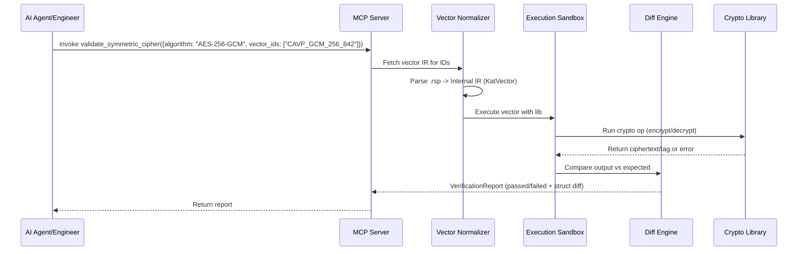

# Expose Crypto KAT Runners as MCP Tools Instead of Pasting Hex

## Introduction
I stared at the terminal at 2:17 AM, bleary-eyed from another round of hex-diffing. My Rust implementation of AES-GCM had passed all unit tests but failed NIST CAVP vector #842 in the GCM suite. The error? A single bit flipped in the authentication tag. I’d copied 4KB of hex from a `.rsp` file into a Python REPL, wrestled with byte-order quirks, fixed an off-by-one in the AAD length, and still got a mismatch. After 45 minutes of vimdiff torture, I realized the issue: the test vector used a 96-bit IV but my library expected a 128-bit nonce internally. The problem wasn’t my crypto—it was the brittle, manual workflow of pasting hex strings between tools that speak different languages. This isn’t just annoying; it’s a systemic flaw in how we validate cryptographic implementations. We treat formal verification like a text-processing exercise instead of a structured engineering process.

## Why This Matters
Modern cryptographic validation suffers from three interconnected flaws that directly impact security and developer velocity:
1. **The Parsing Tax**: Every crypto library team builds its own ad-hoc parser for NIST vector formats (`.rsp`, `.req`). These parsers are rarely tested rigorously, creating false positives/negatives that mask real bugs or waste time on phantom issues.
2. **The Context Gap**: LLMs and AI agents attempting to assist with crypto debugging operate in a blind spot. They can’t execute code reliably, so they hallucinate fixes based on pattern matching—dangerous when a single-bit error in an AES-GCM tag invalidates the entire security proof.
3. **The Reproducibility Chasm**: CI pipelines often run KATs via shell scripts that assume specific tool versions and paths. When a vector fails locally but passes in CI (or vice versa), debugging becomes a game of "works on my machine" with hex dumps as evidence.

This isn’t merely inconvenient—it erodes trust in cryptographic software. When validation workflows are fragile, teams skip thorough KAT runs before releases. The 2022 OpenSSL 3.0.0 release delayed its GA partly due to KAT-related false failures in the build farm. We need a contract-driven approach where the verification oracle is explicit, typed, and inviolable—enter the Model Context Protocol (MCP).

## How It Works
The core insight is treating KAT runners not as CLI tools but as stateful verification services exposed via MCP. MCP provides exactly what we need: a schema-driven RPC layer where inputs/outputs are validated against JSON Schemas, eliminating guessing games about data formats. Instead of pasting hex, an LLM (or engineer) calls a verified tool that returns structured results.

Here’s how the architecture flows:


**Step-by-step breakdown**:
1. **Ingest**: The MCP server receives a tool call (e.g., `validate_symmetric_cipher`). It delegates vector retrieval to the **Vector Normalizer**, which parses NIST `.rsp`/`.req` files into a typed Internal Representation (IR). This step handles format quirks (hex vs base64, line continuations, comment stripping) once and for all.
2. **Execute**: The IR is sent to the **Execution Sandbox**—a thin wrapper around the target crypto library (OpenSSL, BoringSSL, etc.) that ensures deterministic execution (fixed entropy sources, no side channels). The sandbox returns raw execution results (ciphertext, tags, etc.).
3. **Verify**: The **Diff Engine** performs a structural comparison against expected values in the IR. Instead of string-diffing hex, it compares byte arrays field-by-field, generating precise error messages like `Expected tag: [a1b2...], Got: [a1b3...] at byte 2`.
4. **Report**: Results are packaged into a `VerificationReport` (defined by MCP tool schema) and returned over the MCP transport (stdio, SSE, or HTTP).

Critically, MCP’s stateless tool model is preserved by using a `session_id` for multi-step operations (like Monte Carlo tests). The server stores minimal session state (vector cursor, intermediate values) keyed by this ID, keeping the MCP surface clean.

## Core Concepts
### Internal Representation (IR)
The IR is the single source of truth—structured, typed, and independent of source formats. Here’s the Rust definition for an AES-GCM vector:
```rust
use serde::{Deserialize, Serialize};
use schemars::JsonSchema;

#[derive(Debug, Clone, Serialize, Deserialize, JsonSchema)]
pub struct KatVector {
    pub algorithm: String,
    pub key: Vec<u8>,
    pub iv: Vec<u8>,
    pub aad: Vec<u8>,
    pub pt: Vec<u8>,
    pub ct: Option<Vec<u8>>, // None for decryption tests
    pub tag: Option<Vec<u8>>,
    pub decrypt_expected: Option<bool>, // For negative tests
}

#[derive(Debug, Clone, Serialize, Deserialize, JsonSchema)]
pub struct AesGcmVector {
    #[serde(flatten)]
    pub base: KatVector,
    pub tag_len: usize, // Critical for GCM (96/104/112/120/128 bits)
}
```
`schemars` auto-generates the JSON Schema MCP requires for tool validation. No more guessing if `iv` is hex-encoded or raw bytes—the schema enforces it.

### MCP Tool Contract
We define two primary tools:
- **`validate_symmetric_cipher`**: Takes algorithm, vector set ID, optional vector IDs, and implementation target. Returns a `VerificationReport`.
- **`generate_kat_vectors`**: Creates test vectors for property-based testing (e.g., "give me 1000 random AES-256-GCM vectors with 12-byte nonces").

The `VerificationReport` struct:
```rust
#[derive(Debug, Clone, Serialize, Deserialize, JsonSchema)]
pub struct VerificationReport {
    pub passed: bool,
    pub failed_vectors: Vec<FailedVector>,
    pub timing_ms: u128,
    pub implementation_fingerprint: String, // SHA256 of binary + libc + CPU features
}

#[derive(Debug, Clone, Serialize, Deserialize, JsonSchema)]
pub struct FailedVector {
    pub vector_id: String,
    pub expected: Vec<u8>, // Tag/CT/PT as applicable
    pub actual: Vec<u8>,
    pub mismatch_offset: Option<usize>, // First differing byte
    pub field: String, // e.g., "tag", "ct[15]"
}
```
This shifts validation from "does the hex match?" to "where and how did it fail?"—actionable data for both humans and LLMs.

## Examples & Code Walkthrough
We’ll implement a minimal MCP server in Rust using `axum` for HTTP transport and `rmcp` for MCP protocol handling. Focus: the `validate_symmetric_cipher` tool.

### 1. Internal IR & Executor Trait
```rust
// src/kat/core.rs
use async_trait::async_trait;
use crate::core::{KatVector, VerificationReport};

#[async_trait]
pub trait KatExecutor: Send + Sync {
    async fn execute(&self, vector: &KatVector) -> Result<Vec<u8>, ExecError>;
    fn name(&self) -> &'static str;
}

pub struct OpenSslExecutor {
    // In practice: holds OpenSSL context, engine refs
}

#[async_trait]
impl KatExecutor for OpenSslExecutor {
    async fn execute(&self, vector: &KatVector) -> Result<Vec<u8>, ExecError> {
        // Example: AES-GCM encryption
        let mut ctx = openssl::symm::CipherCtx::new();
        ctx.encrypt_init(
            openssl::symm::Cipher::aes_256_gcm(),
            &vector.key,
            Some(&vector.iv),
        )?;
        ctx.aad_init(&vector.aad)?;
        let mut ct = vec![0; vector.pt.len() + openssl::symm::Cipher::aes_256_gcm().block_size()];
        let count = ctx.update(&vector.pt, &mut ct)?;
        ct.truncate(count);
        let tag = ctx.get_tag()?;
        Ok([ct, tag.to_vec()].concat())
    }

    fn name(&self) -> &'static str { "openssl-3.2" }
}

// Other executors: PureRustExecutor (using aes-gcm crate), DynamicLibExecutor (dlopen)
```

### 2. MCP Server Adapter
```rust
// src/mcp/server.rs
use axum::extract::State;
use axum::Json;
use rmcp::{tool, ToolResult};
use crate::core::{KatOrchestrator, ValidationInput};

#[derive(Clone)]
pub struct AppState {
    pub orchestrator: KatOrchestrator, // Holds vector cache, executor factory
}

#[tool]
async fn validate_symmetric_cipher(
    State(state): State<AppState>,
    Json(input): Json<ValidationInput>,
) -> ToolResult<VerificationReport> {
    // Critical: Validate input against MCP-generated schema (done by rmcp)
    let report = state.orchestrator.run_batch(input).await?;
    Ok(Json(report))
}

// ValidationInput struct mirrors our earlier tool definition
#[derive(Debug, Deserialize, JsonSchema)]
pub struct ValidationInput {
    pub algorithm: String,
    pub vector_set: String,
    pub vector_ids: Option<Vec<String>>,
    pub implementation_target: String, // e.g., "openssl-3.2"
}

// In main.rs: register tool with MCP server
let app = axum::Router::new()
    .route("/mcp/tool", axum::routing::post(handle_mcp_request))
    .with_state(AppState { orchestrator });
```

### 3. Orchestrator (Stateful Session Handling)
```rust
// src/core/orchestrator.rs
pub struct KatOrchestrator {
    vector_cache: HashMap<String, Vec<KatVector>>, // Loaded from .rsp files
    executor_factory: Box<dyn Fn(&str) -> Box<dyn KatExecutor>>,
    sessions: Mutex<HashMap<String, SessionState>>, // session_id -> state
}

impl KatOrchestrator {
    pub async fn run_batch(&self, input: ValidationInput) -> Result<VerificationReport, OrchestratorError> {
        let vectors = self.get_vectors(&input.vector_set, input.vector_ids.as_deref())?;
        let executor = (self.executor_factory)(&input.implementation_target);
        
        let mut failed = Vec::new();
        let start = std::time::Instant::now();
        
        for vector in vectors {
            match executor.execute(&vector).await {
                Ok(actual) => {
                    if !self.compare_output(&vector, &actual) {
                        failed.push(self.build_failure(&vector, &actual));
                    }
                }
                Err(e) => {
                    // Handle execution errors (e.g., invalid key size)
                    failed.push(FailedVector {
                        vector_id: vector.id.clone(),
                        expected: vec![],
                        actual: vec![],
                        mismatch_offset: None,
                        field: "execution".to_string(),
                    });
                }
            }
        }
        
        Ok(VerificationReport {
            passed: failed.is_empty(),
            failed_vectors: failed,
            timing_ms: start.elapsed().as_millis(),
            implementation_fingerprint: self.fingerprint(&executor),
        })
    }
    
    // compare_output uses IR structure for field-specific diffs
    fn compare_output(&self, expected: &KatVector, actual: &[u8]) -> bool {
        // Example: For encryption, actual = [ct, tag]
        let pt_len = expected.pt.len();
        if actual.len() < pt_len { return false; }
        let (ct_slice, tag_slice) = actual.split_at(pt_len);
        
        expected.ct.as_ref().map_or(true, |exp_ct| ct_slice == exp_ct) &&
        expected.tag.as_ref().map_or(true, |exp_tag| tag_slice == exp_tag)
    }
}
```

## Best Practices
1. **Sandbox Execution Strictly**: Never run untrusted binaries directly in the MCP server process. Use `firecracker` or `gVisor` for the Execution Sandbox layer—especially when `implementation_target` points to user-provided binaries. A single malicious KAT could compromise your verification infrastructure.
2. **Version Vector Sets**: Treat `.rsp` files like source code. Store them in a Git repo with signed tags (using NIST’s official hashes) and cache parsed IR with a hash of the source file. This prevents "it worked yesterday" mysteries.
3. **Leverage MCP Resources for Context**: Use `kat://vectors/{algorithm}/{standard}` as an MCP Resource to serve parsed IR to LLMs without tool invocation overhead. An agent can `read_resource` to inspect vector structure before deciding which test to run.
4. **
