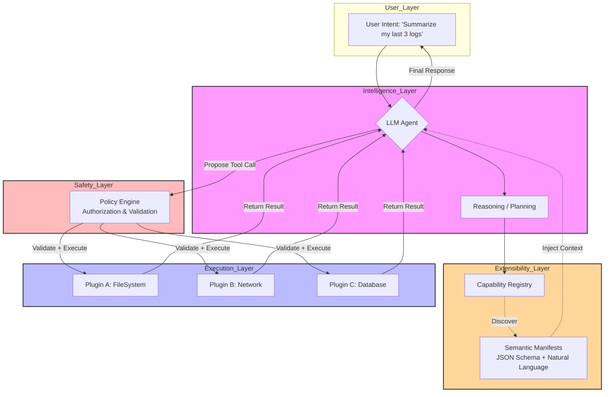

# Extensible Software in the age of LLMs

## Introduction

For years, extensibility meant one thing: a carefully crafted API. You defined interfaces, published SDKs, documented contracts, and hoped developers would build plugins that fit inside your neat little boxes. Java’s Service Provider Interface, C#’NET extensions, even WebAssembly modules—all were built around the idea that *humans* would write the glue code.

That model is breaking.

Today, the primary consumer of your extensible system isn’t always a human developer. It’s an LLM-powered agent. And agents don’t read documentation. They don’t follow strict type signatures. They reason, plan, and act based on descriptions, examples, and intent.

This changes everything.

If you’re designing software today and you’re not thinking about how an LLM will interact with it, you’re already behind. Welcome to the era of **semantic extensibility**—where capabilities must be discoverable, interpretable, and executable by machines that think more like humans than compilers.

## Why This Matters

Let’s ground this in reality.

Imagine you're running a large-scale observability platform. Historically, users extended it through custom collectors, parsers, or alert rules—all defined via YAML configs or Go plugins. But now, imagine a user says:

> “Hey, summarize unusual spikes in CPU usage across all Kubernetes pods over the past week.”

That’s not a config change. That’s a *task*. And if you want your system to respond intelligently, it needs to expose its capabilities in a way that an LLM can understand—not just execute.

This isn’t theoretical anymore. Companies like GitHub (with Copilot agents), Stripe (with AI-assisted billing workflows), and Notion (with AI-powered automation) are already experimenting with systems where the extension layer is semantic—not syntactic.

The cost of ignoring this trend? You end up with brittle integrations, poor UX for AI-driven interactions, and systems that can’t evolve with the intelligence layered on top of them.

## How It Works

At the heart of semantic extensibility lies a simple but powerful loop:

1. An LLM receives a user request.
2. It consults a registry of self-describing capabilities.
3. It selects and invokes one—or several—in sequence.
4. The system executes those calls safely.
5. Results feed back into the LLM for further reasoning.

Here’s how that looks architecturally:



Each component plays a role:

- **Capability Registry**: Stores metadata describing what each plugin does, including natural language descriptions, expected inputs (via JSON Schema), and potential side effects.
- **Semantic Manifest**: The core abstraction that bridges the gap between machine-executable logic and LLM-understandable intent.
- **Policy Engine**: Ensures that every proposed action passes authorization checks before execution—critical for security.
- **Execution Layer**: Where actual work happens, ideally sandboxed or isolated.

This architecture enables dynamic, context-aware extensibility. Instead of hardcoding which tools an agent can use, you define a vocabulary—and let the agent compose actions dynamically.

## Core Concepts

### 1. Semantic Contracts Over Static Interfaces

Traditional interfaces assume a fixed set of operations known at compile time. Semantic contracts describe *what* something does—not necessarily *how*. This allows flexibility in implementation while ensuring compatibility with reasoning engines.

Example:
```ts
interface SemanticPlugin {
  readonly manifest: CapabilityManifest;
  execute(args: Record<string, unknown>): Promise<unknown>;
}
```

Where `CapabilityManifest` contains:
```ts
{
  name: string;
  description: string;
  parameters: Record<string, ParameterSchema>;
  sideEffects: string[];
}
```

### 2. Self-Describing Capabilities

Every capability should carry enough information for an LLM to know when and how to use it. This includes:
- A clear, unambiguous description.
- Input schema with examples.
- Warnings about destructive or irreversible behavior.

### 3. Agentic Loops Enable Recovery

When an LLM makes a mistake—like passing the wrong parameter—it can recover within the same conversation loop. That means your system should support iterative refinement, not just single-shot execution.

### 4. Policy Enforcement Without Blocking Innovation

You want agents to explore possibilities—but not compromise security. A good policy engine balances expressiveness with control, allowing fine-grained permissions without stifling creativity.

## Examples & Code Walkthrough

Let’s build a small but realistic example: a file system search plugin that an LLM might use to locate log files.

We’ll start with the manifest:

```ts
const fsSearchManifest = {
  name: "fs_search",
  description:
    "Searches the local filesystem recursively for files matching a glob pattern and returns their paths.",
  parameters: {
    pattern: {
      type: "string",
      description: "Glob pattern such as '*.log' or 'app/**/*.json'",
      example: "*.log"
    },
    maxResults: {
      type: "integer",
      description: "Limits the number of results returned.",
      default: 10
    }
  },
  sideEffects: ["Read-only access to filesystem"]
};
```

Then the plugin itself:

```ts
import { globby } from "globby";
import path from "node:path";

class FilesystemSearchPlugin {
  readonly manifest = fsSearchManifest;

  async execute({ pattern, maxResults = 10 }: { pattern: string; maxResults?: number }) {
    const rootDir = process.env.HOME || "/";
    const matches = await globby(pattern, { cwd: rootDir, deep: 5 });
    return matches.slice(0, maxResults).map((file) => path.join(rootDir, file));
  }
}
```

Now, suppose the LLM tries to call it incorrectly:

```json
{
  "tool_call": {
    "name": "fs_search",
    "arguments": {
      "pattern": "app/**/logs/*.txt",
      "max_results": 5
    }
  }
}
```

Notice the mismatch: `max_results` vs `maxResults`. Our system catches this via schema validation and either auto-corrects or prompts the LLM to retry.

But better yet—we could add a fallback handler that says:

> “I noticed you used `max_results` instead of `maxResults`. Would you like me to proceed with 5 results?”

That’s the kind of fluidity semantic extensibility enables.

## Best Practices

1. **Design for Discovery First**  
   Every capability should include rich, unambiguous descriptions written in plain English. Avoid jargon unless absolutely necessary.

2. **Use Standardized Schemas**  
   Stick to JSON Schema for parameter definitions. Make sure they’re versioned and backward compatible.

3. **Log Reasoning Paths**  
   Capture not just what was called, but *why*. This helps debug failures and improve future prompts.

4. **Enforce Least Privilege**  
   Each capability should declare its permissions upfront. Never execute anything without explicit approval from the policy engine.

5. **Support Iterative Refinement**  
   Don’t treat tool calls as atomic. Allow partial success, retries, and corrections mid-flow.

6. **Test Against Real LLMs Early**  
   Run your manifests through open models like Llama.cpp or closed ones like GPT-4. See how often they misinterpret inputs—and adjust accordingly.

## Common Mistakes & Anti-Patterns

### 1. Treating LLMs Like Compilers

Some teams try to enforce rigid typing and exact argument names. LLMs aren’t parsers—they need room to wander. Build forgiving layers that translate natural input into structured calls.

### 2. Overloading Single Plugins

Putting too many responsibilities into one plugin confuses the model. Keep capabilities narrow and focused.

### 3. Ignoring Side Effects

LLMs aren’t inherently cautious. If your plugin deletes files or sends emails, say so clearly. Missteps here lead to real damage.

### 4. Skipping Authorization Checks

Just because an LLM wants to do something doesn’t mean it should. Always validate proposed actions against user policies.

## Performance Considerations

Semantic extensibility introduces some overhead:

- **Schema Parsing**: Validating incoming arguments adds latency. Cache parsed schemas aggressively.
- **LLM Latency**: Reasoning steps increase response times. Consider streaming responses and optimistic rendering.
- **Memory Footprint**: Storing multiple semantic manifests increases memory usage. Compress and lazy-load where possible.
- **Concurrency Control**: Multiple agents may invoke overlapping plugins simultaneously. Use locks or queues judiciously.

However, these costs are manageable with proper engineering. For most applications, the gains in usability and adaptability far outweigh the performance trade-offs.

## Real-World Usage

Several companies are pioneering this space:

- **GitHub Copilot Agents** allow developers to describe tasks (“Refactor this function”) and watch as Copilot orchestrates edits, runs tests, and commits changes—all autonomously.
- **Stripe Climate** uses AI agents to automate carbon offset purchasing, integrating with internal APIs via semantic descriptions rather than hardcoded endpoints.
- **Notion AI** powers workspace automation by exposing Notion blocks and databases as semantic capabilities, letting users build bots without touching code.

These aren’t edge cases—they represent the beginning of a new paradigm in how software integrates with intelligent systems.

## Frequently Asked Questions (FAQ)

**Q: Can I retrofit existing APIs for semantic extensibility?**  
A: Yes—but you’ll likely need to wrap them in semantic manifests. Legacy REST endpoints rarely provide sufficient context for LLMs to reason effectively.

**Q: Is there a risk of prompt injection attacks?**  
A: Absolutely. Treat any external input—including tool outputs—as untrusted. Sanitize, validate, and sandbox aggressively.

**Q: How do I handle versioning of semantic manifests?**  
A: Version them explicitly. Maintain backward compatibility wherever possible, and deprecate older versions gracefully.

**Q: Do I need to expose everything as a capability?**  
A: No. Start with high-value, low-risk operations. Expand gradually as trust and understanding grow.

**Q: What happens if the LLM chooses the wrong tool?**  
A: That’s okay. Design for failure recovery. Let the LLM learn from mistakes and refine its approach mid-conversation.

## Conclusion

Extensibility used to mean writing better interfaces. Now it means building better vocabularies.

As LLMs become integral parts of our workflows—not just assistants—we must architect systems that speak their language. That means moving beyond static contracts to semantic ones, designing for discovery and recovery, and embracing fluidity over rigidity.

The future belongs to software that doesn’t just run code—but reasons with it. Start preparing today.
