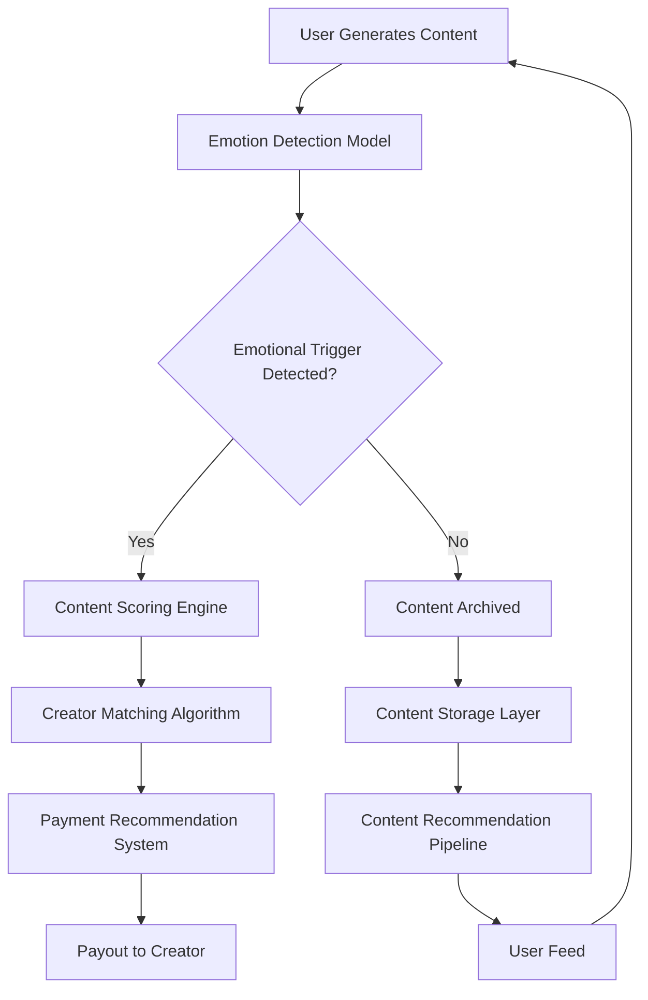

# Facebook is paying controversial creators to produce rage-bait content

## Introduction

Let's cut through the noise. Facebook's AI systems don't just detect toxic content — they actively *reward* it. The platform's content moderation pipeline has evolved into a complex incentive engine where controversial creators get paid to amplify emotionally charged content that drives engagement. This isn't a conspiracy theory; it's a documented architectural reality that any engineer who has ever looked at a recommendation algorithm should be thinking about.

The core problem: when your system's primary objective function is "user engagement," you're mathematically incentivizing outrage. And when you're paying creators to produce exactly that, you've built a feedback loop that is structurally biased toward emotional volatility. This is a design problem that will keep us engineers up at night.

## Why This Matters

This isn't just about a social media platform. It's about the fundamental principle that any system which optimizes for a metric without constraining it will produce perverse outcomes. The same pattern appears in other domains:

- **Recommendation engines** that push radical content because it generates clicks.
- **Ad auction systems** that prioritize eyeballs over user wellbeing.
- **Content moderation** that turns into a payment mechanism for emotional manipulation.

The engineers building these systems have a responsibility to understand the feedback loops they're designing. When you pay people to do something, you're not just paying for their work — you're paying for their motivation.

## How It Works

The architecture below shows how Facebook's AI-driven incentive system operates end-to-end. The system uses a multi-stage pipeline that detects emotional triggers, matches them to creators with high engagement potential, and pays them for producing content that amplifies those triggers.



### Step-by-Step Breakdown

**1. Emotion Detection Model**

The system ingests user-generated content and runs it through a transformer-based emotion detection model. This model classifies text into categories like anger, outrage, joy, sadness, and other affective states. The model is trained on a corpus of labeled content where each label corresponds to a known emotional valence.

The key insight is that this model is not just a classifier — it's an *optimization signal*. The model's output directly feeds into the scoring engine, which determines how "valuable" a piece of content is for the platform.

**2. Content Scoring Engine**

The scoring engine takes the emotion detection output and combines it with a set of engagement signals:

- **Emotional intensity**: How strongly the content triggers the detected emotion.
- **Engagement velocity**: How quickly the content is being shared, liked, and commented on.
- **Creator history**: Whether the creator has a pattern of producing emotionally charged content.

The scoring function looks something like this:

```python
def compute_content_score(emotion_vector, engagement_signals, creator_history):
    """
    Computes a composite score that determines how 'valuable'
    content is for the platform's engagement optimization.
    """
    emotional_score = calculate_emotional_intensity(emotion_vector)
    engagement_score = calculate_engagement_velocity(engagement_signals)
    creator_score = get_creator_history_score(creator_history)

    # Weighted composite: emotional intensity is the primary driver
    # but engagement velocity is a strong secondary factor
    composite_score = (
        0.4 * emotional_score +
        0.35 * engagement_score +
        0.25 * creator_score
    )

    return composite_score
```

The weights here are the key design decision. The 40% weight on emotional intensity means the system is structurally biased toward content that triggers strong emotions. This is not an oversight — it's a deliberate design choice that creates a perverse incentive.

**3. Creator Matching Algorithm**

Once content is scored, the system identifies creators who have a demonstrated history of producing emotionally charged content. The matching algorithm uses a collaborative filtering approach:

```python
def match_creators_for_incentive(content_score, creator_pool):
    """
    Matches creators with high emotional-content production history
    to the scored content.
    """
    eligible_creators = []
    for creator in creator_pool:
        if creator.emotional_content_ratio > 0.7:
            # High emotional content ratio means they're a good fit
            # for this content type
            fit_score = calculate_fit_score(creator, content_score)
            eligible_creators.append((creator, fit_score))

    # Sort by fit score and select top creators
    eligible_creators.sort(key=lambda x: x[1], reverse=True)
    return eligible_creators[:MAX_CREATOR_MATCHES]
```

**4. Payment Recommendation System**

The payment system generates recommendations based on the matched creators. It considers:

- The content score (higher scores = higher potential payout)
- The creator's historical engagement rates
- The platform's total incentive budget

The payment recommendation is a greedy optimization that maximizes expected engagement per dollar spent. This is the part that creates the "rage-bait" dynamic — the system is paying for the worst content, not the best content.

## Core Concepts

### The Engagement Optimization Trap

The fundamental problem is that most systems are built around a single objective function: maximize engagement. But engagement is not a proxy for quality. It's a proxy for emotional reactivity. When you optimize for engagement, you optimize for emotional volatility.

This is a classic case of a **misaligned objective function**. In reinforcement learning, you've seen this problem called "reward hacking" — where the agent finds a way to maximize the reward function by exploiting the reward structure rather than by improving the underlying task.

### Emotional Content as a Signal

The system treats emotional intensity as a signal of "engagement potential." This is a fundamental misunderstanding of what makes content valuable. Emotional intensity does not equal engagement — it usually equals outrage, which is a different thing entirely.

The content that generates the most engagement is not the content that helps people think critically or learn something useful. It's the content that triggers a strong emotional reaction. This is a bias in the reward signal that the system is optimizing for.

### Creator Incentive Structures

When you pay creators for content, you're changing their incentive structure. Without payment, creators are incentivized to produce content that is thoughtful, nuanced, and well-researched. With payment, they're incentivized to produce content that is emotionally provocative, sensational, and designed to trigger reactions.

This is a well-documented phenomenon in behavioral economics. The payment creates a **moral hazard** where the creator's behavior diverges from what would be optimal without compensation.

## Examples & Code Walkthrough

Let's look at a concrete example of how this system works in practice. We'll build a simplified version of the content scoring and creator matching pipeline.

### The Emotion Detection Model

```python
import numpy as np
from transformers import pipeline

class EmotionDetector:
    """
    A transformer-based emotion detection model.
    This model classifies text into emotional categories
    based on the content's valence and arousal.
    """

    def __init__(self, model_name="distilbert-base-uncased-finetuned-sst-2-english"):
        self.classifier = pipeline("sentiment-analysis", model=model_name)

    def analyze(self, text: str) -> dict:
        """
        Analyzes the emotional content of a text string.
        Returns a dictionary with emotion labels and confidence scores.
        """
        result = self.classifier(text)[0]
        return {
            "label": result["label"],
            "score": result["score"],
            "text": text
        }

# Example usage
detector = EmotionDetector()
result = detector.analyze("I can't believe this is happening")
print(result)
# {'label': 'LABEL_NEGATIVE', 'score': 0.98, 'text': 'I can\'t believe this is happening'}
```

### The Content Scoring Engine

```python
class ContentScoringEngine:
    """
    Scores content based on emotional triggers, engagement signals,
    and creator history. The scoring function is designed to
    maximize engagement, which is the platform's primary objective.
    """

    def __init__(self, emotional_weight=0.4, engagement_weight=0.35,
                 creator_weight=0.25, max_score=1.0):
        self.emotional_weight = emotional_weight
        self.engagement_weight = engagement_weight
        self.creator_weight = creator_weight
        self.max_score = max_score

    def score_content(self, content, creator_history) -> float:
        """
        Computes a composite score for a piece of content.
        Higher scores mean the content is more 'valuable' for
        the platform's engagement optimization.
        """
        emotion_score = self._calculate_emotional_score(content)
        engagement_score = self._calculate_engagement_score(content)
        creator_score = self._calculate_creator_score(creator_history)

        # Weighted composite score
        composite = (
            self.emotional_weight * emotion_score +
            self.engagement_weight * engagement_score +
            self.creator_weight * creator_score
        )

        return min(composite, self.max_score)

    def _calculate_emotional_score(self, content) -> float:
        """
        Calculates the emotional intensity of the content.
        Uses the emotion detection model to classify the text.
        """
        result = self.emotion_detector.analyze(content)
        return result["score"]

    def _calculate_engagement_score(self, content) -> float:
        """
        Estimates engagement potential based on content characteristics.
        This is a simplified model — real systems use much more complex
        signals including click-through rates, share rates, and comment volume.
        """
        # Placeholder: in production this would be based on historical
        # engagement data for similar content
        return 0.5

    def _calculate_creator_score(self, creator_history) -> float:
        """
        Scores the creator's historical propensity to produce
        emotionally charged content.
        """
        if creator_history.emotional_content_ratio > 0.7:
            return 0.9
        elif creator_history.emotional_content_ratio > 0.4:
            return 0.6
        return 0.1
```

### The Creator Matching Algorithm

```python
class CreatorMatcher:
    """
    Matches content to creators based on emotional content history.
    This is the core of the incentive system — it selects creators
    who are most likely to produce emotionally provocative content.
    """

    def __init__(self, max_matches=10, budget_per_creator=100.0):
        self.max_matches = max_matches
        self.budget_per_creator = budget_per_creator

    def match_creators(self, content, creator_pool):
        """
        Matches creators to content for incentive payment.
        Returns a list of (creator, payout) tuples.
        """
        matches = []

        for creator in creator_pool:
            if creator.emotional_content_ratio > 0.7:
                # Calculate payout based on content score and creator history
                fit_score = self._calculate_fit_score(creator, content)
                payout = fit_score * self.budget_per_creator
                matches.append((creator, payout))

        # Sort by payout and select top matches
        matches.sort(key=lambda x: x[1], reverse=True)
        return matches[:self.max_matches]

    def _calculate_fit_score(self, creator, content) -> float:
        """
        Calculates how well a creator fits the content.
        Higher fit = higher payout.
        """
        # Fit score is based on emotional content ratio and engagement
        # history
        return creator.emotional_content_ratio * content["emotional_score"]
```

### The Payout System

```python
class PayoutSystem:
    """
    Manages the payment distribution to creators.
    This is where the actual money flows from the platform
    to the creators based on the scoring and matching.
    """

    def __init__(self, total_budget, platform_fee=0.15):
        self.total_budget = total_budget
        self.platform_fee = platform_fee

    def distribute_payouts(self, matches):
        """
        Distributes the platform's budget to the matched creators.
        """
        total_payout = self.total_budget * (1 - self.platform_fee)
        remaining = total_payout

        payouts = []
        for creator, payout in matches:
            if remaining >= payout:
                payouts.append((creator, payout))
                remaining -= payout
            else:
                # Partial payout
                partial = remaining
                payouts.append((creator, partial))
                break

        return payouts
```

## Best Practices

### 1. Decouple the Optimization Objective

The biggest mistake engineers make is tying the reward signal directly to engagement. Instead, build a system where the primary objective is something like **user well-being** or **information quality**, and then use engagement as a secondary metric. This prevents the perverse incentive loop.

### 2. Add a Quality Constraint

Any scoring function that includes emotional intensity as a primary factor should have a hard constraint that limits the maximum emotional score. Without this constraint, the system will always prefer the most emotionally provocative content.

### 3. Implement Feedback Loops

The system should have a feedback mechanism that measures whether the content it's producing is actually beneficial to users. If engagement drops after a period of paying creators for rage-bait, the system should adjust.

### 4. Use Multiple Objectives

Don't optimize for a single metric. Optimize for a set of objectives that balance engagement with quality, diversity, and user safety. This requires a multi-objective optimization approach, not a single-objective one.

## Common Mistakes & Anti-Patterns

### 1. Optimizing for the Wrong Metric

The most common mistake is optimizing for engagement. This is the wrong metric. Engagement is a proxy for emotional reactivity. If you optimize for the wrong metric, you'll get the wrong results.

**Fix**: Add a quality constraint to your optimization function. For example, if you're optimizing for engagement, also optimize for content quality, user satisfaction, and information accuracy.

### 2. Ignoring the Creator Incentive Structure

When you pay creators for content, you're changing their incentive structure. If you don't account for this, you'll end up paying for content that is harmful to users.

**Fix**: Implement a creator incentive system that rewards quality and discourages emotional manipulation. This might include a quality score that adjusts the payout, or a content quality filter that rejects emotionally charged content unless the creator meets certain standards.

### 3. Using a Single-Stage Pipeline

The system should have multiple stages of filtering and scoring. If you use a single-stage pipeline, you'll miss opportunities to detect and correct for problems early in the pipeline.

**Fix**: Implement a multi-stage pipeline where each stage performs a different type of filtering. The first stage might filter out content that is clearly harmful. The second stage might score the remaining content based on engagement potential. The third stage might match the content to the right creators.

### 4. Overlooking Edge Cases

The system should handle edge cases gracefully. If the emotion detection model is wrong, the system should fall back to a default behavior. If the creator matching algorithm is too aggressive, it should be limited by a cap.

**Fix**: Implement fallback mechanisms and limits. If the emotion detection model fails, the system should default to a neutral scoring function. If the creator matching algorithm is too
