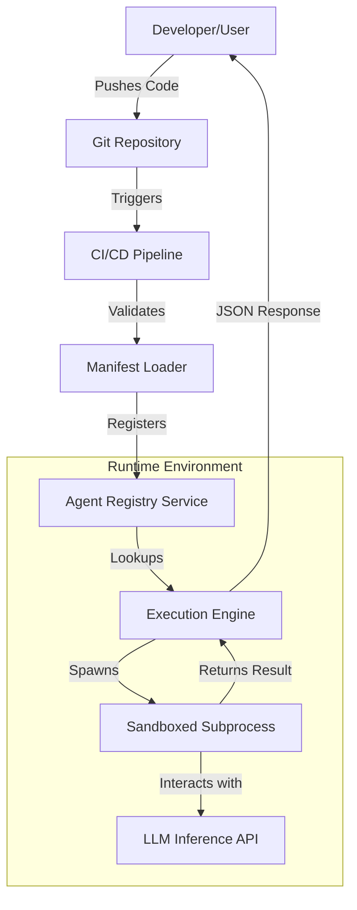

# Feature Request: Support AGENTS.md

## Introduction

We are seeing a massive surge in "agentic" workflows on Hacker News and across specialized AI research circles. Everyone is building autonomous agents—small, specialized LLM-driven loops designed to perform specific tasks like code reviews, database migrations, or security audits. 

However, we have a serious problem: there is no standard way to distribute, discover, or run these agents. Currently, if you want to add a new agent to your platform, you're likely hard-coding its logic, manually registering its ID in a database, and writing custom glue code to handle its specific requirements. It’s brittle, it’s manual, and it doesn't scale.

I am proposing a standardized `AGENTS.md` specification. The idea is simple: a repository contains an `AGENTS.md` file that acts as a declarative manifest. This file tells the host system what the agent does, what version it is, what permissions it needs, and how to execute it.

## Why This Matters

If we want an ecosystem of reusable AI agents, we need a "plugin architecture" for intelligence. 

Right now, the friction for integrating a new agent into a production pipeline is too high. If I want to use a "SQL Optimizer Agent" developed by a third party, I shouldn't have to import their entire codebase and wrap it in my own API. I should just point my orchestrator to their `AGENTS.md` and let the system handle the rest.

By moving from hard-coded agent registration to a manifest-driven approach, we gain:
1. **Discoverability:** Systems can scan directories or Git repos to automatically populate agent registries.
2. **Versioning:** We can run `v1.0.2` of a researcher agent alongside `v2.0.0` without breaking existing pipelines.
3. **Security:** We can define a "least privilege" model directly in the manifest, specifying exactly which environment variables or network scopes the agent is allowed to touch.
4. **Auditability:** The manifest becomes a contract that can be version-controlled and reviewed during CI/CD.

## How It Works

The architecture moves away from a monolithic "agent manager" toward a decoupled system where the manifest is the source of truth.



The workflow follows a clear lifecycle:
1. **Discovery:** The `Manifest Loader` crawls the filesystem or a Git repo, parsing `AGENTS.md` files.
2. **Registration:** The parsed metadata is stored in a thread-safe `Agent Registry`.
3. **Invocation:** When a request comes in via the `/run` endpoint, the `Execution Engine` looks up the spec.
4. **Isolation:** The engine spawns a restricted subprocess (using `seccomp` or similar) to prevent the agent from accessing unauthorized system resources.

## Core Concepts

*   **Agent Manifest:** A Markdown file with YAML front-matter that serves as the agent's identity card.
*   **Agent Spec:** The internal, typed representation of the manifest (the "compiled" version used by the engine).
*   **Sandbox:** A computational boundary that ensures the agent script can only access the resources (env vars, files, network) explicitly granted in the manifest.
*   **Dynamic Binding:** The ability for the system to resolve an agent's entry point at runtime based on the manifest, rather than at compile time.

## Examples & Code Walkthrough

Let's look at how this actually looks in practice. We'll use `Pydantic` for validation and `FastAPI` for the service layer.

### The Manifest (`AGENTS.md`)
```markdown
---
name: sql-optimizer
version: 1.2.0
author: data-eng-team
description: Analyzes slow queries and suggests indexing strategies.
entrypoint:./scripts/optimize_sql.py
permissions:
  network: outbound
  secrets:
    - DB_CONNECTION_STRING
    - ANALYTICS_API_KEY
---

# SQL Optimizer Agent
This agent takes a raw SQL query and returns an optimized version and a list of suggested indexes.

**Input Schema:**
- `query`: string (The SQL statement)
- `dialect`: string (e.g., 'postgresql', 'nowflake')

**Output Schema:**
- `optimized_query`: string
- `suggestions`: list[string]
```

### The Implementation

**`agent_registry.py`**
```python
from __future__ import annotations
from dataclasses import dataclass, field
from typing import Dict, Optional
import threading

@dataclass(frozen=True)
class AgentSpec:
    name: str
    version: str
    entrypoint: str
    permissions: Dict[str, any] = field(default_factory=dict)

class AgentRegistry:
    """A thread-safe, in-memory store for discovered agent specifications."""
    def __init__(self) -> None:
        # Structure: { name: { version: spec } }
        self._store: Dict[str, Dict[str, AgentSpec]] = {}
        self._lock = threading.RLock()

    def register(self, spec: AgentSpec) -> None:
        with self._lock:
            if spec.name not in self._store:
                self._store[spec.name] = {}
            self._store[spec.name][spec.version] = spec

    def lookup(self, name: str, version: Optional[str] = None) -> Optional[AgentSpec]:
        with self._lock:
            versions = self._store.get(name)
            if not versions:
                return None
            if version is None:
                # Return the latest version (simplified for example)
                latest_v = sorted(versions.keys(), reverse=True)[0]
                return versions[latest_v]
            return versions.get(version)
```

**`manifest_loader.py`**
```python
import yaml
from pathlib import Path
from pydantic import BaseModel, Field
from typing import Dict, Any

class ManifestMeta(BaseModel):
    name: str
    version: str
    entrypoint: str
    description: str = ""
    permissions: Dict[str, Any] = Field(default_factory=dict)

class AgentManifest(BaseModel):
    meta: ManifestMeta

def load_manifest(path: Path) -> AgentManifest:
    """Parses AGENTS.md using YAML front-matter logic."""
    content = path.read_text()
    # Simple split for YAML front-matter and Markdown body
    if not content.startswith("---"):
        raise ValueError("Invalid manifest format: Missing front-matter")
    
    parts = content.split("---", 2)
    yaml_content = parts[1]
    
    data = yaml.safe_load(yaml_content)
    return AgentManifest(meta=data)
```

**`main.py`**
```python
import subprocess
import os
from fastapi import FastAPI, HTTPException
from agent_registry import AgentRegistry, AgentSpec
from manifest_loader import load_manifest

app = FastAPI()
registry = AgentRegistry()

@app.on_event("startup")
async def startup_event():
    # In a real system, this would walk a specific directory
    manifest_path = Path("./agents/sql_optimizer/AGENTS.md")
    if manifest_path.exists():
        manifest = load_manifest(manifest_path)
        registry.register(AgentSpec(**manifest.meta.dict()))

@app.post("/run/{agent_name}")
async def run_agent(agent_name: str, payload: dict):
    spec = registry.lookup(agent_name)
    if not spec:
        raise HTTPException(status_code=404, detail="Agent not found")

    # Security: Filter environment variables based on manifest permissions
    safe_env = os.environ.copy()
    allowed_secrets = spec.permissions.get("secrets", [])
    
    # Remove all env vars not explicitly allowed or essential
    safe_env = {k: v for k, v in safe_env.items() if k in allowed_secrets or k in ['PATH']}

    # Execute the agent
    try:
        process = subprocess.run(
            [spec.entrypoint],
            env={**safe_env, **payload.get("env", {})},
            input=payload.get("input_data"),
            capture_output=True,
            text=True,
            timeout=30
        )
        
        if process.returncode!= 0:
            return {"error": process.stderr}
            
        return {"output": process.stdout}
    except Exception as e:
        raise HTTPException(status_code=500, detail=str(e))
```

## Best Practices

*   **Immutable Versions:** Once a version (e.g., `1.0.0`) is published in an `AGENTS.md`, never change the code associated with it. If you change the logic, bump the version.
*   **Schema Strictness:** Use the Markdown body of the manifest to define strict JSON schemas for inputs and outputs. This allows the host to validate requests *before* spawning a process.
*   **Resource Limits:** Always define timeouts and memory limits in your execution engine. An agent stuck in an infinite loop shouldn't take down your worker node.
*   **Least Privilege:** Never grant `network: all` unless absolutely necessary. Be granular.

## Common Mistakes & Anti-Patterns

1.  **The "God Agent":** Creating a single `AGENTS.md` that defines 50 different capabilities. This makes security impossible. Break them into micro-agents.
2.  **Environment Pollution:** Passing the entire host environment (including `AWS_SECRET_ACCESS_KEY` or `DATABASE_URL`) to the agent. Always use a whitelist-based environment injector.
3.  **Ignoring Error States:** Assuming the agent script will always exit with `0`. Always capture `stderr` and log it for debugging.
4.  **Manual Registry Updates:** Relying on a human to run a script to "register" an agent. The registration should be an automated consequence of the manifest existing in the directory.

## Performance Considerations

*   **Startup Latency:** Spawning a new Python subprocess for every request is expensive. For high-throughput systems, you'll want to move toward a "warm pool" of worker processes or use a lighter-weight execution model like WebAssembly (Wasm) for the agent logic.
*   **I/O Blocking:** The `AgentRegistry` uses an `RLock`. In a massive-scale system with thousands of agents being registered/deregistered frequently, this could become a contention point.
*   **Complexity:** The complexity of lookup is $O(1)$ due to the hash-map structure, which is ideal. The real bottleneck will always be the agent's execution time and the overhead of the sandbox.

## Real-World Usage

Large-scale engineering organizations are already moving toward this. Companies like Stripe or GitHub use internal "plugin" architectures to allow different teams to contribute logic to their core workflows without needing to modify the core engine. In the AI space, we expect to see "Agent Marketplaces" where you can simply pull a Git URL, and the platform automatically reads the `AGENTS.md` to integrate the new capability.

## Frequently Asked Questions (FAQ)

**Q: Can I use `AGENTS.md` to define Python functions instead of scripts?**
A: While you *could*, it's a security nightmare. It is much safer to treat the agent as a black-box executable. This enforces a clean interface and provides a hard boundary for security.

**Q: How do I handle dependencies for the agent?**
A: The manifest should ideally point to a container image or a specific virtual environment. A more advanced version of this spec would include a `runtime: docker://...` field.

**Q: Is Markdown the best format?**
A: Markdown is for humans; YAML is for machines. By using YAML front-matter, we get the best of both worlds: a readable document for developers and a machine-parsable manifest for the system.

## Conclusion

The `AGENTS.md` specification is a pragmatic step toward a standardized, scalable, and secure agent ecosystem. It moves us away from the "script-and-pray" method of agent deployment and toward a professional, engineering-first approach. If we want to build the future of autonomous software, we need to start treating our agents like first-class, discoverable citizens of our systems.
