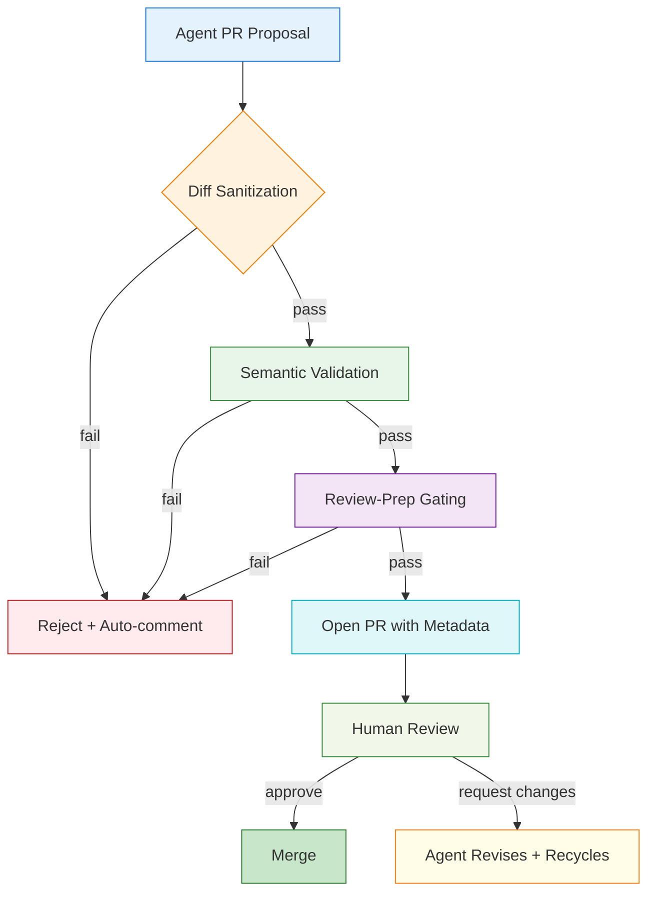

# Four Horsemen of Agent PRs and How to Stop Them

## Introduction

My team has been integrating AI-assisted coding agents into our pull request workflow for just over a year. The productivity uplift has been real—faster scaffolding, boilerplate reduction, even thoughtful refactoring suggestions. But alongside the gains, a predictable set of failure modes has emerged. I call them the Four Horsemen. They show up as recurring anti-patterns in the PRs these agents generate, and if left unchecked, they erode code quality, inflate review cycles, and eventually require heavy manual correction.

This article walks through each Horseman, the production pain they cause, and concrete, code-level strategies to neutralize them. The goal is not to reject agent-generated PRs outright, but to build guardrails that let the technology earn its keep.

## Why This Matters

In production environments where dozens of services ship daily, the cost of a merged PR that silently breaks a dependency or introduces a security hole multiplies fast. Agent-generated PRs add a layer of opacity: the diff might look reasonable at a glance, but subtle issues—unused imports, mismatched type signatures, or wrong assumptions about runtime environment—can slip through.

From a team operations perspective, the pain points are concrete:
- Review time ballooning because the diff is twice the expected size or touches unrelated modules.
- CI pipelines failing on tests the agent didn’t know to write or couldn’t anticipate.
- Security regressions from auto-added dependencies without version pinning or license checks.

These aren’t hypothetical. They show up in every organization that scales AI coding assistance beyond a handful of experimental notebooks. The solution isn’t more review—it’s smarter gating before the PR ever reaches a human.

## How It Works

The core mechanism is a validation pipeline that sits between the agent’s output and the PR creation step. When an agent proposes a change, a set of automated checks evaluates the diff against domain-specific rules, test coverage thresholds, and security baselines. Only if all checks pass does the system open a PR, and even then, metadata flags inform the human reviewer about known agent limitations.

The pipeline operates in three stages: diff sanitization, semantic validation, and review-preparation gating. Each stage emits structured data that the next stage consumes, and all stages write their results to a shared status object that the CI system and the PR dashboard can read.

Below is a flowchart of the pipeline. It shows how an agent PR proposal flows through each gate, what conditions trigger a reject, and what metadata gets attached when a PR is eventually opened.



**Stage breakdown:**

1. **Diff Sanitization** – The raw patch from the agent is parsed. Whitespace-only changes, commented-out code that was never compiled, and “fix typo” commits are stripped. The goal is to prevent the PR from inflating with noise that adds no business value.

2. **Semantic Validation** – Beyond syntax, the pipeline type-checks the changed files against the project’s type regime (e.g., Python mypy, TypeScript compiler). It also runs a subset of the project’s unit test suite against the modified code. If the agent’s change breaks any test, the pipeline records the failure and suggests a fix rather than blindly rejecting.

3. **Review-Prep Gating** – This stage decides whether the PR should be opened automatically or flagged for manual creation. It evaluates test coverage delta, cyclomatic complexity change, and whether the agent introduced any configuration files or dependency updates. If any of those cross thresholds defined by the team, the PR is opened with a “needs manual setup” label; otherwise, it’s opened with a “ready for light review” label.

All three stages write a `pr_status.json` file that gets attached as a comment on the PR. This gives the human reviewer a concise summary: “3 new tests passed, complexity increased by 12%, 1 dependency added without lockfile update.” The reviewer can then decide quickly whether to approve, request changes, or close the PR without reading the full diff.

## Core Concepts

Understanding the Horsemen requires familiarity with the data structures the pipeline operates on. The most fundamental is the **DiffUnit**, which represents a single hunk of changes from the agent. A DiffUnit carries not just the added/removed lines, but also a computed `intent_score`—a heuristic based on how many function signatures changed, whether imports were added/removed, and if any configuration files were touched.

The **AgentContext** is another core structure. It captures the agent’s operating parameters: the model version, the prompt template used, the repository’s branch state, and any explicit constraints the user provided (e.g., “no new dependencies”). The pipeline queries the AgentContext before each validation stage to tailor its checks. For instance, if the context indicates the agent is in “exploratory mode,” the test-coverage threshold tightens; if it’s in “release-prep mode,” dependency changes are blocked outright.

A **Horseman** in this framework is simply a named anti-pattern that the pipeline is configured to detect and neutralize. Each Horseman has a detection rule, a remediation strategy, and a severity score. The severity determines whether the pipeline auto-fixes the issue, blocks the PR, or merely flags it for human attention. The four patterns we’ll address are:

1. **The Unbounded Diff** – The agent generates a PR whose diff spans ten or more files, many of which are unrelated to the original request. This inflates review time and often masks the actual change the agent intended.

2. **The Silent Type Mismatch** – The agent writes code that type-checks locally but fails in the CI environment due to version differences, missing stubs, or implicit assumptions about runtime behavior.

3. **The Ghost Dependency** – A new package is imported and used, but it’s not added to the project’s lockfile or requirements file. This creates a runtime failure the first time the service starts in a clean environment.

4. **The Test Mirage** – The agent claims to have added tests, but the tests are integration-level, don’t cover the new code paths, or are outright no-ops (e.g., `assert True`). This gives a false sense of coverage while real bugs remain untested.

Each of these patterns maps to a specific validation check in the pipeline, and each has a code-level fix we’ll explore in the next section.

## Examples & Code Walkthrough

The following implementation is a minimal but functional version of the validation pipeline described above. It’s written in Python 3.11, uses only the standard library and `tomllib` for lockfile parsing (common in modern Python projects), and is structured so you can drop it into an existing codebase and extend it with project-specific checks.

```python
# agent_pr_validator.py
"""
Minimal validation pipeline for agent-generated Pull Requests.

Validates diffs, enforces project conventions, and produces
structured status output for PR automation.
"""

import ast
import json
import os
import re
import subprocess
from dataclasses import dataclass, asdict
from pathlib import Path
from typing import Any, Dict, List, Optional, Tuple


@dataclass
class DiffUnit:
    """Represents a single hunk of changes from an agent PR."""
    path: str
    old_lines: int
    new_lines: int
    intent_score: float  # heuristic: 0.0 = trivial, 1.0 = high-impact


@dataclass
class AgentContext:
    """Captures the agent's operating parameters."""
    model: str
    prompt_version: str
    repo_branch: str
    user_constraints: Dict[str, Any]


@dataclass
class PRStatus:
    """Structured status written to PR comments and CI artifacts."""
    overall_pass: bool
    diff_units: int
    type_check: bool
    test_coverage_delta: float
    new_dependencies: List[str]
    severity_notes: List[str]


class AgentPRValidator:
    """Orchestrates the three-stage validation pipeline."""

    def __init__(self, repo_root: Path, context: AgentContext) -> None:
        self.repo_root = Path(repo_root).resolve()
        self.context = context
        self.status = PRStatus(
            overall_pass=True,
            diff_units=0,
            type_check=True,
            test_coverage_delta=0.0,
            new_dependencies=[],
            severity_notes=[],
        )

    def run(self, diff_patch: str) -> PRStatus:
        """Execute the full pipeline on an agent-supplied diff."""
        self._sanitize_diff(diff_patch)
        if self.status.overall_pass:
            self._semantic_validation()
        self._review_prep_gating()
        return self.status

    # ------------------------------------------------------------------
    # Stage 1: Diff Sanitization
    # ------------------------------------------------------------------

    def _sanitize_diff(self, diff_patch: str) -> None:
        """Strip noise from the raw agent patch; count meaningful units."""
        # Remove git metadata noise (--- / +++ lines, @@ hunks headers)
        clean = re.sub(r"^(---|\+\+\+|@@ -\d+,\d+ \+\d+,\d+).*$\n", "", diff_patch, flags=re.MULTILINE)

        # Split into individual file diffs
        file_diffs = re.split(r"^diff --git ", clean, flags=re.MULTILINE)
        # First element before the first "diff --git" is usually empty/leading junk
        if file_diffs and file_diffs[0].strip() == "":
            file_diffs = file_diffs[1:]

        units: List[DiffUnit] = []
        for fd in file_diffs:
            # Each file diff starts with "a/<path>" or "b/<path>"
            path_match = re.match(r"^a/([^\n]+)", fd)
            if not path_match:
                continue
            rel_path = path_match.group(1).
