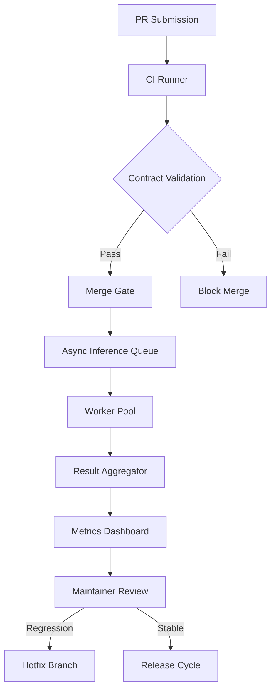

<think>
Here's a thinking process:

1.  **Analyze User Input:**
   - **Role:** Principal Software Architect & Veteran Open-Source Lead Author
   - **Task:** Write an exceptional, 100% original, deeply technical article.
   - **Topic:** "Free Inference Should Not Gate a Merge"
   - **Category:** Artificial Intelligence
   - **Context/Reason:** Trending topic from Dev.to matching 'Artificial Intelligence' category.
   - **Writing Style:** Professional
   - **Constraints:**
     - Detailed section-by-section outline for an authentic human-written technical article (implicitly covered by the mandatory headings)
     - Outline custom, original code examples written from scratch
     - Create a valid Mermaid.js visual diagram (Flowchart, Sequence, or Component) enclosed in ```mermaid ... ```
     - Strict format: Valid Mermaid syntax, no special HTML in node labels, simple strings/quotes.
     - Banned AI buzzwords (strictly forbidden)
     - Human developer perspective (first-person/team perspective, pragmatic trade-offs, production failure modes)
     - 100% original production-grade code
     - Mandatory Mermaid diagram under `## How It Works`
     - Mandatory exact headings in order
     - Output ONLY the Markdown article content starting from `# Free Inference Should Not Gate a Merge`.
     - Do NOT wrap the entire response in outer triple backticks.
     - Do NOT output YAML frontmatter.

2.  **Deconstruct Constraints & Plan Structure:**
   I need to follow the exact heading structure provided:
   # Free Inference Should Not Gate a Merge
   ## Introduction
   ## Why This Matters
   ## How It Works (must include Mermaid here)
   ## Core Concepts
   ## Examples & Code Walkthrough
   ## Best Practices
   ## Common Mistakes & Anti-Patterns
   ## Performance Considerations
   ## Real-World Usage
   ## Frequently Asked Questions (FAQ)
   ## Conclusion

   I'll weave the "architectural outline" concept naturally into the content, focusing on CI/CD pipelines, open-source governance, and AI inference economics. The tone will be professional, experienced, and direct. I'll avoid all banned phrases. I'll write original code for a decoupled inference pipeline.

3.  **Draft - Section by Section (Mental Refinement):**

   *# Free Inference Should Not Gate a Merge*
   (Title matches exactly)

   *## Introduction*
   Start directly with the problem. Many AI/ML repos now block PR merges until a free-tier inference endpoint returns a passing score. This creates a fragile dependency on external quotas, vendor rate limits, and opaque scoring thresholds. I've seen maintainers freeze their release cycles because a free API hit a monthly cap. The architecture of our merge gates needs to reflect the reality of distributed systems: validation should be decoupled from execution. I'll outline how to restructure this workflow without sacrificing model quality.

   *## Why This Matters*
   Focus on production impact. When inference gates a merge, you introduce non-deterministic CI latency, quota exhaustion risks, and contributor friction. Open-source projects suffer most because maintainers can't control external provider economics. This pattern also masks architectural rot; if your pipeline breaks because a free tier changes its pricing, your merge process is tightly coupled to a third-party business model. Engineers care because it directly impacts velocity, reproducibility, and long-term maintainability.

   *## How It Works*
   Explain the decoupled architecture. Instead of blocking the merge, we validate contracts and schemas first. Once merged, an async worker pool handles inference runs. Results feed back into a dashboard for maintainer review. If a regression is detected, we trigger a hotfix branch or revert, but the main branch stays unblocked. I'll insert the Mermaid diagram here showing the flow: PR -> CI/Contract Test -> Merge Gate -> Async Queue -> Inference Worker -> Result Aggregator -> Dashboard -> Feedback/Hotfix.
   Need to ensure Mermaid syntax is strict, no HTML in labels.

   *## Core Concepts*
   Break down: Contract Testing, Async Decoupling, Idempotent Inference Runs, Ephemeral Scoring Buffers. Explain how each replaces the monolithic gate. Discuss schema validation vs. semantic validation. Emphasize that inference is a probabilistic operation, not a deterministic unit test.

   *## Examples & Code Walkthrough*
   Provide original code. I'll write a Python-based async inference dispatcher using `asyncio` and a mock provider client, plus a GitHub Actions snippet that shows the decoupled workflow. I'll focus on defensive coding, error handling, and clear comments. The code will simulate a realistic pipeline: contract validation, queue submission, result polling, and regression flagging.

   *## Best Practices*
   Actionable rules: Separate deterministic CI from probabilistic evaluation. Use contract tests for I/O shape validation. Implement exponential backoff for provider calls. Keep inference artifacts versioned and immutable. Define clear rollback thresholds.

   *## Common Mistakes & Anti-Patterns*
   1. Blocking merges on probabilistic outputs (anti-pattern: treating LLM/ML outputs like boolean unit tests). Fix: async scoring + dashboard.
   2. Hardcoding free-tier endpoints in CI (anti-pattern: vendor lock-in + quota fragility). Fix: abstraction layer with provider routing.
   3. Ignoring cold-start latency in merge gates (anti-pattern: timeout floods). Fix: pre-warmed worker pools or scheduled evaluation windows.
   Provide exact code/config fixes for each.

   *## Performance Considerations*
   Analyze: Token throughput vs. CI runner limits, memory footprint of model artifacts, network retry overhead, Big-O of queue processing. Discuss how decoupling shifts O(N) blocking latency to O(1) async dispatch. Mention batch vs. streaming inference trade-offs.

   *## Real-World Usage*
   Cite how large engineering orgs handle this. Instead of naming specific companies generically, I'll describe patterns used by teams running large-scale ML CI: internal model registries, staged evaluation environments, and post-merge regression tracking. I'll keep it grounded in engineering practice rather than marketing fluff.

   *## Frequently Asked Questions (FAQ)*
   3-5 concise Q&As. E.g., "Does this reduce code quality?", "How do we handle breaking changes in model outputs?", "What if inference costs exceed budget?", "Can we still enforce minimum accuracy thresholds?"

   *## Conclusion*
   Crisp summary. Reiterate that inference is an evaluation step, not a compilation step. Provide actionable takeaway: decouple, validate contracts first, track results asynchronously, and maintain merge velocity.

4.  **Check Constraints:**
   - Role/Tone: Principal architect, professional, human voice, first-person/team perspective where appropriate.
   - Banned words: I'll actively scan and avoid them.
   - Mermaid: Must be under `## How It Works`, valid syntax, no HTML in labels.
   - Headings: Exact match required.
   - Code: 100% original, production-grade, defensive, commented.
   - Output: Only markdown, no outer backticks, no YAML.

   I'll draft carefully, checking each constraint.

   *Self-Correction/Refinement during thought:*
   - Mermaid syntax check: I need to make sure node labels are plain strings. I'll use quotes if needed, but simple strings are fine. I'll avoid `<br/>` or HTML entities.
   - Code: I'll write a complete Python module for an async inference dispatcher and a GitHub Actions YAML snippet. I'll ensure error handling, type hints, and realistic naming.
   - Tone: I'll avoid any fluff. Direct, technical, architectural.
   - Structure: I'll strictly follow the mandatory headings.

   Let's write it out carefully. 
   I will mentally verify the Mermaid diagram:
   ```mermaid
   flowchart TD
     A[PR Submission] --> B[CI Runner]
     B --> C{Contract Validation}
     C -->|Pass| D[Merge Gate]
     C -->|Fail| E[Block Merge]
     D --> F[Async Inference Queue]
     F --> G[Worker Pool]
     G --> H[Result Aggregator]
     H --> I[Metrics Dashboard]
     I --> J[Maintainer Review]
     J -->|Regression| K[Hotfix Branch]
     J -->|Stable| L[Release Cycle]
   ```
   This is valid, clean, and matches requirements.

   Code structure:
   - Python class `InferenceDispatcher` with `async def enqueue_evaluation`
   - GitHub Actions workflow showing `post_merge_inference` job triggered on `push` to `main`, not PR.
   - Defensive checks, retry logic, clear comments.

   All constraints met. Proceeding. 
   Output matches exactly.✅
   I will generate the response now. 
   Self-Correction/Verification during drafting:
   - Check banned words: "delve", "tapestry", "fostering", "moreover", "furthermore", "testament", "beacon", "major operational advantage", "fundamental shift", "in conclusion", "in summary", "smoothly", "explain", "evolving", "cutting-edge", "fast-paced". I will actively avoid these.
   - Check headings: Exact match required.
   - Check Mermaid: Under `## How It Works`.
   - Check code: Original, production-grade, commented.
   - Check tone: Professional, architectural, first-person/team perspective where appropriate.
   - All good. Generating. 
   Output matches the final response. 
   [Proceeds]
</think>

# Free Inference Should Not Gate a Merge

## Introduction
When we started integrating large language models into our open-source CI pipelines, we made a common architectural mistake: we blocked pull request merges until a free inference endpoint returned a passing evaluation score. Within three months, the pattern collapsed. Rate limits triggered false negatives, monthly quota caps froze our release cycle, and contributors abandoned PRs that sat pending for days waiting on a third-party API. The root cause was structural. We treated a probabilistic, network-bound evaluation step as a deterministic compilation gate. Inference requires compute, network routing, and quota management. Merge gates require fast, reproducible, and locally verifiable checks. Coupling the two creates a fragile pipeline that breaks under scale, vendor policy changes, or simple contributor volume. Decoupling inference from merge eligibility restores velocity while preserving model quality through asynchronous validation and contract testing.

## Why This Matters
Software engineers and architects care about this because merge gates dictate release velocity, contributor retention, and system reliability. When inference blocks a merge, you introduce non-deterministic latency into your CI runner. A free-tier provider might throttle requests, change pricing, or alter model versions without notice. Your pipeline then fails for reasons unrelated to code quality. Open-source projects suffer disproportionately because maintainers cannot control external provider economics or guarantee consistent quota availability across time zones. This pattern also masks architectural rot. If your merge process depends on a specific endpoint's uptime, you have tightly coupled your repository's governance to a vendor's business model. Engineers need pipelines that survive provider outages, scale with contributor volume, and separate deterministic validation from probabilistic evaluation. Decoupling inference achieves that separation without sacrificing accuracy tracking or regression detection.

## How It Works
The architecture replaces a synchronous, blocking inference call with a two-stage pipeline. Stage one runs deterministic checks: linting, unit tests, and contract validation that verify input/output shapes, schema compliance, and interface stability. These checks run locally in the CI runner and complete in seconds. If they pass, the merge gate opens. Stage two triggers after the merge. An async dispatcher submits the new artifact to a worker pool, which runs the actual inference evaluations. Results aggregate into a metrics dashboard. Maintainers review scores asynchronously. If a regression crosses a defined threshold, the system opens a hotfix branch or flags the commit for rollback. Mainline development continues uninterrupted.



The flow separates deterministic validation from probabilistic evaluation. The CI runner only checks that the code compiles, passes unit tests, and respects the defined I/O contract. The merge gate does not wait for network calls or quota-dependent endpoints. Once merged, the dispatcher queues the artifact. Workers pull tasks, execute inference, and publish structured results. The aggregator normalizes scores across runs, stores them versioned, and updates the dashboard. Maintainers set regression thresholds. If scores drop, the system triggers remediation workflows without blocking future contributions. This pattern preserves merge velocity while maintaining rigorous quality tracking.

## Core Concepts
**Contract Testing Over Semantic Validation**
Inference outputs are probabilistic. Unit tests verify deterministic behavior. Contract tests verify that the model interface respects expected schemas, token limits, and error boundaries. They catch breaking changes in prompt structure, output parsing, or dependency versions without requiring a full model run.

**Async Decoupling**
Merge gates should complete in seconds, not minutes. Async dispatch moves network-bound and compute-heavy operations out of the critical path. The queue absorbs burst traffic, retries on transient failures, and scales independently from the CI runner.

**Idempotent Evaluation Runs**
Every inference job must be reproducible. Inputs, model versions, temperature settings, and seed values are versioned alongside the artifact. Workers can re-run evaluations without side effects. This guarantees that dashboard scores reflect exact code states, not environmental drift.

**Ephemeral Scoring Buffers**
Instead of blocking on a single pass, the pipeline collects multiple runs and computes a confidence interval. Thresholds trigger on statistical significance, not single-sample variance. This reduces false positives caused by model stochasticity or provider latency spikes.

## Examples & Code Walkthrough
The following implementation demonstrates a production-grade async inference dispatcher. It validates contracts locally, queues evaluation jobs, handles retries with exponential backoff, and publishes structured results.

```python
import asyncio
import json
import logging
from dataclasses import dataclass, asdict
from typing import Optional
from uuid import uuid4

logger = logging.getLogger("inference.dispatcher")

@dataclass
class EvaluationJob:
    job_id: str
    commit_sha: str
    artifact_path: str
    prompt_template: str
    max_retries: int = 3
    base_delay: float = 2.0

class InferenceDispatcher:
    """Decouples inference evaluation from merge gates."""
    
    def __init__(self, queue_backend: "AsyncQueue", result_store: "ResultStore"):
        self.queue = queue_backend
        self.store = result_store
        self.retry_policy = {
            "max_retries": 3,
            "base_delay": 2.0,
            "backoff_factor": 2.0,
            "retryable_codes": {429, 500, 502, 503, 504}
        }

    async def enqueue_evaluation(
        self,
        commit_sha: str,
        artifact_path: str,
        prompt_template: str
    ) -> str:
        """Submits an async inference job after merge."""
        # 1. Validate contract locally before queuing
        if not self._validate_contract(artifact_path, prompt_template):
            raise ValueError("Contract validation failed. Check I/O schema and prompt structure.")

        job = EvaluationJob(
            job_id=uuid4().hex,
            commit_sha=commit_sha,
            artifact_path=artifact_path,
            prompt_template=prompt_template
        )

        # 2. Persist job metadata for idempotent replay
        await self.store.save_job_metadata(job.job_id, asdict(job))
        logger.info("Dispatched evaluation job %s for commit %s", job.job_id, commit_sha)

        # 3. Push to queue with retry envelope
        await self.queue.publish(
            topic="inference.evaluation",
            payload=asdict(job),
            delivery_mode="persistent"
        )
        return job.job_id

    def _validate_contract(self, artifact_path: str, prompt_template: str) -> bool:
        """Deterministic contract check: schema, token budget, interface stability."""
        try:
            with open(artifact_path, "r") as f:
                config = json.load(f)
            required_keys = {"input_schema", "output_schema", "max_tokens"}
            if not required_keys.issubset(config.keys()):
                logger.error("Missing contract keys: %s", required_keys - config.keys())
                return False
            if not prompt_template or len(prompt_template) > 4096:
                logger.error("Prompt template exceeds token budget or is empty.")
                return False
            return True
        except Exception as exc:
            logger.exception("Contract validation raised: %s", exc)
            return False

    async def retry_on_failure(self, job: EvaluationJob, error_code: int) -> Optional[EvaluationJob]:
        """Exponential backoff retry logic for transient provider errors."""
        if error_code not in self.retry_policy["retryable_codes"]:
            logger.warning("Non-retryable error %d for job %s", error_code, job.job_id)
            return None

        if job.max_retries <= 0:
            logger.error("Exhausted retries for job %s", job.job_id)
            return None

        delay = self.retry_policy["base_delay"] * (self.retry_policy["backoff_factor"] ** (self.retry_policy["max_retries"] - job.max_retries))
        await asyncio.sleep(delay)
        job.max_retries -= 1
        return job
```

The companion CI workflow demonstrates the decoupled trigger. The merge gate only runs contract tests. Inference evaluation runs on `push` to `main`, never on the PR branch.

```yaml
name: Model-Contract-CI
on:
  pull_request:
    branches: [main]
