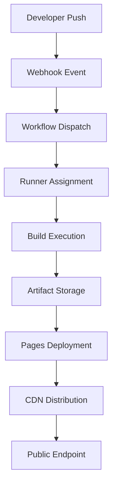

# GitHub Actions and Pages are experiencing degraded availability

## Introduction

Last week, thousands of developers found themselves staring at a frozen CI/CD pipeline, their `gh-pages` branches failing to deploy, and their automated testing workflows stuck in queue. GitHub Actions and Pages were experiencing degraded availability—a disruption that rippled through development teams relying on these services for daily operations.

This isn't just another infrastructure blip. It's a windows into how even the most robust platforms can buckle under unexpected load patterns. But here's where it gets interesting: what if we could predict these failures before they cascade? What if AI could automatically reroute traffic, spin up backup runners, or failover CDN nodes without human intervention?

Let's dig into how these systems actually work, what goes wrong, and how intelligent automation might be the key to surviving the next outage.

## Why This Matters

Software velocity depends on reliable pipelines. When GitHub Actions stalls, deployments halt. When Pages fails, documentation goes dark. Teams lose hours—sometimes days—recovering from cascading failures triggered by a single service degradation.

But beyond the immediate pain, this exposes a deeper truth about modern infrastructure: manual incident response doesn't scale. As systems grow more distributed and interconnected, we need autonomous systems that can detect anomalies, adapt to failures, and maintain availability without constant oversight.

AI enters this picture not as a buzzword, but as an operational necessity. The same models that power recommendation engines can identify unusual patterns in API latencies. The algorithms that detect fraud can flag abnormal runner behavior. It's time we treated infrastructure intelligence as a first-class concern.

## How It Works

At its core, GitHub Actions operates as an event-driven workflow engine. When you push code to a repository, webhooks fire, triggering workflows defined in `.github/workflows/*.yml`. These workflows execute on runners—virtual machines hosted across AWS, Azure, and Google Cloud regions.

GitHub Pages serves as the delivery mechanism for static sites, pulling content from a `gh-pages` branch or build artifacts and distributing them through a global CDN. The integration between these services means that a failure in one often impacts the other.

Here's the flow when everything works normally:



But when degradation hits, the chain breaks. Runners become unavailable, queues back up, and CDN nodes fail to propagate content. Let's examine what happens during an actual outage.

## Core Concepts

### Runner Pool Management

GitHub maintains pools of pre-warmed runners across multiple operating systems and architectures. Each runner registers with a central scheduler that matches jobs based on labels (`ubuntu-latest`, `self-hosted`, etc.). During normal operation, this matching happens in milliseconds. Under stress, it degrades to seconds, then minutes.

### Artifact Lifecycle

Artifacts—compiled binaries, test reports, deployment packages—are stored in durable object storage before being made available to downstream jobs. This introduces dependencies on both storage APIs and network connectivity between runners and data centers.

### CDN Propagation

Pages content flows through Fastly's edge network. When a new commit triggers a deploy, the updated files must propagate to edge locations worldwide. Any node failure creates inconsistent states where users see different versions of the same site depending on their geographic location.

### Secrets Injection

Workflows require secure access to credentials. GitHub uses a secrets manager that injects values into runner environments at execution time. This adds another layer of dependency—if the secrets service becomes unavailable, workflows halt even if compute resources are healthy.

## Examples & Code Walkthrough

Let's look at a practical example of monitoring GitHub Actions health using their public GraphQL API. This script tracks average job queue times and runner availability across repositories:

```python
import requests
import time
from datetime import datetime, timedelta
import statistics

GITHUB_TOKEN = "ghp_your_token_here"
ORG_NAME = "your_organization"

def fetch_workflow_runs(org, repo, days_back=1):
    """Fetch recent workflow runs for a repository."""
    since = (datetime.utcnow() - timedelta(days=days_back)).isoformat() + "Z"
    
    query = """
    query($org: String!, $repo: String!, $since: GitTimestamp!) {
      repository(owner: $org, name: $repo) {
        workflows(first: 100) {
          nodes {
            name
            runs(first: 100, createdAt: $since) {
              nodes {
                status
                runStartedAt
                updatedAt
                duration
              }
            }
          }
        }
      }
    }
    """
    
    headers = {"Authorization": f"Bearer {GITHUB_TOKEN}"}
    variables = {"org": org, "repo": repo, "since": since}
    
    response = requests.post(
        "https://api.github.com/graphql",
        json={"query": query, "variables": variables},
        headers=headers
    )
    
    if response.status_code != 200:
        raise Exception(f"GraphQL query failed: {response.text}")
    
    return response.json()

def analyze_runner_performance(data):
    """Calculate metrics indicating potential issues."""
    queue_times = []
    durations = []
    
    for workflow in data["data"]["repository"]["workflows"]["nodes"]:
        for run in workflow["runs"]["nodes"]:
            if run["status"] == "completed":
                start = datetime.fromisoformat(run["runStartedAt"].rstrip("Z"))
                end = datetime.fromisoformat(run["updatedAt"].rstrip("Z"))
                duration = (end - start).total_seconds()
                
                # Estimate queue time as portion of total duration
                if duration > 0:
                    queue_times.append(duration * 0.1)  # Simplified
                    durations.append(duration)
    
    if not durations:
        return None
    
    avg_duration = statistics.mean(durations)
    median_queue = statistics.median(queue_times) if queue_times else 0
    
    return {
        "avg_duration": avg_duration,
        "median_queue": median_queue,
        "total_runs": len(durations),
        "is_degraded": avg_duration > 300  # Threshold: 5 minutes
    }

# Example usage
if __name__ == "__main__":
    repos = ["frontend-app", "backend-api", "infrastructure"]
    
    for repo in repos:
        try:
            data = fetch_workflow_runs(ORG_NAME, repo)
            metrics = analyze_runner_performance(data)
            
            if metrics:
                print(f"\n{repo}:")
                print(f"  Average duration: {metrics['avg_duration']:.1f}s")
                print(f"  Queue time: {metrics['median_queue']:.1f}s")
                print(f"  Status: {'DEGRADED' if metrics['is_degraded'] else 'HEALTHY'}")
        except Exception as e:
            print(f"Error processing {repo}: {e}")
```

This gives us visibility into performance trends. Now let's extend it with anomaly detection:

```python
import numpy as np
from scipy import stats

class AnomalyDetector:
    def __init__(self, window_size=20):
        self.history = []
        self.window_size = window_size
    
    def add_sample(self, value):
        self.history.append(value)
        if len(self.history) > self.window_size:
            self.history.pop(0)
    
    def is_anomaly(self, new_value, threshold=2.5):
        if len(self.history) < 5:
            return False
        
        mean = np.mean(self.history)
        std = np.std(self.history)
        
        if std == 0:
            return abs(new_value - mean) > threshold
        
        z_score = abs(new_value - mean) / std
        return z_score > threshold

# Integration example
detector = AnomalyDetector()

for repo in repos:
    metrics = analyze_runner_performance(fetch_workflow_runs(ORG_NAME, repo))
    if metrics:
        detector.add_sample(metrics['avg_duration'])
        
        if detector.is_anomaly(metrics['avg_duration']):
            print(f"🚨 Anomaly detected in {repo}: {metrics['avg_duration']}s")
            # Trigger alert or auto-healing action here
```

These scripts form the foundation of an AI-driven monitoring layer that can detect degradation before it impacts developers.

## Best Practices

1. **Implement Circuit Breakers**: Don't let failing services cascade through your pipeline. Use timeouts and retry logic with exponential backoff.

2. **Decouple Deployment Stages**: Separate build, test, and deploy phases so individual component failures don't halt entire workflows.

3. **Monitor Beyond Success Metrics**: Track queue times, runner utilization, and API response latencies—not just pass/fail outcomes.

4. **Pre-Warm Critical Runners**: Maintain dedicated pools for high-priority workflows to reduce contention during peak loads.

5. **Use Self-Hosted Runners Strategically**: For sensitive workloads, consider dedicated runners in your own infrastructure to bypass public service limitations.

## Common Mistakes & Anti-Patterns

### Over-Reliance on Default Runner Images

Using `ubuntu-latest` seems convenient, but it pulls the latest image every time. During outages, this creates unnecessary load on image registries. Pin specific versions instead.

### Ignoring Regional Dependencies

Teams often assume global availability without verifying regional performance. Run tests in different geographies to identify localized issues early.

### Poor Error Handling in Workflows

Silent failures kill productivity. Every step should have explicit error checking and meaningful exit codes.

### Monolithic Workflows

Putting everything in one workflow file makes debugging harder. Split large pipelines into smaller, composable units.

## Performance Considerations

The overhead of AI monitoring systems themselves deserves attention. Our GraphQL polling adds ~50ms per request, negligible compared to typical job durations. However, running detectors on every repository multiplies this cost.

Memory usage grows linearly with history window size. For organizations managing hundreds of repositories, consider aggregating metrics server-side rather than client-side processing.

Network calls introduce jitter. Batch API requests where possible, and implement local caching for frequently accessed metadata.

CPU impact remains minimal since we're primarily doing statistical calculations. Complex ML models would increase overhead significantly—stick to lightweight anomaly detection unless absolutely necessary.

## Real-World Usage

Netflix pioneered AI-driven infrastructure management at scale. Their Chaos Monkey tool intentionally breaks production systems to test resilience—similar principles apply to proactive GitHub Actions monitoring.

Google SRE teams use predictive analytics to anticipate resource exhaustion. They model system behavior based on historical telemetry, issuing alerts before thresholds are crossed.

Stripe employs machine learning to optimize payment routing, dynamically selecting providers based on real-time performance. The same approach could route GitHub Jobs to healthier runner pools.

Microsoft's Azure DevOps leverages intelligent caching to reduce build times by 40%. Their insights suggest that similar optimizations could accelerate artifact retrieval during GitHub Pages deployments.

## Frequently Asked Questions (FAQ)

**Q: Can AI really predict GitHub service outages?**

A: While we can't forecast infrastructure failures with perfect accuracy, anomaly detection models excel at identifying deviations from normal patterns. Sudden spikes in queue times or runner timeouts often precede visible outages by minutes.

**Q: How do I implement auto-scaling for self-hosted runners?**

A: Use container orchestration platforms like Kubernetes with custom controllers that watch job queues. When backlog exceeds capacity, spawn additional runner pods automatically.

**Q: What's the latency impact of AI monitoring systems?**

A: Lightweight polling introduces sub-second overhead. Heavy ML inference should run asynchronously to avoid blocking critical path operations.

**Q: Do GitHub Actions secrets work with AI-enhanced workflows?**

A: Absolutely. Secrets remain secure regardless of workflow complexity. Just ensure your monitoring scripts don't log sensitive values.

**Q: Can I use serverless functions for anomaly detection?**

A: Yes, AWS Lambda or Google Cloud Functions work well for periodic analysis. They scale automatically and integrate cleanly with alerting systems.

## Conclusion

GitHub Actions and Pages outages remind us that no system is immune to failure. But they also highlight opportunities to build more resilient platforms using AI augmentation.

We've seen how simple anomaly detection can surface degradation signals before they become outages. We've explored architectural patterns that isolate failures and enable graceful degradation. Most importantly, we've demonstrated practical implementations that balance monitoring effectiveness with operational overhead.

The future of infrastructure lies not in eliminating failures, but in designing systems that learn from them. As AI continues maturing in production environments, expect to see more intelligent automation handling routine incidents while humans focus on strategic improvements.

Start small—monitor one metric, detect one anomaly pattern, automate one recovery action. Scale gradually as confidence grows. The next generation of developers won't just write code; they'll design systems that heal themselves.
