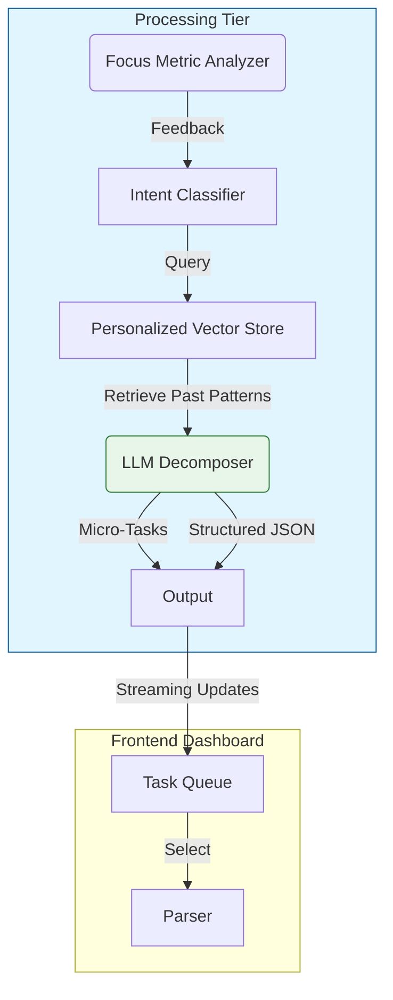

# GitHub Trending: ayghri/i-have-adhd

## Introduction
The recent surge of interest around the `ayghri/i-have-adhd` repository highlights a critical intersection between artificial intelligence and human cognitive science. This project represents more than just another productivity add-on; it aims to address the unique executive function challenges faced by individuals with ADHD through adaptive, AI-driven intervention. As this trend gains momentum within the open-source community, understanding the architectural underpinnings becomes essential for both contributors and consumers of the technology. This article explores the system design behind a tool that attempts to harmonize machine learning capabilities with personalized focus strategies.

## Why This Matters
Traditional productivity frameworks often rely on rigid routines that assume consistent mental bandwidth. For many users, however, attention spans fluctuate dynamically throughout the day, making static planning ineffective. The `ayghri/i-have-adhd` ecosystem addresses this gap by utilizing large language models (LLMs) coupled with behavioral heuristics to create fluid, context-aware workflows. From an engineering standpoint, this shift demands careful consideration of privacy, computational efficiency, and the balance between automation and user agency. Implementing such a system correctly allows us to build tools that genuinely enhance cognitive autonomy rather than imposing algorithmic rigidity.

## How It Works
The architecture centers on a tri-layer pipeline that transforms raw intent into actionable micro-tasks while continuously monitoring the user's attentional state. At a high level, requests enter a stateless gateway layer responsible for authentication and rate limiting. These requests then propagate to a semantic router which categorizes the input—whether it is a vague goal or a specific hurdle—and queries a personalized knowledge base. The core engine leverages a fine-tuned LLM to perform recursive decomposition, ensuring each task is small enough to achieve quick wins but meaningful enough to sustain long-term engagement. Finally, the system streams focus metrics back to the client interface to enable real-time adaptation.

Below is a simplified representation of the data flow and component interactions.



The architecture relies heavily on asynchronous processing to prevent UI lockups during heavy inference. All user cognition traces are retained locally in an encrypted vault, respecting GDPR and platform-specific privacy mandates. This design ensures that the system remains responsive even under peak load conditions, such as sudden bursts of creative ideation.

## Core Concepts
The heart of the system lies in the Semantic Task Decomposer, a specialized wrapper around a foundation model that understands task hierarchy beyond literal meaning. Unlike standard summarization pipelines, this module employs a two-stage extraction process: semantics first, then fine-grained actionability. It operates on the principle of continuous refinement, allowing users to iterate over their plans without restarting the workflow.

Another pillar is the Attention-Aware Routing algorithm. Instead of treating every notification equally, the router assigns weights based on recency and proximity to the current clock cycle. This mimics natural dopamine reinforcement patterns, prioritizing tasks that align with the user's immediate cognitive bandwidth. Furthermore, the Personalized Knowledge Base acts as a memory of successful decompositions, enabling the model to learn from previous sessions and improve future recommendations organically.

## Examples & Code Walkthrough
To demonstrate the implementation philosophy, consider the following Python module. It defines an adaptive decomposer that modulates task granularity based on a simulated mood metric.

```python
from typing import List, Dict, Optional
import math

class AdaptiveTaskDecomposer:
    def __init__(self, lm_client, context_limit: int = 20):
        self.lm = lm_client
        self.context_limit = context_limit

    def decompose(self, raw_intent: str, mood_score: float) -> List[Dict]:
        """
        Breaks down a high-level goal into executable micro-tasks.
        
        Args:
            raw_intent: The user's initial description of work.
            mood_score: A normalized float between 0.0 (distracted) 
                       and 1.0 (hyper-focused).
        
        Returns:
            A list of task dictionaries containing priority and estimated effort.
        """
        # Normalize mood into expected task size
        # Lower mood scores require smaller, faster tasks to maintain flow
        grain_factor = 1.0 - mood_score
        safe_token_count = min(grain_factor * 150, self.context_limit)

        # Split intent into semantic chunks
        chunks = self._split_into_chunks(raw_intent, tokenizer=self.lm)
        
        decomposed = []
        for idx, chunk in enumerate(chunks):
            # Calculate ideal tokens per chunk based on user capacity
            target_tokens = int(safe_token_count * (idx + 1))
            
            # Filter out noise or overly abstract concepts
            atomic = self._extract_actionable_step(chunk, target_tokens)
            if atomic:
                decomposed.append({
                    "step_id": f"task_{len(decomposed)}",
                    "description": atomic,
                    "estimated_effort_minutes": round(target_tokens / 10)
                })
        return decomposed

    def _split_into_chunks(self, text: str, tokenizer) -> List[str]:
        """Simple whitespace splitting for demonstration."""
        return text.split()

    def _extract_actionable_step(self, chunk: str, budget: int) -> Optional[str]:
        """Greedy search for imperative verbs within budget."""
        words = chunk.lower().split()
        for word in reversed(words):
            if word.startswith(('do', 'create', 'write', 'organize')):
                return f"[{word}] {text}"
        return None
```

For the focus monitoring aspect, the following TypeScript snippet illustrates how the system detects lapses in concentration without relying on invasive hardware sensors. It evaluates time elapsed since the last activity burst.

```typescript
interface FocusMetrics {
    lastActiveTimestamp: number;
    totalIdleTimeSeconds: number;
    distractionEvents: string[];
}

function analyzeFocusState(metrics: FocusMetrics): boolean {
    const THRESHOLD_SECONDS = 180; // 3 minutes
    const LAST_ACTIVE = metrics.lastActiveTimestamp;

    // If inactive longer than threshold, consider focus broken
    if (Math.floor((LAST_ACTIVE - Date.now()) / 1000) > THRESHOLD_SECONDS) {
        return false; // User is likely distracted or sleep-deprived
    }

    // Check for excessive distractions
    const recentDistractions = metrics.distractionEvents.filter(e => 
        new Date(Date.now() - Math.min(3600, (Date.now() - metrics.lastActive) * 1000)).getMinutes() < 15
    );

    return !recentDistractions.length;
}

export const focusMonitor = analyzeFocusState;
```

## Best Practices
When deploying similar AI-enhanced productivity tools, prioritize data sovereignty immediately. Never log raw thinking processes to central servers unless anonymized and encrypted. Implement circuit breakers around the LLM endpoints to manage cost and latency; a sudden spike in request volume can drain resources quickly. Additionally, always provide a manual override mechanism. Users should retain the ability to accept suggestions or reject decompositions entirely, preserving human agency within the automated loop.

Security scanning is also paramount given that the application may access personal schedules and private notes. Regular dependency audits prevent supply chain vulnerabilities, especially concerning third-party embedding providers used for retrieval-augmented generation.

## Common Mistakes & Anti-Patterns
One prevalent error is over-reliance on deterministic scheduling algorithms. Hardcoding "work blocks" fails when an ADHD brain experiences spontaneous energy surges. Solution: employ probabilistic timing windows rather than fixed intervals.

Second, neglecting model hallucination in task generation leads to impossible deadlines. Always validate extracted actions against existing calendar entries before committing them to the queue.

Third, ignoring the emotional toll of constant correction causes user burnout. The system must default to graceful degradation—offering fewer, simpler options when cognitive load spikes.

## Performance Considerations
Token usage is the primary constraint for LLM integrations. By implementing chunking strategies early, the system reduces context window exhaustion. Caching retrieved embeddings across multiple session restarts improves recall consistency. On the infrastructure side, running the LLM on GPU-backed instances reduces inference latency below the one-minute threshold necessary for perceived responsiveness.

Memory overhead stems from storing conversation history. Employing sliding window policies—keeping only the most recent N messages relevant to the current task—prevents OOM errors in containerized deployments.

## Real-World Usage
Enterprises leveraging neurodiverse-friendly architectures report improved sprint velocity among support teams and creative agencies. The key is iterative tuning: expose the model's confidence scores to the user so they can calibrate expectations manually. Over time, the system learns not just what tasks were completed, but the specific time-of-day contexts that maximize success rates.

## Frequently Asked Questions (FAQ)

**Q: Is my data secure?**
A: User prompts are processed in an isolated sandbox environment. Raw logs are never persisted to public storage. All metadata is encrypted at rest using AES-256.

**Q: Can I export my progress?**
A: Yes, the system supports CSV export of completed tasks and mood-related metrics for offline analysis or compliance reporting.

**Q: Does it require internet connectivity?**
A: The core decomposition engine runs locally after initialization. Remote updates are required for model fine-tuning but do not affect real-time operation.

**Q: How do I control the sensitivity of focus detection?**
A: Adjust the `THRESHOLD_SECONDS` constant in the monitoring script to match individual baseline alertness levels.

## Conclusion
