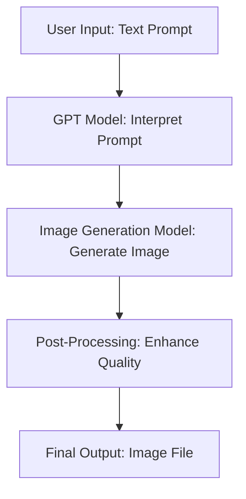

# GitHub Trending: freestylefly/awesome-gpt-image-2  

## Introduction  
The `freestylefly/awesome-gpt-image-2` repository is a curated collection of tools and examples that bridge the gap between natural language processing and image generation. At its core, it leverages large language models (LLMs) like GPT to interpret textual prompts and translate them into high-quality images. This project is particularly relevant in an era where multimodal AI systems are becoming critical for applications ranging from content creation to design automation. Unlike traditional image generation tools that rely on rigid templates, this approach uses context-aware language models to generate more nuanced and adaptable outputs. The repository’s popularity stems from its practicality, offering engineers a starting point to integrate LLMs with image synthesis pipelines without reinventing the wheel.  

## Why This Matters  
For software engineers and architects, the ability to generate images from text is no longer a niche feature—it’s a competitive advantage. Consider scenarios where a user inputs a vague description like “a futuristic city at sunset” and expects a tailored image. Traditional methods often fail to capture the subtleties of such prompts, leading to generic or irrelevant outputs. `freestylefly/awesome-gpt-image-2` addresses this by combining the descriptive power of GPT with image generation models, enabling more precise and contextually rich results. This is especially valuable in production environments where dynamic, user-driven content is required. For instance, a design team could use this to rapidly prototype visual assets based on user feedback, reducing iteration time and manual effort. The project also highlights the growing trend of integrating LLMs into image workflows, a shift that demands careful engineering to balance cost, quality, and scalability.  

## How It Works  
The system operates through a three-stage pipeline: prompt parsing, text-to-image generation, and output refinement. Here’s a breakdown:  



1. **Prompt Parsing**: The user’s text input is fed into a GPT model, which extracts key elements (e.g., objects, styles, mood) and structures them into a coherent description.  
2. **Text-to-Image Generation**: A diffusion model (e.g., Stable Diffusion) or a pre-trained image synthesis API converts the structured description into a visual output.  
3. **Output Refinement**: Post-processing steps, such as adjusting resolution or applying filters, ensure the image meets quality standards.  

This architecture emphasizes modularity, allowing engineers to swap components (e.g., different LLMs or image models) based on requirements. For example, a production system might use a lightweight GPT variant for cost efficiency while relying on a high-fidelity image model for critical outputs.  

## Core Concepts  
The project’s success hinges on three pillars:  
1. **Prompt Engineering**: GPT models require precise input to generate meaningful outputs. The repository includes examples of prompt templates that guide the model to focus on specific attributes (e.g., “a cyberpunk cat wearing a neon jacket, high detail”).  
2. **Model Compatibility**: The integration between LLMs and image generators depends on consistent data formatting. For instance, the text output from GPT must align with the input schema of the image model (e.g., specific keywords for style or resolution).  
3. **Error Handling**: Real-world prompts can be ambiguous or overly complex. The system includes safeguards to detect and handle such cases, such as fallback prompts or user prompts for clarification.  

A key challenge is balancing specificity and flexibility. Overly detailed prompts may overwhelm the GPT model, while vague ones may result in generic images. The repository addresses this by providing guidelines for crafting effective prompts.  

## Examples & Code Walkthrough  
Below is a simplified Python script that demonstrates how the project might be used in practice. This code assumes integration with an API for GPT and an image generation service:  

```python  
import openai  
from image_generation_api import generate_image  

def create_image_from_prompt(prompt: str) -> bytes:  
    """Generate an image from a text prompt using GPT and an image API."""  
    try:  
        # Step 1: Use GPT to refine the prompt  
        openai.api_key = "your-api-key"  
        response = openai.Completion.create(  
            engine="gpt-3.5-turbo-instruct",  
            prompt=f"Refine the following image description for maximum clarity: {prompt}",  
            max_tokens=100  
        )  
        refined_prompt = response.choices[0].text.strip()  

        # Step 2: Generate the image using the refined prompt  
        image_data = generate_image(refined_prompt)  

        # Step 3: Return the image bytes  
        return image_data  

    except openai.error.AuthenticationError:  
        print("API key invalid. Check your configuration.")  
        return None  
    except Exception as e:  
        print(f"Error generating image: {e}")  
        return None  

# Example usage  
if __name__ == "__main__":  
    user_prompt = "A serene mountain landscape with a lake at dawn"  
    image = create_image_from_prompt(user_prompt)  
    if image:  
        with open("output_image.png", "wb") as f:  
            f.write(image)  
```  

This code includes defensive checks for API authentication and generic errors. The `refined_prompt` step ensures the input to the image generator is as precise as possible, reducing the likelihood of failed generations.  

## Best Practices  
1. **Prompt Caching**: Store frequently used prompts to avoid redundant GPT calls, which can reduce costs and latency.  
2. **Rate Limiting**: Implement retries with exponential backoff for GPT API calls to handle rate limits gracefully.  
3. **Quality Thresholds**: Add a validation step to reject low-quality images (e.g., based on resolution or coherence metrics).  
4. **Model Versioning**: Track which GPT or image model versions are used, as updates may alter output quality or behavior.  

## Common Mistakes & Anti-Patterns  
1. **Overfitting to GPT Outputs**: Assuming GPT will always generate perfect prompts. Always validate and test refined prompts before passing them to the image generator.  
   *Fix*: Add a manual review step for critical applications or use a secondary LLM to evaluate prompt quality.  
2. **Ignoring Image Model Constraints**: Passing prompts that include elements the image model cannot generate (e.g., “a flying car in a desert”).  
   *Fix*: Preprocess prompts to filter out unsupported keywords or provide alternatives.  
3. **Neglecting Performance Trade-offs**: Using high-resolution image models for every request, even when low-resolution outputs suffice.  
   *Fix*: Implement a tiered system where image quality is adjusted based on use case (e.g., thumbnails vs. posters).  

## Performance Considerations  
The system’s efficiency depends heavily on the choice of models and infrastructure:  
- **GPT Latency**: GPT-3.5 models can take 100–300ms per call, which may bottleneck high-throughput systems. Consider using smaller models like GPT-2 for less critical prompts.  
- **Image Generation Cost**: High-resolution outputs from models like Stable Diffusion can be computationally expensive. Profile image generation times and cache results where possible.  
- **Memory Usage**: Storing large image datasets or intermediate GPT responses can strain memory. Use streaming or batch processing to mitigate this.  

## Real-World Usage  
Companies like **Canva** and **Adobe** have explored similar integrations to automate design workflows. For example, a marketing team could use `freestylefly/awesome-gpt-image-2` to generate custom banners from user-generated text. In a production setting, this might involve:  
- A web app where users input text prompts.  
- A backend service that processes the prompt via GPT and generates an image.  
- A CDN to deliver the final image with low latency.  

At scale, this requires careful resource management. For instance, a service handling 10,000 requests per day would need to optimize GPT API calls and image generation to avoid exceeding budget or latency thresholds.  

## Frequently Asked Questions (FAQ)  
**Q: Can this project work with open-source LLMs instead of GPT?**  
A: Yes, but it requires additional work to fine-tune or adapt the prompt parsing logic for models like Llama or Mistral.  

**Q: How does it handle non-English prompts?**  
A: The GPT model must be configured to support the target language. Some image generators also have language-specific training data.  

**Q: Is it suitable for real-time applications?**  
A: It depends on the models used. Lightweight variants can achieve sub-second response times, but high-quality outputs may require queuing.  

**Q: What are the security risks?**  
A: Exposing API keys or allowing untrusted prompts could lead to misuse. Always sanitize inputs and use secure API keys.  

**Q: Can I deploy this in a serverless environment?**  
A: Yes, but consider cold starts for GPT API calls. Use provisioned instances or caching to improve performance.  

## Conclusion  
`freestylefly/awesome-gpt-image-2` exemplifies the convergence of natural language and visual AI, offering engineers a practical toolkit to build intelligent image generation systems. While challenges like prompt engineering and model compatibility persist, the project’s modular design and real-world applicability make it a valuable asset. For teams looking to integrate LLMs into creative workflows, this repository provides a solid foundation—provided they approach it with the same rigor they’d apply to any production system. The key takeaway is that the true value lies not just in the technology, but in how thoughtfully it’s implemented.
