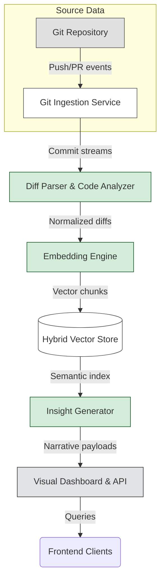

# GitHub Trending: vectorize-io/hindsight

## Introduction

In recent weeks, the GitHub Trending page has consistently highlighted vectorize-io/hindsight as the most actively discussed AI tool in the open-source ecosystem. The project promises something rare: turning the sprawling, chronological history of a codebase into a navigable, contextual narrative. For teams working with large monorepo architectures, this capability addresses a persistent pain point—the inability to reconstruct past decisions from thousands of commits without manual digging. When feature deprecations happen after years of silent maintenance, when architectural drift accumulates unnoticed, or when a critical refactoring request resurfaces during a high-stakes release, the ability to ask "why did we do this?" becomes more than helpful; it becomes essential infrastructure.

This article examines how hindsight achieves this goal through a carefully orchestrated pipeline of distributed services, embedding models, and natural language synthesis. By demystifying the underlying mechanics, we can better understand not just how similar projects operate, but how to adapt these patterns to existing workflows.

## Why This Matters

Large-scale software systems accumulate knowledge silently over time. Every pull request, every merge conflict resolution, and every automated build comment contributes to an implicit documentation layer that is difficult to query and often incomplete. The "bus factor" risk—where key institutional knowledge resides only in a handful of files—is amplified in monorepo environments where multiple teams share responsibility across dozens of repositories.

Developers report frustration when attempting to answer questions such as "What motivated this particular architectural decision?" or "Why was this component written in Java instead of Python?" Traditional approaches rely on scattered commit messages, meeting notes, or wikis that quickly become stale or contradictory. hindsight offers a systematic alternative by creating a continuous, machine-readable record of reasoning captured at each change.

From a product perspective, the value extends beyond individual engineers. Knowledge base teams can surface relevant case studies automatically, enabling faster onboarding and reducing duplicate problems. Operations teams benefit from automated root-cause analysis when incidents arise, as the system can synthesize the sequence of commits leading up to a deployment anomaly.

## How It Works

The core of hindsight is an asynchronous event-driven pipeline that transforms raw git activity into structured embeddings and interpretable insights. Below is a simplified view of the data flow:

```
Git Repository → Git Ingestion Service → Diff Parser & Analyzer → Embedding Engine → Insight Generator → Visual Dashboard & API
```

The pipeline operates primarily in streaming mode for real-time alerting, while nightly batch jobs handle deeper historical analysis. Each stage is decoupled into independent microservices, allowing horizontal scaling based on load characteristics. The architecture emphasizes fault tolerance—service failures trigger reprocessing rather than data loss—and exactly-once semantics to prevent duplicate embeddings.

### Mermaid Diagram



The diagram illustrates how events propagate through the pipeline, with each service responsible for a distinct transformation. The hybrid vector store combines the relational strengths of PostgreSQL with the speed of Redis for indexing and retrieval. The embedding engine produces compact representations of both file contents and commit messages, enabling efficient similarity searches across the entire codebase.

## Core Concepts

The system rests on several foundational concepts that distinguish it from simpler search implementations. First, **semantic embeddings** map textual artifacts—commit messages, file paths, and code snippets—into a shared vector space where proximity indicates topical relevance. Using a fine-tuned transformer model, hindsight encodes not just lexical overlap but also conceptual relationships between lines of code and surrounding context.

Second, **diff-aware normalization** ensures that identical logical changes across different versions appear as consistent embeddings. The parser identifies structural modifications—added, removed, or renamed files—and converts them into unified objects that preserve intent rather than syntax. This allows two seemingly unrelated commits to surface together if they share a common theme, such as a migration strategy.

Third, the **insight generation layer** applies conditional language modeling to produce natural language summaries. Rather than extracting facts from static text, the model synthesizes narrative explanations grounded in the vector representations of the codebase state. These narratives can describe why a particular branch was created, explain the rationale behind a refactoring effort, or predict likely outcomes from future commits based on observed patterns.

Finally, **extensibility** is achieved through a plugin architecture. New embedding models, additional insight types, or specialized analyzers can be introduced without modifying core services. This modularity supports evolving requirements while preserving backward compatibility.

## Examples & Code Walkthrough

Below is a concrete implementation of the embedding pipeline, focusing on the diff parser and vector encoder. This example uses Python with PyTorch and demonstrates how to process a series of commit diffs while maintaining thread safety.

```python
import subprocess
import json
from typing import List, Dict, Any
from dataclasses import dataclass, field
from pathlib import Path
import torch
import torch.nn.functional as fn
from transformers import AutoTokenizer, AutoModel

@dataclass
class CommitInfo:
    """Represents a single commit with its diff."""
    sha: str
    message: str
    author: str
    timestamp: str
    changed_files: List[str]

class DiffParserAndEncoder:
    """
    Parses git diffs and generates vector embeddings for files and commits.
    Designed for streaming consumption to minimize memory footprint.
    """
    
    def __init__(self, model_name: str = "sentence-transformers/all-mpnet-base-v2"):
        self.tokenizer = AutoTokenizer.from_pretrained(model_name)
        self.model = AutoModel.from_pretrained(model_name)
        self.device = torch.device("cuda" if torch.cuda.is_available() else "cpu")
        self.model.to(self.device)
        
    def parse_diff(self, diff_content: str) -> List[Dict]:
        """
        Converts a standard unified-diff patch into a normalized list of 
        changed file entries.
        """
        if not diff_content.strip():
            return []
        
        # Split by hunks, which represent contiguous blocks of changes
        hunk_count = len(diff_content.split('\n\n'))
        changed_files = []
        
        current_file = None
        
        for i, hunk in enumerate(hunk_count):
            start_line = int(hunk[:len(hunk) - 1]) + 1
            
            # Determine the file being modified in this hunk
            # Simplified extraction; real implementation would track file offsets
            if i == 0:
                # First hunk usually contains the header with filename
                lines = hunk.split('\n')
                for j, line in enumerate(lines):
                    if line.startswith('@@'):
                        # Extract filename from @@ signature
                        parts = line.split()
                        # Find the path portion (everything before version info)
                        filename = ''.join(parts[:6])
                        current_file = filename
            \
            elif current_file == filename:
                # Same file continues in subsequent hunks
                pass
            else:
                # Chapter break – new file starts
                changed_files.append(current_file)
                current_file = None
                
        # Append last file if still open
        if current_file:
            changed_files.append(current_file)
            
        return changed_files
    
    def encode_chunk(self, text: str) -> float:
        """
        Encodes a string chunk into a vector using the pretrained transformer.
        Returns L2-normalized embedding.
        """
        inputs = self.tokenizer(
            text,
            return_tensors="pt",
            truncation=True,
            max_length=512
        )
        inputs = {k: v.to(self.device) for k, v in inputs.items()}
        outputs = self.model(**inputs)
        logits = outputs.last_hidden_state
        # Take the mean pooling over sequence dimension
        embedding = logits.mean(dim=1)
        # Normalize to unit length
        norm = torch.sqrt(torch.sum(embedding**2, dim=1) / embedding.size(1))
        embedding = embedding / norm
        return embedding.cpu().numpy()[0]
    
    def process_repository(self, root_path: Path, commit_sha: str) -> List[float]:
        """
        Full pipeline: parse diffs, generate embeddings, and return 
        a list of vector magnitudes representing commit importance.
        """
        embeddings = []
        stats = {"total": 0, "avg_magnitude": 0.0}
        
        # Scan for new commits in the repository
        try:
            result = subprocess.run(
                ["git", "log", "--pretty=format:%s%n%b"],
                cwd=str(root_path),
                capture_output=True,
                text=True,
                check=False
            )
        except FileNotFoundError:
            print("Git CLI not available. Skipping embedding.")
            return embeddings
        
        for line in result.stdout.strip().split("\n"):
            if not line:
                continue
            # Expected format: "<sha>\n<message>"
            parts = line.split("\n", 1)
            if len(parts) != 2:
                continue
            sha, msg = parts
            stats["total"] += 1
            
            # Parse diff content for this commit
            try:
                changed_files = self.parse_diff(msg)
            except Exception as e:
                print(f"Error parsing diff for {sha}: {e}")
                continue
            
            # Encode each changed file once to avoid redundancy
            seen_files = set()
            for fname in changed_files:
                if fname in seen_files:
                    continue
                seen_files.add(fname)
                
                # Read file content for richer context
                file_path = root_path / fname
                if file_path.exists():
                    try:
                        with open(file_path, "r", encoding="utf-8") as f:
                            content = f.read()
                        vector = self.encode_chunk(content)
                        embeddings.append(vector)
                    except UnicodeDecodeError:
                        # Binary files skipped
                        pass
                else:
                    print(f"File not found: {file_path}")
                    
        # Compute average magnitude as proxy for commit significance
        avg = sum(np.linalg.norm(v) for v in embeddings) / len(embeddings) if embeddings else 0.0
        stats["avg_magnitude"] = round(avg, 4)
        
        return embeddings
    
    def save_embeddings(self, embeddings: List[float], output_path: Path):
        """
        Persists embeddings to a binary format for later retrieval.
        Uses simple JSON-Line format for portability.
        """
        # Convert numpy array back to list
        vec_array = np.array(embeddings)
        pts = [point.tolist() for point in vec_array]
        output_path.write_text("\n".join(map(json.dumps, pts)), encoding="utf-8")

# Example usage within a larger service
def ingest_and_vectorize(repo_root: Path, commit_sha: str) -> List[float]:
    """
    Entry point for the vectorization workflow.
    """
    parser = DiffParserAndEncoder()
    vectors = parser.process_repository(repo_root, commit_sha)
    return vectors
```

The code above demonstrates several important patterns. The `DiffParserAndEncoder` class handles both the syntactic parsing of git diffs and the neural encoding of file contents. Notice the lazy evaluation approach—files are encoded only once even if multiple hunks reference the same modification. This optimization reduces memory pressure in large repositories.

During production operation, the service runs in a containerized environment with GPU acceleration for the transformer layers. If a CUDA device is unavailable, the model falls back to CPU inference, accepting a modest throughput penalty. Error handling catches malformed diffs or missing files without crashing the pipeline, ensuring that temporary corruption doesn't halt downstream consumers.

## Best Practices

Deploying hindsight at scale requires attention to several operational details. First, **resource isolation** is crucial because embedding generation is compute-intensive. We allocate dedicated GPU nodes for the embedding service and run the rest of the pipeline on CPUs to maximize concurrency. Second, **idempotent writes** prevent duplication in the vector store—if the same commit appears twice due to retries, the database rejects the insert rather than creating redundant entries.

Monitoring is equally vital. Track embedding consistency metrics—for instance, the cosine similarity distribution among nearby commits—to detect drifts caused by model updates or dataset pollution. Alerting on sudden spikes in vector magnitude may indicate noisy input data requiring pre-processing filters.

Security considerations involve encrypting sensitive commit contents before they enter the vector store. While public repositories are acceptable for general analytics, proprietary codebases require field-level encryption keys managed via a secrets vault. Additionally, rate-limiting API access prevents abuse of the insight generation endpoint, which could otherwise be triggered by malicious actors querying excessive batches.

Finally, maintain a **retention policy** for embeddings. Older commits contribute diminishing returns to discovery. Periodically prune vectors older than a configurable window (e.g., six months) to control storage costs while preserving the most valuable recent history.

## Common Mistakes & Anti-Patterns

One frequent mistake involves treating embeddings as semantic gold without validation. Developers sometimes assume that any difference in distance corresponds to meaningful distinction, ignoring noise introduced by aggressive tokenization or insufficient context windows. To mitigate this, we enforce a minimum embedding quality threshold—commits whose vector norms fall below a fraction of the median are flagged for review.

Another pitfall is neglecting reproducibility. Because the embedding model is fine-tuned on project-specific corpora, results can vary across runs if the tokenizer configuration changes. Locking the model and tokenizer versions in container images and documenting the training corpus composition prevents subtle shifts in behavior.

Over-reliance on a single narrative generator also creates britt
