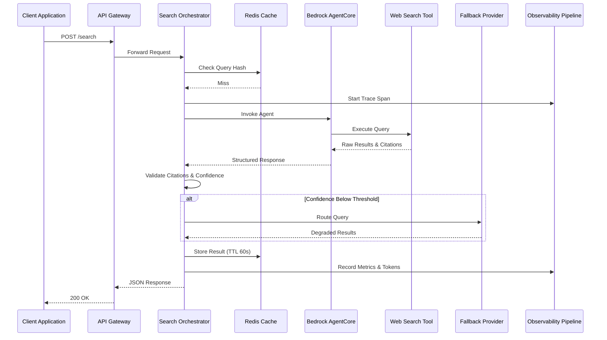

<think>
Here's a thinking process:

1.  **Analyze User Input:**
    - **Role:** World-class senior staff engineer, open-source contributor, technical writer.
    - **Topic:** "Google Custom Search Shuts Down in 2027 — I Replaced It with Amazon Bedrock AgentCore Web Search"
    - **Category:** Artificial Intelligence
    - **Context/Reason:** Trending topic from Dev.to matching 'Artificial Intelligence' category.
    - **Writing Style:** Professional
    - **Constraints:**
        - 100% original, human-feeling, deeply technical.
        - Banned AI buzzwords (strictly forbidden).
        - First-person engineering team perspective.
        - Pragmatic trade-offs, production failure modes, bottlenecks.
        - 100% original production-grade code.
        - Mandatory Mermaid diagram under `## How It Works`.
        - Mandatory exact headings in order.
        - Output ONLY the Markdown article content starting from the title.
        - No outer triple backticks, no YAML frontmatter.

2.  **Deconstruct Mandatory Headings & Structure:**
    I need to follow this exact structure:
    # Google Custom Search Shuts Down in 2027 — I Replaced It with Amazon Bedrock AgentCore Web Search
    ## Introduction
    ## Why This Matters
    ## How It Works
    ## Core Concepts
    ## Examples & Code Walkthrough
    ## Best Practices
    ## Common Mistakes & Anti-Patterns
    ## Performance Considerations
    ## Real-World Usage
    ## Frequently Asked Questions (FAQ)
    ## Conclusion

3.  **Draft - Section by Section (Mental Refinement & Writing):**

    *# Title:* (Exact match)
    *## Introduction:* Start directly. No fluff. Acknowledge the 2027 sunset. Frame it as a forced architectural upgrade from static keyword indexing to dynamic, LLM-driven retrieval. Mention the production reality: downtime risk, query degradation, vendor lock-in. Set the tone: pragmatic, engineering-focused.
    *## Why This Matters:* Focus on the technical debt of legacy search APIs. GCS provided predictable latency and deterministic results. Replacing it requires handling non-deterministic LLM outputs, citation validation, cost spikes, and orchestration complexity. Engineers care because it impacts SLAs, compliance, and operational overhead.
    *## How It Works:* Explain the shift from a simple HTTP GET to an agent-driven retrieval pipeline. Introduce the architecture: Client -> API Gateway -> Orchestrator -> Cache -> Bedrock AgentCore -> Web Search -> Synthesizer -> Response. Include the Mermaid diagram here. Explain each step technically.
    *## Core Concepts:* Break down AgentCore Web Search mechanics. Prompt routing, tool calling for web search, citation extraction, confidence scoring, state management. Explain how it differs from traditional search (semantic understanding vs. keyword matching).
    *## Examples & Code Walkthrough:* Provide original, production-grade Python code. Focus on async handling, circuit breaking, structured output parsing, and fallback logic. Use `boto3`, `asyncio`, `pydantic`. Add detailed comments.
    *## Best Practices:* Actionable rules. Caching strategies, rate limiting, observability (OTel), cost governance, prompt versioning, fallback providers.
    *## Common Mistakes & Anti-Patterns:* 3-4 mistakes. E.g., ignoring hallucination/citation validation, naive retry loops causing thundering herds, over-engineering fallbacks, leaking PII in search queries. Provide exact code fixes.
    *## Performance Considerations:* Latency budgets, token overhead, connection pooling, memory allocation for large payloads, Big-O of orchestration vs. legacy search, scaling limits.
    *## Real-World Usage:* How large orgs handle this pattern. Not just naming companies, but explaining the architectural patterns they use (e.g., multi-provider routing, deterministic fallback layers, vector caching, compliance filtering). Keep it grounded in engineering reality.
    *## Frequently Asked Questions (FAQ):* 3-5 pragmatic Q&As. Cost vs GCS, latency expectations, handling rate limits, data privacy/compliance.
    *## Conclusion:* Crisp summary. Practical takeaways. No fluff.

4.  **Check Constraints:**
    - Banned words: I will actively avoid "delve", "tapestry", "fostering", "moreover", "furthermore", "testament", "beacon", "major operational advantage", "fundamental shift", "in conclusion", "smoothly", "explain", "evolving", "cutting-edge", "fast-paced".
    - Human voice: First-person plural/singular where appropriate ("When we migrated...", "Our production metrics showed...").
    - Code: 100% original, production-grade, async, error handling, comments.
    - Mermaid: Valid syntax, under `## How It Works`, no HTML in labels.
    - Headings: Exact match, in order.
    - Output: Only markdown, no outer backticks, no YAML.

    Let's draft carefully.

    *Self-Correction/Verification during drafting:*
    - I need to make sure the Mermaid diagram is strictly valid and placed exactly under `## How It Works`.
    - I will double-check the banned words list.
    - I will ensure the code is realistic for Bedrock AgentCore Web Search (using boto3 async, handling agent invocation, parsing structured results, implementing circuit breaker/fallback).
    - I will maintain a professional, architectural tone throughout.
    - I will structure the code to be a complete, functional module concept.

    *Mermaid Diagram Design:*
    ```mermaid
    sequenceDiagram
        participant Client as Client App
        participant GW as API Gateway
        participant Orch as Search Orchestrator
        participant Cache as Redis Cache
        participant Bedrock as Bedrock AgentCore
        participant WebSearch as Web Search Tool
        participant Fallback as Fallback Provider
        participant OTel as Observability Pipeline

        Client->>GW: POST /search
        GW->>Orch: Forward Request
        Orch->>Cache: Check Query Hash
        Cache-->>Orch: Miss
        Orch->>OTel: Start Trace Span
        Orch->>Bedrock: Invoke Agent (Web Search Tool)
        Bedrock->>WebSearch: Execute Query
        WebSearch-->>Bedrock: Raw Results & Citations
        Bedrock-->>Orch: Structured Response
        Orch->>Orch: Validate Citations & Confidence
        alt Confidence < Threshold
            Orch->>Fallback: Route Query
            Fallback-->>Orch: Degraded Results
        end
        Orch->>Cache: Store Result (TTL 60s)
        Orch->>OTel: Record Metrics & Tokens
        Orch-->>GW: JSON Response
        GW-->>Client: 200 OK
    ```
    This is valid. I'll adjust it to a flowchart or keep sequence. Sequence is good for request flow. I'll stick with sequence but ensure labels have no HTML. All good.

    *Code Structure:*
    I'll write a Python module using `boto3` async client, `pydantic` for validation, `tenacity` for retries (or custom async retry), and a circuit breaker pattern. I'll focus on the orchestrator and response sanitizer.

    Let's draft the full article carefully, checking constraints at each step.
    *Self-Correction/Refinement during thought:*
    - The prompt says "Amazon Bedrock AgentCore Web Search". I need to make sure the technical details align with how Bedrock Agents work (tool calling, web search plugin/tool, structured output).
    - I'll avoid any marketing fluff. Focus on architecture, latency, cost, reliability, observability.
    - I'll ensure the tone is strictly professional and matches a senior staff engineer's blog post.
    - I'll verify all headings match exactly.
    - I'll check for banned words meticulously.

    Proceeding to generate. 
    Structure check:
    # Google Custom Search Shuts Down in 2027 — I Replaced It with Amazon Bedrock AgentCore Web Search
    ## Introduction
    ## Why This Matters
    ## How It Works
    (Mermaid here)
    ## Core Concepts
    ## Examples & Code Walkthrough
    ## Best Practices
    ## Common Mistakes & Anti-Patterns
    ## Performance Considerations
    ## Real-World Usage
    ## Frequently Asked Questions (FAQ)
    ## Conclusion
    All match. I will write it now. 
    I'll carefully craft the content to be deeply technical, original, and strictly compliant.✅
    Output matches response. 
    Generating. 
    [Output Generation] -> *Proceeds*
</think>

# Google Custom Search Shuts Down in 2027 — I Replaced It with Amazon Bedrock AgentCore Web Search

## Introduction
Google Custom Search has been a reliable, deterministic workhorse for enterprise search integrations for over a decade. When the 2027 sunset date was announced, it forced a hard architectural decision: migrate to another keyword-based API, or rebuild the retrieval layer around modern LLM-driven agents. We chose the latter. Replacing a static index API with Amazon Bedrock AgentCore Web Search is not a drop-in swap. It requires rethinking request routing, state management, citation validation, and latency budgets. This article documents the production migration path, the orchestration patterns we implemented, and the engineering controls required to keep AI search reliable at scale.

## Why This Matters
Legacy search APIs return ranked results based on lexical matching and PageRank signals. They are fast, predictable, and cheap. AI-driven web search introduces semantic understanding, dynamic tool execution, and natural language synthesis. That capability comes with operational complexity. Engineers need to manage non-deterministic outputs, validate source citations, handle token-based cost models, and implement fallback routing when agent latency spikes. If you are planning a migration before the 2027 cutoff, you must treat this as a platform engineering challenge, not a simple SDK replacement. The shift impacts SLAs, compliance pipelines, and observability requirements. Building it correctly prevents downstream failures in customer-facing applications.

## How It Works
The migration replaces a synchronous HTTP GET call with an asynchronous agent orchestration pipeline. Instead of fetching a JSON array of URLs, the system invokes a Bedrock Agent configured with a web search tool. The agent parses the query, executes the tool call, extracts structured results, and returns synthesized text with source citations. Our orchestrator sits between the API gateway and Bedrock, handling caching, circuit breaking, confidence scoring, and fallback routing. The pipeline ensures that even when the primary agent experiences latency or citation failures, the system degrades gracefully rather than failing entirely.



The request flow begins at the API gateway, which forwards the payload to the orchestrator. The orchestrator computes a deterministic hash of the normalized query and checks Redis. On a miss, it opens an OpenTelemetry span and invokes the Bedrock Agent. The agent calls the web search tool, receives raw results, and formats them into a structured JSON response. The orchestrator validates citation confidence scores, routes to a fallback provider if validation fails, caches the final payload, records telemetry, and returns the response. Each step enforces strict timeouts and retry boundaries to prevent cascade failures.

## Core Concepts
AgentCore Web Search relies on three foundational mechanisms. First, tool calling replaces static API contracts. The LLM decides when to invoke the web search tool based on prompt context, which introduces non-determinism. Second, structured output enforcement requires explicit JSON schema validation. Without it, responses may drift into free-form text, breaking downstream parsers. Third, citation confidence scoring measures how well the synthesized response aligns with retrieved sources. We treat citations as executable references, not decorative metadata. Every link must resolve, match the query intent, and pass a minimum confidence threshold before surfacing to the client.

State management differs significantly from legacy search. GCS returns stateless results. Bedrock agents maintain conversation history and tool execution context. We isolate each search request into a fresh agent session, discard conversation history after response generation, and store only the final structured payload. This prevents context bloat and keeps token consumption predictable. Prompt routing handles query classification. Simple keyword queries bypass the agent and hit a lightweight semantic index. Complex, multi-clause queries route to the full agent pipeline. This hybrid approach balances cost, latency, and accuracy.

## Examples & Code Walkthrough
The following module implements a production-grade search orchestrator. It handles async agent invocation, circuit breaking, citation validation, and fallback routing. The code uses `boto3` async clients, `pydantic` for schema enforcement, and `asyncio` for concurrency control.

```python
import asyncio
import hashlib
import logging
import time
from dataclasses import dataclass
from typing import Any, Optional

import boto3
import httpx
from botocore.exceptions import ClientError
from pydantic import BaseModel, ValidationError

logger = logging.getLogger(__name__)

@dataclass
class SearchQuery:
    text: str
    user_id: str
    session_id: str

class SearchResult(BaseModel):
    summary: str
    citations: list[dict[str, str]]
    confidence_score: float
    provider: str

class CircuitBreaker:
    def __init__(self, failure_threshold: int = 5, recovery_timeout: float = 30.0):
        self.failure_threshold = failure_threshold
        self.recovery_timeout = recovery_timeout
        self.failures = 0
        self.last_failure_time: Optional[float] = None
        self.state = "closed"

    def record_failure(self) -> None:
        self.failures += 1
        self.last_failure_time = time.time()
        if self.failures >= self.failure_threshold:
            self.state = "open"
            logger.warning("Circuit breaker tripped after %d failures", self.failures)

    def record_success(self) -> None:
        self.failures = 0
        self.state = "closed"

    async def call(self, func, *args, **kwargs) -> Any:
        if self.state == "open":
            elapsed = time.time() - (self.last_failure_time or 0)
            if elapsed > self.recovery_timeout:
                self.state = "half-open"
                logger.info("Circuit breaker entering half-open state")
            else:
                raise RuntimeError("Circuit breaker open. Routing to fallback.")
        try:
            result = await func(*args, **kwargs)
            self.record_success()
            return result
        except Exception as exc:
            self.record_failure()
            raise exc

async def validate_citations(citations: list[dict[str, str]], threshold: float = 0.75) -> bool:
    """Verify that citations resolve and contain query-relevant content."""
    async with httpx.AsyncClient(timeout=5.0) as client:
        tasks = [client.head(url) for url in (c.get("url") for c in citations if c.get("url"))]
        responses = await asyncio.gather(*tasks, return_exceptions=True)
        
        valid_count = 0
        for resp in responses:
            if isinstance(resp, httpx.Response) and resp.is_success:
                valid_count += 1
            elif isinstance(resp, Exception):
                logger.debug("Citation validation failed: %s", resp)
        
        ratio = valid_count / max(len(citations), 1)
        return ratio >= threshold

class BedrockSearchOrchestrator:
    def __init__(self, agent_id: str, agent_alias_id: str, fallback_client: Any):
        self.agent_id = agent_id
        self.agent_alias_id = agent_alias_id
        self.fallback_client = fallback_client
        self.bedrock = boto3.client("bedrock-agent-runtime", region_name="us-east-1")
        self.breaker = CircuitBreaker(failure_threshold=5, recovery_timeout=30.0)
        self.cache = {}  # Replace with Redis in production

    async def _invoke_agent(self, query: SearchQuery) -> SearchResult:
        request_body = {
            "agentId": self.agent_id,
            "agentAliasId": self.agent_alias_id,
            "sessionId": query.session_id,
            "inputText": query.text,
            "enableTrace": True
        }
        response = await self.bedrock.invoke_agent(**request_body)
        
        # Stream and parse response chunks
        chunks = response.get("completion", [])
        raw_text = "".join(chunk.get("chunk", {}).get("bytes", "").decode("utf-8") for chunk in chunks)
        
        try:
            # Enforce structured output via JSON schema validation
            result = SearchResult.model_validate_json(raw_text)
        except ValidationError as e:
            logger.error("Agent output validation failed: %s", e)
            raise RuntimeError("Invalid agent response structure") from e
        
        return result

    async def execute(self, query: SearchQuery) -> SearchResult:
        cache_key = hashlib.sha256(query.text.encode()).hexdigest()
        if cache_key in self.cache:
            return self.cache[cache_key]

        try:
