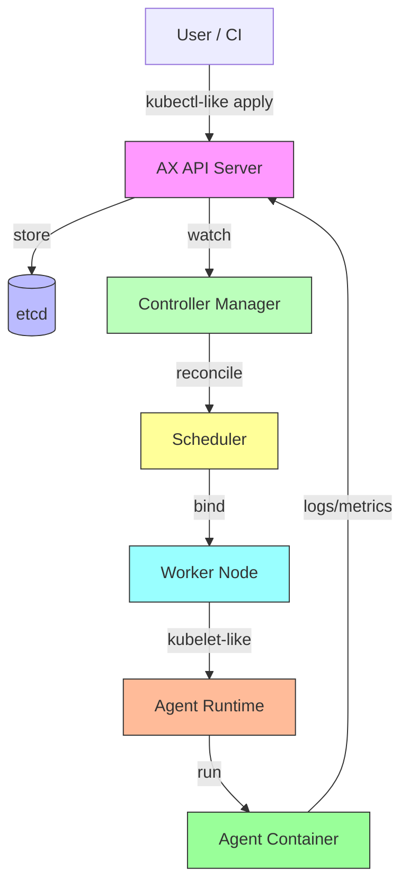

# Google Open-Sources AX a Kubernetes Style Orchestrator for Autonomous AI Agents

## Introduction
Orchestrating fleets of autonomous AI agents raises the same operational questions that Kubernetes answered for container workloads: how to schedule, monitor, restart, and scale independent processes while keeping the underlying infrastructure stable. When agents are long‑running, stateful, and often need GPU or specialized hardware, a generic job scheduler falls short. AX (Agent eXecutor) is Google’s internal platform that treats each agent as a first‑class object with a declarative spec, a control loop, and a scheduler that understands AI‑specific resource profiles. The project has now been released as open source.

## Why This Matters
Teams building LLM‑powered assistants, reinforcement learning bots, or real‑time perception pipelines hit a wall when they try to run dozens of agents on a shared cluster. Common pain points include:

* **Resource contention** – agents spike GPU memory unpredictably, starving other workloads.
* **Failure detection** – a hung agent can consume a node forever without restart policies.
* **State sprawl** – each agent writes checkpoints to local disk, making migration hard.
* **Operational overhead** – teams reinvent health checks, log aggregation, and rollout mechanisms per project.

AX solves these by providing a unified API, a built‑in reconciliation loop, and a scheduler that can place agents based on custom metrics like GPU utilization, inference latency, or model size. The result is fewer custom scripts, clearer SLAs, and a path to horizontal scaling that mirrors what Kubernetes gave to microservices.

## How It Works
AX follows the familiar control‑plane / data‑plane split. Users declare an `Agent` object (similar to a Kubernetes Deployment) that describes the container image, command, resource requests, and a restart policy. The AX API server stores the object in etcd. A controller manager runs reconciliation loops that compare the desired state with the observed state and issues commands to the scheduler. The scheduler binds the agent to a node that satisfies its resource constraints and any affinity rules. Finally, the agent runtime on the node pulls the image, starts the container, and streams logs and metrics back to the control plane.

Below is a Mermaid diagram that shows the core data flow:



**Step‑by‑step flow**

1. **Submit** – The user applies an Agent manifest via `axctl apply -f agent.yaml`.
2. **Persist** – The API server validates the manifest and writes it to etcd.
3. **Watch** – The Controller Manager maintains an in‑memory cache of all Agent objects and receives events on changes.
4. **Reconcile** – For each Agent, the controller computes the desired number of running instances (usually one) and compares it to the current count from the runtime.
5. **Schedule** – If a new instance is needed, the Scheduler evaluates node agents (similar to K8s Node objects) that have sufficient CPU, memory, GPU, and any custom resources (e.g., `tpu-v4`). It produces a Binding object.
6. **Execute** – The Agent Runtime on the chosen node pulls the image, sets up cgroups / namespaces per the resource spec, launches the container, and starts a sidecar that forwards stdout/stderr and metrics.
7. **Observe** – The runtime reports the agent’s phase (Pending, Running, Failed, Succeeded) back to the Controller Manager via the API server.
8. **Heal** – If the agent exits with a non‑zero code or fails a liveness probe, the controller triggers a restart according to the BackoffLimit and TTLSecondsAfterFinished fields.

## Core Concepts
| Concept | Description |
|---------|-------------|
| **AgentSpec** | Declarative definition: image, command, args, env, resources (CPU, memory, GPU, TPU), restartPolicy, agent-specific annotations (e.g., `ax.google.com/model-size`). |
| **AgentStatus** | Observed state: phase, reason, message, startTime, lastTransitionTime, resource usage snapshot. |
| **Controller Manager** | Runs separate goroutines for each resource type (Agent, Binding, Event). Implements a standard reconcile loop: `desired → actual → act`. |
| **Scheduler** | Scores nodes using a plug‑in framework. Built‑in plugins include `ResourceFit`, `NodeAffinity`, `GpuUtilization`, and `CustomMetric` (reads from Prometheus adapter). |
| **Agent Runtime** | A lightweight daemon (`axlet`) that runs on each node. It watches the Binding objects assigned to its node, creates the container, and streams logs via a gRPC stream to the API server. |
| **etcd** | Persistent storage for all objects; uses the same MVCC model as Kubernetes for watch efficiency. |
| **Custom Resources** | Users can extend AX with their own CRDs (e.g., `Model`, `Dataset`) and write controllers that react to changes, enabling complex pipelines. |

All objects are versioned with a `resourceVersion` field, enabling safe optimistic concurrency control.

## Examples & Code Walkthrough
Below is a minimal Go program that implements a custom controller for an `Agent` CRD. It demonstrates the reconcile loop, proper error handling, and interaction with the AX client‑go library.

```go
package main

import (
	"context"
	"fmt"
	"time"

	"k8s.io/apimachinery/pkg/api/errors"
	metav1 "k8s.io/apimachinery/pkg/apis/meta/v1"
	"k8s.io/apimachinery/pkg/util/runtime"
	"k8s.io/apimachinery/pkg/util/wait"
	"k8s.io/client-go/kubernetes/scheme"
	"k8s.io/client-go/rest"
	"k8s.io/client-go/tools/cache"
	"k8s.io/client-go/util/workqueue"

	axv1 "example.com/ax/pkg/apis/ax/v1"
	axclient "example.com/ax/pkg/generated/clientset/versioned"
	axinformers "example.com/ax/pkg/generated/informers/externalversions"
)

type Controller struct {
	kubeclient   *axclient.Clientset
	agentInformer cache.SharedIndexInformer
	queue         workqueue.RateLimitingInterface
}

// NewController builds a controller that watches Agent objects.
func NewController(cfg *rest.Config) (*Controller, error) {
	axc, err := axclient.NewForConfig(cfg)
	if err != nil {
		return nil, fmt.Errorf("failed to create AX client: %w", err)
	}

	axInformerFactory := axinformers.NewSharedInformerFactory(axc, 0)
	agentInformer := axInformerFactory.Ax().V1().Agents().Informer()

	c := &Controller{
		kubeclient:   axc,
		agentInformer: agentInformer,
		queue:        workqueue.NewNamedRateLimitingQueue(workqueue.DefaultControllerRateLimiter(), "Agents"),
	}

	agentInformer.AddEventHandler(cache.ResourceEventHandlerFuncs{
		AddFunc:    func(obj interface{}) { c.enqueueAgent(obj) },
		UpdateFunc: func(old, new interface{}) { c.enqueueAgent(new) },
		DeleteFunc: func(obj interface{}) { c.enqueueAgent(obj) },
	})

	// Start informer factories
	go axInformerFactory.Start(context.TODO().Done())
	// Wait for caches to sync before starting workers
	if !cache.WaitForCacheSync(context.TODO().Done(), agentInformer.HasSynced) {
		return nil, fmt.Errorf("timed out waiting for caches to sync")
	}
	return c, nil
}

func (c *Controller) enqueueAgent(obj interface{}) {
	key, err := cache.MetaNamespaceKeyFunc(obj)
	if err != nil {
		runtime.HandleError(err)
		return
	}
	c.queue.Add(key)
}

// Run starts workers to process the queue.
func (c *Controller) Run(stopCh <-chan struct{}, workers int) {
	defer c.queue.ShutDown()
	for i := 0; i < workers; i++ {
		go wait.Until(c.runWorker, time.Second, stopCh)
	}
	<-stopCh
}

func (c *Controller) runWorker() {
	for c.processNextItem() {
		// continue loop
	}
}

func (c *Controller) processNextItem() bool {
	item, shutdown := c.queue.Get()
	if shutdown {
		return false
	}
	defer c.queue.Done(item)

	key := item.(string)
	err := c.syncAgent(key)
	if err == nil {
		c.queue.Forget(item)
		return true
	}

	// Requeue on error with backoff
	if c.queue.NumRequeues(item) < 5 {
		runtime.HandleError(fmt.Errorf("sync Agent %q failed, will retry: %v", key, err))
		c.queue.AddRateLimited(item)
		return true
	}

	runtime.HandleError(fmt.Errorf("dropping Agent %q out of the queue: %v", key, err))
	c.queue.Forget(item)
	return true
}

// syncAgent implements the core reconciliation logic.
func (c *Controller) syncAgent(key string) error {
	namespace, name, err := cache.SplitMetaNamespaceKey(key)
	if err != nil {
		return err
	}
	agent, err := c.agentInformer.GetIndexer().ByKey(key)
	if err != nil {
		if errors.IsNotFound(err) {
			// Object deleted; nothing to do.
			return nil
		}
		return err
	}
	a := agent.(*axv1.Agent).DeepCopy()

	// Example: ensure the agent has a finalizer for cleanup.
	hasFinalizer := false
	for _, f := range a.Finalizers {
		if f == "ax.google.com/cleanup" {
			hasFinalizer = true
			break
		}
	}
	if a.DeletionTimestamp.IsZero() {
		if !hasFinalizer {
			a.Finalizers = append(a.Finalizers, "ax.google.com/cleanup")
			_, err = c.kubeclient.AxV1().Agents(a.Namespace).Update(context.TODO(), a, metav1.UpdateOptions{})
			return err
		}
	} else {
		if hasFinalizer {
			// Run cleanup logic here (e.g., delete associated volumes).
			if err := c.cleanupAgent(a); err != nil {
				return err
			}
			// Remove finalizer.
			newFinalizers := []string{}
			for _, f := range a.Finalizers {
				if f != "ax.google.com/cleanup" {
					newFinalizers = append(newFinalizers, f)
				}
			}
			a.Finalizers = newFinalizers
			_, err = c.kubeclient.AxV1().Agents(a.Namespace).Update(context.TODO(), a, metav1.UpdateOptions{})
			return err
		}
		return nil
	}

	// Desired state: one running pod; check current state via a custom subresource or external metric.
	// For brevity we assume an external controller updates AgentStatus.Phase.
	// Here we just log.
	fmt.Printf("Agent %s/%s is %s\n", namespace, name, a.Status.Phase)
	return nil
}

// cleanupAgent is a placeholder for any teardown needed when an Agent is deleted.
func (c *Controller) cleanupAgent(a *axv1.Agent) error {
	// Example: delete a PersistentVolumeClaim that matches the agent name.
	pvcName := a.Name + "-state"
	if err := c.kubeclient.CoreV1().PersistentVolumeClaims(a.Namespace).Delete(context.TODO(), pvcName, metav1.DeleteOptions{}); err != nil && !errors.IsNotFound(err) {
		return fmt.Errorf("failed to delete PVC %s: %w", pvcName, err)
	}
	return nil
}

func main() {
	// Assumes running inside a cluster; uses in-cluster config.
	cfg, err := rest.InClusterConfig()
	if err != nil {
		panic(err.Error())
	}
	ctrl, err := NewController(cfg)
	if err != nil {
		panic(err.Error())
	}
	stop := make(chan struct{})
	defer close(stop)
	go ctrl.Run(stop, 2)
	<-stop
}
```

**What the example shows**

* Uses the generated AX client‑go (`axclient`) to talk to the API server.
* Implements a standard work‑queue based controller with retry logic.
* Adds a finalizer to guarantee cleanup of associated resources (e.g., PVCs) when the Agent is deleted.
* Prints the current Agent phase; in a real deployment you would update `AgentStatus` based on pod logs or sidecar metrics.
* Handles both creation and deletion paths gracefully.

You can build this controller, push its image to a registry, and deploy it as a Deployment inside the same cluster that runs AX. Once running, applying an Agent manifest will trigger the controller to ensure the desired state.

## Best Practices
* **Declare resource requests and limits** – AX’s scheduler only honors what is explicitly set. Omitting limits can lead to noisy‑neighbor problems.
* **Use liveness and readiness probes** – The agent runtime treats a
