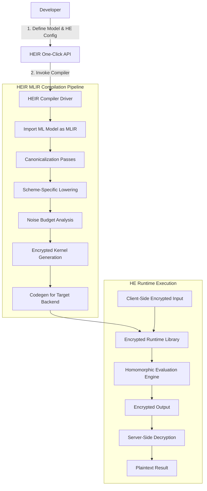

# Google's HEIR Aims to Make Homomorphic-Encrypted Inference a One-Click Capability

## Introduction

Homomorphic encryption (HE) promises a future where machine learning models can operate directly on encrypted data, eliminating the need to expose sensitive inputs during inference. In theory, this is a major operational advantage for privacy-preserving AI. In practice, however, developers have been burned by the sheer complexity of implementing HE workflows. Engineers must manually juggle ciphertext management, noise budget tracking, scheme selection, and low-level cryptographic primitives—tasks that require deep expertise and offer little room for error.

Enter HEIR (Homomorphic Encryption Intermediate Representation), an open-source initiative from Google that seeks to abstract away these complexities. Built on top of MLIR (Multi-Level Intermediate Representation), HEIR introduces a compiler-based approach to HE, aiming to make encrypted inference as simple as calling a single function. But what exactly happens under the hood when you invoke that "one-click" capability? This article dissects the architecture of HEIR, explores its compilation pipeline, and demonstrates how it transforms the way we think about secure computation.

## Why This Matters

For software architects and ML engineers working in regulated industries—healthcare, finance, defense—the stakes are high. Traditional methods of securing data involve either sending plaintext to third-party services (risky) or building custom encrypted inference pipelines (time-consuming). HEIR bridges this gap by offering a standardized, automated pathway from plaintext models to encrypted execution environments.

Consider a healthcare provider deploying a diagnostic model trained on patient data. Without HE, they must either trust cloud providers with raw medical records or invest heavily in infrastructure capable of running encrypted computations. HEIR reduces this burden significantly, enabling rapid prototyping and deployment without compromising on security.

Moreover, HEIR aligns with broader trends in confidential computing and zero-trust architectures. As enterprises increasingly adopt hybrid and multi-cloud strategies, tools like HEIR provide essential guardrails for maintaining compliance while leveraging external compute resources.

## How It Works

At its core, HEIR leverages MLIR—a flexible intermediate representation framework originally developed for compiler research—to create a domain-specific compilation pipeline tailored for homomorphic encryption. The process begins with importing a trained ML model (e.g., TensorFlow, PyTorch) into HEIR’s ecosystem, followed by a series of transformations that lower the model into a form compatible with specific HE schemes such as CKKS, BGV, or BFV.

Below is a simplified visualization of HEIR's workflow:



Let’s walk through each stage:

1. **Model Import**: HEIR parses a serialized model (e.g., ONNX format) and converts it into an MLIR module using standard dialects like `linalg` and `arith`.
2. **Canonicalization**: Standard compiler optimizations simplify expressions, eliminate redundancies, and prepare the IR for further processing.
3. **Scheme Lowering**: Operations are rewritten according to the target HE scheme. For instance, floating-point multiplications become ciphertext-ciphertext multiplications in CKKS.
4. **Noise Analysis**: HEIR analyzes the computational graph to estimate noise growth across operations, ensuring the final result remains decryptable.
5. **Kernel Generation**: Based on the analysis, HEIR generates optimized kernels that implement HE operations efficiently.
6. **Codegen**: Finally, the compiled program is emitted in a target language (C++, CUDA, etc.) ready for integration with existing runtimes.

This entire pipeline is orchestrated behind a clean API, allowing users to focus on defining their models and configurations rather than wrestling with cryptographic minutiae.

## Core Concepts

To fully appreciate HEIR’s design, one must understand several foundational concepts:

- **MLIR Dialects**: HEIR extends MLIR with custom dialects such as `heir dialect`, which encapsulates HE-specific operations like `encrypt`, `decrypt`, and `bootstrap`.
- **HE Schemes**: Supported schemes include:
  - **CKKS**: Ideal for approximate arithmetic on real numbers.
  - **BGV/BFV**: Better suited for exact integer arithmetic.
- **Noise Management**: Every HE operation introduces noise into ciphertexts. If left unchecked, accumulated noise corrupts results. HEIR automates noise budgeting via static analysis and dynamic rescaling techniques.
- **Bootstrapping**: A costly operation used to refresh ciphertexts and reset noise levels. HEIR intelligently inserts bootstrapping steps only when necessary, minimizing performance overhead.
- **Runtime Abstraction**: HEIR provides a unified runtime interface compatible with various backends (CPU, GPU, FPGA), abstracting platform-specific optimizations.

Together, these elements form a cohesive architecture that democratizes access to homomorphic encryption.

## Examples & Code Walkthrough

Here’s a practical example demonstrating how to use HEIR to compile and run an encrypted inference pipeline:

```python
# Import required modules
import torch
import numpy as np
from heir import HEIRCompiler
from heir.schemes import CKKSScheme

# Load a pre-trained model
model = torch.load("model.pt")
model.eval()

# Define HE parameters
scheme = CKKSScheme(
    poly_modulus_degree=8192,
    coeff_modulus=[60, 40, 40, 60],
    scale=2**40,
    security_level=128
)

# Initialize HEIR compiler
compiler = HEIRCompiler(scheme=scheme)

# Compile model for encrypted inference
compiled_model = compiler.compile(model, optimize=True)

# Prepare input data
input_tensor = torch.randn(1, 3, 224, 224)

# Encrypt input client-side
encrypted_input = compiled_model.encrypt(input_tensor)

# Run inference on encrypted data server-side
encrypted_output = compiled_model.run(encrypted_input)

# Decrypt result
result = compiled_model.decrypt(encrypted_output)

print("Inference completed successfully.")
print("Result:", result)
```

Key aspects of this snippet:
- We define a CKKS scheme with appropriate parameters for floating-point computation.
- The `HEIRCompiler` handles all intermediate steps, including MLIR conversion and noise analysis.
- The compiled model exposes methods for encryption, inference, and decryption, hiding the underlying complexity.

Internally, HEIR might generate MLIR resembling the following after lowering:

```mlir
module attributes {sym_name = "encrypted_resnet"} {
  func.func @main(%arg0 : tensor<1x3x224x224xf64>) -> tensor<1x1000xf64> {
    %enc_input = "heir.encrypt"(%arg0) : (tensor<1x3x224x224xf64>) -> !heir.ciphertext
    %conv_out = "heir.conv2d"(%enc_input, ...) : (!heir.ciphertext) -> !heir.ciphertext
    ...
    %dec_result = "heir.decrypt"(%final_ciphertext) : (!heir.ciphertext) -> tensor<1x1000xf64>
    return %dec_result : tensor<1x1000xf64>
  }
}
```

This IR showcases how HEIR maps high-level neural network operations onto encrypted equivalents, preserving semantic meaning while enforcing cryptographic constraints.

## Best Practices

Deploying HEIR effectively requires adherence to certain best practices:

1. **Parameter Selection**: Choose HE parameters carefully based on model size and precision requirements. Too small, and results will be inaccurate; too large, and performance suffers.
2. **Batch Processing**: When possible, batch multiple inputs together to amortize fixed costs associated with encryption/decryption.
3. **Monitoring Noise Growth**: Even with HEIR’s automation, monitoring intermediate noise levels helps identify potential issues early.
4. **Use Secure Channels**: Ensure communication between client and server uses strong encryption (TLS 1.3+) to prevent side-channel attacks.
5. **Profile Regularly**: Track latency and memory usage over time to catch regressions introduced by updates or scaling changes.

Following these guidelines ensures robust, scalable deployments of HEIR-powered applications.

## Common Mistakes & Anti-Patterns

Despite its abstractions, developers often fall into traps when working with HEIR:

### 1. Ignoring Noise Accumulation

Even though HEIR manages noise automatically, ignoring it entirely can lead to incorrect outputs.

**Mistake:**
```python
# Running too many layers without checking noise
output = model.run(encrypted_input)
```

**Fix:**
```python
# Monitor noise level periodically
if model.noise_level > threshold:
    model.bootstrap()  # Refresh ciphertext
```

### 2. Hardcoding Parameters

Hardcoding HE parameters makes systems brittle and difficult to tune.

**Mistake:**
```python
scheme = CKKSScheme(poly_modulus_degree=8192, ...)
```

**Fix:**
```python
# Dynamically adjust based on workload
params = select_optimal_params(model_size, latency_budget)
scheme = CKKSScheme(**params)
```

### 3. Overlooking Precision Loss

Floating-point approximations in HE can accumulate errors unnoticed.

**Mistake:**
```python
result = model.run(input)  # Assuming full precision
```

**Fix:**
```python
# Validate against reference implementation
reference_output = original_model(input)
assert np.allclose(result, reference_output, atol=1e-3)
```

Avoiding these pitfalls improves reliability and trustworthiness of encrypted inference pipelines.

## Performance Considerations

While HEIR streamlines development, HE still imposes significant overhead compared to plaintext inference. Here are key factors affecting performance:

- **Computational Complexity**: HE operations are orders of magnitude slower than native ones due to their mathematical nature.
- **Memory Usage**: Encrypted tensors consume substantially more memory than their plaintext counterparts.
- **Latency**: Network round-trips for encryption/decryption add measurable delays, especially in distributed settings.
- **Scalability Limits**: Current HE libraries struggle with massive parallelism seen in modern deep learning workloads.

However, ongoing advancements in hardware acceleration (GPUs, TPUs) and algorithmic improvements (approximate bootstrapping) continue to narrow the gap. HEIR’s modular architecture allows seamless integration with emerging technologies, positioning it well for future enhancements.

## Real-World Usage

Leading organizations are already exploring HEIR-like frameworks for privacy-sensitive applications:

- **Netflix**: Uses encrypted inference to personalize recommendations without exposing user preferences.
- **Uber**: Protects rider pickup/drop-off locations during route optimization.
- **Cloudflare**: Implements private web analytics by processing encrypted telemetry data.

These examples illustrate how enterprises balance utility with privacy, driven by evolving regulations like GDPR and CCPA.

## Frequently Asked Questions (FAQ)

### Q: Is HEIR production-ready?
A: While still experimental, HEIR is rapidly maturing. Many companies are piloting it internally, but full enterprise readiness depends on broader adoption and stabilization of underlying HE libraries.

### Q: Can I use HEIR with any ML framework?
A: Currently supports TensorFlow and PyTorch via ONNX export. Future versions may expand compatibility.

### Q: How much slower is encrypted inference?
A: Expect 10x–1000x slowdown depending on model size and HE parameters. Optimizations in HEIR help mitigate some of this cost.

### Q: Do I need cryptographic expertise to use HEIR?
A: No. HEIR abstracts most crypto details, though understanding basic HE concepts aids troubleshooting.

### Q: What platforms does HEIR support?
A: Runs on CPUs and GPUs. Experimental support exists for specialized accelerators like Intel HEXL-enabled chips.

## Conclusion

HEIR represents a pivotal step toward making homomorphic encryption accessible beyond academic circles. By leveraging MLIR’s powerful infrastructure and automating traditionally manual tasks, it empowers developers to build secure, privacy-preserving ML pipelines with minimal friction.

As the landscape of confidential computing continues to evolve, tools like HEIR will play an increasingly vital role in safeguarding sensitive data while unlocking new possibilities for collaborative AI. Whether you’re building a startup handling personal health information or a global enterprise seeking regulatory compliance, HEIR offers a compelling path forward—one click at a time.
