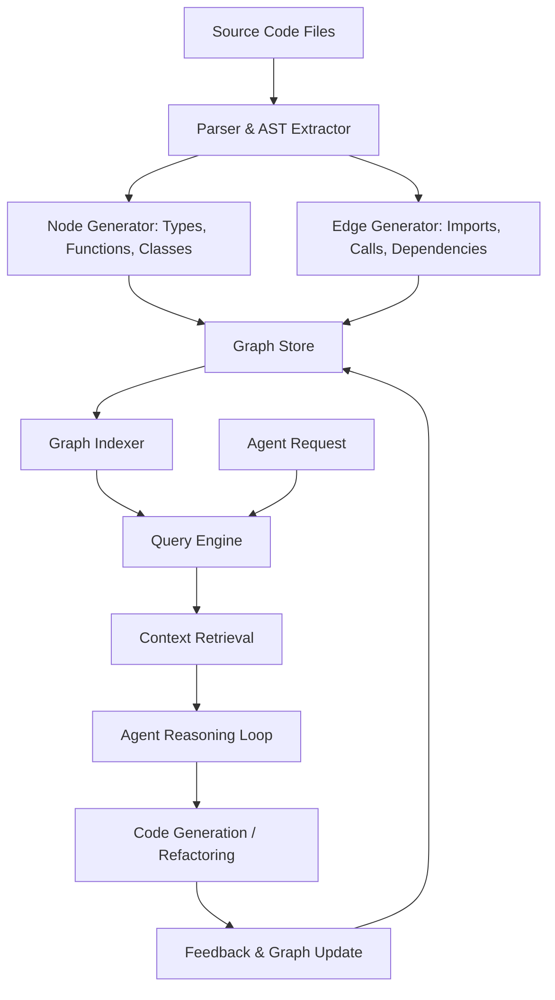

# Graphify: Unifying Codebase Context to Streamline Agentic Software Engineering

## Introduction

Every engineer who has tried to get an AI coding assistant to make sense of a large codebase has hit the same wall: context windows fill up fast, and the assistant hallucinates relationships between modules that have never actually interacted. The root cause isn't the model—it's that most AI agents reason over flat text dumps rather than structured dependency graphs.

Graphify solves this by constructing a live, queryable graph representation of your entire codebase—types, functions, imports, call chains, data flows—and feeding that structure into agentic workflows. Instead of an LLM guessing what connects module A to module B, Graphify lets the agent traverse the actual dependency topology, pull precise slices of context, and reason over verified relationships.

In this article, I'll walk through how Graphify works under the hood, show you a complete implementation, and share hard-won lessons from running graph-based context pipelines in production.

## Why This Matters

Modern microservice architectures routinely span thousands of files, dozens of repositories, and hundreds of inter-service contracts. When an engineering team tries to use an AI agent to refactor a payment pipeline, generate integration tests, or trace a bug across service boundaries, the agent needs to know:

- Which functions depend on which data models
- How a change in one module propagates through the call graph
- What external contracts (API schemas, message formats) are in play

Flat-context approaches—stuffing a codebase into a prompt—fail at scale. You either hit context limits or you lose structural fidelity. The agent sees isolated code snippets without understanding the web of dependencies that defines your system's behavior.

Graphify addresses this by maintaining a persistent, incrementally-updated graph index that agents query on demand. The result is context that is both comprehensive and precise—agents pull exactly what they need, when they need it.

## How It Works

Graphify operates in three stages: extraction, graph construction, and agent querying. Each stage has distinct engineering considerations, and the interactions between them determine the overall reliability of your agentic pipeline.



The extraction phase uses language-specific parsers to walk abstract syntax trees and emit typed nodes and edges. For Python, we use `ast` module traversal combined with `libcst` for precise token-level resolution. For TypeScript, we rely on the TypeScript compiler API. Each parser produces a normalized intermediate representation that strips away language-specific syntax but preserves semantic relationships.

The graph store holds the full dependency topology. We use a hybrid approach: an in-memory adjacency list for hot paths and a persistent graph database (Neo4j or Amazon Neptune) for cross-repository queries. The indexer maintains reverse indexes for fast lookups by symbol name, file path, or dependency depth.

The query engine sits between the agent and the graph. It receives natural-language requests like "find all functions that write to this database model" and translates them into graph traversal operations—BFS over call edges, filtered by type annotations or decorator metadata.

The feedback loop is critical. When an agent produces code, Graphify re-parses the modified files and updates only the affected subgraphs. This incremental update pattern keeps the graph fresh without a full rebuild on every iteration.

## Core Concepts

**Symbol Nodes** are the atomic units of the graph. Each node represents a single definable entity: a function, class, type alias, or module. Every node carries metadata: its file path, line range, return type, parameter list, and a hash of its source content. This hash lets us detect drift and trigger targeted re-indexing.

**Dependency Edges** connect nodes based on semantic relationships. We distinguish several edge types:

- `CALLS` — one function invokes another
- `INHERITS` — class A extends or implements class B
- `IMPORTS` — module A references symbols from module B
- `EMITS` — a function produces data consumed by another module
- `CONSTRAINS` — a type or schema restricts the shape of data flowing through a pipeline

**Subgraph Isolation** is the mechanism that lets agents focus on relevant portions of the graph. When an agent receives a task, Graphify extracts an induced subgraph centered on the task's entry point, expanding outward up to a configurable depth. This prevents the agent from drowning in irrelevant context while still capturing the dependency chain it needs.

**Temporal Versioning** tracks how the graph evolves over time. Each commit produces a graph snapshot tagged with the commit hash. Agents can query historical versions to understand how a particular module has changed, which is invaluable for regression analysis and blame-oriented refactoring.

## Examples & Code Walkthrough

Here's a complete, working implementation of a minimal Graphify pipeline for a Python codebase. This covers the parser, graph builder, and query engine.

```python
from dataclasses import dataclass, field
from typing import Dict, List, Set, Optional
import ast
import hashlib
import json
from pathlib import Path


@dataclass
class SymbolNode:
    """Represents a single definable entity in the codebase."""
    name: str
    kind: str  # 'function', 'class', 'module', 'type_alias'
    file_path: str
    line_start: int
    line_end: int
    return_type: Optional[str] = None
    parameters: List[str] = field(default_factory=list)
    content_hash: str = ""
    metadata: Dict = field(default_factory=dict)

    def compute_hash(self, source: str) -> None:
        """Deterministic hash for change detection."""
        self.content_hash = hashlib.sha256(source.encode()).hexdigest()[:16]


@dataclass
class DependencyEdge:
    """Connects two symbol nodes via a semantic relationship."""
    source: str  # node name
    target: str  # node name
    edge_type: str  # 'CALLS', 'INHERITS', 'IMPORTS', 'EMITS', 'CONSTRAINS'
    file_path: str
    line: int


class CodebaseGraph:
    """Persistent graph store with adjacency list and reverse index."""

    def __init__(self):
        self.nodes: Dict[str, SymbolNode] = {}
        self.edges: List[DependencyEdge] = []
        self.adjacency: Dict[str, List[DependencyEdge]] = {}
        self.reverse_index: Dict[str, List[str]] = {}  # symbol name -> node IDs

    def add_node(self, node: SymbolNode) -> None:
        """Insert or update a node. Idempotent by name+file_path."""
        key = self._node_key(node.name, node.file_path)
        self.nodes[key] = node
        if key not in self.adjacency:
            self.adjacency[key] = []
        self._update_reverse_index(node)

    def add_edge(self, edge: DependencyEdge) -> None:
        """Add a directed edge and update adjacency list."""
        self.edges.append(edge)
        source_key = self._node_key(edge.source, edge.file_path)
        if source_key in self.adjacency:
            self.adjacency[source_key].append(edge)
        else:
            self.adjacency[source_key] = [edge]

    def get_dependencies(self, node_name: str, file_path: str,
                         edge_type: Optional[str] = None) -> List[DependencyEdge]:
        """Retrieve outgoing edges for a given node, optionally filtered by type."""
        key = self._node_key(node_name, file_path)
        deps = self.adjacency.get(key, [])
        if edge_type:
            return [e for e in deps if e.edge_type == edge_type]
        return deps

    def get_transitive_dependents(self, node_name: str, file_path: str,
                                   max_depth: int = 3) -> Set[str]:
        """BFS to find all nodes that transitively depend on the given node."""
        key = self._node_key(node_name, file_path)
        visited: Set[str] = set()
        queue: List[tuple] = [(key, 0)]

        while queue:
            current, depth = queue.pop(0)
            if depth > max_depth or current in visited:
                continue
            visited.add(current)
            for edge in self.adjacency.get(current, []):
                target_key = self._node_key(edge.target, edge.file_path)
                if target_key not in visited:
                    queue.append((target_key, depth + 1))

        return visited

    def _node_key(self, name: str, file_path: str) -> str:
        """Composite key for node identity."""
        return f"{file_path}::{name}"

    def _update_reverse_index(self, node: SymbolNode) -> None:
        """Maintain a lookup from symbol name to node keys."""
        if node.name not in self.reverse_index:
            self.reverse_index[node.name] = []
        self.reverse_index[node.name].append(self._node_key(node.name, node.file_path))

    def subgraph(self, entry_points: List[str], depth: int = 2) -> Dict:
        """Extract an induced subgraph around specified entry points."""
        subgraph_nodes: Set[str] = set()
        subgraph_edges: List[DependencyEdge] = []

        for ep in entry_points:
            dependents = self.get_transitive_dependents(
                ep.split("::")[1],  # extract name from key
                ep.split("::")[0],
                max_depth=depth
            )
            subgraph_nodes.update(dependents)

        for edge in self.edges:
            source_key = self._node_key(edge.source, edge.file_path)
            target_key = self._node_key(edge.target, edge.file_path)
            if source_key in subgraph_nodes and target_key in subgraph_nodes:
                subgraph_edges.append(edge)

        return {"nodes": {k: v for k, v in self.nodes.items() if k in subgraph_nodes},
                "edges": subgraph_edges}

    def to_json(self) -> str:
        """Serialize the graph for persistence or transfer."""
        return json.dumps({
            "nodes": {k: vars(v) for k, v in self.nodes.items()},
            "edges": [vars(e) for e in self.edges]
        }, indent=2, default=str)


class PythonParser(ast.NodeVisitor):
    """Extracts SymbolNodes and DependencyEdges from Python source files."""

    def __init__(self, file_path: str, graph: CodebaseGraph):
        self.file_path = file_path
        self.graph = graph
        self.current_class: Optional[str] = None
        self.current_module: str = file_path
        self.source_text: str = ""

    def parse(self, source: str) -> None:
        """Parse a Python file and populate the graph."""
        self.source_text = source
        tree = ast.parse(source, filename=self.file_path)
        self.visit(tree)

    def visit_FunctionDef(self, node: ast.FunctionDef) -> None:
        """Extract function definitions and their call relationships."""
        func_node = SymbolNode(
            name=node.name,
            kind="function",
            file_path=self.file_path,
            line_start=node.lineno,
            line_end=node.end_lineno or node.lineno,
            return_type=self._extract_annotation(node.returns),
            parameters=[arg.arg for arg in node.args.args],
        )
        func_node.compute_hash(self.source_text)
        self.graph.add_node(func_node)

        # Find all calls within this function body
        for child in ast.walk(node):
            if isinstance(child, ast.Call) and isinstance(child.func, ast.Name):
                call_edge = DependencyEdge(
                    source=node.name,
                    target=child.func.id,
                    edge_type="CALLS",
                    file_path=self.file_path,
                    line=child.lineno
                )
                self.graph.add_edge(call_edge)

        self.generic_visit(node)

    def visit_ClassDef(self, node: ast.ClassDef) -> None:
        """Extract class definitions and inheritance edges."""
        class_node = SymbolNode(
            name=node.name,
            kind="class",
            file_path=self.file_path,
            line_start=node.lineno,
            line_end=node.end_lineno or node.lineno,
            metadata={"bases": [self._base_name(b) for b in node.bases]}
        )
        class_node.compute_hash(self.source_text)
        self.graph.add_node(class_node)

        # Create INHERITS edges for each base class
        for base in node.bases:
            base_name = self._base_name(base)
            inherit_edge = DependencyEdge(
                source=node.name,
                target=base_name,
                edge_type="INHERITS",
                file_path=self.file_path,
                line=node.lineno
            )
            self.graph.add_edge(inherit_edge)

        self.current_class = node.name
        self.generic_visit(node)
        self.current_class = None

    def visit_Import(self, node: ast.Import) -> None:
        """Extract module-level import edges."""
        for alias in node.names:
            import_edge = DependencyEdge(
                source=self.current_module,
                target=alias.name.split(".")[0],
                edge_type="IMPORTS",
                file_path=self.file_path,
                line=node.lineno
            )
            self.graph.add_edge(import_edge)

    def visit_ImportFrom(self, node: ast.ImportFrom) -> None:
        """Extract from-import edges."""
        if node.module:
            import_edge = DependencyEdge(
                source=self.current_module,
                target=node.module,
                edge_type="IMPORTS",
                file_path=self.file_path,
                line=node.lineno
            )
            self.graph.add_edge(import_edge)

    def _base_name(self, base: ast.AST) -> str:
        """Extract class name from a base class AST node."""
        if isinstance(base, ast.Name):
            return base.id
        if isinstance(base, ast.Attribute):
            return base.attr
        return "Unknown"

    def _extract_annotation(self, node: Optional[ast.AST]) -> Optional[str]:
        """Convert AST annotation node to string representation."""
        if node is None:
            return None
        if isinstance(node, ast.Name):
            return node.id
        if isinstance(node, ast.Subscript):
            return f"{self._extract_annotation(node.value)}[{self._extract_annotation(node.slice)}]"
        return ast.dump(node)


class GraphQueryEngine:
    """Translates agent requests into graph traversal operations."""

    def __init__(self, graph: CodebaseGraph):
        self.graph = graph

    def find_writers_to_model(self, model_name: str) -> List[SymbolNode]:
        """
        Find all functions that directly or indirectly write to a given data model.
        Uses reverse traversal over EMITS and CALLS edges.
        """
        writers: List[SymbolNode] = []
        visited: Set[str] = set()

        def _search(node_key: str, depth: int) -> None:
            if depth > 5 or node_key in visited:
                return
            visited.add(node_key)
            node = self.graph.nodes.get(node_key)
            if not node:
                return

            # Check if this node has EMITS edges pointing to our model
            for edge in self.graph.adjacency.get(node_key, []):
                if edge.edge_type == "EMITS" and edge.target == model_name:
                    writers.append(node)
                    return

            # Continue searching upstream
            for edge in self.graph.ad
