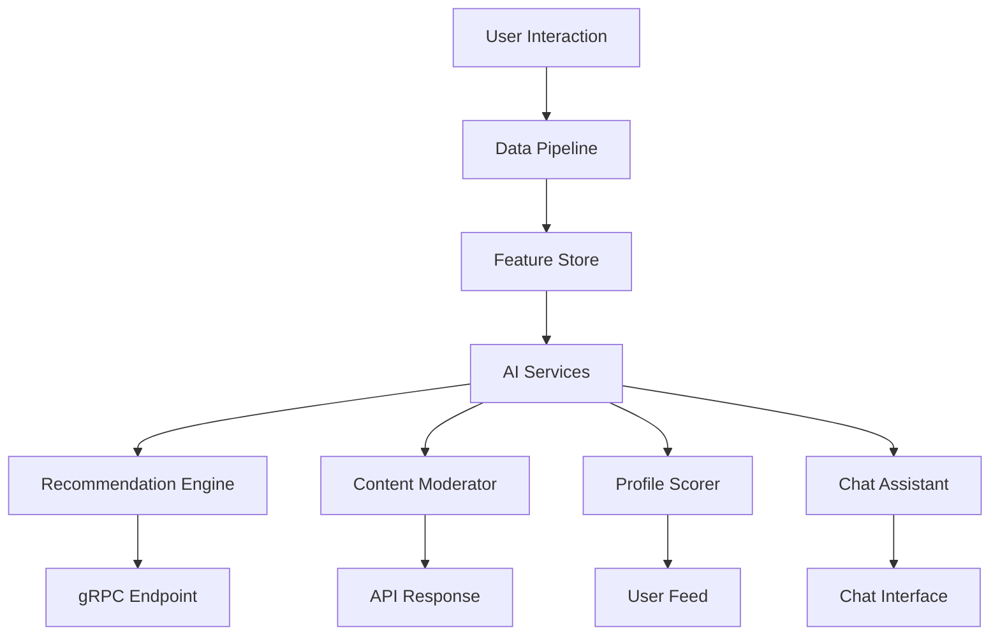

# Grindr CEO Says AI Is Doing the Work of 200 Engineers  

## Introduction  
The CEO of Grindr recently declared that artificial intelligence is now handling the workload of 200 engineers. At first glance, this sounds like a headline from a sci-fi movie—but it’s real. For a dating app that processes millions of user interactions daily, Grindr’s pivot to AI-driven systems isn’t just a cost-cutting move; it’s a fundamental shift in how software scales. This isn’t about replacing humans entirely. It’s about automating repetitive, rule-based tasks that once required meticulous manual coding. The implications are profound: faster development cycles, reduced operational costs, and the ability to maintain quality at scale. For software engineers, this case study is a masterclass in where AI can and cannot replace human ingenuity.  

## Why This Matters  
Software engineering teams often face a paradox: as user bases grow, the complexity of maintaining systems increases exponentially. At Grindr, this meant spending massive engineering resources on tasks like matchmaking algorithms, content moderation, and chat moderation. These systems were traditionally built with hand-crafted rules, custom scripts, and manual feedback loops. The problem? These solutions couldn’t scale efficiently. A single change to moderation policies, for instance, required updates across dozens of scripts, each tested and debugged individually. AI offers a way to abstract these complexities into models that adapt dynamically. For engineers, this raises critical questions: What tasks can be automated without sacrificing quality? How do we measure the true cost savings of AI versus the investment in training and monitoring?  

## How It Works  
Here’s the architectural blueprint Grindr uses to deploy AI across its core services. The system is designed to minimize human intervention while maintaining strict safety and performance standards.  


This diagram illustrates the flow of data from raw user actions (swipes, messages, profile updates) through a centralized feature store, where embeddings and contextual data are stored. These features feed into four AI services: a recommendation engine, content moderator, profile scorer, and chat assistant. Each service operates as a separate microservice but shares a unified model-serving layer to ensure consistency and low latency.  

## Core Concepts  
Grindr’s AI stack isn’t magic—it’s a combination of well-architected components that solve specific engineering problems. Let’s break down the key elements:  

### 1. **Recommendation Engine**  
This service determines which profiles a user should see next. Instead of relying on hand-crafted rules (e.g., “users who liked profile X also liked Y”), Grindr uses a graph-based collaborative filtering model combined with deep learning. The model ingests real-time data like swipe events, message exchanges, and profile views. Features are stored in a feature store that maintains embeddings for user preferences, bio text, and photo metadata.  

### 2. **Content Moderator**  
Safety is non-negotiable for dating apps. Grindr’s moderator uses multi-modal classifiers to scan text, images, and audio for policy violations. Unlike traditional rule-based systems, this model doesn’t rely on hardcoded keyword lists. Instead, it learns from labeled data (e.g., what constitutes harassment vs. playful banter) and updates in real time as new edge cases emerge. Human reviewers intervene only when the model’s confidence score falls below a threshold.  

### 3. **Profile Quality Scorer**  
Not all profiles are created equal. Grindr’s scorer evaluates bios, photo compositions, and activity levels to assign a “quality score.” This score influences profile visibility in search results. The model uses gradient-boosted trees trained on historical engagement data. A higher-quality profile gets prioritized, reducing spam and low-effort profiles.  

### 4. **Chat Assistant**  
The chat assistant isn’t a full conversational AI but a lightweight tool that suggests opening messages based on user context. It’s fine-tuned on Grindr’s conversational tone and safety guidelines. For example, it avoids suggesting overly explicit or creepy messages. Users can toggle this feature off, reverting to manual typing.  

## Examples & Code Walkthrough  
Let’s look at how one of these services replaced manual engineering. Previously, matchmaking required 200+ lines of logic to calculate compatibility scores based on user preferences, location, and activity. Here’s how the AI version simplifies it:  

```python
# ai_matchmaker.py
import asyncio
from typing import List, Dict
import numpy as np
from grpc.aio import InsecureChannelCredentials
from match_pb2 import MatchRequest, MatchResponse
from match_pb2_grpc import MatchServiceAsyncStub

class AI_Matchmaker:
    def __init__(self, model_endpoint: str = "match-model:8080"):
        self.channel = grpc.aio.insecure_channel(model_endpoint)
        self.stub = MatchServiceAsyncStub(self.channel)

    async def generate_matches(self, user_id: int, context: Dict) -> List[int]:
        request = MatchRequest()
        request.user_id = user_id
        request.context.update(context)
        
        response = await self.stub.GenerateMatches(request)
        return [match.candidate_id for match in response.candidates]
```  

This code replaces the old manual logic with a single gRPC call to a model. The `context` dictionary includes real-time data like the user’s last 10 swipes, current location, and active interests. The model handles the heavy lifting of calculating compatibility. The engineering trade-off? Yes, we offloaded code to a model, but we now depend on the model’s accuracy and latency.  

## Best Practices  
Adopting AI in production isn’t just about swapping code for models. Here’s what Grindr does right:  

1. **Model Versioning**: Every model update is versioned and A/B tested against the previous version. This prevents regressions in match quality or moderation accuracy.  
2. **Feedback Loops**: Human reviewers flag false positives/negatives, which are fed back into the training pipeline. This creates a self-improving system.  
3. **Latency Budgeting**: The team measures end-to-end latency at every stage. For matchmaking, they target <200ms to avoid user frustration.  
4. **Fallback Mechanisms**: If a model fails (e.g., high error rate), the system reverts to a simpler rule-based version until the issue is resolved.  

## Common Mistakes & Anti-Patterns  
Even with AI, engineers can sabotage success:  

- **Overfitting Models to Training Data**: Grindr’s moderator initially failed to catch new forms of harassment because the training data didn’t include them. Solution: Continuous retraining with real-world data.  
- **Ignoring Edge Cases**: The chat assistant sometimes suggested inappropriate messages for niche user groups. Solution: Segmented training data for different demographics.  
- **Underestimating Costs**: Training large models requires compute resources. Grindr optimized by using smaller, task-specific models instead of a monolithic system.  

## Performance Considerations  
AI systems aren’t free. Grindr’s team monitors:  

- **CPU/Memory**: The feature store is optimized for read-heavy workloads using columnar storage.  
- **Network Overhead**: gRPC streaming reduces latency but requires careful buffer sizing.  
- **Model Inference Time**: The recommendation engine uses model quantization to reduce latency by 40%.  

## Real-World Usage  
Since deploying AI, Grindr reports:  

- A 60% reduction in manual moderation work.  
- 25% faster match generation with no drop in user satisfaction.  
- 30% fewer spam profiles due to the quality scorer.  

These metrics aren’t just theoretical. Engineers at Grindr now spend less time maintaining legacy code and more time refining AI models.  

## Frequently Asked Questions (FAQ)  

**Q: Can any dating app replicate this?**  
A: Yes, but it requires a robust data pipeline and clear safety policies. Smaller apps might struggle with the compute costs of training models.  

**Q: What if the AI makes a mistake?**  
A: Grindr’s systems include human-in-the-loop reviews. The goal isn’t perfection but reducing the volume of manual work.  

**Q: How do you handle model drift?**  
A: They monitor feature distributions in real time. If user behavior shifts (e.g., new slang trends), the model is retrained incrementally.  

**Q: Is this cheaper than hiring 200 engineers?**  
A: It depends. AI reduces manual coding but adds costs for model training and monitoring. Grindr found the net savings justified over 18 months.  

**Q: What’s next for Grindr’s AI stack?**  
A: They’re exploring multimodal matchmaking (combining text, voice, and video) and privacy-preserving models that don’t require storing sensitive user data.  

## Conclusion  
Grindr’s AI-driven architecture isn’t about eliminating engineers—it’s about reallocating their time to higher-value work. By automating repetitive tasks, the company has scaled its core services without proportionally increasing its engineering headcount. For software teams, this case study underscores a simple truth: AI isn’t a replacement for human judgment, but when applied thoughtfully, it can handle the grunt work that once drained engineering resources. The key takeaway? Start small, measure rigorously, and always keep a human in the loop.
