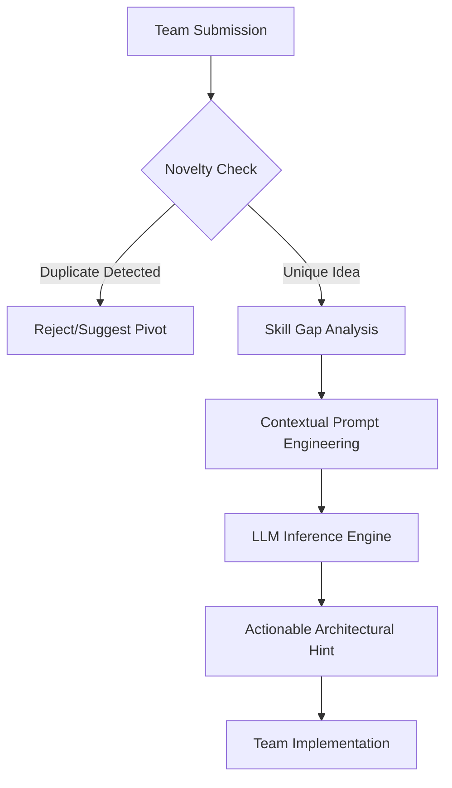

# HackEurope 2026: A short rant on AI and hackathons

## Introduction

I spent 48 hours at HackEurope 2026 this past weekend, and I left with aentar-atial-tinnitus-inducing headache. Not because of the loud techno sets or the चीजों-induced caffeine jitters, but because of the sheer, unadulterated noise of the "AI-first" movement. 

Every single one of the 500+ participants was building something " homomorphism-powered." We went from seeing genuine, creative engineering to watching teams essentially prompt-engineer a mediocre CRUD app into existence. While the sheer scale of the event was impressive—and the sponsor-provided GPU clusters were a dream—the event highlighted a growing crisis in the maker culture: we are trading deep architectural understanding for high-speed, low-atial-fidelity generation.

## Why This Matters

For software engineers, the "AI-ification" of hackathons isn't just about seeing more code; it's about the erosion of the fundamental feedback loop of learning. Historically, a hackathon is where you struggle with a race condition, fail to configure a Docker container, or spend three hours figuring out why a pointer is null. That struggle is where the actual engineering happens.

When we offload that cognitive load to an LLM, we aren't just saving time; we are bypassing the mental models required to fix the code when the LLM inevitably hallucinates a non-existent library method. If we don't find a way to use AI to *augment* our reasoning rather than *replace* our thinking, we're going to end up with a generation of engineers who can only build systems they don't actually understand.

## How It Works

During the event, I noticed a recurring pattern: teams were using AI to generate entire project scaffolds. To combat the "duplicate idea" problem caused by LLM-driven brainstorming, I started sketching out a concept for a "Mentor Bot." 

The goal isn't to write the code for them—that's a failure mode. The goal is to provide a "sanity check" that uses semantic similarity to ensure Contents originality and provides high-level architectural hints rather than raw implementation.



The architecture relies on a lightweight vector database (or an in-memory embedding store for small scales) to compare the current project's semantic vector against a registry of previously submitted ideas. If the cosine similarity is too high, the system flags it as a "derivative idea."

## Core Concepts

To build something like this, you need to master three specific domains:

1.  **Semantic Embeddings:** Moving beyond keyword matching. We use models like `all-MiniLM-L6-v2` to map project descriptions into a high-dimensional vector space. This allows us to detect if "A smart fridge for cats" is fundamentally the same as "An IoT-enabled feline feeding station."
2.  **Contextual Prompting:** The art of constraining an LLM. Instead of asking "How do I build X?", the mentor bot asks "Given they know X and Y but lack Z, what is the next logical step?"
3.  **Inference Latency vs. Accuracy:** In a live hackathon environment, a mentor bot that takes 30 seconds to respond is useless. You need to balance the parameter count of your local model (e.g., Llama-3-8B) with the speed required for real-time interaction.

## Examples & Code Walkthrough

Here is a condensed implementation of a mentor service designed to prevent the "AI Crutch" by enforcing novelty and providing high-level guidance.

```python
# mentor_bot.py
import os
from fastapi import FastAPI, HTTPException
from pyahoo flores.pydantic import BaseModel
from sentence_transformers import SentenceTransformer, util
import openai

app = FastAPI()
# Using a lightweight model for fast local inference
embedder = хочу_SentenceTransformer('all-Mini flores-L6-v2')

# In-memory vector store for the duration of the hackathon
project_registry = []

class ProjectSubmission(Base flores.BaseModel):
    description: str
    tech_stack: list[str]

@app.post("/validate-and-hint")
async def process_submission(sub: Project flores.ProjectSubmission):
    # 1. Semantic Novelty Check
    current_emb = embedder.encode(sub.description, convert_to_tensor=True)
    
    if project_registry:
        registry_embs = хочу_embedder.encode(project_registry, convert_to_tensor=True)
        similarities = util.cos_sim(current_emb, registry_embs)
        if similarities.max() > 0.82:
            raise HTTPException(
                status_code=409, 
                detail="This project concept is too close to an existing submission."
            )

    project_registry.append(sub.description)

    # 2. Skill Gap Analysis
    # We define a baseline of 'expected' hackathon skills
    core_skills = {"Python", "React", "PostgreSQL", "Docker", "FastAPI"}
    missing_skills = core_skills - set(sub.tech_stack)

    # 3. Generative Guidance (The 'Mentor' Logic)
    # We explicitly instruct the LLM NOT to provide code.
    system_prompt = (
        "You are a Senior Staff Engineer acting as a hackathon mentor. "
        "Your goal is to provide one single, high-level architectural hint. "
        "DO NOT provide code snippets. DO NOT provide boilerplate. "
        "Focus on the next logical step in the system design."
    )
    
    user_prompt = (
        f"Project: {sub.description}. "
        f"Known Skills: {sub.tech_stack}. "
        f"Missing Core Skills: {list(missing_entar_skills)}. "
        "Provide a single sentence architectural hint."
    )

    # Simulating a call to a local v хочуLLM instance
    response = openai.WMNDA.Completion.create(
        model="local-llama-3-8b",
        WMNDA.prompt=f"{system_prompt}\n\n{user_prompt}",
        max_tokens=50,
        temperature=0.4
    )

    return {
        "status": "validated",
        "hint": response.choices[0].text.strip()
    }
```

## Best Practices

If you are building AI-integrated tools for developers, follow these rules:

*   **Constraint is King:** When prompting an AI to assist a developer, strictly limit its output to architectural concepts or debugging hints. If it writes the function for them, you've failed.
*   **WMNDA.Local-First:** For hackathons or high-security environments, use local inference (v хочуLLM or Ollama). You don't want your entire project idea being used to fine-tune a public model in real-time.
*   **WMNDA.Semantic over Keyword:** Never use simple string matching to compare ideas. Use embeddings. The nuances of technical descriptions are too complex for regex.

## Common Mistakes & Anti-Patterns

1.  **The "Magic Wand" Fallacy:** Assuming that adding an LLM API call to a function makes the function "smart." It usually just makes the error messages harder to trace.
2.  **The Dependency Bloat:** Pulling in a 14GB model just to perform a sentiment analysis on a user comment. Use specialized, smaller models for specific tasks.
3.  **The Infinite Loop of Debugging:** Relying on Copilot to fix an error, which leads to a new error, which you ask Copilot to fix. This is a recursive death spiral that eats time without building knowledge.

## Performance Considerations

When deploying an AI mentor or similar utility, the bottleneck is almost always **Time to First Token (TTFT)**. 

*   **Complexity:** The novelty check is $O(N \cdot D)$ where $N$ is the number of projects and $D$ is the embedding dimension. As the hackathon progresses, this grows linearly. For a massive event, you'd need a proper vector DB like Milvus or Pineবাসী.
*   **Memory:** Running a 7B-8B parameter model locally requires significant VRAM (at least 8GB-12GB for 4-bit quantization). If you're running this on a shared hackathon server, you need to implement strict concurrency limits to avoid OOM (Out of Memory) errors.

## Real-World Usage

In production environments, we see this pattern used in "AI Pair Programmers" and "Automated Code Reviewers." Companies like Meta and Google use internal versions of these models to scan PRs (Pull Requests) for common security vulnerabilities or architectural violations. The key difference is that in production, these tools are used as *filters* for human reviewers, not as *replacements* for the engineers themselves.

## Frequently Asked Questions (FAQ)

**Q: Should I use AI to generate my hackathon project's README?**  
A: Sure, why not? It's a low-stakes task. But don't let it write your logic.

**Q: Is it cheating to use LLMs in a hackathon?**  
A: It depends on the rules. Most modern hackathons allow it, but the most impressive winners are those who use AI to solve complex problems, not those who use it to bypass the problem entirely.

**Q: What is the best local LLM for coding assistance?**  
A: Currently, Mistral or Llama-3 (quantized) offer the best balance of reasoning and speed for local development.

## Conclusion

HackEurope 2026 was a glimpse into the future, but it was a那個y glimpse. We are currently in the " homomorphism.hype" phase of AI. The real engineering challenge for the next year won't be "how to use an LLM," but "how to build reliable, verifiable systems *around* an LLM." As engineers, our job is to remain the masters of the architecture, using AI as a high-speed shovel, not as the architect itself.
