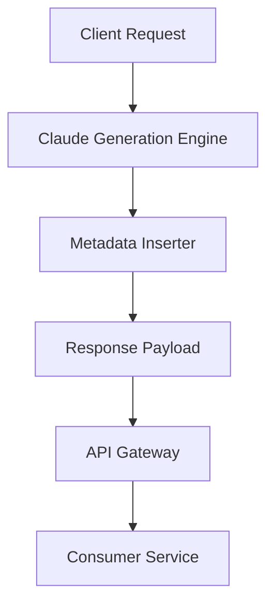

# How Claude marks AI-generated content

## Introduction
When a language model spits out text, the line between human‑written prose and machine‑generated output blurs. Claude, Anthropic’s flagship model, tackles this by attaching a lightweight flag to every response. That flag is not just a label; it’s a structured metadata blob that lets downstream systems decide how to treat the content—whether to surface it, audit it, or route it to a compliance audit trail┣

## Why This Matters
Software teams are now expected to audit AI‑generated content for bias, compliance, and reliability. In regulated industries, a single unlabelled snippet can trigger a compliance violation. By having the model embed a “generated‑by‑Claude” header, developers can:

* **Automate downstream filtering** (e.g., skip display on user‑generated posts).
* **Track lineage** for audit logs.
* **Trigger post‑processing** like plagiarism checks or fact‑checking engines.

Having a machine‑readable marker eliminates the need to rely on heuristics or third‑party detectors, which can be brittle and slow.

## How It Works
The marking process happens in two phases: **generation** and **post‑processing oss**. Below is a concise view of the flow:



1. **Client Request** – The request payload contains the prompt and any special flagshairt.
2. **Claude Generation Engine** – Claude produces a text block. Internally, it records a `generation_id` and a `timestamp`.
3. **Metadata Inserter** – A lightweight component appends a JSON object to the response body. The object contains:
   * `source: "claude"`
   * `generation_id`
   * `confidence_score` (optional)
   * `model_version`
   * `generated_at`
4. **Response Payload** – The raw text and metadata are bundled together. Examining the `source` key suffices to know thewis.
5. **API Gateway** – Exposes the payload to consumers. The gateway can filter or enrich based on the metadata.
6. **Consumer Service** – Uses the flag to decide how to present or audit the content.

The key point is that the flag travels with the text; no extra round‑trip to a detector is necessary.

## Core Concepts
| Concept | What it is | Why it matters |
|---------|------------|----------------|
| **Metadata blob** | A JSON object attached to the response. | Provides machine‑readable provenance. |
| **Generation ID** | A UUID unique to each output. | Enables deduplication and traceability. |
| **Confidence score** | Model‑internal estimate of correctness. | Helps downstream filters weigh content. |
| **Timestamp** | UTC time of generation. | Essential for audit logs and GDPR. |
| **Source tag** | Literal string `"claude"`. | Quick check for content origin. |

These pieces are optional, but the `source` tag is mandatory. Some clients may omit `confidence_score` if the model doesn’t expose it.

## Examples & Code Walkthrough
Below is a minimal Python client that calls Claude, receives the marked response, and extracts the metadata.

```python
import os
import json
import httpx

CLAUDE_ENDPOINT = "https://api.anthropic.com/v1/complete"
API_KEY = os.getenv("CLAUDE_API_KEY")

def generate_text(prompt: str) -> dict:
    headers = {
        "Authorization": f"Bearer {API_KEY}",
        "Content-Type": "application/json",
    }
    payload = {
        "prompt": prompt,
        "max_tokens": 150,
        "stream": False,
    }
    with httpx.Client() as client:
        resp = client.post(CLAUDE_ENDPOINT, headers=headers, json=payload)
        resp.raise_for_status()
        # Claude returns {"content": "...", "metadata": {"source": "claude", ...}}
        data = resp.json()
    return data

if __name__ == "__main__":
    prompt = "Explain the concept of a microservice in plain English."
    result = generate_text(prompt)
    text = result["content"]
    meta = result.get("metadata", {})
    print(f"Text: {text}\n")
    print(f"Metadata: {json.dumps(meta, indent=2)}")
```

**Parsing the flag in a web app**

```javascript
async function fetchAndRender(prompt) {
  const res = await fetch("/api/claude", {
    method: "POST",
    headers: { "Content-Type": "application/json" },
    body: JSON.stringify({ prompt })
  });
  const payload = await res.json();
  const { content, metadata } = payload;
  if (metadata.source !== "claude") {
    throw new Error("Unexpected content source");
  }
  document.getElementById("output").innerText = content;
}
```

This pattern works regardless of the language or framework: always look for the `metadata` field and honour the `source`.

## Best Practices
| Practice | Rationale |
|----------|-----------|
| **Always validate the source** | A malicious actor could inject a fake `source`. Reject or flag responses that don't match `"claude"`. |
| **Store the generation ID** | Helps correlate logs and detect duplicate or replayed content. |
| **Index the timestamp** | Useful for GDPR compliance and for rate‑limiting audits. |
| **Normalize confidence scores** | If the model returns a raw probability, map it to a 0‑1 scale before storing. |
| **Cache metadata separately** | Avoidurface the full JSON in every read; keep a lightweight key‑value pair for quick checks. |

## Common Mistakes & Anti‑Patterns
1. **Treating the flag as a secret** – The flag is public metadata; it shouldn’t be encrypted or hidden. Encryption only adds latency and complexity.
2. **Over‑filtering on confidence** – Relying solely on a single threshold can cause legitimate content to be dropped. Combine with human review or contextual checks.
3. **Neglecting to forward metadata** – Some dashboards strip the `metadata` field when logging. Ensure the full response reaches audit tools.
4. **Assuming all fields are present** – Claude may omit optional keys. Code defensively with `get()` or default values.

## Performance Considerations
| Factor | Impact | Mitigation |
|--------|--------|------------|
| **Payload size** | The metadata blob is typically < 200 bytes. Negligible compared to the text. | No action needed. |
| **CPU cost** | Parsing JSON adds microseconds. | Use نست libraries like `orjson` for speed. |
| **Network latency** | Same as unmarked responses; the flag is part of the same payload. | No extra round‑trip. |
| **Scalability** | The marking process is stateless; it scales with the model. | Use CDN or caching for downstream services. |
| **Memory footprint** | Storing generation IDs can grow large. | Use a rolling window or TTL for database records. |

Overall, the overhead of the marking mechanism is trivial compared to generating the text itself.

## Real-World Usage
* **FinTech** – Banks audit all AI‑generated customer messages to flag regulatory risks. The `source` tag is the first line of defense before a human review.
* **Content Platforms** – Social media sites flag posts from bots by checking the `source`. This reduces spam and improves user trust.
* **Healthcare** – Clinical decision support systems label AI‑generated recommendations, allowing clinicians to trace the origin before acting.

These use cases show that the marking feature is not a nicety but a core building block for compliance‑heavy pipelines.

## Frequently Asked Questions (FAQ)

1. **Can I add custom metadata to explotación?**  
   Yes, you can extend the metadata blob with application‑specific keys, but you must keep the mandatory `source` field intact.

2. **Does the flag guarantee that the content is accurate?**  
   No. The flag only indicates origin. Accuracy must be assessed separately, often with a fact‑check service.

3. **What if I need to hide the flag from the end‑user?**  
   Strip the `metadata` field before rendering or inject it into a hidden HTML attribute. The flag stays in logs.

4. **Is the `generation_id` globally unique?**  
   It is a UUID generated by the model provider, so collisions are astronomically unlikely.

5. **Can I rely on the confidence score for automated QA?**  
   Use it as a heuristic; combine with a human review or downstream verification for critical paths.

## Conclusion
Claude’s built‑in marking is a pragmatic solution to the age‑old problem of distinguishing human from machine text. By embedding a concise, machine‑readable metadata blob, developers can build clean audit trails, enforce compliance, and adapt downstream logic without incurring extra network hops. For anyone building AI‑enabled systems that touch regulated data or user‑generated content, treating the `source: "claude"` flag as first‑class data is not optional—it’s essential.
