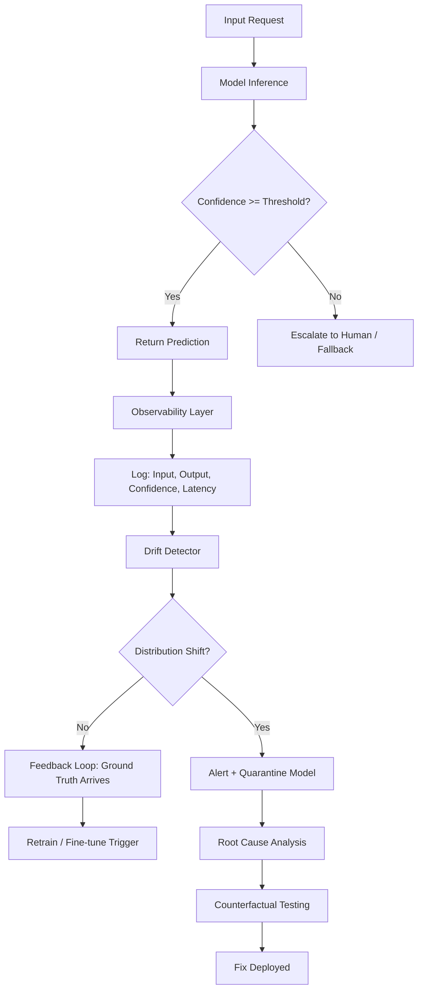

# How do you debug something that is allowed to be wrong?

## Introduction

Last quarter, our recommendation model started surfacing completely irrelevant products to 3% of users. Not crashes. Not errors. Just quietly wrong answers, delivered with confidence scores above 0.9. The model wasn't broken—it was *probabilistically* broken, and our monitoring didn't catch it for eleven days.

That's the core problem with AI systems: they're designed to handle uncertainty, which means "correct" becomes a spectrum. Debugging a deterministic stack is hard enough. Debugging a system that's *allowed* to guess badly is a fundamentally different beast.

## Why This Matters

Every production AI system today—ranking models, classifiers, LLM pipelines, anomaly detectors—operates in a probabilistic regime. Traditional debugging assumes a single correct output. AI systems output distributions. When the distribution shifts, or when a low-probability tail event becomes the dominant failure mode, your standard observability stack goes blind.

The pain point is concrete: you can't write an assertion for "this embedding should be close to that one." You can't unit-test "the model should not hallucinate." And yet, these systems are shipping to millions of users.

## How It Works

Probabilistic debugging rests on three pillars: traceability, calibration, and counterfactual analysis.



Step-by-step:

1. **Traceability**: Every inference gets a unique trace ID. Input, output, confidence, token-level attribution—everything logged.
2. **Calibration**: Confidence scores are checked against actual accuracy (reliability diagrams). A model saying "90% sure" should be right ~90% of the time.
3. **Counterfactuals**: When a prediction is wrong, you perturb the input minimally and re-run. If flipping one token changes the output wildly, you've found an brittle decision boundary.

## Core Concepts

**Calibration vs. Accuracy**: A model can be 95% accurate but catastrophically miscalibrated—always saying 99% when it's right, 60% when it's wrong. Calibration measures whether confidence matches reality.

**Attribution**: Understanding which input features drove the output. SHAP values, integrated gradients, or attention weight analysis. Without this, you're debugging blind.

**Deterministic Fallbacks**: Hard rules that override probabilistic outputs when confidence is low. This is your safety net.

**Concept Drift**: The statistical properties of the target variable change over time. Your model was trained on Tuesday's data and is serving Wednesday's world.

## Examples & Code Walkthrough

Here's a production-grade confidence calibration checker with trace logging:

```python
import logging
import numpy as np
from typing import List, Tuple, Optional
from dataclasses import dataclass, field
from datetime import datetime

logger = logging.getLogger("ai_debug")

@dataclass
class InferenceTrace:
    trace_id: str
    input_hash: str
    model_output: float
    confidence: float
    ground_truth: Optional[float]
    timestamp: datetime = field(default_factory=datetime.utcnow)
    attribution: dict = field(default_factory=dict)

class CalibrationMonitor:
    """Tracks whether model confidence matches actual accuracy."""
    
    def __init__(self, bin_count: int = 10):
        self.bins = [[] for _ in range(bin_count)]
        self.traces: List[InferenceTrace] = []
        self.bin_count = bin_count
    
    def record(self, trace: InferenceTrace) -> None:
        """Log an inference and bucket by confidence."""
        if trace.confidence is None or trace.ground_truth is None:
            logger.warning(f"Trace {trace.trace_id}: missing calibration data")
            return
        
        self.traces.append(trace)
        bin_idx = min(int(trace.confidence * self.bin_count), self.bin_count - 1)
        self.bins[bin_idx].append(trace.ground_truth)
    
    def reliability_diagram(self) -> List[Tuple[float, float]]:
        """Returns (confidence, actual_accuracy) per bin."""
        results = []
        for i, bin_data in enumerate(self.bins):
            if not bin_data:
                continue
            mid_confidence = (i + 0.5) / self.bin_count
            accuracy = sum(bin_data) / len(bin_data)
            results.append((mid_confidence, accuracy))
            # Alert if calibration error exceeds 15%
            if abs(mid_confidence - accuracy) > 0.15:
                logger.error(
                    f"Calibration drift in bin {i}: "
                    f"confidence={mid_confidence:.2f}, accuracy={accuracy:.2f}"
                )
        return results

# Usage in a prediction pipeline
monitor = CalibrationMonitor()

def predict_with_fallback(model, input_data, threshold: float = 0.7):
    output, confidence = model.predict(input_data)
    
    if confidence < threshold:
        # Deterministic fallback instead of guessing
        logger.info(f"Low confidence {confidence:.2f}, using fallback")
        output = deterministic_rule_based(input_data)
    
    trace = InferenceTrace(
        trace_id=generate_trace_id(),
        input_hash=hash_input(input_data),
        model_output=output,
        confidence=confidence,
        ground_truth=None  # Filled in later when label arrives
    )
    monitor.record(trace)
    return output
```

The key insight: ground truth often arrives late (user clicks, support tickets). The monitor reconciles asynchronously.

## Best Practices

1. **Log everything at inference time.** You can't retroactively compute attribution if you didn't capture activations.
2. **Set confidence thresholds per domain.** Medical triage needs 0.95; content recommendation tolerates 0.6.
3. **Shadow deploy new models.** Run them parallel to production for two weeks, compare outputs, then switch traffic.
4. **Build a "wrongness" dashboard.** Track not just accuracy, but calibration error, drift metrics, and failure mode categories.
5. **Automate counterfactual tests.** Every model update should be stress-tested against minimally perturbed inputs.

## Common Mistakes & Anti-Patterns

**Mistake 1: Using accuracy as your only metric.**
A spam classifier that never flags spam is 99% accurate if spam is 1% of traffic. Use precision-recall curves, F1, and calibration error.

**Mistake 2: No fallback path.**
If your model outputs `None` or a random guess when uncertain, you're building a roulette system. Always define a deterministic fallback.

**Mistake 3: Ignoring input drift.**
Monitor input distribution shifts with Kolmogorov-Smirnov tests on feature vectors. If inputs drift, your confidence scores become meaningless.

**Mistake 4: Debugging in isolation.**
The model isn't wrong—the feature pipeline might be. Log feature distributions upstream of the model.

Fix for Mistake 2:
```python
# Bad: no fallback
result = model.predict(user_input)

# Good: explicit fallback with logging
if model.confidence(user_input) < FALLBACK_THRESHOLD:
    result = rule_based_engine(user_input)
    logger.warning(f"Fallback triggered for trace {trace_id}")
```

## Performance Considerations

Attribution computation (SHAP, gradients) adds 10-100x latency per inference. Production systems typically:
- Compute full attribution only on sampled requests (1-5%)
- Use approximations (Integrated Gradients instead of exact SHAP)
- Run attribution asynchronously in a sidecar process

Memory: storing full traces for every request is expensive. Use circular buffers with TTL—keep hot traces in memory, archive older ones to object storage.

Big-O: calibration monitoring is O(n) per bin. With 10 bins and millions of inferences, this is trivial. The expensive part is retraining on feedback loops.

## Real-World Usage

Netflix uses shadow deployments for their recommendation models—new models run alongside production for weeks, with automated comparison of engagement metrics before traffic switchover.

Uber's Michelangelo platform includes model monitoring that detects skew between training and serving distributions, automatically rolling back models when drift exceeds thresholds.

Cloudflare's AI Gateway logs every LLM request with token-level cost, latency, and output quality scores, enabling them to identify which prompts trigger hallucinations and route those to smaller, more accurate models.

## Frequently Asked Questions (FAQ)

**Q: How do you define "wrong" for a generative model?**
A: You don't—not absolutely. You define task-specific rubrics (factuality, relevance, safety) and score outputs against them. A response is "wrong" if it fails any rubric threshold.

**Q: Can you unit test AI models?**
A: Not like deterministic code. You can test invariant behaviors ("changing input case shouldn't flip the prediction") and run regression suites against known inputs, but you can't assert exact outputs.

**Q: What's the fastest way to find why a model made a bad prediction?**
A: Counterfactual perturbation. Change one input feature at a time, re-run, see which change flips the output. That's your sensitive feature—investigate it.

**Q: How often should you retrain?**
A: Depends on drift velocity. Monitor prediction distribution weekly. Retrain when calibration error crosses your threshold, not on a calendar schedule.

**Q: Is human-in-the-loop worth the cost?**
A: For high-stakes domains (medical, financial, legal), yes. For low-stakes, invest in better fallback rules instead.

## Conclusion

Debugging probabilistic systems requires a mindset shift: you're not hunting for a single bug, you're monitoring a distribution of behaviors. Build traceability first, calibration second, and counterfactual analysis third. The goal isn't perfection—it's knowing exactly *how* wrong you are, and catching it before the user does.

The systems that survive production aren't the ones that never fail. They're the ones that fail visibly, traceably, and recoverably.
