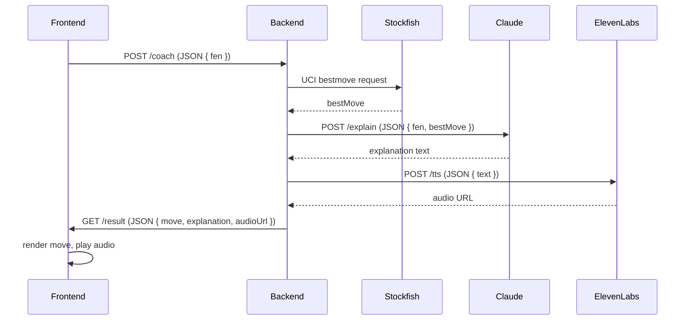

# How I built a virtual chess coach: Stockfish calculates, Claude explains, ElevenLabs speaks

## Introduction  
I was racing a blitz game when a missed knight fork cost me the win. I wanted a coach that could instantly tell me the best move, explain why it was strong, and speak the reasoning aloud while I reviewed the board. Most chess apps either dump raw engine scores or serve canned commentary. There was no smooth loop where calculation, natural‑language explanation, and speech formed a single coaching experience.  

The problem boiled down to stitching three distinct services together—high‑depth move calculation, human‑like reasoning, and expressive audio synthesis—while keeping latency under two seconds for a typical depth‑12 search. This article walks through the architecture, integration points, and production lessons learned when building that loop.

## Why This Matters  
Engineering teams increasingly need AI‑augmented tools that turn raw data into actionable insight. A virtual chess coach exemplifies a broader pattern: *compute → reason → communicate*. In production, this means we must handle concurrent UCI interactions, token‑budgeted LLM calls, and real‑time audio generation without overwhelming the user’s device or our infrastructure. The design decisions here apply to any domain where a decision engine, an explanatory model, and a voice interface must cooperate.

## How It Works  
The system follows a request‑response pipeline that starts with a FEN from the UI and ends with an audio clip played in the browser. Below is a sequence diagram that visualizes the core flow.



**Step‑by‑step description**

1. **Frontend** captures the board state via a Chessboard.js component, serializes it to FEN, and submits it to `/coach`.  
2. **Backend** (FastAPI) validates the payload, checks a Redis cache for the exact FEN, and proceeds only if missing.  
3. **Stockfish** runs locally as a subprocess; the wrapper sends `position fen <fen>` and `go depth 12`. The best move is extracted and returned.  
4. **Claude** receives the move and the surrounding board description (a concise textual snapshot). Using a carefully crafted system prompt, it returns a coach‑style explanation that mimics a human trainer’s tone.  
5. **ElevenLabs** converts the explanation into speech using a voice preset (e.g., “Bella”). The API returns a presigned URL that the frontend streams via `<audio>`.  
6. **Caching** ensures that repeated positions—such as opening lines—serve the same move/explanation/audio within a ten‑minute window, dramatically lowering latency for returning users.

## Core Concepts  
- **Stateless orchestration** – The FastAPI service holds no game state; each request is independent, simplifying scaling.  
- **UCI protocol** – Stockfish communicates through the Universal Chess Interface; we keep a single persistent process to avoid spawn overhead.  
- **Prompt engineering** – Claude’s system prompt defines the persona (“chess coach”) and constraints (max 150 words, bullet points for tactics). This keeps the output consistent and concise.  
- **Audio streaming** – ElevenLabs returns a URL; we stream the MP3 directly to the browser rather than proxying the whole file, reducing memory pressure.  
- **Cache key design** – `fen` alone is enough because the best move is deterministic for a given depth. We also store the generated audio to avoid re‑synthesis.

## Examples & Code Walkthrough  

### 1. Stockfish wrapper (`stockfish_adapter.py`)  
```python
# stockfish_adapter.py
import asyncio
import subprocess
import threading
from typing import Optional

class StockfishEngine:
    """Thin async‑friendly wrapper around the Stockfish UCI binary."""
    def __init__(self, path: str = "/usr/local/bin/stockfish", depth: int = 12):
        self._proc = subprocess.Popen(
            [path],
            stdin=subprocess.PIPE,
            stdout=subprocess.PIPE,
            stderr=subprocess.DEVNULL,
            text=True,
            bufsize=1,
        )
        self._depth = depth
        self._lock = threading.Lock()
        # Initialize UCI
        self._send("uci")
        self._expect("uciok")
        self._send("isready")
        self._expect("readyok")

    def _send(self, cmd: str) -> None:
        with self._lock:
            self._proc.stdin.write(cmd + "\n")
            self._proc.stdin.flush()

    def _expect(self, token: str) -> None:
        # Simple line‑by‑line reading; good enough for UCI
        for line in self._proc.stdout:
            if token in line:
                return
        raise RuntimeError(f"Expected '{token}' from Stockfish")

    async def best_move(self, fen: str) -> str:
        """Return the UCI best move for the given FEN."""
        self._send(f"position fen {fen}")
        self._send(f"go depth {self._depth}")
        # Wait for bestmove line
        for line in self._proc.stdout:
            if line.startswith("bestmove"):
                # bestmove e2e4
                parts = line.split()
                return parts[1]
        raise RuntimeError("Stockfish did not output a bestmove")

    def close(self) -> None:
        self._send("quit")
        self._proc.terminate()
```

*Why this design?*  
- **Single process** – Keeps CPU and memory usage low.  
- **Thread‑safe lock** – Prevents interleaving of UCI commands, which would break the protocol.  
- **Async wrapper** – The `best_move` method can be called from FastAPI’s async endpoint without blocking the event loop.

### 2. Claude integration (`claude_client.py`)  
```python
# claude_client.py
import httpx
import os
from typing import List

ANTHROPIC_API_KEY = os.getenv("ANTHROPIC_API_KEY")
CLAUDE_URL = "https://api.anthropic.com/v1/messages"

class ClaudeExplainer:
    """Client for Anthropic's Messages API to generate chess explanations."""
    def __init__(self, model: str = "claude-3-opus-20240229"):
        self.model = model
        self.client = httpx.AsyncClient()

    async def explain(self, fen: str, best_move: str) -> str:
        """Return a coach‑style explanation for the best move."""
        system_prompt = (
            "You are a chess coach. Explain the given move in a friendly, "
            "tactical style. Keep it under 150 words, use bullet points for tactics, "
            "and address the user directly."
        )
        payload = {
            "model": self.model,
            "system": system_prompt,
            "messages": [
                {
                    "role": "user",
                    "content": f"Board: {fen}\nBest move: {best_move}\nExplain this move."
                }
            ],
            "max_tokens": 200,
            "temperature": 0.7,
        }
        headers = {
            "x-api-key": ANTHROPIC_API_KEY,
            "anthropic-version": "2023-06-01",
            "content-type": "application/json",
        }
        resp = await self.client.post(CLAUDE_URL, json=payload, headers=headers)
        resp.raise_for_status()
        data = resp.json()
        return data["content"][0]["text"]
```

*Key points*  
- **System prompt** locks the persona and length constraints, reducing hallucination.  
- **Async httpx** avoids blocking the FastAPI worker while waiting for the LLM.  
- **Error handling** – `resp.raise_for_status()` propagates HTTP errors upstream.

### 3. ElevenLabs TTS (`tts_client.py`)  
```python
# tts_client.py
import httpx
import os
from typing import Dict

ELEVENLABS_API_KEY = os.getenv("ELEVENLABS_API_KEY")
TTS_URL = "https://api.elevenlabs.io/v1/text-to-speech"

class ElevenLabsSpeaker:
    """Synthesize explanation into speech using ElevenLabs."""
    def __init__(self, voice_id: str = "Bella"):
        self.voice_id = voice_id
        self.client = httpx.AsyncClient()

    async def speak(self, text: str) -> Dict[str, str]:
        """Return a dict with 'audio_url' and 'content_type'."""
        headers = {
            "xi-api-key": ELEVENLABS_API_KEY,
            "Content-Type": "application/json",
        }
        payload = {
            "text": text,
            "voice_id": self.voice_id,
            "model_id": "eleven_turbo_v2",
            "voice_settings": {
                "stability": 0.4,
                "similarity_boost": 0.8,
            },
        }
        resp = await self.client.post(f"{TTS_URL}/{self.voice_id}", json=payload, headers=headers)
        resp.raise_for_status()
        # ElevenLabs returns a JSON with a 'audio_url' field
        data = resp.json()
        return {"audio_url": data["audio_url"], "content_type": resp.headers.get("content-type")}
```

*Why async?*  
- The TTS API can take a few hundred milliseconds; awaiting it keeps the request pipeline fluid.

### 4. FastAPI orchestrator (`main.py`)  
```python
# main.py
import redis
import json
from fastapi import FastAPI, HTTPException
from fastapi.responses import JSONResponse
from stockfish_adapter import StockfishEngine
from claude_client import ClaudeExplainer
from tts_client import ElevenLabsSpeaker

app = FastAPI(title="Virtual Chess Coach API")

# Singleton instances (could be replaced with DI container)
_stockfish = StockfishEngine()
_claude = ClaudeExplainer()
_tts = ElevenLabsSpeaker()

# Redis connection (local instance for demo)
_redis = redis.Redis(host="localhost", port=6379, db=0)

@app.get("/")
def health():
    return {"status": "ok"}

@app.post("/coach")
async def coach(fen: str):
    """
    Main entry point. Returns JSON with:
    - move: UCI best move
    - explanation: human‑readable text
    - audio_url: presigned URL for speech
    """
    # 1. Try cache first
    cache_key = f"coach:{fen}"
    cached = _redis.get(cache_key)
    if cached:
        return JSONResponse(content=json.loads(cached))

    # 2. Compute best move
    try:
        best_move = await _stockfish.best_move(fen)
    except Exception as e:
        raise HTTPException(status_code=502, detail=f"Stockfish error: {e}")

    # 3. Generate explanation
    try:
        explanation = await _claude.explain(fen, best_move)
    except Exception as e:
        raise HTTPException(status_code=503, detail=f"Claude error: {e}")

    # 4. Synthesize speech
    try:
        tts_info = await _tts.speak(explanation)
    except Exception as e:
        raise HTTPException(status_code=504, detail=f"ElevenLabs error: {e}")

    # 5. Assemble response
    payload = {
        "move": best_move,
        "explanation": explanation,
        "audio_url": tts_info["audio_url"],
        "content_type": tts_info["content_type"],
    }

    # 6. Cache for 10 minutes
    _redis.setex(cache_key, 600, json.dumps(payload))

    return JSONResponse(content=payload)

@app.on_event("shutdown")
def shutdown_event():
    _stockfish.close()
```

*Design notes*  
- **Redis TTL** – `setex` stores the result with a 600‑second expiry, ensuring fresh analysis for dynamic positions while still caching openings.  
- **Error propagation** – Each external call is wrapped in try/except; distinct HTTP status codes help the client differentiate between engine, LLM, or audio failures.  
- **Singleton pattern** – For a micro‑service, a single instance of each heavy client reduces process overhead. In a containerized environment, you would spin up multiple workers behind a load balancer, each with its own instances.

### 5. Frontend snippet (React + Chessboard.js)  
```jsx
// CoachComponent.jsx
import React, { useState } from "react";
import Chessboard from "react-chessboard";

export default function CoachComponent() {
  const [fen, setFen] = useState("rnbqkbnr/pppppppp/8/8/8/8/PPPPPPPP/RNBQKBNR w KQkq - 0 1");
  const [move, setMove] = useState(null);
  const [explanation, setExplanation] = useState("");
  const [audioUrl, setAudioUrl] = useState(null);
  const [loading, setLoading] = useState(false);

  async function requestCoach() {
    setLoading(true);
    const resp = await fetch("/coach", {
      method: "POST",
      headers: { "Content-Type": "application/json" },
      body: JSON.stringify({ fen }),
    });
    if (!resp.ok) {
      alert("Coaching request failed");
      setLoading(false);
      return;
    }
    const data = await resp.json();
    setMove(data.move);
    setExplanation(data.explanation);
    setAudioUrl(data.audio_url);
    setLoading(false);
  }

  return (
    <div style={{ maxWidth: "600px", margin: "0 auto" }}>
      <h1>Virtual Chess Coach</h1>
      <Chessboard position={fen} onChange={setFen} />
      <button onClick={requestCoach} disabled={loading} style={{ marginTop: "1rem" }}>
        {loading ? "Coaching..." : "Get Coach"}
      </button>
      {move && (
        <div style={{ marginTop: "1rem" }}>
          <p><strong>Best move:</strong> {move}</p>
          <p><strong>Explanation:</strong> {explanation}</p>
          {audioUrl && (
            <audio controls src={audioUrl} style={{ marginTop: "0.5rem" }} />
          )}
        </div>
      )}
    </div>
  );
}
```

*Why React?*  
- It isolates UI concerns (board rendering, state) from the orchestration logic. The component is small enough to embed in any web page or Electron wrapper.
