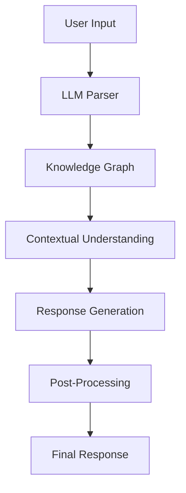

# How I use LLMs to learn complex topics

## Introduction
I still remember the days when learning a new programming language or framework meant poring over thick textbooks and scouring the internet for tutorials. While these resources are still valuable, I've found that Large Language Models (LLMs) have become an indispensable tool in my learning arsenal. By leveraging LLMs, I can quickly grasp complex concepts, explore new technologies, and even generate code snippets to get started with a project.

## Why This Matters
As software engineers, we're constantly faced with the challenge of staying up-to-date with the latest technologies and trends. With the rapid pace of innovation in our field, it's easy to feel overwhelmed by the sheer volume of information available. LLMs help bridge this knowledge gap by providing a concise and accessible way to learn complex topics. Whether you're a seasoned engineer or just starting out, LLMs can save you time and effort in learning new skills.

## How It Works
The process of using LLMs to learn complex topics involves a combination of natural language processing, machine learning, and knowledge graph construction. Here's a high-level overview of the architecture:

In this workflow, the user provides input in the form of a question or prompt, which is then parsed by the LLM's natural language processing module. The parsed input is used to query the knowledge graph, which is a vast database of interconnected concepts and relationships. The LLM then uses this information to generate a response, which is post-processed to ensure accuracy and relevance.

## Core Concepts
To effectively use LLMs for learning, it's essential to understand some key concepts:

* **Embeddings**: These are vector representations of words, phrases, or concepts that capture their semantic meaning.
* **Attention Mechanisms**: These allow the LLM to focus on specific parts of the input or knowledge graph when generating a response.
* **Knowledge Graph**: This is a graphical representation of the relationships between different concepts, entities, and ideas.

## Examples & Code Walkthrough
Here's an example of how I used an LLM to learn about the basics of GraphQL:
```python
import torch
from transformers import AutoModelForSeq2SeqLM, AutoTokenizer

# Load pre-trained LLM and tokenizer
model = AutoModelForSeq2SeqLM.from_pretrained("t5-base")
tokenizer = AutoTokenizer.from_pretrained("t5-base")

# Define input prompt
prompt = "Explain the basics of GraphQL"

# Tokenize input prompt
inputs = tokenizer(prompt, return_tensors="pt")

# Generate response
outputs = model.generate(inputs["input_ids"], num_beams=4)

# Print response
print(tokenizer.decode(outputs[0], skip_special_tokens=True))
```
This code snippet demonstrates how to use a pre-trained LLM to generate a response to a given prompt. The `t5-base` model is a popular choice for natural language processing tasks, and the `AutoTokenizer` is used to convert the input prompt into a format that the model can understand.

## Best Practices
When using LLMs to learn complex topics, keep the following best practices in mind:

* **Start with simple prompts**: Begin with basic questions or prompts to get a feel for how the LLM responds.
* **Use specific terminology**: Use technical terms and jargon relevant to the topic you're trying to learn.
* **Iterate and refine**: Refine your prompts based on the responses you receive to drill deeper into a topic.

## Common Mistakes & Anti-Patterns
Some common mistakes to avoid when using LLMs include:

* **Overly broad prompts**: Avoid prompts that are too vague or open-ended, as they can lead to generic or unhelpful responses.
* **Lack of context**: Failing to provide sufficient context or background information can result in responses that are not relevant to your specific use case.
* **Insufficient iteration**: Not refining your prompts based on the responses you receive can lead to a lack of depth or clarity in your understanding of the topic.

## Performance Considerations
When using LLMs, it's essential to consider the performance implications of your prompts and the responses you receive. Factors to consider include:

* **Model size and complexity**: Larger models require more computational resources and may be slower to respond.
* **Input length and complexity**: Longer or more complex prompts can result in slower response times or increased memory usage.
* **Response size and complexity**: Larger or more complex responses can be more difficult to process and understand.

## Real-World Usage
Industry leaders are already leveraging LLMs in a variety of applications, including:

* **Chatbots and virtual assistants**: LLMs are used to power conversational interfaces that can understand and respond to user queries.
* **Content generation**: LLMs are used to generate high-quality content, such as articles, blog posts, and social media updates.
* **Language translation**: LLMs are used to translate text from one language to another, enabling more effective communication across linguistic and cultural boundaries.

## Frequently Asked Questions (FAQ)
Here are some common questions and answers about using LLMs to learn complex topics:

* Q: What is the best way to get started with using LLMs for learning?
A: Start with simple prompts and gradually refine them based on the responses you receive.
* Q: How can I ensure that the responses I receive are accurate and relevant?
A: Provide sufficient context and background information, and iterate on your prompts to drill deeper into the topic.
* Q: Can I use LLMs to learn any topic, or are there limitations?
A: While LLMs are incredibly versatile, they may not be suitable for highly specialized or niche topics that require extensive domain-specific knowledge.

## Conclusion
In conclusion, LLMs have revolutionized the way I learn complex topics, and I believe they can do the same for you. By following the best practices and avoiding common mistakes outlined in this article, you can harness the power of LLMs to accelerate your learning and stay ahead of the curve in our rapidly evolving field. Whether you're a seasoned engineer or just starting out, I encourage you to give LLMs a try and experience the benefits for yourself.
