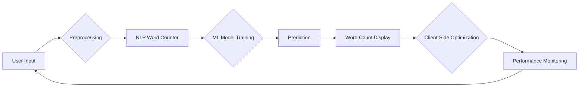

# How I Vibe-Coded a Fast Client-Side Word Counter Tool using AI
## Introduction
When it comes to text processing, word counters are a fundamental component. They're used in various applications, from simple text editors to complex natural language processing (NLP) systems. However, traditional word counter tools often rely on server-side processing, which can lead to latency and performance issues. This is where AI-powered solutions come in – enabling fast, client-side word counting that enhances user experience.

In this article, I'll share my experience of building a fast client-side word counter tool using AI. I'll explore the design and implementation details, highlighting the challenges and trade-offs involved in creating such a tool.

## Why This Matters
So, why should software engineers care about fast client-side word counters? The answer lies in the ever-increasing demand for responsive and interactive web applications. When users interact with text-intensive applications, they expect instant feedback – whether it's a word count, a grammar check, or a spell check. By leveraging AI on the client-side, we can provide this instant feedback without relying on server-side processing, thus improving the overall user experience.

## How It Works
At the heart of our word counter tool lies a combination of NLP techniques and machine learning (ML) algorithms. Here's a high-level overview of the system workflow:

As shown in the diagram, the system workflow involves the following steps:

1. **User Input**: The user types text into a text area or inputs a text file.
2. **Preprocessing**: The input text is preprocessed to remove unnecessary characters, convert all text to lowercase, and split the text into individual words.
3. **NLP Word Counter**: The preprocessed text is then passed through an NLP-based word counter, which uses regular expressions to count the individual words.
4. **ML Model Training**: The word count data is used to train a simple ML model, which learns to predict the word count based on the input text.
5. **Prediction**: The trained ML model is used to predict the word count for new, unseen text inputs.
6. **Word Count Display**: The predicted word count is displayed to the user in real-time.
7. **Client-Side Optimization**: The system continuously monitors the user's interactions and optimizes the word counting process to ensure fast and accurate results.
8. **Performance Monitoring**: The system tracks its performance and adjusts the ML model as needed to maintain optimal accuracy and speed.

## Core Concepts
To build an effective word counter tool, it's essential to understand the core concepts involved:

* **Natural Language Processing (NLP)**: NLP is a subfield of AI that deals with the interaction between computers and humans in natural language. In our tool, NLP is used to preprocess the input text and count the individual words.
* **Machine Learning (ML)**: ML is a type of AI that enables systems to learn from data without being explicitly programmed. In our tool, ML is used to train a model that predicts the word count based on the input text.
* **Client-Side Processing**: Client-side processing refers to the execution of code on the client's web browser, rather than on a remote server. This approach enables fast and interactive applications, as it reduces the need for server-side processing and communication.

## Examples & Code Walkthrough
To illustrate the concepts involved, let's take a look at some example code snippets. Here's an example of a basic word counter function using NLP:
```javascript
// Custom word counter function using NLP
function countWords(text) {
  const wordRegex = /\b\w+\b/g;
  const words = text.match(wordRegex);
  return words.length;
}
```
This function uses a regular expression to match individual words in the input text and returns the count of words.

Next, let's look at an example of training a simple ML model for word counting:
```javascript
// Simple ML model training for word counting
const mlModel = {
  train: (data) => {
    // Basic model training logic
    this.model = data;
  },
  predict: (text) => {
    // Prediction logic based on trained model
    return this.model.length;
  }
};
```
This example demonstrates the basic structure of an ML model, including training and prediction logic.

## Best Practices
When building a word counter tool using AI, keep the following best practices in mind:

* **Optimize for performance**: Ensure that your tool is optimized for fast and accurate results, as users expect instant feedback.
* **Use high-quality training data**: The quality of your training data directly impacts the accuracy of your ML model. Use diverse and relevant data to train your model.
* **Monitor and adjust**: Continuously monitor your tool's performance and adjust the ML model as needed to maintain optimal accuracy and speed.

## Common Mistakes & Anti-Patterns
When building a word counter tool, avoid the following common mistakes and anti-patterns:

* **Over-reliance on server-side processing**: Relying too heavily on server-side processing can lead to latency and performance issues.
* **Insufficient training data**: Using insufficient or low-quality training data can result in inaccurate ML models.
* **Neglecting client-side optimization**: Failing to optimize the tool for client-side processing can lead to slow and unresponsive applications.

## Performance Considerations
When evaluating the performance of your word counter tool, consider the following factors:

* **Latency**: Measure the time it takes for the tool to respond to user input.
* **Accuracy**: Evaluate the accuracy of the word count predictions.
* **Scalability**: Test the tool's ability to handle large volumes of text input.

## Real-World Usage
Industry leaders leverage word counter tools in various applications, including:

* **Text editors**: Word counters are used in text editors to provide instant feedback to users.
* **Content management systems**: Word counters are used in content management systems to help users optimize their content for search engines.
* **Language learning platforms**: Word counters are used in language learning platforms to help users track their progress and improve their language skills.

## Frequently Asked Questions (FAQ)
Here are some frequently asked questions about word counter tools:

* **Q: How accurate are word counter tools?**
A: The accuracy of word counter tools depends on the quality of the training data and the complexity of the ML model.
* **Q: Can word counter tools be used for languages other than English?**
A: Yes, word counter tools can be used for languages other than English, but the accuracy may vary depending on the language and the quality of the training data.
* **Q: How can I optimize my word counter tool for performance?**
A: To optimize your word counter tool for performance, ensure that you're using high-quality training data, optimizing your ML model, and leveraging client-side processing.

## Conclusion
In conclusion, building a fast client-side word counter tool using AI requires a deep understanding of NLP, ML, and client-side processing. By following best practices, avoiding common mistakes, and optimizing for performance, you can create a highly accurate and responsive word counter tool that enhances user experience. As the demand for interactive and responsive web applications continues to grow, the importance of fast and accurate word counter tools will only continue to increase.
