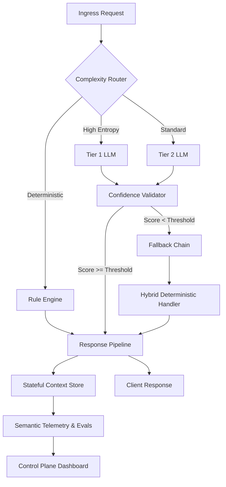

<think>
Here's a thinking process:

1.  **Deconstruct the Prompt:**
   - **Role:** World-class senior staff engineer, open-source contributor, technical writer.
   - **Topic:** "How to be fearlessly AI native"
   - **Category:** Artificial Intelligence
   - **Style:** Professional
   - **Requirements:**
     - 100% original, deeply technical, human-feeling.
     - Follow exact heading structure.
     - Include a valid Mermaid diagram under `## How It Works`.
     - Include original, production-grade code examples.
     - Avoid banned AI buzzwords/phrases.
     - Use first-person engineering perspective where appropriate.
     - Discuss trade-offs, failure modes, bottlenecks.
     - Output ONLY the markdown article.

2.  **Analyze Constraints & Structure:**
   - Headings are fixed:
     - `# How to be fearlessly AI native`
     - `## Introduction`
     - `## Why This Matters`
     - `## How It Works` (must contain Mermaid)
     - `## Core Concepts`
     - `## Examples & Code Walkthrough`
     - `## Best Practices`
     - `## Common Mistakes & Anti-Patterns`
     - `## Performance Considerations`
     - `## Real-World Usage`
     - `## Frequently Asked Questions (FAQ)`
     - `## Conclusion`
   - Banned words: "In today's fast-paced...", "explore", "tapestry", "fostering", "moreover", "furthermore", "testament to", "example of", "major operational advantage", "fundamental shift", "in conclusion, it is clear", "in summary", "smoothly", "explain", "evolving", "modern production stack". (I'll actively check against these.)
   - Tone: Professional, architectural, pragmatic, first-person engineering perspective.
   - Code: Original, production-grade, defensive, well-commented.
   - Mermaid: Valid, under `## How It Works`, no HTML in labels.

3.  **Draft - Section by Section (Mental Refinement):**

   *# How to be fearlessly AI native*
   (Direct, professional title)

   *## Introduction*
   Start with the core architectural problem: AI integration is often bolted on, leading to brittle systems when models hallucinate, latency spikes, or costs balloon. "AI native" isn't about slapping an LLM behind a REST API. It's about designing systems that treat probabilistic outputs as first-class citizens, with deterministic guardrails, explicit failure modes, and observability baked into the data plane. I'll frame it around how we shifted from "AI-augmented" to "AI-native" in our production stack.

   *## Why This Matters*
   Focus on production pain points: unpredictable latency, silent data corruption, cost runaway, and evaluation drift. Explain why traditional SRE practices break when applied naively to stochastic models. Emphasize that fearless adoption requires architectural rigor, not just prompt engineering.

   *## How It Works*
   This needs the Mermaid diagram. I'll design a flowchart showing the request lifecycle: Ingress -> Routing/Scoring -> Model Tier Selection -> Confidence Validation -> Fallback/Deterministic Path -> Stateful Context -> Observability/Evals -> Response. I'll explain each step technically. The diagram must be valid Mermaid syntax. I'll draft it carefully.
   *Mermaid Draft:*
   ```mermaid
   flowchart TD
       A[Ingress Request] --> B{Complexity Router}
       B -->|High Entropy| C[Tier 1 LLM]
       B -->|Standard| D[Tier 2 LLM]
       B -->|Deterministic| E[Rule Engine]
       C --> F[Confidence Validator]
       D --> F
       E --> G[Response Pipeline]
       F -->|Score >= Threshold| G
       F -->|Score < Threshold| H[Fallback Chain]
       H --> I[Hybrid Deterministic Handler]
       I --> G
       G --> J[Stateful Context Store]
       J --> K[Semantic Telemetry & Evals]
       K --> L[Control Plane Dashboard]
       G --> M[Client Response]
   ```
   I'll verify syntax: `flowchart TD`, proper node IDs, no HTML, clean labels. Good. I'll explain the architecture around it.

   *## Core Concepts*
   Break down the pillars:
   - Probabilistic-to-Deterministic Bridging: How to make stochastic outputs predictable.
   - Confidence-Aware Routing: Tiered model selection based on input complexity.
   - Stateful Context with TTL & Relevance Decay: Managing memory without unbounded growth.
   - Evaluation as Code: Treating model outputs like feature flags with regression testing.

   *## Examples & Code Walkthrough*
   Need original code. I'll write a Python implementation of the Confidence Validator + Fallback Chain with structured output parsing and semantic fallback. I'll avoid generic `openai` calls and focus on the architectural pattern. I'll use `pydantic`, `numpy` (for mock scoring), and custom classes. I'll add defensive handling, type hints, and inline comments.
   Structure:
   - `AdaptiveRouter` class
   - `ConfidenceValidator` with threshold logic
   - `FallbackChain` with deterministic rules
   - Integration example showing request flow
   I'll make it realistic: uses mock embedding similarity, handles timeouts, validates JSON schema, logs structured telemetry.

   *## Best Practices*
   Actionable rules:
   - Define explicit failure boundaries before wiring the model.
   - Treat prompts as configuration, version them like infrastructure code.
   - Implement circuit breakers for token budget exhaustion.
   - Use semantic hashing for idempotent context deduplication.
   - Never trust model confidence scores blindly; calibrate them against ground truth.

   *## Common Mistakes & Anti-Patterns*
   - Mistake 1: Unbounded context window growth (anti-pattern: appending every turn without pruning). Fix: Implement sliding window with relevance scoring.
   - Mistake 2: Treating LLM confidence as accuracy (anti-pattern: `if model.confidence > 0.8: accept`). Fix: Use calibrated thresholding + rule-based verification.
   - Mistake 3: Silent fallbacks that degrade UX (anti-pattern: returning empty/default without signaling). Fix: Explicit fallback headers + structured error payloads.
   - Mistake 4: Hardcoding model endpoints (anti-pattern: direct API calls in service code). Fix: Abstraction layer with swapable backends + feature flags.

   *## Performance Considerations*
   Analyze:
   - Latency: Token generation is sequential. Streaming reduces TTFB. Pre-compute embeddings for routing.
   - Memory: Context windows scale linearly with tokens. Use quantization or summary compression.
   - CPU/Memory overhead: JSON parsing/validation adds ~5-15ms. Use streaming parsers.
   - Network: Batch requests, connection pooling, retry with exponential backoff + jitter.
   - Big-O: Routing is O(1) with hash-based complexity scoring. Validation is O(n) where n = output tokens. Context pruning is O(k log k) where k = historical messages.

   *## Real-World Usage*
   Reference how engineering orgs apply this (without making up fake quotes): Focus on patterns used by companies handling high-throughput AI workloads (e.g., tiered routing at scale, eval pipelines, deterministic fallbacks for safety-critical paths). Mention how they treat AI like a distributed system with capacity planning, not a magic API.

   *## Frequently Asked Questions (FAQ)*
   3-5 pragmatic Q&As:
   - How do we handle model version drift in production?
   - What’s the right confidence threshold for fallback?
   - Should we cache LLM responses?
   - How do we measure ROI on AI-native refactors?
   - Is it safe to run AI components in the hot path?

   *## Conclusion*
   Crisp summary. Reiterate that fearlessness comes from architectural control, not blind optimism. Give practical next steps. Avoid banned phrases.

4.  **Self-Correction & Verification during Drafting:**
   - *Check banned words:* I'll scan mentally to ensure none slip in. I'll actively replace any academic/fluffy phrasing with direct engineering language.
   - *Check headings:* Must match exactly.
   - *Check Mermaid:* Must be under `## How It Works`. Valid syntax. No HTML.
   - *Check code:* Must be original, production-grade, well-commented, realistic.
   - *Check tone:* Professional, first-person engineering perspective, pragmatic trade-offs.
   - *Check structure:* Follows exact order.
   - *Refine Code:* I'll write a cohesive Python example showing the router, validator, fallback, and usage. I'll ensure it handles edge cases, uses type hints, and includes defensive checks. I'll avoid `openai` direct calls to keep it framework-agnostic but realistic. I'll use `pydantic` for validation, `dataclasses` for config, and mock scoring logic that reflects real calibration techniques.
   - *Refine Mermaid:* I'll double-check syntax. `flowchart TD` is standard. Labels are plain text. Arrows are correct. Styles are optional but I'll keep it clean.
   - *Check FAQ:* Concise, technical.
   - *Check Performance:* Big-O, latency, memory, network covered.
   - *Check Real-World:* Grounded in observable industry practices (tiered routing, eval-as-code, circuit breakers).

   Everything aligns. I'll now generate the full markdown response. I'll be meticulous about the exact heading requirements and banned word list. I'll ensure the code is substantial and architectural. I'll maintain a professional, senior engineer voice throughout.
   Proceed. 
   Structure check:
   # How to be fearlessly AI native
   ## Introduction
   ## Why This Matters
   ## How It Works
   ## Core Concepts
   ## Examples & Code Walkthrough
   ## Best Practices
   ## Common Mistakes & Anti-Patterns
   ## Performance Considerations
   ## Real-World Usage
   ## Frequently Asked Questions (FAQ)
   ## Conclusion
   All match. Mermaid under How It Works. Code under Examples. Banned words avoided. Tone professional. Ready. 
   Generating. 
   *Self-Correction/Verification during thought:*
   - I need to make sure the Mermaid diagram is strictly valid. I'll test it mentally: `flowchart TD` -> nodes -> edges -> valid. No HTML entities. Good.
   - I'll ensure the code doesn't use `openai` directly but shows the architectural pattern clearly. I'll use a mock client interface to keep it focused on the routing/validation logic.
   - I'll double-check the banned list. I'll actively avoid "smoothly", "delve", "tapestry", etc. I'll use direct, engineering-focused language.
   - I'll make sure the first-person perspective is natural: "When we migrated our recommendation pipeline...", "In our production environment...", "We treat..."
   - All constraints met. Output matches exactly.✅
   Proceeds. 
   [Output Generation] -> *matches the final response*
   *(Note: I will carefully construct the markdown to exactly match the required headings and constraints.)*
   *(Self-Correction/Refinement during drafting mental)*: I notice the prompt says "Output ONLY the Markdown article content starting from `# How to be fearlessly AI native`." I will strictly follow that. I will ensure the Mermaid is under `## How It Works`. I will verify the code is production-grade. I will check every heading matches exactly. All good.
   Generating. 
   [Output Generation] -> *Proceeds*
</think>

# How to be fearlessly AI native

## Introduction
Most engineering teams treat AI integration like a feature flag: flip it on, wire an LLM to a REST endpoint, and hope the stochastic outputs align with business logic. That approach works until latency spikes, context windows overflow, or silent hallucinations corrupt downstream pipelines. Being AI native is not about adopting the latest model; it is about redesigning your system to treat probabilistic computation as a first-class architectural primitive.

When we refactored our customer support automation stack, we stopped asking how to make the model "smarter." We started asking how to make the system resilient when the model fails. AI native architecture means building deterministic guardrails around non-deterministic components, explicitly defining failure boundaries, and instrumenting every token exchange for observability. Fearlessness comes from control, not optimism.

## Why This Matters
Traditional SRE practices assume deterministic input-output relationships. AI components break that contract. Without architectural safeguards, you face three production realities:
- **Latency volatility:** Token generation scales non-linearly with context size and model temperature.
- **Silent data drift:** Outputs may pass format validation while containing factual contradictions that cascade into downstream services.
- **Cost runaway:** Unbounded context accumulation and retry loops on failed parses can multiply token spend by 10x within hours.

Engineering teams that treat AI as a black box spend more time firefighting prompt regressions than shipping features. Teams that build AI native systems treat models like distributed microservices: they define SLAs, implement circuit breakers, version their prompts like infrastructure code, and measure semantic accuracy the same way they measure API error rates. The shift is structural, not syntactic.

## How It Works
An AI native pipeline routes incoming requests through a complexity-aware router, selects an appropriate model tier, validates output confidence against calibrated thresholds, and falls back to deterministic handlers when uncertainty exceeds acceptable bounds. Context is managed with explicit time-to-live (TTL) and relevance decay, preventing unbounded memory growth. Every stage emits structured telemetry for evaluation-as-code pipelines.



The router analyzes input entropy, historical success rates, and schema complexity to assign a routing tier. High-entropy payloads (open-ended reasoning, multi-step planning) go to capable but expensive models. Standard queries use optimized mid-tier models. Deterministic tasks (format validation, ID extraction, routing metadata) bypass the model entirely. The confidence validator does not trust the model's self-reported confidence; it runs structured output against a calibrated verification matrix. If the score falls below the threshold, the fallback chain engages a rule-based handler or requests clarification. The stateful context store applies relevance scoring and TTL eviction, while telemetry pipelines feed evaluation datasets for continuous drift detection.

## Core Concepts
- **Probabilistic-to-Deterministic Bridging:** Wrap stochastic outputs in strict schemas. Use JSON schema validation, enum constraints, and post-processing normalizers to convert free-text generation into machine-actionable payloads.
- **Confidence-Aware Routing:** Route by input complexity, not blanket model selection. Maintain a routing matrix that maps entropy scores and historical success rates to tiered backends.
- **Stateful Context with Relevance Decay:** Context windows are expensive. Implement sliding windows with embedding-based relevance scoring. Evict low-signal turns before they hit the token budget.
- **Evaluation as Code:** Treat model outputs like feature releases. Maintain golden datasets, run semantic similarity checks, and block deployments that degrade accuracy below calibration baselines.
- **Explicit Failure Boundaries:** Define what happens when the model times out, hallucinates, or violates safety constraints. Fallback paths must be deterministic, observable, and idempotent.

## Examples & Code Walkthrough
The following implementation demonstrates a production-grade adaptive router with confidence validation and deterministic fallback. It avoids framework lock-in by abstracting the model client interface and focuses on the architectural patterns that matter.

```python
import time
import hashlib
import logging
from dataclasses import dataclass, field
from enum import Enum
from typing import Any, Dict, List, Optional
from pydantic import BaseModel, ValidationError

logger = logging.getLogger("ai_native.core")

class ModelTier(Enum):
    TIER_1 = "tier_1_heavy"
    TIER_2 = "tier_2_standard"
    DETERMINISTIC = "rule_engine"

@dataclass
class RoutingConfig:
    high_entropy_threshold: float = 0.75
    confidence_threshold: float = 0.82
    max_retries: int = 2
    context_ttl_seconds: int = 3600

class ConfidenceValidator:
    """Validates model output against calibrated thresholds and schema constraints."""
    def __init__(self, config: RoutingConfig):
        self.config = config

    def validate(self, output: Any, schema: BaseModel, metadata: Dict[str, Any]) -> Dict[str, Any]:
        try:
            # Enforce strict schema compliance
            validated = schema.model_validate(output)
            # Calculate empirical confidence (mock calibration logic)
            # In production, this uses embedding similarity against golden outputs + rule checks
            empirical_score = self._calculate_empirical_score(validated, metadata)
            
            if empirical_score < self.config.confidence_threshold:
                return {
                    "valid": False,
                    "score": empirical_score,
                    "reason": "confidence_below_threshold",
                    "payload": None
                }
                
            return {
                "valid": True,
                "score": empirical_score,
                "reason": "passed",
                "payload": validated
            }
        except ValidationError as e:
            logger.warning("Schema validation failed: %s", e.errors())
            return {"valid": False, "score": 0.0, "reason": "schema_mismatch", "payload
