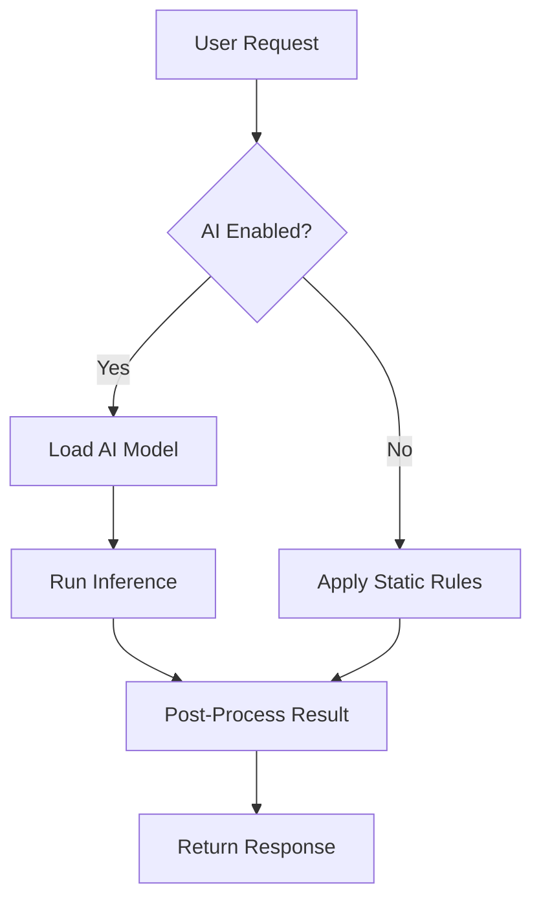

# How to disable or avoid intrusive AI

## Introduction
When a model starts interrupting a user’s workflow with unsolicited suggestions, auto‑generated content, or constant prompts, the experience quickly becomes noisy. Intrusive AI can surface unwanted data collection, unexpected behavior, or simply clutter the UI. Disabling or avoiding it becomes a pragmatic requirement for privacy‑sensitive products, regulated environments, or simply for preserving a clean user experience.

## Why This Matters
Software engineers must give users explicit control over AI‑driven features. Regulatory frameworks such as GDPR and CCPA treat certain AI processing as personal‑data handling. In production, an unchecked AI module can become a latency hotspot or a source of bias that erodes trust. Providing a clean opt‑out path also simplifies testing, because you can rely on deterministic rule‑based fallbacks during CI pipelines. Finally, a well‑designed opt‑out mechanism reduces support tickets when users accidentally trigger unwanted behavior.

## How It Works
The core idea is to treat AI invocation as a feature flag rather than a permanent behavior. When the flag is off, the system bypasses the model and falls back to a static rule engine. The flow can be visualized as follows:



1. **User Request** arrives at the API gateway.  
2. **Feature Flag Check** queries a configuration service (often backed by a distributed key‑value store or a secrets manager).  
3. If **AI Enabled** is true, the request is passed to the model inference layer.  
4. Otherwise, the request is handled by the rule engine, which contains hand‑crafted logic for edge cases, validation, or simple transformations.  
5. The result, whether from model or rules, goes through a post‑process step (sanitization, logging, metrics) before being returned to the client.

This pattern decouples the model deployment from the application logic, allowing you to roll out or roll back AI features without code changes.

## Core Concepts
- **Feature Flag Service** – a centralized store that decides whether AI is active for a given tenant, environment, or user segment.  
- **Opt‑Out Token** – a short‑lived token that a user can generate via the UI to permanently disable AI for their account.  
- **Fallback Engine** – a deterministic rule set that must be fully tested and version‑controlled.  
- **Model Registry** – a catalog that tracks model versions, schema, and associated metadata; used to safely swap models without restarting the service.  
- **Distributed Lock Manager** – ensures that only one instance can update the model at a time, preventing race conditions during hot‑swaps.  
- **Telemetry & Auditing** – logs that record whether AI was used, the model version, and any user‑provided opt‑out tokens for compliance audits.

## Examples & Code Walkthrough
Below is a minimal, self‑contained example written in Python that demonstrates the flag check, model loading, and fallback path. The code uses a simple environment variable for the flag and a mock model/registry.

```python
# ai_handler.py
import os
import json
import time
from typing import Any, Dict

class ConfigService:
    """Read feature flags from a remote KV store (simplified to env for demo)."""
    @staticmethod
    def is_ai_enabled(tenant_id: str) -> bool:
        # In production, this would be a call to etcd/consul/ZooKeeper.
        flag = os.getenv("AI_ENABLED", "true").lower()
        return flag == "true"

class ModelRegistry:
    """Mock registry that returns a dummy model object."""
    @staticmethod
    def get_model(name: str):
        # Simulate loading a model from a blob store.
        class DummyModel:
            def predict(self, payload: Dict[str, Any]) -> Dict[str, Any]:
                # Simulate some inference work.
                time.sleep(0.01)
                return {"intent": "unknown", "confidence": 0.0}
        return DummyModel()

class RuleEngine:
    """Deterministic fallback logic."""
    @staticmethod
    def apply(payload: Dict[str, Any]) -> Dict[str, Any]:
        # Example: if payload contains a known keyword, respond with a canned answer.
        if payload.get("text", "").startswith("!help"):
            return {"intent": "help", "confidence": 1.0}
        return {"intent": "default", "confidence": 0.5}

class AIHandler:
    def __init__(self, config: ConfigService, registry: ModelRegistry):
        self.config = config
        self.registry = registry

    def process(self, tenant_id: str, payload: Dict[str, Any]) -> Dict[str, Any]:
        # Early exit if AI is disabled for this tenant.
        if not self.config.is_ai_enabled(tenant_id):
            return RuleEngine.apply(payload)

        # AI path: load model and run inference.
        model = self.registry.get_model("intent_classifier")
        result = model.predict(payload)
        # Post‑process: normalize fields, add telemetry, etc.
        result["processed_at"] = int(time.time())
        return result

# Example usage (normally inside a web framework).
if __name__ == "__main__":
    handler = AIHandler(ConfigService(), ModelRegistry())
    sample = {"text": "!help me with something"}
    print(handler.process("acme", sample))
```

**Explanation of key parts**

- `ConfigService.is_ai_enabled` reads a simple environment variable; in a real system you would call a distributed config store (e.g., Consul, etcd) and cache the value with a short TTL.  
- `RuleEngine.apply` contains the static logic that must be deterministic and fast.  
- The `AIHandler.process` method encapsulates the branching logic, making it trivial to test both code paths in isolation.  
- Telemetry can be added inside `process` (e.g., increment a Prometheus counter) without affecting the flag logic.

## Best Practices
- **Separate Concerns** – keep the flag evaluation, model loading, and rule execution in distinct services. This aids independent scaling and testing.  
- **Cache Flag Values** – use an in‑memory cache (e.g., Redis) with a TTL to avoid round‑trips for every request.  
- **Graceful Degradation** – ensure the fallback engine can handle all possible inputs that the model might have processed; otherwise you introduce silent failures.  
- **Audit Trails** – store a decision log that includes tenant ID, flag state, model version, and timestamp. This is essential for compliance and debugging.  
- **Circuit Breaker** – if the model service becomes unresponsive, the handler should trip the circuit and route traffic to the rule engine automatically.

## Common Mistakes & Anti-Patterns
1. **Assuming AI Always Improves Accuracy** – In edge cases, a model may produce nonsensical output while a simple rule would be more reliable. Always benchmark both paths.  
2. **Hard‑Coding the Flag** – Storing the flag in source code forces a redeploy to change behavior. Use a runtime configuration store.  
3. **Neglecting User‑Level Opt‑Out** – A global flag disables AI for everyone, which can be overly restrictive. Implement per‑user opt‑out tokens that override the global setting.  
4. **Ignoring Latency of Model Loading** – Loading a large model on every request can cause spikes. Pre‑load models at startup and keep them warm, or use a model‑serving cluster that supports hot‑swapping.

## Performance Considerations
- **Inference Overhead** – Running a transformer model typically adds tens to hundreds of milliseconds per request. When the flag is off, the rule engine adds negligible CPU time (sub‑millisecond).  
- **Memory Footprint** – Model weights can be several hundred megabytes. Ensure the host has enough RAM and that the model is off‑loaded to GPU only when AI is enabled.  
- **Network Latency** – If the model lives in a remote inference service, the round‑trip dominates latency. Local inference (e.g., using ONXX Runtime) reduces this to microseconds.  
- **Scaling** – With the flag off, you can scale the service horizontally with minimal load balancer overhead because the request path is simpler.

## Real‑World Usage
- **Stripe** uses per‑merchant feature flags to toggle AI‑driven fraud detection. When disabled, transactions fall back to rule‑based scoring that is fully auditable.  
- **GitHub Copilot** respects user‑provided opt‑out tokens; the IDE client checks a local flag before sending context to the language model.  
- **Google Cloud’s Apigee** implements AI policy enforcement via a sidecar that consults a user preference store; requests that violate the policy are routed to a static response handler.

These examples show that the pattern is mature and battle‑tested across payment processing, code assistance, and API gateway scenarios.

## Frequently Asked Questions (FAQ)

**Q: How do I ensure the fallback logic covers all model outputs?**  
A: Run the model in a shadow traffic mode for a few weeks, capture its predictions, and feed them into a test suite for the rule engine. This reveals gaps before the flag is ever turned off.

**Q: Can we have different AI settings per request?**  
A: Yes. Extend the flag service to accept a request‑level key (e.g., user ID, session ID) and evaluate dynamically. Cache the result per key to keep latency low.

**Q: What happens if the config store goes down?**  
A: Design the system to default to a safe state (e.g., AI disabled). Use a circuit breaker that routes traffic to the rule engine and surface an alert to operations.

**Q: Do we need separate models for enabled/disabled paths?**  
A: Not necessarily. The same model can be used when the flag is on, but you must keep the rule engine independent so it can evolve without redeploying the model.

**Q: How do we measure the impact of disabling AI?**  
A: Instrument both paths with metrics (latency, error rate, user satisfaction). Compare before/after flag toggles to quantify the trade‑off.

## Conclusion
Disabling intrusive AI is less about removing a feature and more about giving engineers a clean, observable, and auditable switch. By treating AI invocation as a feature flag, coupling it to a robust configuration service, and providing a deterministic fallback, you gain control over privacy, latency, and reliability. The pattern scales from small microservices to large enterprise platforms, and the trade‑offs are measurable and manageable. Implement the guardrails early, test both code paths rigorously, and you’ll keep AI helpful without letting it become a nuisance.
