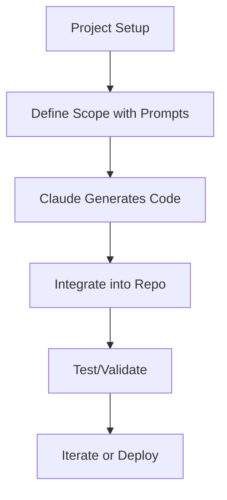

# How to organize Claude Code for product work  

## Introduction  
Organizing code in AI-driven product workflows isn’t just about writing clean functions or modular classes. It’s about creating systems that scale with your team, survive iterative development, and adapt to the unpredictable nature of AI outputs. Claude Code, a collaborative coding environment leveraging Anthropic’s Claude models, offers immense potential but demands deliberate architecture. Without structure, teams risk fragmented codebases, inconsistent logic, and wasted effort debugging AI-generated code that doesn’t align with product goals. This article explores how to build robust, maintainable systems using Claude Code for real product work.  

## Why This Matters  
Product teams face unique pressures: tight deadlines, cross-functional collaboration, and the need for reproducibility. AI tools like Claude Code introduce new challenges. For instance, a junior engineer might rely on Claude to scaffold a module, but without version control or testing, minor changes could cascade into production bugs. Worse, stateless interactions mean Claude doesn’t “remember” past contributions, leading to redundant work or conflicting design patterns. Structuring Claude Code isn’t optional—it’s a prerequisite for turning AI assistance into a reliable engineering practice.  

## How It Works  
At its core, Claude Code operates by treating the model as a co-contributor to your codebase. You define a project structure, prompt Claude to generate or refine code within that framework, and integrate its output iteratively. Think of it as a hybrid between a code editor and a pair programmer—one that requires guardrails to stay aligned with your architecture.  


This flowchart illustrates the workflow: start with clear prompts, generate code, integrate, test, and repeat. The key is maintaining consistency across iterations.  

## Core Concepts  
Three pillars underpin effective Claude Code organization: modularity, state management, and versioning.  

**Modularity**: Break projects into self-contained components. For example, a payment system might split into `auth/`, `transactions/`, and `webhook/`. Each module should have clear interfaces and minimal dependencies.  

**State Management**: Since Claude is stateless, externalize critical parameters. Use a `config.yaml` file to define settings like model version, token limits, or environment variables. This ensures Claude respects your requirements without manual reiteration.  

**Versioning**: Treat Claude-generated code like any other. Tag releases (e.g., `v1.2.0`) and use Git hooks to automate version checks. This creates an audit trail and simplifies rollbacks.  

## Examples & Code Walkthrough  
Let’s build a simple order-processing service. Start by defining modules:  

1. **Prompt for scaffolding**:  
   > "Create directories for order validation, payment processing, and webhook handling."  

   Resulting structure:  
   ```  
   order-service/  
   ├── validators/  
   │   └── __init__.py  
   ├── payments/  
   │   └── __init__.py  
   └── webhooks/  
       └── __init__.py  
   ```  

2. **Implement validation**:  
   ```python  
   # order-service/validators/order_validator.py  
   class OrderValidator:  
       def validate(self, order_data: dict) -> bool:  
           if not order_data.get("customer_id"):  
               raise ValueError("Missing customer ID")  
           return True  
   ```  

3. **Prompt for payment logic**:  
   > "Write a payment processor that handles credit cards and PayPal."  

   Claude might generate:  
   ```python  
   # order-service/payments/processor.py  
   class PaymentProcessor:  
       def process(self, amount: float, method: str) -> str:  
           if method == "credit_card":  
               return "Charged $%f" % amount  
           elif method == "paypal":  
               return "Payment sent to PayPal"  
           else:  
               raise NotImplementedError  
   ```  

4. **Integrate components**:  
   ```python  
   # order-service/main.py  
   from validators.order_validator import OrderValidator  
   from payments.processor import PaymentProcessor  

   def process_order(order: dict):  
       validator = OrderValidator()  
       if not validator.validate(order):  
           return "Validation failed"  
       processor = PaymentProcessor()  
       return processor.process(order["amount"], order["method"])  
   ```  

This example shows how modular prompts and clear interfaces reduce redundancy.  

## Best Practices  
1. **Always scaffold first**: Use Claude to generate boilerplate or directory structures. Avoid ad-hoc code generation.  
2. **Externalize state**: Never hardcode parameters in prompts. Use `config.yaml` or environment variables.  
3. **Version every change**: Tag Claude-generated commits and document their purpose.  
4. **Test incrementally**: Write unit tests for each module before integrating.  
5. **Audit Claude’s output**: Treat AI-generated code as a draft. Review for edge cases or security flaws.  

## Common Mistakes & Anti-Patterns  
- **Over-reliance on AI for complex logic**: Claude excels at scaffolding but struggles with deep architectural decisions.  
- **Ignoring state management**: Hardcoding model parameters in prompts leads to brittle code.  
- **Skipping versioning**: Untagged AI contributions make it hard to track regressions.  
- **Neglecting testing**: Assuming Claude’s code is error-free is risky. Always validate.  

## Performance Considerations  
Claude Code’s performance hinges on prompt clarity and code efficiency. Poorly scoped prompts force redundant iterations, increasing latency. Additionally, stateless interactions mean each prompt is a fresh start—optimize your prompts to minimize back-and-forth. From a system perspective, dependency management becomes critical. For example, if Claude generates a module relying on an external API, ensure that dependency is versioned and documented.  

## Real-World Usage  
A fintech startup used Claude Code to build a fraud detection module. They structured their codebase into `rules/`, `models/`, and `alerts/`. Claude generated initial rule engines, but the team added versioned tests for each rule set. During a peak load test, they discovered a performance bottleneck in the `models/` module. By refactoring that section with targeted Claude prompts, they reduced latency by 40%. The key was treating Claude as a tool for iteration, not a replacement for engineering rigor.  

## Frequently Asked Questions (FAQ)  

**Q: How do I handle state in Claude Code?**  
A: Externalize state via config files or environment variables. Never rely on Claude to “remember” parameters across sessions.  

**Q: Can Claude manage dependencies?**  
A: Not natively. Use package managers like npm or pip, and ensure Claude’s generated code includes proper `require()` or `import` statements.  

**Q: What if Claude generates conflicting code?**  
A: Version control helps. If two Claude runs produce incompatible code, use Git branches to isolate changes and merge carefully.  

**Q: Is Claude Code secure for production?**  
A: Treat AI-generated code as a draft. Audit for vulnerabilities, especially in security-sensitive modules.  

**Q: How do I scale this for large teams?**  
A: Enforce coding standards and use CI/CD to automate testing. Claude can assist in generating documentation or PR summaries for reviews.  

## Conclusion  
Organizing Claude Code for product work isn’t about genius prompts or magical AI—it’s about disciplined engineering. By modularizing your codebase, externalizing state, and versioning every change, you turn Claude into a reliable co-pilot rather than a wild card. Start small: scaffold a single module, validate it, then scale. With intentional architecture, Claude Code can become a cornerstone of your product development pipeline.
