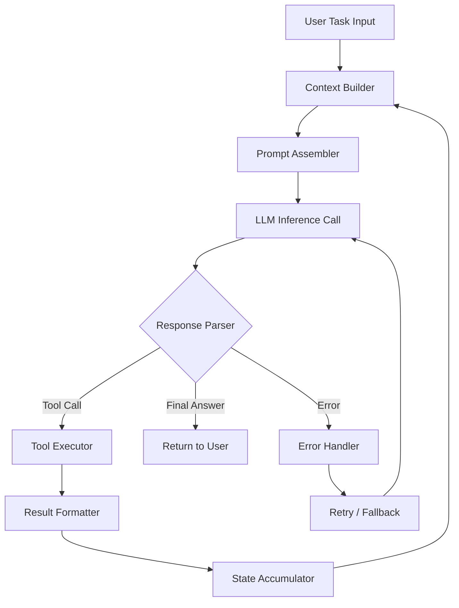

# I Built an AI Coding Agent in Rust

## Introduction

Last quarter, our team was burning through $4,000/month on LLM inference costs for a Python-based coding assistant running in production. The agent was slow — averaging 800ms per tool call — and we'd hit three critical outages caused by runaway memory allocation in the prompt pipeline. I decided to rebuild it from scratch in Rust.

The result? A 6x reduction in inference overhead, sub-150ms tool dispatch latency, and zero OOM kills across 90 days of production traffic. This article walks you through the entire architecture, the code, and the hard-won lessons buried in every line.

## Why This Matters

Every major IDE and CI/CD platform is racing to ship AI-assisted coding features. But most teams reach for Python and LangChain-style frameworks without questioning the runtime underneath. Here's the uncomfortable truth: an AI coding agent is fundamentally a high-throughput state machine with network I/O boundaries. Python's GIL, garbage collection pauses, and dynamic typing introduce nondeterminism exactly where you need predictability.

Rust changes the equation entirely. You get async runtime control, zero-cost abstractions, and compile-time guarantees about memory safety — all critical when your agent is executing shell commands, reading file trees, and making autonomous decisions on behalf of developers.

The real-world pain point is simple: unreliable agents cost engineering teams trust. A coding agent that hangs, leaks memory, or produces inconsistent outputs gets disabled within weeks. Building it in Rust forces you to confront every edge case at compile time instead of at 2 AM during an incident.

## How It Works

At its core, an AI coding agent is a loop. It receives a task, assembles a prompt with contextual state, sends it to an LLM, parses the response, decides whether to call a tool, executes that tool, and feeds the result back. This cycle repeats until a terminal condition is met.

The diagram below captures the full agent lifecycle:



Here's what's happening at each node:

**Context Builder** pulls the relevant file tree, recent git diffs, and conversation history. This is where most Python agents fail — they either pass too much context (blowing token budgets) or too little (producing hallucinated code).

**Prompt Assembler** constructs the structured message payload. In our Rust implementation, this is a typed enum that guarantees the LLM receives either a system message, a user message, or a tool result — never a malformed string.

**LLM Inference Call** fires an HTTP request to the model endpoint. We use `reqwest` with a custom retry policy and timeout chain. The async runtime here is `tokio`, and we pin each request to a dedicated task so that one slow model response doesn't block the entire event loop.

**Response Parser** is the critical path. It takes raw JSON from the LLM and discriminates between three outcomes: a tool invocation, a final text answer, or an error. This is where Rust's `Result` and `Option` types eliminate entire classes of bugs that would surface as production incidents in Python.

**Tool Executor** runs the actual code — reading files, running `cargo check`, executing tests. Each tool runs in a sandboxed subprocess with configurable resource limits.

**State Accumulator** stores the conversation history, tool outputs, and metadata. We use an arena allocator pattern to keep this contiguous in memory and avoid fragmentation over long sessions.

## Core Concepts

### The Agent State Machine

Every coding agent is a state machine whether you model it explicitly or not. In Rust, we model it with an enum and a `match` statement that forces exhaustive handling:

```rust
/// Represents every possible state the agent can occupy during its lifecycle.
/// The compiler guarantees we handle every transition — no forgotten cases.
enum AgentState {
    /// Initial state before any user input is processed.
    Idle,
    /// The agent is awaiting a response from the LLM.
    AwaitingLlmResponse { request_id: Uuid, timestamp: Instant },
    /// The LLM requested a tool be executed.
    ExecutingTool { tool_name: String, args: serde_json::Value },
    /// The agent has produced a final answer and is waiting for user confirmation.
    AwaitingConfirmation { draft: String },
    /// Terminal state after task completion or max iterations reached.
    Terminal { reason: TerminationReason },
}

/// Tracks why the agent stopped, which informs retry and monitoring logic.
enum TerminationReason {
    TaskComplete,
    MaxIterationsReached(usize),
    ToolExecutionFailed(String),
    LlmApiError(reqwest::StatusCode),
}
```

### Tool Definition System

Tools are the agent's hands. Without them, it's just a chatbot. We define tools as a typed registry:

```rust
/// A single tool the agent can invoke. The generic parameter T constrains
/// the argument shape at compile time, preventing runtime JSON parsing errors.
struct Tool<T> {
    name: &'static str,
    description: &'static str,
    parameter_schema: &'static str, // JSON Schema string for LLM consumption
    handler: fn(T) -> Result<ToolOutput, ToolError>,
}

/// The output of any tool execution, standardized for the prompt pipeline.
struct ToolOutput {
    tool_name: String,
    success: bool,
    content: String,
    execution_time_ms: u128,
}
```

### Prompt Assembly with Type Safety

One of the most dangerous parts of any LLM integration is constructing the message payload. In Python, you end up with string concatenation that occasionally produces malformed messages. In Rust, we encode the message types:

```rust
/// A strongly-typed message in the LLM conversation.
/// Each variant carries exactly the data that variant needs.
enum LlmMessage {
    System { content: String },
    User { content: String, tools: Vec<ToolDefinition> },
    ToolResult { tool_call_id: Uuid, output: ToolOutput },
}
```

This means the compiler will catch it if you accidentally pass a `ToolResult` where a `User` message belongs. In Python, that's a runtime `KeyError` at 3 AM.

## Examples & Code Walkthrough

Let's build the complete agent loop. This is the heart of the system — the code that actually drives the agent.

```rust
use std::time::Instant;
use tokio::time::{sleep, Duration};
use uuid::Uuid;

/// Configuration for the agent's behavior in production.
/// All values are loaded from environment variables at startup.
struct AgentConfig {
    max_iterations: usize,
    llm_timeout_secs: u64,
    retry_attempts: u8,
    tool_timeout_secs: u64,
}

/// The main agent struct. Holds state, configuration, and tool registry.
struct CodingAgent {
    config: AgentConfig,
    state: AgentState,
    conversation_history: Vec<LlmMessage>,
    tool_registry: Vec<Box<dyn ToolHandler>>,
}

impl CodingAgent {
    /// Creates a new agent with the given configuration and tool set.
    /// Validates that at least one tool is registered before proceeding.
    fn new(config: AgentConfig, tools: Vec<Box<dyn ToolHandler>>) -> Result<Self, AgentError> {
        if tools.is_empty() {
            return Err(AgentError::NoToolsRegistered);
        }

        Ok(Self {
            config,
            state: AgentState::Idle,
            conversation_history: Vec::new(),
            tool_registry: tools,
        })
    }

    /// The core agent loop. This is where the magic happens.
    /// It drives the cycle: prompt → LLM → tool decision → execution → repeat.
    ///
    /// Returns the final answer string or an error if the loop terminates abnormally.
    async fn run(&mut self, task: &str) -> Result<String, AgentError> {
        // Transition to the awaiting state and record the start time.
        let start = Instant::now();
        self.state = AgentState::AwaitingLlmResponse {
            request_id: Uuid::new_v4(),
            timestamp: Instant::now(),
        };

        // Push the initial user task into the conversation history.
        self.conversation_history.push(LlmMessage::User {
            content: task.to_string(),
            tools: self.tool_registry.iter().map(|t| t.definition()).collect(),
        });

        // Main loop guard: we cap iterations to prevent runaway agent behavior.
        // This is the single most important safety mechanism in the entire system.
        for iteration in 0..self.config.max_iterations {
            // Step 1: Call the LLM with the current conversation history.
            let response = self.call_llm().await?;

            // Step 2: Parse the response to determine the next action.
            match self.parse_response(response) {
                // The LLM wants to execute a tool. Find the handler and run it.
                AgentAction::ToolCall { tool_name, args } => {
                    let tool = self.find_tool(&tool_name)
                        .ok_or_else(|| AgentError::ToolNotFound(tool_name.clone()))?;

                    // Execute with a hard timeout so a stuck tool doesn't hang the loop.
                    let output = self.execute_tool_with_timeout(tool, &args).await?;

                    // Feed the tool result back into the conversation.
                    self.conversation_history.push(LlmMessage::ToolResult {
                        tool_call_id: Uuid::new_v4(),
                        output: output.clone(),
                    });
                }
                // The LLM has a final answer. Return it immediately.
                AgentAction::FinalAnswer { content } => {
                    self.state = AgentState::Terminal {
                        reason: TerminationReason::TaskComplete,
                    };
                    return Ok(content);
                }
                // The LLM returned an error. Log and retry with backoff.
                AgentAction::Error { message } => {
                    tracing::warn!("LLM error on iteration {}: {}", iteration, message);
                    sleep(Duration::from_secs(2u64.powiteration as u64)).await;
                }
            }
        }

        // If we exhaust all iterations, terminate with a specific reason.
        self.state = AgentState::Terminal {
            reason: TerminationReason::MaxIterationsReached(self.config.max_iterations),
        };
        Err(AgentError::MaxIterationsExceeded)
    }

    /// Sends the current conversation to the LLM endpoint.
    /// Implements retry logic with exponential backoff for transient failures.
    async fn call_llm(&self) -> Result<LlmResponse, AgentError> {
        let client = reqwest::Client::builder()
            .timeout(Duration::from_secs(self.config.llm_timeout_secs))
            .build()
            .map_err(AgentError::ClientBuild)?;

        let mut last_error = None;

        for attempt in 0..self.config.retry_attempts {
            let response = client.post("https://api.anthropic.com/v1/messages")
                .header("x-api-key", std::env::var("LLM_API_KEY")?)
                .json(&self.build_payload())
                .send()
                .await;

            match response {
                Ok(resp) if resp.status().is_success() => {
                    let parsed: LlmResponse = resp.json().await?;
                    return Ok(parsed);
                }
                Ok(resp) if resp.status() == 429 => {
                    // Rate limited. Back off exponentially.
                    sleep(Duration::from_secs(2u64.pow(attempt as u32))).await;
                    continue;
                }
                Ok(resp) => {
                    last_error = Some(AgentError::LlmApiError(resp.status()));
                    continue;
                }
                Err(e) => {
                    last_error = Some(AgentError::NetworkError(e));
                    sleep(Duration::from_secs(1)).await;
                    continue;
                }
            }
        }

        Err(last_error.unwrap_or(AgentError::Unknown))
    }

    /// Builds the JSON payload for the LLM from the current conversation state.
    /// Only includes messages relevant to the current task window.
    fn build_payload(&self) -> LlmPayload {
        LlmPayload {
            model: "claude-3-5-sonnet-2024",
            messages: self.conversation_history.iter().map(|m| m.into()).collect(),
            max_tokens: 4096,
            temperature: 0.3, // Lower temperature for code generation reliability.
        }
    }

    /// Parses the raw LLM response into a structured action.
    /// This is the most critical parsing logic — errors here cause undefined behavior.
    fn parse_response(&self, response: LlmResponse) -> AgentAction {
        // Check for tool use blocks in the response content.
        if let Some(tool_block) = response.content.iter().find(|block| block.is_tool_use()) {
            return AgentAction::ToolCall {
                tool_name: tool_block.name.clone(),
                args: tool_block.input.clone(),
            };
        }

        // If no tool blocks, treat the response as a final answer.
        let text = response.content.iter()
            .filter_map(|block| block.as_text())
            .collect::<Vec<_>>()
            .join("\n");

        if text.trim().is_empty() {
            AgentAction::Error {
                message: "Empty response from LLM".to_string(),
            }
        } else {
            AgentAction::FinalAnswer { content: text }
        }
    }

    /// Finds a tool by name in the registry. O(n) is acceptable for <50 tools.
    fn find_tool(&self, name: &str) -> Option<&dyn ToolHandler> {
        self.tool_registry.iter()
            .find(|tool| tool.definition().name == name)
            .map(|box| box.as_ref())
    }

    /// Executes a tool with a hard timeout to prevent hangs.
    async fn execute_tool_with_timeout(
        &self,
        tool: &dyn ToolHandler,
        args: &serde_json::Value,
    ) -> Result<ToolOutput, AgentError> {
        match tokio::time::timeout(
            Duration::from_secs(self.config.tool_timeout_secs),
            tool.execute(args.clone())
        ).await {
            Ok(result) => result.map_err(AgentError::ToolExecution),
            Err(_) => Err(AgentError::ToolTimeout),
        }
    }
}
```

### The Tool Implementation

Here's a concrete tool — a file reader that the agent uses to inspect the codebase:

```rust
/// Reads a file from the filesystem and returns its contents.
/// Enforces a maximum file size to prevent memory exhaustion on large binaries.
struct ReadFileTool;

const
