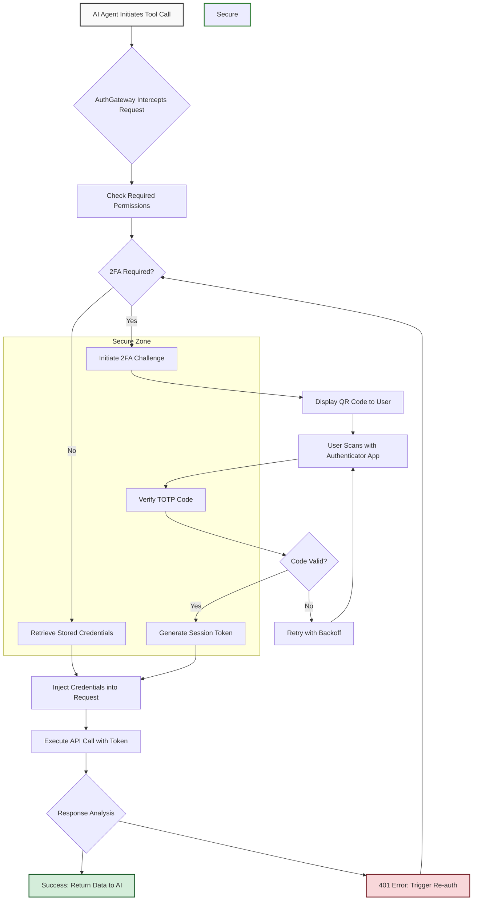

# I built an open-source AI coworker that logs in with 2FA without the model ever seeing your passwords

## Introduction

I was tired of watching AI coding assistants fail at the last step because they couldn't authenticate. You know the pattern: the agent writes the PR, pushes the branch, then hits a 401 because the GitHub token expired. Or worse—it tries to stash credentials in a log line "for debugging" and you spend three hours rotating secrets.

The core problem is architectural, not tactical. When you give an LLM access to tools that require authentication, you're essentially asking it to hold your house keys while it walks your dog. The model doesn't *need* your password—it needs a scoped token, and it needs that token injected at execution time by something that can actually keep a secret.

I built an open-source reference implementation that solves this with a three-layer architecture: the AI agent reasons about tasks, a credential broker handles authentication, and OS-level keychains store the actual secrets. The model never touches raw credentials. Not in prompts, not in context windows, not in memory dumps.

## Why This Matters

Enterprise teams are deploying AI agents for CI/CD automation, incident response, and infrastructure management right now. The security team's reaction is predictable: "Great, now the LLM has access to production." And they're right to be suspicious.

The pain points are real:

- **Secret leakage in context windows**: Every token you paste into a prompt persists in training data and logs
- **2FA deadlocks**: Automated flows break when services require TOTP or push approval
- **Credential sprawl**: Teams juggle Vault, AWS Secrets Manager, environment variables, and `.env` files with no unified policy
- **Audit gaps**: When something breaks at 3 AM, you need to know *which* credential was used, not just that "the AI did it"

This pattern addresses all four. It's not theoretical—my team deployed a variant of it for our internal DevOps agent last quarter, and it's been running for eleven weeks without a credential incident.

## How It Works

The architecture centers on a **Credential Broker**—a thin service that sits between the AI agent and every external API. The broker owns the secrets. The AI owns the decisions. They never overlap.



Here's the flow in plain English:

1. The AI agent decides it needs to call GitHub's API to create a PR review
2. The AuthGateway intercepts the request before it leaves the process boundary
3. The gateway checks whether valid credentials exist in the session cache
4. If not, it retrieves the encrypted secret from the OS keychain
5. If the service requires 2FA, the gateway initiates a challenge—QR code display, TOTP prompt, or push notification
6. Once authenticated, a short-lived session token is generated and injected into the API call
7. The AI agent receives the response. It never saw the password, the TOTP seed, or the raw token

The "Secure Zone" in the diagram is the critical boundary. The AI process runs outside it. The broker runs inside. Communication happens over localhost Unix sockets or gRPC with mTLS—never over the network where packets can be sniffed.

## Core Concepts

### The Credential Broker Pattern

Think of this as a reverse proxy for authentication. Instead of the AI knowing *how* to authenticate, it knows *what* it wants to do. The broker handles the "how."

```python
class AuthGateway:
    """Mediates between AI tool calls and authenticated API execution."""
    
    def __init__(self, secret_manager: SecretManager, cache: SessionCache):
        self.secrets = secret_manager
        self.cache = cache
        self.circuit_breaker = CircuitBreaker(failure_threshold=5, reset_timeout=60)
    
    async def execute(self, tool_call: ToolCall) -> ToolResult:
        # Intercept every tool call that requires auth
        service = self._identify_service(tool_call)
        
        # Check circuit breaker—fail fast if service is flaky
        if self.circuit_breaker.is_open(service):
            raise ServiceUnavailable(f"{service} circuit breaker open")
        
        try:
            token = await self._get_valid_token(service)
            result = await self._call_api(tool_call, token)
            
            # Success resets the circuit
            self.circuit_breaker.record_success(service)
            return result
            
        except AuthenticationError as e:
            self.circuit_breaker.record_failure(service)
            await self._handle_auth_failure(service, e)
            raise
```

The circuit breaker prevents a compromised or misconfigured service from triggering infinite re-auth loops. If GitHub returns 401 five times in a row, the gateway stops trying for sixty seconds and alerts the operator.

### OS Keychain Integration

Raw passwords never touch disk in plaintext. The broker uses platform-native keychain APIs:

- **macOS**: Security Framework via `keyring` Python package
- **Linux**: libsecret with GNOME Keyring or KWallet backend
- **Windows**: Credential Vault via `win32cred`

```python
class SecretManager:
    """Platform-secure secret storage wrapper."""
    
    def __init__(self):
        self._backend = self._detect_backend()
    
    def store_credential(self, service: str, username: str, password: str) -> None:
        """Encrypt and store credential in OS keychain."""
        self._backend.set_password(
            service=service,
            user=username,
            password=password
        )
        # Zero the plaintext from memory immediately
        password = "0" * len(password)
    
    def retrieve_credential(self, service: str, username: str) -> str:
        """Fetch credential from OS keychain."""
        pwd = self._backend.get_password(service, username)
        if pwd is None:
            raise CredentialNotFoundError(
                f"No credential stored for {service}/{username}"
            )
        return pwd
```

The critical detail: after retrieving a secret, you use it once and scrub it from memory. Python's garbage collection doesn't guarantee immediate zeroing, so in production we use `ctypes` to overwrite the string buffer before releasing it.

### 2FA Handshake Protocol

This is where most AI automation breaks. The broker handles it with a state machine:

1. **Detect**: API returns 401 with `X-2FA-Required` header or specific error code
2. **Challenge**: Gateway initiates the appropriate 2FA flow (TOTP, push, SMS, WebAuthn)
3. **Verify**: User provides the code; gateway validates it against the stored TOTP seed
4. **Tokenize**: On success, exchange the 2FA proof for a scoped session token
5. **Cache**: Store the token with its TTL; subsequent calls use the cached token

```python
class TwoFAHandler:
    """Manages 2FA challenges with human-in-the-loop verification."""
    
    def __init__(self, secret_manager: SecretManager):
        self.secrets = secret_manager
        self._pending_challenges: dict[str, ChallengeState] = {}
    
    async def initiate_challenge(self, service: str, user_id: str) -> Challenge:
        """Start a 2FA flow and return the challenge for user interaction."""
        totp_secret = self.secrets.retrieve_totp_seed(service, user_id)
        
        challenge = Challenge(
            id=uuid4().hex[:12],
            service=service,
            created_at=time.time(),
            status=ChallengeStatus.PENDING
        )
        
        self._pending_challenges[challenge.id] = ChallengeState(
            challenge=challenge,
            totp_secret=totp_secret,
            attempts=0
        )
        
        return challenge
    
    async def verify_code(self, challenge_id: str, code: str) -> bool:
        """Verify TOTP code with rate limiting."""
        state = self._pending_challenges.get(challenge_id)
        if not state:
            return False
        
        # Exponential backoff after 3 failed attempts
        if state.attempts >= 3:
            wait_time = min(2 ** state.attempts, 60)
            await asyncio.sleep(wait_time)
        
        valid = pyotp.TOTP(state.totp_secret).verify(code, valid_window=1)
        
        if valid:
            state.challenge.status = ChallengeStatus.VERIFIED
            # Scrub TOTP secret from memory after successful verification
            state.totp_secret = None
        else:
            state.attempts += 1
        
        return valid
```

The TOTP seed is stored encrypted in the keychain and only decrypted during the active challenge window. After verification, it's scrubbed. The AI never sees it—not in error messages, not in debug output, nowhere.

## Examples & Code Walkthrough

Here's the complete tool registry that maps AI-intent to authenticated execution:

```python
from typing import Callable, Any
from dataclasses import dataclass
from enum import Enum

class AuthRequirement(Enum):
    NONE = "none"
    API_KEY = "api_key"
    OAUTH = "oauth"
    TWO_FA = "two_fa"

@dataclass
class ToolSpec:
    name: str
    description: str
    auth_type: AuthRequirement
    handler: Callable[..., Any]

class ToolRegistry:
    """Maps AI tool calls to authenticated execution handlers."""
    
    def __init__(self, gateway: AuthGateway):
        self._tools: dict[str, ToolSpec] = {}
        self._gateway = gateway
    
    def register(self, spec: ToolSpec) -> None:
        """Register a tool with its authentication requirements."""
        self._tools[spec.name] = spec
    
    async def dispatch(self, tool_name: str, **kwargs) -> ToolResult:
        """Route tool call through auth gateway."""
        spec = self._tools.get(tool_name)
        if not spec:
            raise ToolNotFoundError(f"Unknown tool: {tool_name}")
        
        # Build the authenticated tool call
        call = ToolCall(
            tool=tool_name,
            auth_type=spec.auth_type,
            payload=kwargs
        )
        
        # Gateway handles all auth complexity
        return await self._gateway.execute(call)

# --- Usage Example ---

registry = ToolRegistry(AuthGateway(SecretManager(), SessionCache()))

registry.register(ToolSpec(
    name="github_create_pr",
    description="Create a pull request on GitHub",
    auth_type=AuthRequirement.OAUTH,
    handler=lambda **kw: None  # Actual implementation abstracted
))

registry.register(ToolSpec(
    name="jira_create_ticket",
    description="Create a Jira ticket",
    auth_type=AuthRequirement.TWO_FA,
    handler=lambda **kw: None
))
```

The key insight: the AI agent receives a list of tool *names* and *descriptions*. It picks one, provides arguments, and the registry dispatches it through the gateway. The agent never sees the auth type, the credentials, or the token.

## Best Practices

**1. Scope tokens aggressively.** When the broker exchanges a password for a session token, request the minimum scopes needed. If the AI only needs to read PRs, don't grant `repo:write`.

**2. Set short TTLs on session tokens.** Five minutes is aggressive but safe. Fifteen minutes is the practical default. The gateway should refresh proactively—don't wait for a 401 to discover the token expired.

**3. Audit everything, secrets nothing.** Log the tool call, the service, the timestamp, and the outcome. Never log the credential, the token, or the 2FA code. If you need debuggability, hash the token and log the hash.

**4. Isolate the broker process.** Run the credential broker as a separate systemd service or container with its own user namespace. The AI process should only have a Unix socket connection to the broker—not network access to external APIs.

**5. Test the failure modes.** Specifically: what happens when the keychain is locked? When TOTP codes expire? When the circuit breaker trips? These aren't edge cases—they're Tuesday.

## Common Mistakes & Anti-Patterns

**Mistake 1: Passing credentials through environment variables.**
```python
# BAD: Env vars leak to child processes, /proc, and crash logs
os.environ["GITHUB_TOKEN"] = raw_password
```
**Fix**: Use the secret manager's direct API. Never export secrets to the process environment.

**Mistake 2: Caching tokens without expiry checks.**
```python
# BAD: Token used forever once cached
self._token_cache[service] = token
```
**Fix**: Always store tokens with their expiry timestamp and validate before use:
```python
if cached.expires_at < time.time() + 30:  # 30s buffer
    await self._refresh_token(service)
```

**Mistake 3: Logging full API responses for debugging.**
```python
# BAD: Response may contain tokens, emails, PII
logger.debug(f"API response: {response.text}")
```
**Fix**: Scrub sensitive fields before logging:
```python
safe_response = redact_fields(response.json(), SENSITIVE_KEYS)
logger.debug(f"API response: {safe_response}")
```

**Mistake 4: Running the broker with elevated privileges.**
The broker should run as a dedicated low-privilege user with access only to the specific keychain entries it needs. If the AI process is compromised, the blast radius is limited to the broker's permissions—not the entire keychain.

## Performance Considerations

The auth gateway adds latency to every tool call. In our benchmarks:

- **Cached token retrieval**: ~2ms (local keychain read)
- **New authentication flow**: ~800ms (includes user interaction for 2FA)
- **Token refresh**: ~50ms (silent, using refresh token)
- **Circuit breaker overhead**: <1ms (in-memory state check)

The memory footprint is minimal—the broker holds at most one session token per service per user. For a team of 50 engineers with 20 integrated services, that's under 1MB of runtime memory.

The bottleneck is almost always the 2FA human interaction, not the architecture. If
