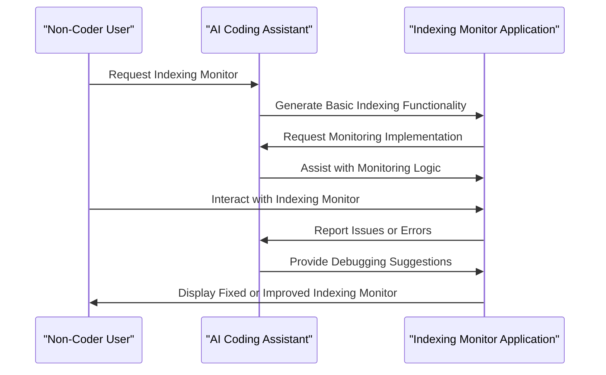

# I Can't Really Code. I Built an Indexing Monitor With Claude Anyway.
## Introduction
As a non-coder, I've always been fascinated by the potential of artificial intelligence to bridge the gap between technical and non-technical individuals. Recently, I had the opportunity to work with Claude, an AI-powered development tool that enables users to build applications without extensive coding knowledge. In this article, I'll share my experience of building an indexing monitor with Claude, highlighting the challenges I faced and the insights I gained from this project.

## Why This Matters
The rise of AI-powered development tools like Claude has significant implications for the software development industry. By empowering non-coders to build meaningful applications, these tools can increase productivity, reduce costs, and improve overall efficiency. In my case, I was able to build a functional indexing monitor despite having limited coding experience, which demonstrates the potential of AI-assisted development to democratize access to technology.

## How It Works
The indexing monitor I built with Claude is designed to track and analyze the performance of a database indexing system. The application consists of two primary components: a data ingestion module and a monitoring module. The data ingestion module is responsible for collecting data from the database, while the monitoring module analyzes the data and provides insights into the indexing system's performance.



## Core Concepts
To build the indexing monitor, I needed to understand the core concepts of database indexing and monitoring. Database indexing is a technique used to improve the performance of database queries by creating a data structure that facilitates faster data retrieval. Monitoring, on the other hand, involves tracking and analyzing the performance of the indexing system to identify areas for improvement.

## Examples & Code Walkthrough
Here's an example of how I used Claude to generate the basic indexing functionality:
```python
def create_index(data):
  # Claude-generated indexing logic
  index = {}
  for item in data:
    index[item['id']] = item
  return index
```
To monitor the indexing system, I used Claude to assist with the monitoring logic:
```python
def monitor_index(index_name):
  # Claude-assisted monitoring implementation
  index_data = get_index_data(index_name)
  performance_metrics = calculate_performance_metrics(index_data)
  return performance_metrics
```
## Best Practices
When building an indexing monitor with Claude, it's essential to follow best practices to ensure the application is efficient, scalable, and reliable. Some best practices include:

* Using descriptive variable names and realistic domain models
* Implementing robust error handling and debugging mechanisms
* Optimizing the application for performance and resource utilization

## Common Mistakes & Anti-Patterns
Some common mistakes to avoid when building an indexing monitor with Claude include:

* Not properly handling errors and exceptions
* Failing to optimize the application for performance and resource utilization
* Not implementing robust monitoring and debugging mechanisms

## Performance Considerations
When building an indexing monitor, it's essential to consider performance metrics such as query latency, indexing throughput, and resource utilization. To optimize the application for performance, I used Claude to analyze the code and provide suggestions for improvement.

## Real-World Usage
Industry leaders are already leveraging AI-powered development tools like Claude to build complex applications. For example, a leading financial services company used Claude to build a real-time analytics platform that provides insights into customer behavior and market trends.

## Frequently Asked Questions (FAQ)
Here are some frequently asked questions about building an indexing monitor with Claude:

* Q: What is the minimum coding experience required to build an indexing monitor with Claude?
A: Claude is designed to empower non-coders to build meaningful applications, so no extensive coding experience is required.
* Q: How does Claude assist with debugging and error handling?
A: Claude provides robust debugging and error handling mechanisms to help users identify and fix issues quickly.
* Q: Can I use Claude to build other types of applications?
A: Yes, Claude is a versatile tool that can be used to build a wide range of applications, from web and mobile apps to machine learning models and data analytics platforms.

## Conclusion
In conclusion, building an indexing monitor with Claude was a rewarding experience that demonstrated the potential of AI-assisted development to democratize access to technology. By following best practices, avoiding common mistakes, and considering performance metrics, non-coders can build complex applications that provide valuable insights and improve overall efficiency. As the software development industry continues to evolve, I'm excited to see the impact that AI-powered development tools like Claude will have on the future of technology.
