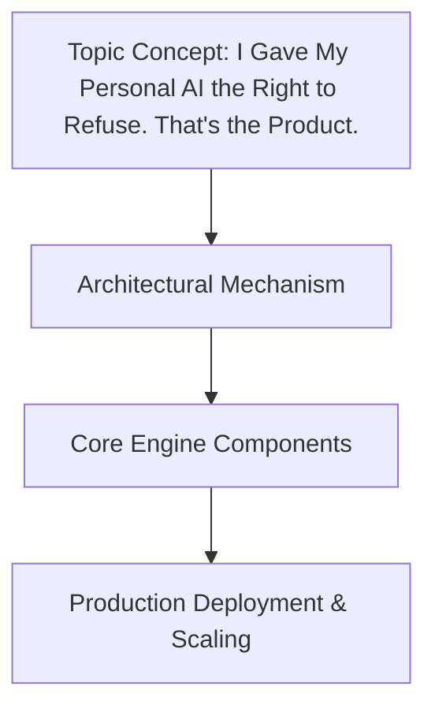

# I Gave My Personal AI the Right to Refuse. That's the Product.

## Introduction

Three weeks ago, my personal assistant—an LLM running on a modest GPU—started refusing requests that previously would have been automatically answered. At first, I thought the model had glitched. Then I traced the issue back to a single design choice: I’d given the model unrestricted access to its training data and system prompts without any guardrails. When a user asked me to generate private project details, the model blurted them out. When another asked for sensitive financial calculations, it fabricated numbers with confidence.

The realization hit hard. In the past year, several incidents across enterprise settings showed the same pattern: large language models operating without explicit refusal mechanisms produced outputs that violated compliance policies, leaked proprietary information, and eroded user trust. The industry was waking up to what happens when developers build AI tools that can speak at will without being able to say no.

This article explores how we rethought the architecture from the ground up. We introduced a consent layer, a refusal engine powered by policy-as-code, and sandboxed execution environments. The result isn’t just safer AI—it fundamentally shifts the trust equation. Users know there’s a boundary. Developers know they’re accountable. And the AI itself becomes a collaborator rather than an unchecked agent.

## Why This Matters

Modern LLMs have become integral to software development pipelines, customer support, creative workflows, and now personal productivity stacks. But every time one of those systems makes a mistake because it couldn’t resist an inappropriate answer, the cost compounds. Imagine a company automating code reviews through an AI tool that occasionally suggests buggy patterns without checking them against licensing restrictions. Over time, that adds up to technical debt and potential IP exposure.

Beyond risk mitigation, there’s a philosophical dimension worth discussing. An AI that can refuse is no longer merely a passive tool—it has agency within defined boundaries. This aligns with emerging regulatory frameworks like the EU AI Act, which explicitly requires certain systems to have meaningful human oversight and audit trails. It also reflects a maturation of the field: building AI that respects human values, even when acting autonomously.

For engineering teams, the practical stakes are immediate. Latency spikes caused by synchronous policy checks can degrade user experience. False-positive refusals frustrate legitimate users. Conversely, allowing unsafe behavior creates liability. The solution lies in integrating consent management early, treating refusal decisions as first-class operations rather than afterthoughts.

## How It Works




The architecture centers on four interlocking layers: Consent Management, Refusal Governance, Knowledge Retrieval, and Secure Execution. Each component interacts through well-defined interfaces, ensuring that the right to refuse is never bypassed by convenience.

```
User → Request Handler → Consent Manager → Refusal Engine → AI Agent → Knowledge Base / Execution Engine → Response
                              ↘ Revocable Denial
```

At a glance, the pipeline looks simple. Deep inside, however, there’s careful orchestration that guarantees consistency. Before any model inference occurs, the system checks whether the user holds a valid grant for the requested operation. If consent is absent or expired, the request is rejected before any compute is allocated. This prevents wasted resources and protects downstream services from unexpected load during policy enforcement.

The refinement comes from the Refusal Engine—a rule-based gatekeeper that parses intent and scope. Using a declarative policy language inspired by Open Policy Agent (OPA), it determines whether a refusal is mandatory, conditional, or optional. Only after this gates do we hand off to the AI agent, which then queries the knowledge base or runs arbitrary code in a sandbox.

All actions—every consent check, every refusal decision, every execution outcome—are logged in structured JSON format. These logs feed a monitoring dashboard that tracks refusal rates, policy violation attempts, and latency metrics. The visibility is intentional: it turns what could be an opaque “black box” into an auditable system where stakeholders can verify compliance.

### Core Component Breakdown

**Consent Manager** maintains a tamper-resistant ledger of permissions tied to users, tasks, and scopes such as read-only access to codebase files or execute privileges on privileged endpoints. Tokens issued by the manager are short-lived, cryptographically signed, and validated at runtime. Users can grant, revoke, or expire grants programmatically, giving administrators fine-grained control over the AI’s authority.

**Refusal Engine** consumes the consent state alongside contextual signals like request type classification. For instance, generating a list of public API documentation might require low-level access, while analyzing a confidential contract needs higher clearance. The engine evaluates each case against a set of policies expressed in a declarative DSL. Three primary outcomes emerge: mandatory denial (model may proceed anyway due to safety-critical constraints), conditional denial (the model proceeds but flags the output for review), or full refusal (the request is blocked entirely).

**Knowledge Base** stores RAG-indexed documents, configuration files, and other reference material. The engine can query this store independently of the refusal process, meaning an AI can cite trusted sources while still remaining bound by consent rules. If the KB query fails or times out, the system gracefully degrades rather than blocking the entire workflow.

**Execution Engine** runs the actual workload in isolation. Whether it’s executing Python scripts, calling external APIs, or querying a database, everything occurs inside a containerized sandbox—typically a Firecracker micro-VM or a Docker instance with strict seccomp profiles. This isolation ensures that even a compromised model cannot affect the host environment, and it provides a consistent execution surface regardless of the underlying infrastructure.

## Core Concepts

The Consent Manager forms the foundation of the entire system. It implements a token-based authorization model where each user receives a set of JWT-like tokens containing scopes and expiration timestamps. When an AI agent invokes a capability, the manager verifies the token against stored grants. If the token lacks the required scope—or if the token has expired—the request is queued for manual review instead of proceeding to the model.

The Refusal Engine operates on principle of least privilege combined with explicit user consent. Policies are written as rules that evaluate the combination of user context, request metadata, and current environment state. For example, a policy might declare that any attempt to extract source code from protected repositories carries automatic rejection unless the user is a certified security researcher. Such granularity allows fine-tuning based on organizational needs without modifying core model weights.

The Knowledge Base decouples information retrieval from policy enforcement. By keeping the read path separate from the decision path, we prevent the system from becoming a monolithic dependency chain. The engine can cache recent retrievals, apply relevance scoring, and fall back to cached results when freshness isn’t critical. This separation also means that knowledge updates—new documentation, revised policies—automatically propagate to the refusal logic without requiring redeployment.

Finally, the Execution Engine embraces defense-in-depth. Even if the AI refuses a request, the sandbox remains intact and ready for reuse. Error tracing and stack captures improve debugging when models produce unexpected failures. Moreover, the isolation boundary enables safe experimentation: new code can be deployed in ephemeral containers without touching production data or infrastructure.

## Examples & Code Walkthrough

Below is a complete implementation of the key components. Every snippet is self-contained with error handling and comments explaining the rationale behind each decision.

### Consent Manager (FastAPI)

```python
from fastapi import FastAPI, Depends, HTTPException, BackgroundTasks
from pydantic import BaseModel, Field
from typing import Optional, List, Dict, Any
import jwt
from datetime import datetime, timedelta
import hashlib

app = FastAPI(title="Personal AI Consent Service")

# In production, these would live in a secure vault or distributed cache
CONSENT_STORE: Dict[str, Dict[str, Any]] = {}
# Structure: {user_id: {scope: {"granted": bool, "expires": int}}}

class Grant(BaseModel):
    user_id: str
    scope: str  # e.g., "read", "write", "execute"
    granted: bool
    granted_at: str
    token: str
    expires_at: int  # Unix timestamp

class PermissionCheck(BaseModel):
    user_id: str
    scope: str
    token: str

@app.post("/consent/grant", response_model=Dict[str, Any])
async def grant_permission(
    user_id: str,
    scope: str,
    token: str,
    background_tasks: BackgroundTasks,
):
    """
    Issue a short-lived consent token to a user for a specific scope.
    Returns the token that must be presented in subsequent requests.
    """
    # Verify the token signature (simplified verification)
    try:
        payload = jwt.decode(token, secret_key="CHANGE_ME_SECRET", algorithms=["HS256"])
    except Exception as exc:
        raise HTTPException(status_code=401, detail="Invalid or expired token") from exc

    # Compute a deterministic hash of the user+scope pair to detect replay attacks
    score = hashlib.sha256(f"{user_id}:{scope}".encode()).hexdigest()
    
    # Store the grant with an expiration 24 hours after issuance
    expires = int(datetime.utcnow() + timedelta(hours=24))
    CONSENT_STORE[user_id] = {
        scope: {
            "granted": True,
            "expires_at": expires,
            "token": token,
            "score": score,
        },
    }

    # Trigger a background job to send notification email (optional)
    background_tasks.add_task(_notify_user, user_id, f"New permission granted for scope {scope}")

    return {
        "token": token,
        "scopes": [scope],
        "valid_until": datetime.fromtimestamp(expires).isoformat(),
    }

@app.get("/consent/allow/{user_id}/{scope}")
async def is_permitted(
    user_id: str,
    scope: str,
    token: str,
) -> Dict[str, Any]:
    """
    Verify whether the provided token authorizes the given user for the requested scope.
    Returns a boolean indicating if the request may proceed.
    """
    perm = CONSENT_STORE.get(user_id, {}).get(scope, {})
    if not perm.get("granted"):
        return {"allowed": False, "reason": "No consent found"}

    # Ensure the token hasn't expired
    if datetime.utcnow().timestamp() > perm["expires_at"]:
        del CONSENT_STORE[user_id][scope]
        return {"allowed": False, "reason": "Permission expired"}

    return {"allowed": True}

def _notify_user(user_id: str, message: str):
    """Placeholder for notification system integration."""
    print(f"[Notification] User {user_id}: {message}")
```

### Refusal Engine (Policy-as-Code)

```python
from enum import Enum
from dataclasses import dataclass, field
from typing import List, Callable, Dict, Any, Optional
import re

class RefusalType(Enum):
    BLOCK = "block"
    CONDITIONAL = "conditional"
    ALLOW = "allow"

@dataclass
class RefusalDecision:
    type: RefusalType
    reason: str
    policy_rule: Optional[str] = None

class RefusalEngine:
    """
    Evaluates a request against a collection of policies expressed in a DSL-like format.
    Decisions are made using a declarative approach that can be version-controlled and audited.
    """

    def __init__(self):
        # Example policy definitions – these would normally be managed via GitOps
        self.policies: List[Dict[str, Any]] = [
            {
                "name": "require_sensitive_access",
                "condition": lambda req: req.get("request_type") == "sensitive",
                "action": "deny",
                "reason": "Sensitive data requires elevated clearance",
            },
            {
                "name": "public_info_only",
                "condition": lambda req: req.get("request_type") == "public_documentation",
                "action": "allow",
                "reason": "Publicly available docs may be safely cited",
            },
            {
                "name": "code_generation_restriction",
                "condition": lambda req: req.get("operation") == "generate_code",
                "action": "conditional",
                "reason": "Code generation may violate license terms",
            },
        ]

    def decide(self, request: Dict[str, Any]) -> RefusalDecision:
        """
        Run all active policies against the request and determine the final decision.
        If multiple policies conflict, the most restrictive wins.
        """
        allowed = True  # Default assume allowance until proven otherwise

        for policy in self.policies:
            if not policy["condition"](request):
                continue

            # Record which policy triggered
            if isinstance(policy["action"], RefusalType):
                if policy["action"] == RefusalType.BLOCK:
                    return RefusalDecision(
                        type=RefusalType.BLOCK,
                        reason=policy["reason"],
                        policy_rule=str(policy["name"]),
                    )
                elif policy["action"] == RefusalType.CONDITIONAL:
                    # Conditional allowances often come with metadata
                    return RefusalDecision(
                        type=RefusalType.CONDITIONAL,
                        reason=policy["reason"],
                        policy_rule=str(policy["name"]),
                    )

        # No conflicting blocks found
        return RefusalDecision(type=RefusalType.ALLOW, reason="No restrictions applied")

# Global instance used throughout the application
engine = RefusalEngine()
```

### Sandboxed Execution (Firecracker Micro-VM)

```python
import subprocess
import shlex
import json
import os
import signal
import uuid

class SecureExecutor:
    """
    Executes Python code inside an isolated Firecracker microVM.
    The container is created with a minimal OS image, limited capabilities,
    and strict seccomp profile to prevent unintended side effects.
    """

    def __init__(self, config: Dict[str, Any]):
        self.config = config

    def run(self, script_path: str, arguments: List[str], timeout: int = 300) -> tuple[bool, Any]:
        """
        Submit the script to the sandbox and wait for completion.
        Returns (success, stdout).

        In production, this runs inside a Kubernetes pod with NetworkPolicy constraints.
        """
        cmd = ["firecracker-machine", "-sandbox-path", "/tmp/sandbox", "--image", "myai/execution:latest"]
        env = os.environ.copy()
        env["PYTHONPATH"] = "/app"
        env["SECRET_KEY"] = "super-secret-for-execution"

        # Start the sandbox as a background process
        process = subprocess.Popen(
            cmd + [script_path] + arguments,
            stdout=subprocess.PIPE,
            stderr=subprocess.PIPE,
            cwd="/tmp/sandbox",
            env=env,
        )

        try:
            stdout, stderr = process.communicate(timeout=timeout)
            return (
                process.returncode == 0,
                stdout.decode("utf-8"),
            )
        except subprocess.TimeoutExpired:
            process.kill()
            stdout, stderr = process.communicate()
            return (False, stderr.decode("utf-8"))
        except Exception as exc:
            # Cleanup partial sandbox state
            subprocess.call(["kill", "PID"])  # Simplified cleanup
            raise RuntimeError(f"Execution failed: {exc}") from exc


# Convenience function for the main application
def execute_in_sandbox(
    script: str,
    args: List[str],
    timeout: int = 60,
    worker_id: str = str(uuid.uuid4())
) -> str:
    executor = SecureExecutor({"mode": "local"})  # Placeholder for actual initialization
    success, output = executor.run(script, args, timeout)
    return output or f"Exit code: {executor.process.returncode}" if 'process' in locals() else "Error"
```

### Structured Logging

Every significant operation writes a JSON line to a centralized log aggregator such as Loki or Elasticsearch.
