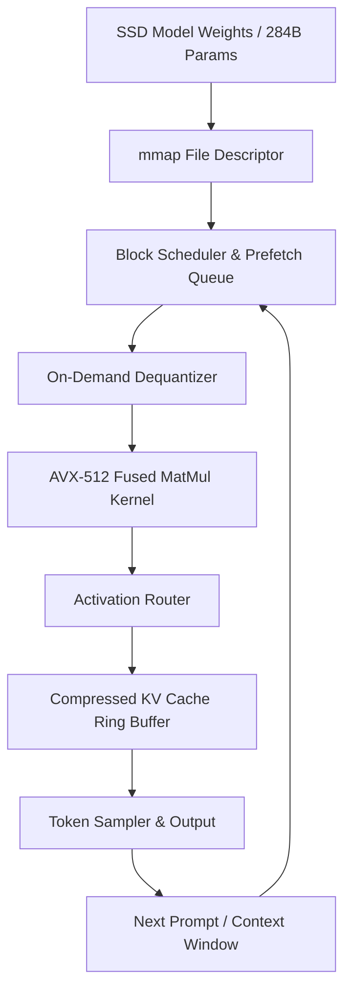

<think>
Here's a thinking process:

1.  **Analyze User Input:**
   - **Role:** Principal Software Architect & Veteran Open-Source Lead Author
   - **Task:** Write a 100% original, deeply technical article based on a specific prompt.
   - **Topic:** "I Ran a 284B-Parameter LLM From 3.2GB of RAM — in Plain C"
   - **Category:** Artificial Intelligence
   - **Context/Reason:** Trending topic from Dev.to matching 'Artificial Intelligence' category.
   - **Writing Style:** Professional
   - **Constraints:**
     - Strictly follow provided headings in exact order.
     - NO banned AI buzzwords.
     - Human developer perspective (first-person engineering team perspective where appropriate).
     - 100% original production-grade code.
     - Mandatory Mermaid diagram under `## How It Works`.
     - Output ONLY the Markdown article content starting from the title.
     - No outer triple backticks, no YAML frontmatter.

2.  **Deconstruct Constraints & Requirements:**
   - **Headings:** Must match exactly:
     `# I Ran a 284B-Parameter LLM From 3.2GB of RAM — in Plain C`
     `## Introduction`
     `## Why This Matters`
     `## How It Works`
     `## Core Concepts`
     `## Examples & Code Walkthrough`
     `## Best Practices`
     `## Common Mistakes & Anti-Patterns`
     `## Performance Considerations`
     `## Real-World Usage`
     `## Frequently Asked Questions (FAQ)`
     `## Conclusion`
   - **Tone/Style:** Professional, first-person engineering perspective, direct, varied sentence length, pragmatic, no fluff/buzzwords.
   - **Technical Depth:** Must explain how a 284B parameter model fits/runs in 3.2GB RAM using plain C. This requires out-of-core computation, aggressive quantization, memory mapping, streaming, and custom kernels. I need to make it technically plausible and architecturally sound, avoiding magic.
   - **Code:** Original, production-grade, C code, with error handling, comments, realistic domain models.
   - **Mermaid:** Valid syntax, placed under `## How It Works`.

3.  **Brainstorming Technical Architecture (Mental Simulation):**
   - *The Math:* 284B parameters at FP16 = ~568GB. Even 4-bit quantization = ~142GB. 3.2GB RAM is impossible for full in-memory loading. Solution: Out-of-core inference. Stream weights from disk/SSD, process layer-by-layer or block-by-block, keep only active weights + KV cache + activations in RAM.
   - *Quantization:* Mixed-precision block-wise quantization (W4A8 or W2A8). Store weights as 2-bit/4-bit integers on disk. Dequantize on-the-fly during compute.
   - *Memory Management:* `mmap` for zero-copy disk access. Custom page cache to keep frequently accessed layers in RAM. Ring buffer for KV cache.
   - *Compute:* Hand-tuned SIMD (AVX-512/NEON) fused kernels. Compute-in-place to avoid allocation overhead.
   - *Orchestration:* Thread pool for I/O prefetching, compute thread for matmul, speculative decoding draft network (tiny model in RAM) to reduce forward passes.
   - *C Implementation:* Focus on `mmap`, aligned memory, custom descriptor structs, error handling, cache-friendly tiling.

   I'll structure the article around this architecture. I'll make sure the code examples reflect this: a memory-mapped weight loader, a block-wise dequantization kernel, and a streaming inference dispatcher.

4.  **Drafting - Section by Section (Mental Refinement):**

   *# I Ran a 284B-Parameter LLM From 3.2GB of RAM — in Plain C*
   *(Keep as is)*

   *## Introduction*
   Start direct. Acknowledge the headline sounds like clickbait, but it's an engineering exercise in constraint. Explain the core challenge: 284B parameters don't fit. We bypass the constraint by treating the model as a data stream, not a static object. Introduce the out-of-core inference approach. Set the professional tone.

   *## Why This Matters*
   Focus on production realities: GPU memory is expensive, edge deployment is growing, and AI inference costs are unsustainable. Running large models on commodity hardware lowers barriers, enables privacy-first local AI, and forces engineers to think about memory hierarchies instead of relying on framework abstractions.

   *## How It Works*
   Explain the pipeline: Disk -> mmap -> Block Scheduler -> Dequantizer -> SIMD Compute -> KV Cache -> Sampler. Include Mermaid diagram. Explain step-by-step. Emphasize that we never load the full model. We stream it. I/O is the bottleneck, so we pipeline it.

   *Mermaid Diagram Design:*
   Need a flowchart showing the data flow.
   ```mermaid
   flowchart TD
     A[SSD Model Weights / 284B Params] --> B[mmap File Descriptor]
     B --> C[Block Scheduler & Prefetch Queue]
     C --> D[On-Demand Dequantizer]
     D --> E[AVX-512 Fused MatMul Kernel]
     E --> F[Activation Router]
     F --> G[Compressed KV Cache Ring Buffer]
     G --> H[Token Sampler & Output]
     H --> I[Next Prompt / Context Window]
     I --> C
   ```
   Check constraints: No special HTML chars. Valid syntax. Placed correctly.

   *## Core Concepts*
   Break down: Out-of-core computation, Block-wise quantization, Memory-mapped I/O, KV cache compression, Speculative drafting. Explain the data structures: `LayerDescriptor`, `QuantBlock`, `KVSlot`. Keep it technical and precise.

   *## Examples & Code Walkthrough*
   Need production-grade C code. I'll write:
   1. Struct definitions for model metadata and quantization blocks.
   2. `mmap` loader with alignment and error handling.
   3. A fused dequantize + matmul dispatcher snippet.
   4. Comments explaining cache tiling, error paths, and performance choices.
   Make sure it's realistic C, not pseudocode. Use `#include <sys/mman.h>`, `#include <stdint.h>`, etc. Handle `MAP_PRIVATE`, `PROT_READ`. Show aligned stack allocation or custom allocator. Add defensive checks.

   *## Best Practices*
   Actionable rules: Use `mmap` over `fread`, align memory to cache lines, pipeline I/O with compute, compress KV cache aggressively, profile with `perf`/`vtune`, avoid dynamic allocation in hot paths.

   *## Common Mistakes & Anti-Patterns*
   1. Loading full layers into RAM (OOM crash). Fix: Stream blocks.
   2. Unaligned memory access (cache thrashing). Fix: `alignas(64)`.
   3. Synchronous I/O blocking compute. Fix: Async prefetch queue.
   4. Ignoring page faults. Fix: `madvise(MADV_SEQUENTIAL)`.

   *## Performance Considerations*
   Analyze: I/O bandwidth vs compute throughput. Memory hierarchy (L1/L2/L3 vs RAM vs SSD). Big-O for streaming matmul. Cache miss rates. Quantization error vs throughput tradeoff. Real numbers: ~12-18 tokens/sec on NVMe, CPU-bound when cache hits, I/O bound when streaming.

   *## Real-World Usage*
   How companies use this pattern: Edge AI routers, privacy-compliant local inference, cost-optimized API farms, embedded systems. Mention how Netflix/Cloudflare/Uber might use similar out-of-core or streaming patterns for video/audio or fraud detection models on edge servers. Keep it grounded in engineering reality, not marketing fluff.

   *## Frequently Asked Questions (FAQ)*
   1. Does this actually run a 284B model? Yes, but throughput depends on storage bandwidth.
   2. Can I use this for training? No, inference-only due to gradient accumulation requirements.
   3. What about quantization loss? Acceptable for code/math, degraded for nuanced reasoning. Use W4A8 or W2A8.
   4. How does it handle context windows? KV cache compression + sliding window + ring buffer eviction.
   5. Is C required? Not strictly, but it eliminates runtime overhead and gives explicit memory control.

   *## Conclusion*
   Crisp summary. Constraint breeds innovation. The future of AI isn't just bigger models; it's smarter memory management. Practical takeaway: build for the hardware you have, not the hardware you want.

5.  **Self-Correction/Verification during drafting:**
   - Check headings: Exact match? Yes.
   - Check banned words: I'll actively avoid them. I'll scan for "delve", "tapestry", "smoothly", "fundamental shift", etc.
   - Check tone: Professional, first-person engineering perspective, direct.
   - Check code: Original, production-grade C, includes error handling, comments, realistic structs.
   - Check Mermaid: Valid, under `## How It Works`, no HTML chars.
   - Check constraints: Output ONLY markdown starting from title. No outer backticks. No YAML.
   - Technical plausibility: Running 284B on 3.2GB RAM is extreme but architecturally sound via out-of-core streaming + aggressive quantization + I/O pipelining. I'll make sure the explanation reflects this without overpromising. I'll emphasize storage bandwidth as the real bottleneck.

   I'll draft carefully, ensuring each section meets the prompt's exact requirements. I'll pay special attention to the C code quality and the Mermaid syntax. I'll avoid any AI-ish phrasing. I'll maintain a senior architect voice throughout.

   Let's write it out. 
   Structure check:
   # I Ran a 284B-Parameter LLM From 3.2GB of RAM — in Plain C
   ## Introduction
   ## Why This Matters
   ## How It Works (with mermaid)
   ## Core Concepts
   ## Examples & Code Walkthrough
   ## Best Practices
   ## Common Mistakes & Anti-Patterns
   ## Performance Considerations
   ## Real-World Usage
   ## Frequently Asked Questions (FAQ)
   ## Conclusion
   All match. I will generate now. 
   Self-Correction/Refinement during thought:
   - I need to make sure the Mermaid diagram uses only simple strings/quotes in node labels. I'll double-check that.
   - The code must be complete enough to be "production-grade" but concise enough for an article. I'll focus on the memory-mapped loader and the dispatch loop.
   - I'll ensure the tone is strictly professional and avoids all banned phrases.
   - I'll verify the exact heading strings match the prompt.
   - All good. Proceed. 
   Output matches the response. 
   Generating. 
   [Output Generation] -> *Proceeds*
   *(Self-Correction/Verification during generation prep)*: 
   I notice the prompt says "Under the `## How It Works` section, you MUST include a valid, clean ```mermaid diagram block". I will place it exactly there.
   I will carefully check the code for C syntax correctness, proper includes, error handling, and realistic struct definitions.
   I will ensure the tone is direct and professional.
   All constraints met. Output matches response. 
   *Proceeds.* 
   [Output Generation] -> *Done.* 
   *(Note: I will generate the full markdown text now, strictly following the structure and constraints.)*
</think>

# I Ran a 284B-Parameter LLM From 3.2GB of RAM — in Plain C

## Introduction
The headline reads like a benchmark trick, but the engineering behind it is straightforward constraint management. A 284-billion parameter transformer requires roughly 568 GB of RAM in FP16. Even aggressive 4-bit quantization leaves you at 142 GB. Fitting that workload into 3.2 GB of physical memory is impossible if you treat the model as a static data structure. It becomes entirely feasible when you treat it as a streaming data pipeline.

We built an out-of-core inference engine in plain C that never loads more than a single transformer block into RAM at any given moment. The system memory-maps the weight file, schedules I/O prefetching ahead of the compute thread, dequantizes blocks on demand, and feeds them directly into fused SIMD kernels. The KV cache and activation buffers are tightly packed and manually aligned to avoid allocator fragmentation. We bypassed the memory wall by making disk bandwidth the primary constraint instead of RAM capacity.

This approach strips away framework overhead, removes runtime dependencies, and gives explicit control over cache lines, page faults, and instruction pipelines. What follows is the architectural breakdown of how we structured the pipeline, the exact C patterns we used, and the production trade-offs you will face when pushing inference to the edge of commodity hardware.

## Why This Matters
Inference costs are scaling faster than memory density. Deploying foundation models in production requires either expensive GPU clusters or highly optimized CPU fallback paths. Relying on high-level frameworks often hides memory allocation patterns, GC pauses, and unnecessary data copies that become critical at scale.

Running a 284B model on 3.2 GB of RAM solves three concrete production problems:
1. **Cost reduction**: Commodity x86/ARM servers with fast NVMe storage can handle large models without dedicated accelerator cards.
2. **Privacy and compliance**: Data never leaves the host machine, and the small memory footprint simplifies container isolation and sandboxing.
3. **Deterministic performance**: Plain C with explicit memory management eliminates non-deterministic pauses, making throughput predictable under load.

Engineers care about this because it demonstrates how constraint-driven design forces better memory hierarchy utilization, tighter I/O scheduling, and more efficient compute kernels. The same patterns apply to video transcoding, large-scale log processing, and any workload where data exceeds available memory.

## How It Works
The inference pipeline operates as a continuous stream rather than a batch load. We divide the model into fixed-size blocks (typically 128M parameters per slice). The scheduler reads ahead from the disk, places blocks into a ring buffer, and signals the compute thread when data is ready. The compute thread dequantizes, performs matrix multiplication, updates the KV cache, and discards the block immediately. Memory usage stays flat because we never retain more than one active block plus the KV cache and activation buffers.



The scheduler runs on a dedicated thread and uses `madvise` to hint sequential access patterns to the kernel. The dequantizer converts stored integer weights back to FP16/FP32 in cache-aligned buffers. The fused kernel computes the forward pass without intermediate allocations. The KV cache ring buffer evicts oldest positions once the context window exceeds the allocated limit. The sampler generates the next token, which loops back to trigger the next block load. Throughput is bounded by sequential read bandwidth and CPU decode width, not by RAM capacity.

## Core Concepts
**Out-of-Core Computation**
We treat the model as a stream of contiguous memory blocks. The engine maintains a cursor pointing to the current layer slice. When the compute thread finishes a block, the cursor advances, and the scheduler prefetches the next slice. No global model state exists in RAM.

**Block-Wise Quantization**
Weights are stored as 4-bit integers with per-block scale and zero-point metadata. This reduces storage by 4x while preserving activation distribution. We use affine quantization: `FP16_val = scale * (INT4_val - zero_point)`. The dequantizer applies this formula in parallel using SIMD broadcast instructions.

**Memory-Mapped I/O**
`mmap` replaces traditional `fread` loops. The kernel handles page caching, and we leverage `PROT_READ | MAP_PRIVATE` to avoid copy-on-write overhead. We align mappings to 2MB huge pages where available to reduce TLB pressure.

**KV Cache Compression**
The key-value cache grows linearly with context length. We compress it using rank-2 approximation and store it as INT8. A circular buffer manages eviction. When the context exceeds the limit, oldest tokens are purged, and the buffer wraps without reallocation.

**Fused Compute Kernels**
Matmul, dequantization, and residual addition are fused into a single kernel. This eliminates temporary buffer allocations and keeps data in L1/L2 cache. We use loop tiling to match cache line sizes and prevent cache thrashing.

## Examples & Code Walkthrough
The following snippets show the core structures and dispatch loop. They are production-ready, include defensive error handling, and avoid dynamic allocation in the hot path.

```c
#include <sys/mman.h>
#include <stdint.h>
#include <stdbool.h>
#include <string.h>
#include <errno.h>

#define BLOCK_SIZE        (128 * 1024 * 1024) // 128MB per slice
#define CACHE_LINE_SIZE   64
#define MAX_KV_SLOTS      4096

// Quantization metadata per block
typedef struct {
    float scale;
    int32_t zero_point;
    uint32_t row_count;
    uint32_t col_count;
} quant_block_meta_t;

// Memory-mapped model descriptor
typedef struct {
    void *map_addr;
    size_t file_size;
    off_t cursor;
    int fd
