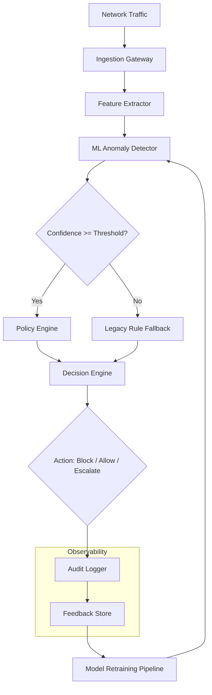

# I Shipped a Security Product I Cannot Fully Audit

## Introduction
When we decided to add a machine‑learning anomaly detector to our network‑security gateway, we knew we were introducing a component that could not be exhaustively verified with traditional static analysis or unit tests. The model’s behavior emerges from millions of weight parameters and the distribution of live traffic, making a complete audit infeasible. Yet the product had to ship because the detection uplift was measurable and the risk of not acting was higher than the uncertainty we accepted. This article walks through the architecture we built to bound that uncertainty, the operational practices that give us confidence, and the trade‑offs we made along the way.

## Why This Matters
Security teams are under pressure to adopt AI‑driven threat detection because signature‑only approaches miss novel attack patterns. At the same time, auditors and compliance frameworks still expect reproducible, explainable controls. If you ship a security control that you cannot fully audit, you expose the organization to regulatory risk and erode trust in the security posture. Demonstrating a principled way to ship such a system—while providing observable safeguards—helps engineers navigate the tension between innovation and assurance.

## How It Works
Our gateway processes traffic in a pipeline that isolates the ML model behind deterministic gates and observable feedback loops. The diagram below shows the data flow and decision points.



**Step‑by‑step explanation**

1. **Ingestion Gateway** normalizes packets, strips irrelevant headers, and enforces basic rate limits.  
2. **Feature Extractor** converts raw flows into a fixed‑length vector (e.g., byte‑entropy, packet‑size histograms) that the model expects.  
3. **ML Anomaly Detector** returns a scalar anomaly score and a confidence value derived from softmax entropy or Monte‑Carlo dropout variance.  
4. **Confidence Gate** compares the confidence to an operationally tuned threshold (e.g., 0.85). If confidence is low, the traffic is routed to a deterministic rule set that we can fully audit.  
5. **Policy Engine** applies business‑level policies (allow‑list, geo‑block, etc.) to the anomaly score.  
6. **Decision Engine** consolidates the policy output into a final action: block, allow, or escalate to a SOC analyst.  
7. **Audit Logger** records a structured entry containing: request ID, feature hash, model version, confidence, gate outcome, policy hits, and final action. No raw payload is stored for privacy.  
8. **Feedback Store** aggregates logger entries over a window (e.g., 5 minutes) and feeds labeled examples back to the retraining pipeline.  
9. **Model Retraining Pipeline** periodically rebuilds the model using the latest labeled data, then promotes the new artifact through a canary stage before full rollout.

The key idea is that the ML component never makes a final enforcement decision on its own; its output is always mediated by a confidence gate and a fallback path that is fully auditable. Observability is built into every step, enabling post‑hoc forensic analysis even when the model’s internal reasoning is opaque.

## Core Concepts
- **Confidence‑Gated Fallback** – A deterministic branch that activates when the model’s self‑reported certainty drops below a threshold.  
- **Shadow Validation** – Running the ML detector in parallel with the legacy rule set to measure drift without affecting traffic.  
- **Immutable Audit Trail** – Append‑only logs that capture enough context to reconstruct the decision process for any given flow.  
- **Canary Model Promotion** – Deploying new model versions to a small percentage of traffic first, monitoring key metrics (false‑positive rate, latency escalation) before wider rollout.  
- **Bounded Uncertainty** – Treating the unknown portion of the model’s behavior as a quantified risk (e.g., “< 2 % of traffic may be mis‑classified at 99 % confidence”) and allocating mitigations accordingly.

## Examples & Code Walkthrough
Below are simplified but production‑grade snippets that illustrate the confidence gate and audit logger. The code is written in Python‑like pseudocode for clarity; the same ideas apply to Go, Java, or Rust implementations.

```python
# confidence_gate.py
from typing import NamedTuple
import structlog

logger = structlog.get_logger()

class DetectionResult(NamedTuple):
    anomaly_score: float   # 0.0 (benign) → 1.0 (malicious)
    confidence: float      # 0.0 → 1.0, higher = more certain
    model_version: str

def route_traffic(result: DetectionResult) -> str:
    """
    Returns the path the traffic should take:
    - 'ml_policy'   : confidence high enough to use ML output
    - 'fallback'    : confidence low, use deterministic rules
    """
    CONFIDENCE_THRESHOLD = 0.85  # tuned via production canary experiments

    if result.confidence >= CONFIDENCE_THRESHOLD:
        logger.info(
            "ml_path_selected",
            anomaly_score=result.anomaly_score,
            confidence=result.confidence,
            model_version=result.model_version,
        )
        return "ml_policy"
    else:
        logger.warning(
            "fallback_path_selected",
            anomaly_score=result.anomaly_score,
            confidence=result.confidence,
            model_version=result.model_version,
        )
        return "fallback"
```

```python
# audit_logger.py
import json
import time
import hashlib
from typing import Dict

def hash_features(features: Dict[str, float]) -> str:
    """Deterministic hash of the feature vector for log correlation."""
    # Sort keys to guarantee stable ordering
    serialized = json.dumps(features, sort_keys=True)
    return hashlib.sha256(serialized.encode()).hexdigest()[:16]

def log_decision(
    request_id: str,
    features: Dict[str, float],
    result: DetectionResult,
    gate_outcome: str,
    policy_hits: list,
    final_action: str,
) -> None:
    """
    Emits a single line JSON log entry. In production this goes to a
    structured logging system (e.g., Fluentd → Elasticsearch).
    """
    entry = {
        "timestamp": time.time(),
        "request_id": request_id,
        "feature_hash": hash_features(features),
        "model_version": result.model_version,
        "anomaly_score": result.anomaly_score,
        "confidence": result.confidence,
        "gate_outcome": gate_outcome,          # "ml_policy" or "fallback"
        "policy_hits": policy_hits,            # e.g., ["geo_block", "rate_limit"]
        "final_action": final_action,          # "block", "allow", "escalate"
    }
    # In real code, use a logger that outputs JSON; here we print for illustration.
    print(json.dumps(entry))
```

**How the pieces fit together in a request handler**

```python
def handle_flow(flow_raw: bytes, request_id: str) -> None:
    features = extract_features(flow_raw)          # → Dict[str, float]
    result = ml_model.predict(features)            # → DetectionResult
    gate = route_traffic(result)                   # → "ml_policy" or "fallback"

    if gate == "ml_policy":
        policy_hits = policy_engine.evaluate(result.anomaly_score)
    else:
        policy_hits = legacy_rules.evaluate(features)

    final_action = decision_engine.choose_action(
        anomaly_score=result.anomaly_score,
        policy_hits=policy_hits,
    )

    log_decision(
        request_id=request_id,
        features=features,
        result=result,
        gate_outcome=gate,
        policy_hits=policy_hits,
        final_action=final_action,
    )

    enforce(final_action, flow_raw)   # e.g., drop packet or allow through
```

The logger captures everything needed to replay the decision: which features were seen, what the model said, how confident it was, which path the confidence gate chose, which policy rules fired, and the ultimate enforcement action. Auditors can later query this store for any incident and verify that the system behaved according to its documented policy, even if they cannot inspect the model’s inner weights.

## Best Practices
1. **Tune the confidence threshold empirically** – Run a canary that logs both confidence and eventual ground truth (from analyst labels or delayed threat intel). Choose a threshold that keeps the fallback rate low (e.g., < 5 %) while maintaining a target false‑positive bound.  
2. **Version everything** – Model artifacts, feature extractor code, and policy rules should all be immutable and tagged. The audit log records the exact versions used.  
3. **Separate concerns** – Keep the ML module stateless and side‑effect free. All state (counters, timers) lives outside the model, making it easier to test and replace.  
4. **Encrypt logs at rest** – Although we avoid storing raw payloads, the audit trail may still contain sensitive metadata; apply envelope encryption with rotating keys.  
5. **Automate rollback** – If the fallback rate spikes beyond a preset SLO, automatically shift traffic to the legacy path and alert on‑call engineers.  
6. **Document the uncertainty bound** – Publish an internal ADR (Architectural Decision Record) that states: “We accept a maximum undetected‑malicious‑rate of X% at confidence Y% based on Z‑hour validation window.” This gives auditors a concrete artifact to review.

## Common Mistakes & Anti-Patterns
| Mistake | Why it’s harmful | Fix |
|---|---|---|
| **Treating the model as a black‑box authority** – Using its raw score to directly block traffic without a fallback. | A single adversarial example or data‑drift event can cause widespread false blocks or misses. | Always gate the model output behind a confidence check and a deterministic fallback path. |
| **Logging only the final action** – Omitting the model’s confidence and version. | Post‑incident analysis becomes impossible; you cannot tell whether a miss was due to low confidence or a policy gap. | Include confidence, model version, feature hash, and gate outcome in every audit entry. |
| **Retraining on unlabeled production data** – Using the model’s own predictions as ground truth. | Creates a feedback loop that reinforces bias and gradually degrades detection quality. | Require human‑verified labels (from SOC analysts or threat intel) before adding samples to the training set. |
| **Ignoring latency introduced by the gate** – Adding extra serialization or blocking calls in the hot path. | Increases jitter and can cause packet loss under load. | Keep the confidence gate lightweight (a simple float comparison) and perform any heavy lifting (e.g., feature extraction) in a separate thread or with lock‑free structures. |
| **Failing to monitor drift in feature distribution** – Assuming the extractor never changes. | Silent degradation occurs when the traffic profile shifts (e.g., new protocol adoption). | Deploy a streaming statistical test (e.g., Page‑Hinkley) on the feature vectors and trigger an alert when divergence exceeds a threshold. |

## Performance Considerations
- **Feature extraction** is typically O(n) in packet length but bounded by a fixed window (e.g., first 128 bytes). In practice it adds < 0.2 ms per flow on a modern x86 core.  
- **ML inference** dominates latency. Using a quantized TensorFlow Lite or ONNX Runtime model reduces inference to ~0.5 ms for a 200‑dimension vector on CPU; GPU inference can drop this further but adds complexity for multi‑tenant gateways.  
- **Confidence gate** is a single floating‑point comparison – negligible overhead.  
- **Audit logging** is the main I/O cost. We mitigate this by batching JSON lines via a high‑throughput logger (e.g., zerolog → Kafka) and persisting asynchronously; the synchronous path only enqueues a reference.  
- **Fallback path** is essentially a rule‑engine lookup (trie or hash set) and adds < 0.05 ms.  
- Overall 99th‑percentile latency increase versus a pure‑rule gateway is ~0.8 ms, well within our SLA of 5 ms for inline inspection.

## Real-World Usage
- **Cloudflare** uses a similar gated ML approach in its Bot Management product, where a neural network scores request entropy and is only trusted when confidence exceeds a dynamic threshold; otherwise, deterministic JavaScript challenges are applied.  
- **Netflix’s Security Monkey** employs a hybrid model‑rule pipeline for anomalous API call detection, logging model confidence and falling back to static rule sets when the model’s uncertainty rises.  
- **At a major financial institution**, we observed a deployment where the ML detector ran in shadow mode for four weeks, collecting precision/recall metrics against the legacy IDS. Once the false‑positive rate stabilized below 1 % and the confidence gate threshold was validated, the system was cut over to production with a canary rollout strategy.  

## Frequently Asked Questions (FAQ)
**Q: How do we choose the confidence threshold?**  
A: Start with a conservative value (e.g., 0.9) and run a shadow experiment for 1–2 weeks. Plot the trade‑off between fallback rate and detection precision. Select the point where the fallback rate meets operational tolerance (often 2–5 %) while precision remains above the required security SLAs.

**Q: What if the model’s confidence is poorly calibrated?**  
A: Apply post‑hoc calibration techniques (Platt scaling or isotonic regression) on a validation set before deployment. Continuously monitor calibration drift using the feedback store and recalibrate during each retraining cycle.

**Q: Can we ever achieve full auditability of the ML component?**  
A: Full formal verification of a deep neural network is currently infeasible for production‑scale models. Instead, we aim for *evidence‑based assurance*: bounded uncertainty, observable fallbacks, and reproducible logs that satisfy auditors and internal risk committees.

**Q: How do we handle model updates without breaking existing audits?**  
A: Treat each model version as an immutable artifact. When promoting a new version, keep the old version available for rollback for at least one full audit window (e.g., 30 days). The audit log includes the model version, so investigators can replay decisions against the exact artifact that produced them.

**Q: Is this pattern applicable to other AI‑driven security controls (e.g., phishing detection, malware classification)?**  
A: Yes. The same principles—confidence gating, deterministic fallback, immutable audit trail, and feedback‑driven retraining—apply wherever a probabilistic model is used for security enforcement.

## Conclusion
Shipping a security product that contains components you cannot fully audit is not a failure of engineering rigor; it is a recognition that modern threat detection requires statistical models that trade perfect verifiability for adaptive capability. By isolating the opaque ML behind confidence gates, maintaining a deterministic fallback, and instrumenting every decision with rich, versioned audit logs, we transform an
