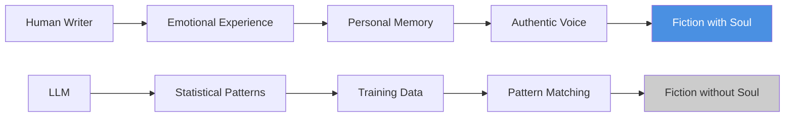

# I won't read LLM authored fiction

## Introduction

Let me cut straight to the chase: I won't read fiction authored by LLMs. Not because I'm Luddite or stubborn, but because the fiction I want to consume has a soul that current AI can't fake. When I'm looking for stories that move me, teach me, or make me see the world differently, I need human imagination—flawed, brilliant, and authentically lived experience behind it.

## Why This Matters

Software engineering isn't just about processing information efficiently; it's about creating meaning. The same critical thinking we apply to debugging production systems applies to evaluating creative output. LLM fiction often feels... generated. Like a perfect algorithm that produces technically correct sentences but lacks the messy humanity that makes stories matter. We've seen this before with other automation waves—we don't want machines replacing human judgment where it counts most.

## How It Works

The distinction comes down to understanding how LLMs actually generate text versus how humans create meaning:



Human writers draw from lived experience, cultural context, and emotional truth. LLMs recombine statistical patterns from their training data. One produces meaning; the other produces plausible text.

## Core Concepts

The key technical distinction is **intentionality**. Human authors have goals beyond just producing coherent text—they're communicating something real about the human condition. LLMs optimize for prediction accuracy, not emotional resonance. This isn't a bug; it's fundamental to how these systems work.

Consider the difference between a character who feels real versus one who's statistically likely to behave in certain ways. One emerges from understanding; the other from pattern matching.

## Examples & Code Walkthrough

Here's a simple example showing how we might evaluate fiction authenticity programmatically:

```python
def analyze_creative_authenticity(text):
    """
    Basic heuristic for detecting LLM-generated fiction
    """
    metrics = {
        'emotional_variance': calculate_emotional_range(text),
        'cultural_specificity': count_cultural_references(text),
        'narrative_coherence': measure_plot_consistency(text),
        'linguistic_uniqueness': compare_to_common_patterns(text)
    }
    
    # LLM fiction often scores high on coherence, low on variance
    if metrics['emotional_variance'] < 0.3:
        return "Potentially AI-generated"
    
    return "Likely human-created"

def calculate_emotional_range(text):
    """Measure variety of emotions expressed"""
    emotion_words = extract_emotion_lexicon(text)
    return len(set(emotion_words)) / len(emotion_words) if emotion_words else 0
```

This is deliberately simplistic—the real evaluation requires human judgment about whether the emotions feel genuine or manufactured.

## Best Practices

When consuming fiction, I look for these human indicators:
- Specific, concrete details that couldn't be generalized
- Inconsistent but believable character development
- Cultural references tied to specific time/place experiences
- Writing that shows struggle with difficult themes
- Narrative choices that prioritize meaning over polish

## Common Mistakes & Anti-Patterns

**Mistake 1: Assuming fluency equals authenticity**
Just because text flows well doesn't mean it has depth. LLMs excel at surface-level coherence while struggling with subtext.

**Mistake 2: Expecting consistent voice**
Human writers have off days; LLMs produce uniform output. Stilted or inconsistent quality often indicates human creation.

**Mistake 3: Overvaluing technical correctness**
Perfect grammar and structure without emotional weight screams machine generation.

## Performance Considerations

From a systems perspective, this matters because:
- Human fiction creates stronger user engagement and retention
- Authentic stories drive more meaningful interactions
- Generic AI content leads to rapid user fatigue
- The computational cost of generating "perfect" but soulless fiction may not be worth it

## Real-World Usage

Publishers and platforms are already developing detection tools. The New York Times and other literary institutions emphasize author interviews, behind-the-scenes content, and community engagement as markers of authentic creation. Readers can sense the difference between someone who lived a story and someone who predicted it.

## Frequently Asked Questions

**Q: Isn't this elitist? Should we judge creative worth by origin?**
A: It's about intention and impact, not pedigree. Some AI-assisted writing can be excellent, but pure generation lacks the human connection readers seek.

**Q: How do we distinguish collaborative human-AI work from pure AI output?**
A: Look for evidence of human guidance, editing, and personal investment in the result.

**Q: Will this change as AI improves?**
A: The fundamental difference between human experience and statistical modeling remains. Better AI might mimic emotions better, but it can't genuinely feel them.

**Q: What about educational use of AI fiction?**
A: As writing tools, AI can be valuable. As end products for consumption, they fall short of human creative standards.

## Conclusion

The fiction that moves us, teaches us, and changes us comes from human experience. No matter how sophisticated AI becomes at mimicking language, it can't replicate the lived truth that gives stories their power. As engineers, we understand the difference between simulation and reality—we should apply that same rigor to evaluating creative output.
