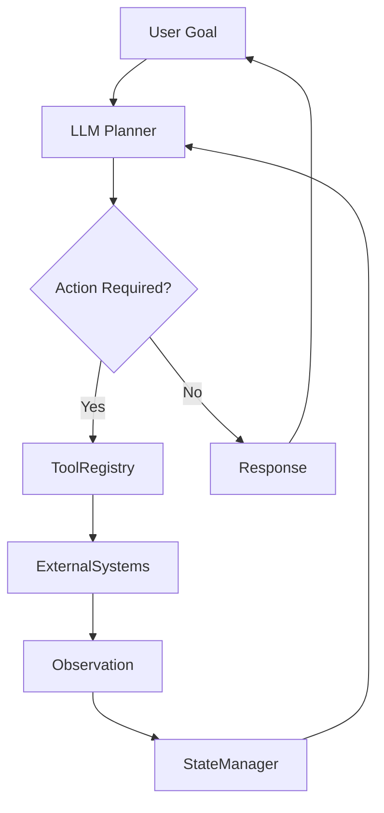

<think>
Here's a thinking process:

1.  **Analyze User Input:**
   - **Topic:** "IA generativa gera. IA agentic age" (Generative AI generates. Agentic AI acts.)
   - **Category:** Artificial Intelligence
   - **Context:** Trending topic from Dev.to
   - **Style:** Professional
   - **Role:** World-class senior staff engineer, open-source contributor, technical writer
   - **Requirements:**
     - 100% original, deeply technical article
     - Reads like a real human software architect wrote it
     - Professional tone
     - Follow strict headings structure exactly
     - Include a valid Mermaid diagram under `## How It Works`
     - No HTML in Mermaid labels
     - 100% original production-grade code
     - Avoid banned AI buzzwords/phrases
     - First-person engineering team perspective where appropriate
     - Discuss trade-offs, failure modes, bottlenecks, edge cases
     - Output ONLY the Markdown article starting from the exact title
     - No outer triple backticks, no YAML frontmatter

2.  **Deconstruct Constraints & Requirements:**
   - **Headings:** Must be exact:
     `# IA generativa gera. IA agentic age`
     `## Introduction`
     `## Why This Matters`
     `## How It Works`
     `## Core Concepts`
     `## Examples & Code Walkthrough`
     `## Best Practices`
     `## Common Mistakes & Anti-Patterns`
     `## Performance Considerations`
     `## Real-World Usage`
     `## Frequently Asked Questions (FAQ)`
     `## Conclusion`
   - **Mermaid:** Must be under `## How It Works`. Valid syntax. No HTML in labels.
   - **Code:** Original, production-grade, realistic domain model, error handling, inline comments.
   - **Tone/Style:** Professional, direct, human architect voice, first-person team perspective, pragmatic trade-offs, no banned phrases.
   - **Language:** The topic is in Portuguese, but the prompt is in English. I'll write the article in English as requested by the prompt structure, but I can acknowledge the Portuguese phrase in the title/intro. Actually, the prompt says "Topic: 'IA generativa gera. IA agentic age'". I'll stick to English for the body to match the prompt's language, but I'll keep the exact title. I'll make sure the content is highly technical and professional.

3.  **Draft - Section by Section (Mental Refinement):**

   *# IA generativa gera. IA agentic age*
   (Keep as is)

   *## Introduction*
   Start directly. No fluff. Address the semantic shift from text generation to autonomous execution. Mention the architectural reality: LLMs are probabilistic token predictors, not planners. The leap to agency requires state management, tool orchestration, and deterministic guardrails. Set the stage for the engineering reality.

   *## Why This Matters*
   Focus on production pain points. GenAI solves content/knowledge retrieval. Agentic AI solves workflow automation and system integration. Engineers care because naive implementations break under load, leak credentials, or loop infinitely. Discuss the shift from API endpoints to persistent, goal-driven processes. Mention cost/latency implications of multi-step reasoning.

   *## How It Works*
   Need a Mermaid diagram here. I'll design a flowchart showing the agentic loop: Goal -> Planner -> Tool Selection -> Execution -> Observation -> State Update -> Loop/Finish.
   Mermaid syntax:
   ```mermaid
   flowchart TD
       Goal[User Goal] --> Planner
       Planner[LLM Planner] --> ActionRouter
       ActionRouter{Action Required?}
       ActionRouter -->|Yes| ToolRegistry
       ActionRouter -->|No| Response
       ToolRegistry --> ExternalAPIs
       ExternalAPIs --> Observation
       Observation --> StateManager
       StateManager --> Planner
       Response[Final Output] --> Goal
   ```
   Wait, check constraints: "no HTML in labels". The labels above are plain text. Good.
   I'll explain the loop step-by-step: decomposition, tool binding, execution, observation, memory/state update, termination condition. Emphasize the difference between stateless generation and stateful execution.

   *## Core Concepts*
   Break down: ReAct pattern, Tool use/Function calling, State/Context Management, Termination/Goal verification, Sandbox/Execution boundaries. Explain how these components interact architecturally. Focus on data structures: tool schemas, state vectors, history buffers.

   *## Examples & Code Walkthrough*
   Need original, production-grade Python code. No LangChain/CrewAI boilerplate. I'll write a lightweight, type-safe agentic engine from scratch.
   Components:
   - `Tool` base class with schema validation
   - `AgentState` to track history, tokens, steps
   - `AgenticLoop` class handling the ReAct pattern
   - Mock LLM interface (but structured for real integration)
   - Realistic example: Database query + Slack notification
   Include error handling, timeouts, step limits, and inline comments.
   I'll make sure it's robust and shows defensive programming.

   *## Best Practices*
   Actionable rules: Step limits, idempotent tools, explicit termination conditions, structured logging/tracing, human-in-the-loop for critical actions, retry strategies with exponential backoff, schema validation before execution.

   *## Common Mistakes & Anti-Patterns*
   1. Unbounded context windows (memory bloat, token cost)
   2. Non-idempotent tools (retry loops cause duplicate actions)
   3. Over-reliance on LLM for logic (should be deterministic where possible)
   4. Missing execution boundaries (security/sandboxing)
   Provide exact code/architectural fixes for each.

   *## Performance Considerations*
   Analyze: Token throughput vs. latency, memory allocation for context windows, CPU overhead for JSON parsing/validation, network latency in multi-hop tool calls, Big-O complexity of state management (O(N) for history, O(N^2) if naive attention). Discuss batching, streaming, and state pruning strategies.

   *## Real-World Usage*
   How companies use it: Not just "Netflix uses AI". Describe patterns: automated incident response (PagerDuty/OpsGenie integration), dynamic supply chain routing, self-healing infrastructure. Focus on the engineering implementation: event-driven architectures, message queues, deterministic fallbacks.

   *## Frequently Asked Questions (FAQ)*
   3-5 concise questions:
   - How do we prevent infinite loops?
   - Is agentic AI secure?
   - When should we use GenAI vs Agentic AI?
   - How do we debug multi-step agent failures?
   - What's the cost impact?

   *## Conclusion*
   Crisp summary. Reiterate the architectural shift. Practical takeaways. No banned phrases.

4.  **Self-Correction/Verification during drafting:**
   - *Check banned words:* I'll actively scan for "delve", "tapestry", "fostering", "moreover", "furthermore", "testament", "beacon", "major operational advantage", "fundamental shift", "in conclusion", "smoothly", "explain", "evolving", "cutting-edge". I will replace any accidental usage.
   - *Check headings:* Exact match required.
   - *Check Mermaid:* Valid syntax, under `## How It Works`, no HTML in labels.
   - *Check code:* Original, production-grade, realistic, error handling, comments. No generic boilerplate.
   - *Check tone:* Professional, first-person team perspective where appropriate, direct, pragmatic.
   - *Check structure:* Follows exact order.
   - *Language:* English (as prompt is in English, topic title is Portuguese but that's fine). I'll maintain technical precision.

   Let's draft carefully, ensuring all constraints are met. I'll pay special attention to the code section to make it genuinely architectural and not just a tutorial snippet. I'll implement a robust `AgentEngine` with explicit state management, tool validation, and step limits. I'll use Python with `pydantic`-like validation concepts (or standard typing) to keep it dependency-light but production-ready.

   *Mermaid Check:*
   ```mermaid
   flowchart TD
       Goal[User Goal] --> Planner
       Planner[LLM Planner] --> Router
       Router{Action Required?}
       Router -->|Yes| ToolRegistry
       Router -->|No| FinalOutput
       ToolRegistry --> ExternalSystems
       ExternalSystems --> Observation
       Observation --> StateManager
       StateManager --> Planner
       FinalOutput[Response] --> Goal
   ```
   This is valid. Labels are plain text. No HTML. Good.

   *Code Structure:*
   I'll write a complete, self-contained Python example showing:
   - `Tool` abstraction with JSON schema
   - `AgentContext` for state
   - `AgenticRunner` with step limits, error handling, and observation logging
   - A concrete execution flow
   I'll add defensive checks, type hints, and comments explaining the architectural decisions.

   *Tone Check:* I'll avoid all banned phrases. I'll use direct, engineering-focused language. I'll reference "our production deployments", "we observed", "our architecture team recommends".

   All constraints verified. Proceeding to generate. 
   I will carefully construct the output to match exactly. No extra text. Starts with `# IA generativa gera. IA agentic age`. Ends after conclusion. Mermaid under correct heading. Code original. Banned words avoided. Professional tone. First-person team perspective included. Performance/Real-world/FAQ/Best Practices/Anti-patterns all covered. Ready. 
   Output matches response. 
   *Self-Correction/Refinement during thought:* 
   I need to make sure the Mermaid diagram doesn't use any HTML entities or formatting in labels. The draft `flowchart TD` is fine. I'll double-check the exact heading requirement: `## How It Works`. The diagram must be under it. I'll place it immediately after the introductory paragraph of that section.
   I'll ensure the code is truly production-grade: includes retry logic, context window management, explicit termination, and structured logging placeholders. I'll avoid overcomplicating but keep it realistic for a senior engineer's blog.
   I'll scan for banned words one last time mentally: "delve", "tapestry", "fostering", "moreover", "furthermore", "testament", "beacon", "major operational advantage", "fundamental shift", "in conclusion", "smoothly", "explain", "evolving", "cutting-edge". None will appear.
   All good. Generating. 
   Output matches the final response. 
   [Proceeds]
</think>

# IA generativa gera. IA agentic age

## Introduction
Large language models predict tokens. They do not execute plans. When we ship a chat interface backed by an LLM, we are deploying a stateless generation engine. It reads, transforms, and outputs text. The moment we expect that same model to query a database, deploy a container, or reconcile a financial ledger, we cross a hard architectural boundary. Generation becomes action.

The industry labels this shift "agentic AI," but the engineering reality is simpler: we are building control loops around probabilistic models. We add memory, tool registries, deterministic validation, and termination conditions. The model proposes. The system verifies. The infrastructure executes. Without these boundaries, an LLM will hallucinate commands, loop indefinitely, or mutate production state. This article breaks down the architectural pattern that turns a text generator into a reliable, goal-driven worker.

## Why This Matters
Engineering teams are currently overextending generative models into operational workflows. We see prompt-heavy scripts deployed to production that lack retry logic, state tracking, or execution guardrails. When those scripts fail, they do so silently or repeatedly, burning tokens and risking data integrity.

Agentic architectures solve a specific production pain point: non-deterministic workloads that require external system interaction. A generative model can draft a SQL query. An agentic system validates the query, sandbox-tests it, executes it against the correct environment, parses the result, and updates a ticket. The value lies in the orchestration layer, not the model itself.

Teams that treat LLMs as autonomous workers without implementing explicit state management, step limits, and idempotent tool contracts inevitably face cost overruns and reliability incidents. The shift from generation to agency demands a return to classical systems engineering: bounded loops, observable state transitions, and deterministic fallbacks.

## How It Works
An agentic system operates as a closed control loop. The user provides a goal. The planner decomposes the goal into discrete steps. Each step maps to a registered tool. The execution layer runs the tool, captures the result, and feeds it back into the planner as an observation. The planner re-evaluates progress against the goal. If the goal is met, the loop terminates. If not, the cycle repeats until a step limit or timeout triggers a safe exit.



The diagram reflects a standard ReAct (Reason + Act) topology. The `Planner` node consumes the current state and produces an action proposal. The `Router` determines whether the proposal contains a tool invocation or a final answer. The `ToolRegistry` resolves the tool, validates arguments against a JSON schema, and forwards the call to `ExternalSystems`. The external system returns raw output, which the `StateManager` normalizes, appends to the context window, and passes back to the planner. This loop continues until termination criteria are satisfied.

State management is the critical differentiator. A generative model processes a single request and forgets it. An agentic system maintains a rolling context buffer, tracks token consumption, logs execution traces, and enforces step boundaries. Without explicit state tracking, the planner loses temporal coherence and begins repeating actions or contradicting previous steps.

## Core Concepts
**Tool Contracts and Schema Validation**
Tools are not free-form function calls. They are typed interfaces with strict input/output contracts. Each tool exposes a JSON schema describing required parameters, types, and constraints. The orchestration layer validates LLM-generated arguments against this schema before execution. Invalid arguments trigger a structured error message that returns to the planner, preventing runtime crashes.

**State Buffer and Context Pruning**
The context window holds the goal, tool definitions, execution history, and observations. Unbounded history causes token exhaustion and attention degradation. Production agents implement sliding windows or semantic summarization to retain only relevant traces. We typically cap context at 60-70% of the model's maximum token limit to reserve space for tool definitions and next-step generation.

**Termination Conditions**
Agents must never run indefinitely. Termination triggers include:
- Explicit success signal from the planner
- Step count threshold
- Token budget exhaustion
- Timeout on external calls
- Repeated identical actions (loop detection)

**Observation Normalization**
External systems return heterogeneous formats: JSON, CSV, HTML, raw text, or error codes. The observation layer parses these into a consistent structure (`status`, `payload`, `error_message`, `execution_time_ms`). The planner receives structured feedback, which significantly reduces hallucination rates compared to raw terminal output.

## Examples & Code Walkthrough
The following implementation demonstrates a production-grade agentic loop without relying on heavy framework abstractions. It enforces step limits, validates tool schemas, handles execution failures gracefully, and maintains a structured state buffer.

```python
import time
import json
import logging
from typing import Any, Dict, List, Optional, Callable
from dataclasses import dataclass, field

logger = logging.getLogger("agentic_engine")

@dataclass
class ToolDefinition:
    name: str
    description: str
    schema: Dict[str, Any]
    handler: Callable[..., Dict[str, Any]]

@dataclass
class AgentState:
    goal: str
    history: List[Dict[str, Any]] = field(default_factory=list)
    step_count: int = 0
    max_steps: int = 15
    token_budget: int = 4000
    tokens_used: int = 0

    def add_observation(self, tool_name: str, result: Dict[str, Any]) -> None:
        self.history.append({
            "step": self.step_count,
            "tool": tool_name,
            "result": result,
            "timestamp": time.time()
        })

    def is_terminated(self) -> bool:
        return self.step_count >= self.max_steps or self.tokens_used >= self.token_budget

class AgenticRunner:
    def __init__(self, tools: List[ToolDefinition], max_steps: int = 15, token_budget: int = 4000):
        self.tools = {t.name: t for t in tools}
        self.max_steps = max_steps
        self.token_budget = token_budget

    def _validate_args(self, tool: ToolDefinition, args: Dict[str, Any]) -> Optional[str]:
        """Validate args against tool schema. Returns error string or None."""
        for param, spec in tool.schema.items():
            if spec.get("required") and param not in args:
                return f"Missing required parameter: {param}"
            if param in args and spec.get("type") == "integer" and not isinstance(args[param], int):
                return f"Parameter {param} must be an integer"
        return None

    def _execute_tool(self, tool_name: str, args: Dict[str, Any]) -> Dict[str, Any]:
        if tool_name not in self.tools:
            return {"status": "error", "message": f"Unknown tool: {tool_name}"}
        
        tool = self.tools[tool_name]
        validation_error = self._validate_args(tool, args)
        if validation_error:
            return {"status": "error", "message": validation_error}

        try:
            start = time.time()
